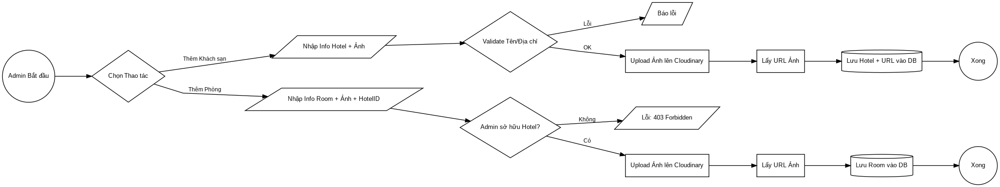
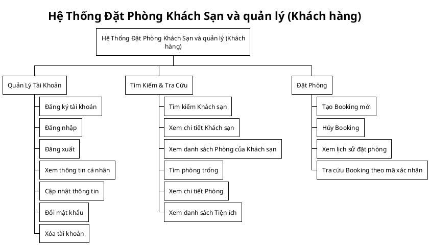
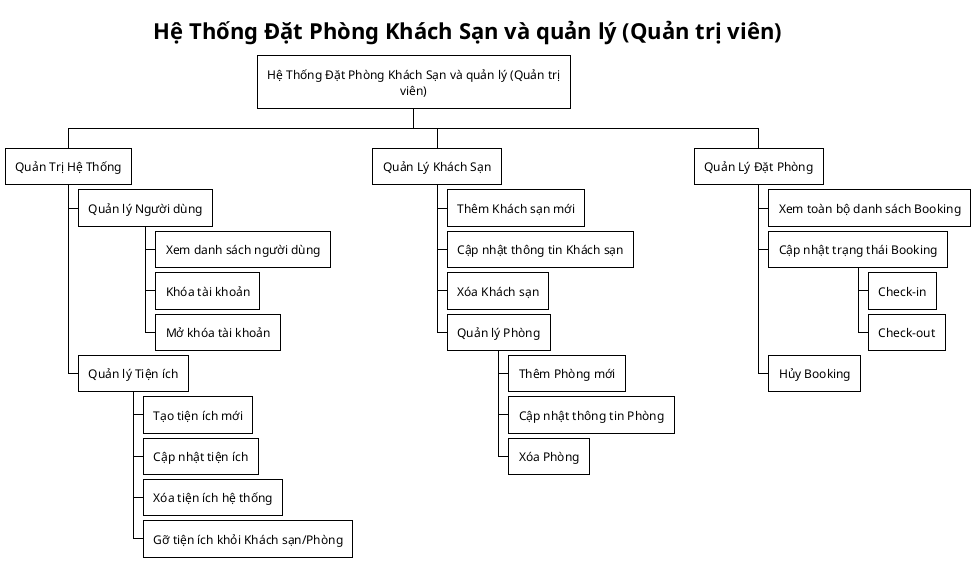
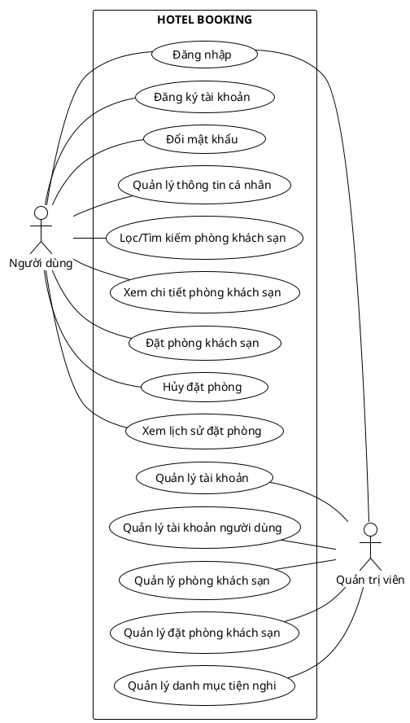

# CHƯƠNG 2. PHƯƠNG PHÁP THỰC HIỆN

## 2.1 Các hệ thống tương tự

Trong quá trình xây dựng website đặt phòng khách sạn theo mô hình Marketplace, việc nghiên cứu và phân tích các nền tảng hiện có là một bước quan trọng. Hoạt động này giúp nhận diện các ưu điểm cần học hỏi, các nhược điểm cần khắc phục và định hình chiến lược phát triển sản phẩm. Dưới đây là phần phân tích hai hệ thống tiêu biểu trong ngành là Booking.com và Traveloka, cả hai đều vận hành thành công mô hình Marketplace, kết nối hiệu quả khách hàng với các nhà cung cấp dịch vụ lưu trú.

### 2.1.1 Booking.com

Booking.com là một trong những nền tảng đặt phòng trực tuyến hàng đầu thế giới. Hoạt động dựa trên mô hình Marketplace, hệ thống cung cấp một danh mục đa dạng các loại hình lưu trú, từ khách sạn, căn hộ đến homestay trên phạm vi toàn cầu. Nguồn doanh thu chính của Booking.com đến từ việc thu phí hoa hồng (thường dao động từ 15-20%) trên mỗi giao dịch thành công từ các đối tác lưu trú.

Ưu điểm:

- Danh mục sản phẩm phong phú: Booking.com sở hữu một mạng lưới đối tác khổng lồ với hàng triệu lựa chọn lưu trú tại hơn 200 quốc gia, đáp ứng được hầu hết các phân khúc khách hàng, từ cao cấp đến bình dân.

- Công cụ tìm kiếm và bộ lọc hiệu quả: Giao diện tìm kiếm được thiết kế trực quan, cho phép người dùng dễ dàng lọc kết quả theo các tiêu chí như giá, tiện nghi, điểm đánh giá, và vị trí, mang lại trải nghiệm nhanh chóng và chính xác.

- Chính sách đặt/hủy phòng linh hoạt: Nền tảng hỗ trợ đa dạng các chính sách như hủy phòng miễn phí hoặc không hoàn tiền, cùng với tùy chọn thanh toán trực tuyến hoặc thanh toán tại nơi lưu trú, tối ưu hóa sự thuận tiện cho khách hàng.

- Hệ thống đánh giá đáng tin cậy: Chỉ những khách hàng đã hoàn tất quá trình đặt và sử dụng dịch vụ mới có quyền đánh giá, đảm bảo tính khách quan và xác thực của các nhận xét.

- Nền tảng quản lý đối tác chuyên nghiệp: Booking.com cung cấp hệ thống Extranet, một công cụ quản trị mạnh mẽ cho phép đối tác dễ dàng cập nhật tình trạng phòng, điều chỉnh giá và quản lý đơn đặt phòng.

Nhược điểm:

- Mức phí hoa hồng cao: Tỷ lệ hoa hồng từ 15-20% được xem là một thách thức tài chính đối với các cơ sở lưu trú quy mô nhỏ.

- Hạn chế trong việc địa phương hóa: Tại thị trường Việt Nam, hệ thống còn thiếu sự tích hợp các phương thức thanh toán phổ biến như VietQR hay ví điện tử MoMo.

- Mức độ cạnh tranh cao: Các đối tác nhỏ lẻ gặp khó khăn trong việc cạnh tranh và hiển thị nổi bật do thuật toán thường ưu tiên các chuỗi khách sạn lớn hoặc những đơn vị tham gia chương trình khách hàng thân thiết Genius.

- Trải nghiệm giao diện người dùng: Giao diện bị một số người dùng đánh giá là phức tạp và chứa quá nhiều thông tin, làm giảm tính thân thiện.

- Thiếu cơ chế kiểm soát gian lận: Hệ thống chưa có cơ chế chấm điểm và xử phạt công khai đối với các đối tác vi phạm chính sách (ví dụ: tự ý hủy đơn), dẫn đến nguy cơ không đồng đều về chất lượng dịch vụ.

- Hỗ trợ khách hàng chưa được tự động hóa: Việc thiếu chatbot để giải đáp tự động các câu hỏi về chính sách khiến khách hàng phải phụ thuộc vào các kênh hỗ trợ thủ công, có thể gây chậm trễ.

### 2.1.2 Traveloka

Traveloka là một nền tảng du lịch trực tuyến hàng đầu tại khu vực Đông Nam Á, được thành lập vào năm 2012. Tương tự Booking.com, Traveloka vận hành theo mô hình Marketplace, cung cấp các dịch vụ đặt phòng khách sạn, vé máy bay và các tiện ích du lịch khác. Nền tảng này tập trung mạnh vào các thị trường trọng điểm như Indonesia, Việt Nam và Thái Lan, với mức phí hoa hồng cho đối tác dao động từ 10-15%.

Ưu điểm:

- Am hiểu thị trường địa phương: Traveloka thể hiện sự thấu hiểu sâu sắc nhu cầu của người dùng Đông Nam Á thông qua việc hỗ trợ đa dạng ngôn ngữ, tiền tệ và các phương thức thanh toán quen thuộc như ví điện tử và chuyển khoản ngân hàng.

- Chương trình khuyến mãi và ưu đãi: Nền tảng thường xuyên triển khai các chương trình giảm giá, tích điểm thành viên và ưu đãi độc quyền để thu hút và giữ chân khách hàng.

- Giao diện thân thiện và tối giản: Thiết kế giao diện, đặc biệt là trên ứng dụng di động, được đánh giá là đơn giản và dễ sử dụng, phù hợp với cả những người dùng không thành thạo công nghệ.

- Dịch vụ hỗ trợ khách hàng hiệu quả: Traveloka cung cấp dịch vụ chăm sóc khách hàng 24/7 thông qua nhiều kênh (chat, điện thoại, email), đảm bảo giải quyết các vấn đề một cách nhanh chóng.

- Hệ thống quản lý đối tác tiện lợi: Đối tác có thể quản lý giá, tình trạng phòng và các đơn đặt chỗ một cách linh hoạt thông qua ứng dụng Partner chuyên biệt.

- Hỗ trợ đa dạng phương thức thanh toán: Nền tảng tích hợp nhiều cổng thanh toán từ nội địa đến quốc tế, mang lại sự thuận tiện tối đa cho người dùng.

Nhược điểm:

- Phạm vi hoạt động quốc tế còn giới hạn: Do tập trung chủ yếu vào thị trường Đông Nam Á, số lượng lựa chọn lưu trú tại các khu vực như châu Âu hay châu Mỹ còn khá hạn chế.

- Thiếu cơ chế đánh giá đối tác: Tương tự Booking.com, hệ thống thiếu một cơ chế chấm điểm và xếp hạng công khai để ghi nhận và xử lý các đối tác có hành vi gian lận hoặc chất lượng dịch vụ kém.

- Quy trình hỗ trợ còn thủ công: Việc giải đáp các thắc mắc về chính sách vẫn phụ thuộc vào nhân viên hỗ trợ, có thể dẫn đến tình trạng quá tải và chậm trễ trong các khung giờ cao điểm.

## 2.2 Công nghệ sử dụng

### 2.2.1 Phía Frontend

React.js: Là một thư viện JavaScript mạnh mẽ do Facebook phát triển, được sử dụng để xây dựng giao diện người dùng (UI) theo kiến trúc dựa trên các thành phần (component). Điều này giúp mã nguồn được tái sử dụng cao, dễ quản lý và bảo trì.

React Router: Thư viện được sử dụng để quản lý việc định tuyến (routing) phía client, cho phép tạo ra một ứng dụng đơn trang (Single-Page Application - SPA) với trải nghiệm điều hướng mượt mà giữa các trang khác nhau mà không cần tải lại toàn bộ trang web.

Tailwind CSS: Là một framework CSS theo triết lý "utility-first", cung cấp các lớp tiện ích cấp thấp để xây dựng giao diện một cách nhanh chóng và tùy biến cao trực tiếp trong mã HTML/JSX. Toàn bộ giao diện của dự án được tạo kiểu bằng Tailwind CSS.

Axios: Là một thư viện HTTP client dựa trên Promise, được sử dụng để thực hiện các yêu cầu API từ frontend đến backend một cách dễ dàng và mạnh mẽ. Axios được cấu hình để tự động đính kèm token xác thực vào mỗi yêu cầu.

### 2.2.2 Phía Backend

#### 2.2.2.1 Java

Ngôn ngữ lập trình Java là một ngôn ngữ hướng đối tượng, được sử dụng rộng rãi trong việc phát triển phần mềm, trang web, game và ứng dụng di động. Một trong những tiêu chí quan trọng của Java là “Viết một lần, thực thi khắp nơi” (Write once, run anywhere), có nghĩa là chương trình viết bằng Java có thểchạy trên nhiều nền tảng khác nhau.

Java có nhiều đặc điểm nổi bật, bao gồm:

- Tương tự C++, nhưng dễ học và sử dụng hơn.

- Độc lập với phần cứng và hệ điều hành, cho phép chương trình chạy tốt trên nhiều môi trường.

- Ngôn ngữ thông dịch, có nghĩa là mã nguồn được biên dịch thành bytecode, sau đó bytecode được môi trường thực thi chạy.

- Cơ chế thu gom rác tự động, giúp loại bỏ các đối tượng không sử dụng và tiết kiệm bộ nhớ.

- Đa luồng, cho phép thực hiện nhiều tác vụ cùng một lúc.

- Tính an toàn và bảo mật cao.

- Java cũng được sử dụng để phát triển nhiều loại ứng dụng khác nhau, từ ứng dụng web, desktop cho đến mobile

#### 2.2.2.2 Spring Boot

- Spring Boot là một dự án con của framework Spring, được thiết kế để giúp phát triển ứng dụng Java một cách nhanh chóng và dễ dàng. Dưới đây là một số đặc điểm nổi bật và tính ưu việt của Spring Boot:

- Thuận tiện cấu hình (Convenient configuration): Spring Boot giúp tựđộng cấu hình môi trường ứng dụng một cách đơn giản thông qua việc sử dụng các giá trị mặc định và các cấu hình thông minh. Điều này giảm đáng kể khối lượng công việc cần thiết cho việc cấu hình.

- Embeddable web server: Spring Boot đi kèm với các web server như Tomcat, Jetty hoặc Undertow được tích hợp sẵn trong ứng dụng, giảm thiểu sự phức tạp trong việc triển khai ứng dụng.

- Dependency Injection (DI): Spring Boot sử dụng cơ chế DI mạnh mẽ của Spring Framework, giúp quản lý và tự động kết nối các thành phần của ứng dụng

- Standalone: Ứng dụng Spring Boot có thể chạy độc lập mà không cần các cấu hình phức tạp, điều này giúp tiết kiệm thời gian và công sức khi triển khai.

- Tích hợp tốt với Spring Ecosystem: Spring Boot tương thích và tích hợp tốt với nhiều dự án khác của Spring như Spring Data, Spring Security, Spring Cloud, giúp phát triển ứng dụng một cách linh hoạt và mạnh mẽ.

- Tự động cập nhật Dependency: Spring Boot hỗ trợ tính năng tự động cập nhật các phiên bản dependency, giúp dễ dàng duy trì và cập nhật ứng dụng.

- Annotation-Based configuration: Sử dụng các chú thích (annotation) để cấu hình thay vì sử dụng các file cấu hình XML, giúp mã nguồn trở nên gọn gàng và dễ đọc.

- Microservices development: Spring Boot được sử dụng rộng rãi trong phát triển ứng dụng dạng Microservices do tính linh hoạt và dễ triển khai. Những đặc điểm này khiến Spring Boot trở thành một lựa chọn phổ biến trong cộng đồng phát triển Java, đặc biệt là cho việc xây dựng các ứng dụng web, dịch vụ và các hệ thống phức tạp.

#### 2.2.2.3 MySQL

- MySQL là một hệ quản trị cơ sở dữ liệu quan hệ (RDBMS) mã nguồn mở, phổ biến và mạnh mẽ. Dưới đây là một số điểm nổi bật về MySQL:

- Mã nguồn mở: MySQL được phát triển và duy trì dưới dạng mã nguồn mở, cho phép người dùng tự do sử dụng, tùy chỉnh và phân phối lại theo các điều khoản của Giấy phép Công cộng GNU (GPL).

- Hiệu suất cao: MySQL được tối ưu hóa để cung cấp hiệu suất cao trong việc xử lý các truy vấn và giao tiếp với cơ sở dữ liệu, làm cho nó trở thành lựa chọn phổ biến cho các ứng dụng yêu cầu xử lý dữ liệu nhanh chóng.

- Đa nền tảng: MySQL hỗ trợ nhiều nền tảng, có thể chạy trên nhiều hệ điều hành như Linux, Windows, macOS, và nhiều loại kiến trúc khác nhau.

- Tính an toàn và bảo mật: MySQL cung cấp các tính năng an toàn và bảo mật như quản lý người dùng, phân quyền, mã hóa dữ liệu, và khả năng sao lưu và khôi phục dữ liệu.

- Dễ sử dụng: MySQL có một cộng đồng lớn và tích hợp nhiều công cụ quản lý cơ sở dữ liệu như MySQL Workbench, giúp người quản trị và phát triển dễ dàng tương tác với cơ sở dữ liệu

- Hỗ trợ chuẩn SQL: MySQL tuân thủ chuẩn SQL, giúp người phát triển dễ dàng chuyển đổi giữa các hệ thống quản trị cơ sở dữ liệu hỗ trợ SQL mà không gặp nhiều vấn đề tương thích.

- Phù hợp với ứng dụng nhỏ đến lớn: Từ các ứng dụng web nhỏ đến các hệ thống doanh nghiệp lớn, MySQL phù hợp với mọi quy mô ứng dụng.

- MySQL là một giải pháp đáng tin cậy và linh hoạt cho việc quản lý cơ sở dữ liệu, và sự phổ biến của nó đã đưa MySQL trở thành một trong những hệ quản trị cơ sở dữ liệu hàng đầu trên thế giới

## 2.3 Phân tích yêu cầu

### 2.3.1 Các quy trình, nghiệp vụ

#### 2.3.1.1 Quy trình Quản lý Tài khoản và Xác thực

- Quy trình bắt đầu khi người dùng mới thực hiện Đăng ký . Hệ thống tiếp nhận thông tin bao gồm họ tên, email, số điện thoại và ngày sinh. Trước khi tạo tài khoản, hệ thống sẽ kiểm tra trong cơ sở dữ liệu xem email đã tồn tại hay chưa để tránh trùng lặp. Mật khẩu người dùng nhập vào sẽ được mã hóa (sử dụng BCrypt) trước khi lưu trữ để đảm bảo bảo mật. Mặc định, tài khoản mới tạo sẽ được gán vai trò là "CUSTOMER" và trạng thái hoạt động được kích hoạt ngay lập tức.

- Đối với quy trình Đăng nhập (Login), người dùng cung cấp email và mật khẩu. Hệ thống tìm kiếm tài khoản theo email, sau đó kiểm tra xem tài khoản có đang bị khóa bởi Admin hay không. Nếu tài khoản hợp lệ, hệ thống so khớp mật khẩu đã mã hóa. Khi xác thực thành công, server sẽ sinh ra một chuỗi JWT chứa thông tin định danh và vai trò của người dùng, token này có hiệu lực trong 6 tháng và được dùng để xác thực các request tiếp theo.

- Ngoài ra, người dùng có thể thực hiện Đổi mật khẩu. Quy trình này yêu cầu người dùng phải nhập đúng mật khẩu cũ. Hệ thống cũng kiểm tra để đảm bảo mật khẩu mới không được trùng với mật khẩu cũ trước khi thực hiện mã hóa và cập nhật vào cơ sở dữ liệu.

```plantuml
@startdot
digraph Hinh_2_1 {
  graph [rankdir=LR, bgcolor="white", splines=polyline, nodesep=0.55, ranksep=0.75];
  node  [fontname="Arial", fontsize=10, color="black", fontcolor="black", style="solid", fillcolor="white"];
  edge  [fontname="Arial", fontsize=9, color="black", fontcolor="black", arrowsize=0.8];

  start [label="Bắt đầu", shape=circle, width=0.8, height=0.8];
  action [label="Chọn Hành động", shape=diamond, width=1.4, height=1.1];

  reg_in [label="Nhập: Tên, Email, SDT, DOB,\nPass", shape=parallelogram];
  email_exists [label="Email đã tồn tại?", shape=diamond, width=1.5, height=1.3];
  user_existed [label="Báo lỗi: User Existed", shape=parallelogram];
  hash [label="Mã hóa Mật khẩu BCrypt", shape=box];
  role [label="Gán Role: CUSTOMER", shape=box];
  save_user [label="Lưu User vào DB", shape=cylinder];
  reg_done [label="Hoàn tất", shape=circle, width=0.8, height=0.8];

  login_in [label="Nhập: Email, Pass", shape=parallelogram];
  find_user [label="Tìm User trong DB", shape=diamond, width=1.5, height=1.25];
  invalid [label="Báo lỗi: Sai thông tin", shape=parallelogram];
  locked [label="Tài khoản bị khóa?", shape=diamond, width=1.5, height=1.2];
  account_locked [label="Báo lỗi: Account Locked", shape=parallelogram];
  pass_ok [label="Mật khẩu khớp?", shape=diamond, width=1.45, height=1.2];
  jwt [label="Sinh JWT Token", shape=box];
  token_info [label="Trả về Token & User Info", shape=parallelogram];
  login_done [label="Hoàn tất", shape=circle, width=0.8, height=0.8];

  start -> action;
  action -> reg_in [label="Đăng Ký"];
  reg_in -> email_exists;
  email_exists -> user_existed [label="Có"];
  email_exists -> hash [label="Không"];
  hash -> role -> save_user -> reg_done;

  action -> login_in [label="Đăng Nhập"];
  login_in -> find_user;
  find_user -> invalid [label="Không thấy"];
  find_user -> locked [label="Thấy"];
  locked -> account_locked [label="Đúng"];
  account_locked -> invalid;
  locked -> pass_ok [label="Sai"];
  pass_ok -> invalid [label="Không"];
  pass_ok -> jwt [label="Có"];
  jwt -> token_info -> login_done;
}
@enddot
```

> Hình 2.1: Quy trình đăng nhập và đăng ký.

#### 2.3.1.2 Quy trình Quản lý Khách sạn và Phòng (Dành cho Admin)

- Quy trình này dành riêng cho tài khoản có quyền Admin. Đầu tiên là Tạo mới Khách sạn, Admin nhập các thông tin như tên, địa chỉ, mô tả, số sao và tải lên hình ảnh. Hệ thống tích hợp với Cloudinary để lưu trữ ảnh và lấy về URL lưu vào cơ sở dữ liệu. Hệ thống cũng kiểm tra tên và địa điểm khách sạn để ngăn chặn việc tạo trùng lặp.

- Sau khi có khách sạn, Admin tiến hành Thêm phòng . Một phòng sẽ được gắn liền với một khách sạn cụ thể do Admin quản lý. Admin thiết lập loại phòng (Single, Double, Suit, Triple), giá tiền, sức chứa và số lượng phòng có sẵn. Tương tự như khách sạn, hình ảnh phòng cũng được upload lên Cloud và liên kết với phòng đó. Đồng thời, Admin có thể gán các tiện ích cho phòng hoặc khách sạn từ danh sách tiện ích chung của hệ thống.

> Hình 2.2: Quy trình quản lý khách sạn và phòng

#### 2.3.1.3 Quy trình Tìm kiếm và Kiểm tra Phòng Trống

Đây là nghiệp vụ quan trọng để đảm bảo khách hàng luôn tìm được phòng thực tế có sẵn. Khi người dùng tìm kiếm theo địa điểm và khoảng thời gian (Check-in/Check-out), hệ thống thực hiện truy vấn phức tạp để loại trừ các phòng đã kín chỗ. Logic hoạt động là tìm tất cả các phòng thuộc khách sạn ở địa điểm đó, sau đó loại bỏ những phòng đã nằm trong các đơn đặt phòng (Booking) có trạng thái là BOOKED hoặc CHECKED_IN mà khoảng thời gian lưu trú giao nhau với khoảng thời gian khách đang tìm. Chỉ những phòng thỏa mãn điều kiện về thời gian và sức chứa mới được trả về kết quả tìm kiếm.

```plantuml
@startdot
digraph Hinh_2_3 {
  graph [rankdir=LR, bgcolor="white", splines=polyline, nodesep=0.5, ranksep=0.65];
  node  [fontname="Arial", fontsize=10, color="black", fontcolor="black", style="solid", fillcolor="white"];
  edge  [fontname="Arial", fontsize=9, color="black", fontcolor="black", arrowsize=0.8];

  start [label="Khách tìm kiếm", shape=circle, width=0.95, height=0.95];
  input [label="Nhập: Location, Dates, Số\nngười", shape=parallelogram];
  validate [label="Validate Ngày", shape=diamond, width=1.15, height=1.0];
  date_err [label="Báo lỗi ngày tháng", shape=parallelogram];
  hotels [label="Lấy Hotel theo Location", shape=cylinder];
  loop [label="Duyệt từng Phòng", shape=box, peripheries=2];

  conflict [label="Trùng lịch Booking?", shape=diamond, width=1.45, height=1.25];
  skip [label="Bỏ qua phòng này", shape=box];
  capacity [label="Đủ sức chứa?", shape=diamond, width=1.25, height=1.05];
  add [label="Thêm vào Danh sách", shape=box];
  has_room [label="Còn phòng?", shape=diamond, width=1.05, height=0.9];
  result [label="Trả về danh sách Phòng trống", shape=parallelogram];
  end [label="Kết thúc", shape=circle, width=0.9, height=0.9];

  start -> input -> validate;
  validate -> date_err [label="Sai"];
  validate -> hotels [label="Đúng"];
  hotels -> loop;
  loop -> conflict;

  conflict -> skip [label="Có"];
  conflict -> capacity [label="Không"];
  capacity -> skip [label="Không"];
  capacity -> add [label="Có"];
  skip -> has_room;
  add -> has_room;

  has_room -> loop [label="Có"];
  has_room -> result [label="Không"];
  result -> end;
}
@enddot
```

> Hình 2.3: Quy trình tìm kiếm và kiểm tra phòng trống

#### 2.3.1.4 Quy trình Đặt phòng

- Quy trình đặt phòng diễn ra qua nhiều bước kiểm tra nghiêm ngặt. Khi khách hàng gửi yêu cầu đặt phòng, hệ thống đầu tiên sẽ xác thực tính hợp lệ của ngày tháng (ngày Check-in không được là quá khứ, ngày Check-out phải sau ngày Check-in). Tiếp theo, hệ thống kiểm tra lại một lần nữa số lượng phòng trống thực tế trong khoảng thời gian đó. Nếu tổng số phòng đã đặt cộng với số phòng khách muốn đặt vượt quá tổng số lượng phòng hiện có của khách sạn, yêu cầu sẽ bị từ chối.

- Nếu phòng có sẵn, hệ thống sẽ tính toán tổng giá tiền bằng cách nhân giá phòng với số đêm lưu trú. Một mã đặt phòng duy nhất gồm 10 ký tự sẽ được sinh ra ngẫu nhiên. Đơn đặt phòng sau đó được lưu vào cơ sở dữ liệu với trạng thái ban đầu là BOOKED.

```plantuml
@startdot
digraph Hinh_2_4 {
  graph [rankdir=LR, bgcolor="white", splines=polyline, nodesep=0.55, ranksep=0.75];
  node  [fontname="Arial", fontsize=11, color="black", fontcolor="black", style="solid", fillcolor="white"];
  edge  [fontname="Arial", fontsize=10, color="black", fontcolor="black", arrowsize=0.8];

  start [label="User Đặt phòng", shape=circle];
  req [label="Gửi Request: RoomID, Date,\nQty", shape=parallelogram];
  dateok [label="Ngày hợp lệ?", shape=diamond];
  dateerr [label="Lỗi ngày tháng", shape=parallelogram];

  check [label="Check Hotel/Room ID", shape=diamond];
  dataerr [label="Lỗi dữ liệu", shape=parallelogram];

  count [label="Đếm số phòng đã đặt", shape=cylinder];
  available [label="Còn đủ phòng?", shape=diamond];
  full [label="Báo lỗi: Hết phòng", shape=parallelogram];

  total [label="Tính Tổng tiền", shape=box];
  booking [label="Sinh Mã Booking", shape=box];
  save [label="Lưu Booking (Status=BOOKED)", shape=cylinder];
  resp [label="Trả về thông tin Booking", shape=parallelogram];
  done [label="Hoàn tất", shape=circle];

  start -> req;
  req -> dateok;
  dateok -> dateerr [label="Không"];
  dateok -> check [label="Có"];
  check -> dataerr [label="Sai"];
  check -> count [label="Đúng"];
  count -> available;
  available -> full [label="Không"];
  available -> total [label="Có"];
  total -> booking;
  booking -> save;
  save -> resp;
  resp -> done;
}
@enddot
```

> Hình 2.4: Quy trình đặt phòng

#### 2.3.1.5 Quy trình Vận hành

- Sau khi đơn đặt phòng được tạo, quy trình vận hành cho phép cập nhật trạng thái. Khi khách đến nhận phòng, Admin hoặc lễ tân sẽ cập nhật trạng thái đơn sang CHECKED_IN. Tại bước này, hệ thống cho phép gán số phòng cụ thể (ví dụ: phòng 301) cho khách. Hệ thống có logic kiểm tra để đảm bảo số phòng này chưa bị gán cho một khách đang lưu trú khác.

- Đối với việc Hủy phòng, người dùng hoặc Admin có thể thực hiện. Tuy nhiên, hệ thống chặn việc hủy đối với các đơn đã hoàn thành (CHECKED_OUT) hoặc đã bị hủy trước đó. Chỉ người dùng tạo đơn (chính chủ) hoặc Admin mới có quyền thực hiện thao tác này.

```plantuml
@startdot
digraph Hinh_2_5 {
  graph [rankdir=LR, bgcolor="white", splines=polyline, nodesep=0.55, ranksep=0.95];
  node  [fontname="Arial", fontsize=11, color="black", fontcolor="black", style="solid", fillcolor="white"];
  edge  [fontname="Arial", fontsize=10, color="black", fontcolor="black", arrowsize=0.8];

  start [label="Bắt đầu", shape=circle];
  choose [label="Chọn hành động", shape=diamond];

  cancelReq [label="Yêu cầu Hủy (BookingID)", shape=parallelogram];
  auth [label="Là Admin hoặc Chủ đơn?", shape=diamond];
  unauthorized [label="Lỗi: Unauthorized", shape=parallelogram];
  status [label="Trạng thái hợp lệ?", shape=diamond];
  cannotCancel [label="Lỗi: Không thể hủy", shape=parallelogram];
  cancelUpdate [label="Cập nhật: CANCELLED", shape=cylinder];
  done1 [label="Xong", shape=circle];

  checkinReq [label="Yêu cầu Check-in (Admin)", shape=parallelogram];
  roomInput [label="Nhập số phòng (Ví dụ: 301)", shape=box];
  busy [label="Phòng đang có khách?", shape=diamond];
  busyErr [label="Lỗi: Phòng đang bận", shape=parallelogram];
  checkinUpdate [label="Cập nhật: CHECKED_IN", shape=cylinder];
  done2 [label="Xong", shape=circle];

  start -> choose;

  choose -> cancelReq [label="Hủy phòng"];
  cancelReq -> auth;
  auth -> unauthorized [label="Không"];
  auth -> status [label="Có"];
  status -> cannotCancel [label="Đã xong/Hủy"];
  status -> cancelUpdate [label="OK"];
  cancelUpdate -> done1;

  choose -> checkinReq [label="Check-in"];
  checkinReq -> roomInput;
  roomInput -> busy;
  busy -> busyErr [label="Có"];
  busy -> checkinUpdate [label="Không"];
  checkinUpdate -> done2;
}
@enddot
```

> Hình 2.5: Quy trình vận hành

### 2.3.2 Sơ đồ chức năng

> Hình 2.6: Sơ đồ chức năng của khách hàng

> Hình 2.7: Sơ đồ chức năng của quản trị viên

### 2.3.3 Sơ đồ Use case tổng quát

> Hình 2.8: Sơ đồ Usecase tổng quát

