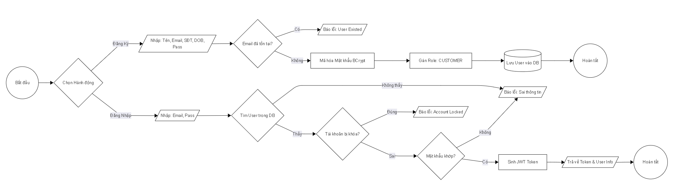
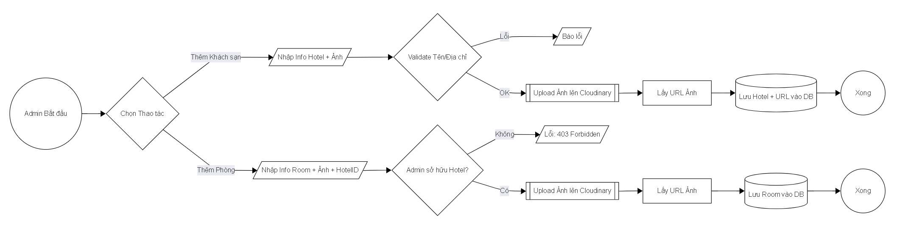
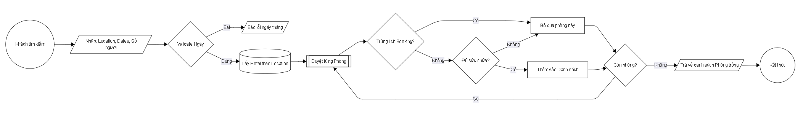
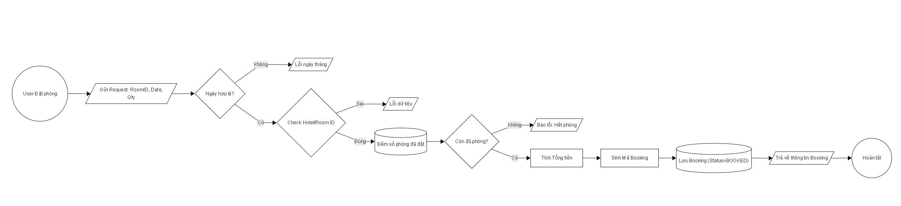
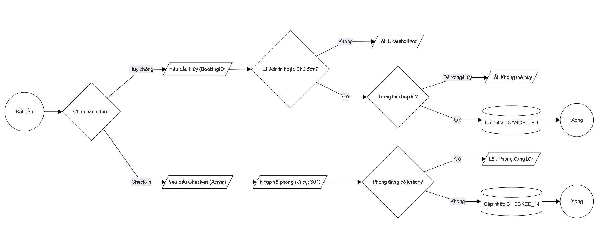
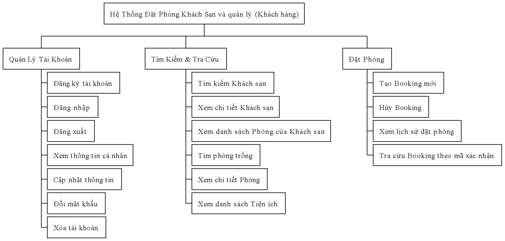
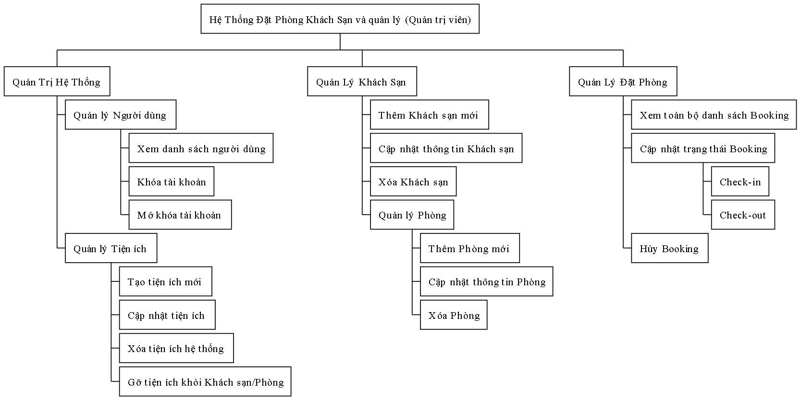
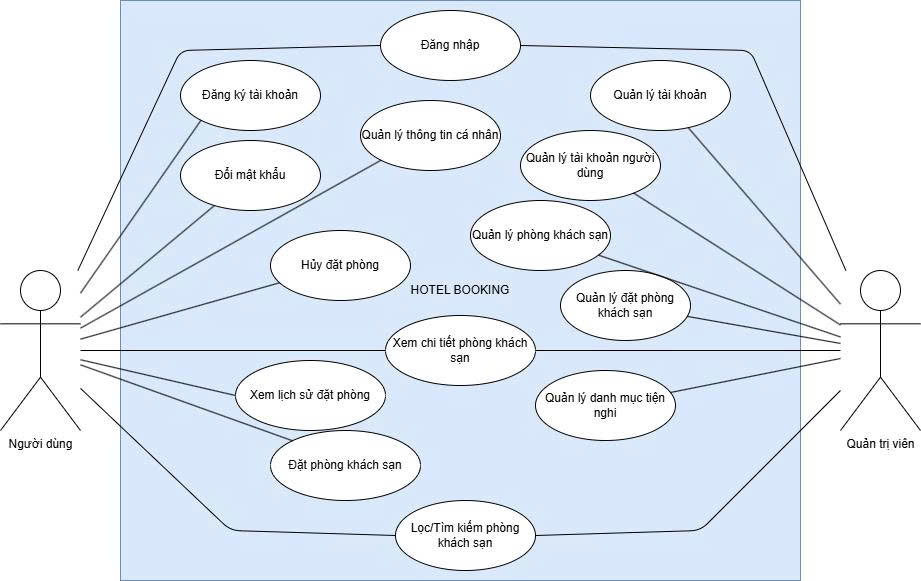

# ThucTap-566-HuynhNguyenTanPhat-LaiThuanPhat

CHƯƠNG 1. GIỚI THIỆU

1.1 ĐẶT VẤN ĐỀ, MỤC TIÊU LUẬN VĂN

1.1.1 Đặt vấn đề

Trong bối cảnh ngành du lịch và dịch vụ lưu trú đang phát triển mạnh mẽ, nhu cầu tìm kiếm, đặt phòng và thanh toán trực tuyến ngày càng trở nên phổ biến. Tuy nhiên, nhiều khách hàng vẫn gặp khó khăn khi tìm kiếm khách sạn phù hợp, so sánh giá, kiểm tra phòng trống, hoặc thực hiện thanh toán an toàn.

Mặt khác, các doanh nghiệp khách sạn nhỏ lẻ lại thiếu nền tảng số để quản lý thông tin phòng, đặt chỗ, hoặc thống kê doanh thu một cách hiệu quả.

Từ những bất cập đó, nhóm tiến hành xây dựng Hệ thống đặt phòng khách sạn trực tuyến (Hotel Booking System) với mục tiêu tối ưu trải nghiệm cho khách hàng, đồng thời hỗ trợ các doanh nghiệp quản lý hoạt động kinh doanh hiệu quả hơn.

1.1.2 Mục tiêu luận văn

Xây dựng một hệ thống web cho phép khách hàng tìm kiếm, đặt phòng trực tuyến.

Phát triển giao diện thân thiện, dễ sử dụng và tương thích đa thiết bị.

Cung cấp công cụ quản lý cho Admin quản lý khách sạn, đặt phòng, tài khoản và báo cáo doanh thu.

Đảm bảo hệ thống đạt các tiêu chí về hiệu suất, bảo mật, và khả năng mở rộng trong tương lai.

1.2 NHỮNG THÁCH THỨC CẦN GIẢI QUYẾT

Quản lý dữ liệu phức tạp: Dữ liệu liên quan đến nhiều bảng (khách sạn, phòng, đặt phòng, hủy phòng, đánh giá). Việc đảm bảo tính toàn vẹn và hiệu suất truy vấn là một thách thức.

Tìm kiếm và lọc dữ liệu: Cần tối ưu truy vấn để đảm bảo kết quả tìm kiếm trả về nhanh (≤ 3 giây) khi có nhiều tiêu chí tìm kiếm đồng thời.

Quản lý phân quyền người dùng: Cần xây dựng cơ chế phân quyền rõ ràng cho ba vai trò: Khách hàng, Quản trị viên.

Tính thân thiện với người dùng: Thiết kế giao diện trực quan dễ sử dụng, trải nghiệm nhất quán trên cả desktop, tablet và mobile.

Tối ưu hóa tìm kiếm khách sạn : Xử lý truy vấn phức tạp với khối lượng dữ liệu lớn trong thời gian thực, đòi hỏi thiết kế cơ sở dữ liệu hiệu quả và thuật toán tìm kiếm tối ưu.

Đồng bộ dữ liệu tồn kho : Quản lý số lượng phòng trống để tránh tình trạng đặt trùng phòng (overbooking), yêu cầu cơ chế khóa giao dịch.

1.3 NỘI DUNG, PHẠM VI THỰC HIỆN

1.3.1 Nội dung thực hiện

Phân tích và thiết kế hệ thống:

Xác định yêu cầu chức năng và phi chức năng.

Thiết kế cơ sở dữ liệu, sơ đồ use case, sơ đồ hoạt động và kiến trúc hệ thống.

Xây dựng hệ thống (Develop):

Giao diện người dùng (Frontend): xây dựng bằng ReactJS hoặc tương tự.

Backend: phát triển API bắng Spring boot, kết nối với cơ sở dữ liệu MySQL.

Kiểm thử và đánh giá hệ thống:

Kiểm thử chức năng: đăng ký, tìm kiếm, đặt phòng, thanh toán, quản lý tài khoản, quản lý khách sạn, quản lý phòng, quản lý tiện nghi.

Kiểm thử phi chức năng: hiệu suất, bảo mật, tính tương thích trình duyệt và thiết bị.

1.3.1 Phạm vi thực hiện

Đối tượng sử dụng: Khách hàng, Quản trị viên.

Phạm vi kỹ thuật:

Hệ thống web (chưa phát triển ứng dụng di động).

Sử dụng cơ sở dữ liệu quan hệ MySQL.

Tích hợp thanh toán ở mức mô phỏng hoặc sandbox (chưa triển khai thực tế).

1.4 Kết quả cần đạt

Kết quả chức năng:

| Chức năng | Tiêu chí đánh giá hoàn thành |
| --- | --- |
| Quản lý tài khoản (Quản trị viên) | Quản trị viên thêm/xóa/sửa/khóa/mở khóa tài khoản. |
| Quản lý khách sạn (Quản trị viên) | Quản trị viên thêm/xóa khách sạn. |
| Quản lý phòng khách sạn | Quản trị viên thêm/sửa/xóa phòng khách sạn. |
| Quản lý tiện nghi | Quản trị viên thêm/xóa/sửa tiện nghi cấp khách sạn/phòng. |
| Đăng ký tài khoản | Người dùng đăng ký tài khoản thành công. |
| Đăng nhập tài khoản | Người dùng đăng nhập tài khoản thành công. |
| Quên mật khẩu | Người dùng có thể lấy lại mật khẩu khi quên mật khẩu. |
| Quản lý thông tin cá nhân | Người dùng xem, sửa thông tin tài khoản cá nhân. |
| Tìm kiếm khách sạn | Hệ thống trả kết quả phù hợp với các tiêu chí mà người dùng chọn. |
| Đặt phòng | Người dùng có thể đặt phòng |
| Xem lịch sử đặt phòng | Người dùng có thể xem chi tiết thông tin phòng đặt phòng. |
| Hủy đặt phòng | Cho phép người dùng hủy phòng đã đặt theo chính sách. |
| Thống kê doanh thu | Thống kê doanh thu của khách sạn theo tháng/năm/quý |

Kết quả phi chức năng:

| Chức năng | Tiêu chí đánh giá hoàn thành |
| --- | --- |
| Thời gian phản hồi tìm kiếm | Hệ thống trả về kết quả tìm kiếm khách sạn không được vượt quá 3 giây. |
| Thời gian tải trang | Thời gian tải các trang chính (trang chủ, trang chi tiết khách sạn) không được vượt quá 2 giây. |
| Xử lý thanh toán | Thời gian xác nhận giao dịch (sau khi người dùng gửi thông tin thanh toán qua ví điện tử) không được vượt quá 5-7 giây. |
| Mã hóa mật khẩu | Tất cả mật khẩu người dùng phải được lưu trữ trong cơ sở dữ liệu dưới dạng băm (hashed). |
| Phân quyền | Hệ thống phải đảm bảo phân quyền nghiêm ngặt. |
| Bảo mật thanh toán | Mọi giao dịch thanh toán trực tuyến (qua ví điện tử) phải được thực hiện qua kết nối an toàn (HTTPS) và tuân thủ các tiêu chuẩn bảo mật. |
| Giao thức truyền tải | Toàn bộ hệ thống phải được truy cập qua giao thức HTTPS (SSL/TLS) để mã hóa dữ liệu truyền tải. |
| Xác thực API | Các API (nếu có) phải được bảo vệ bằng cơ chế xác thực (ví dụ: JWT, OAuth 2.0). |
| Bảo trì | Thời gian bảo trì hệ thống (nếu có) phải được lên kế hoạch và thực hiện ngoài giờ cao điểm và phải có thông báo trước cho người dùng. |
| Thiết kế đáp ứng - Responsive | Giao diện người dùng phải tương thích và hiển thị tốt trên các thiết bị phổ biến, bao gồm máy tính để bàn, máy tính bảng và điện thoại di động. |
| Tính module | Hệ thống nên được thiết kế theo kiến trúc module (ví dụ: Microservices hoặc module hóa) để dễ dàng nâng cấp, sửa lỗi và phát triển các tính năng mới. |

CHƯƠNG 2. PHƯƠNG PHÁP THỰC HIỆN

2.1 Các hệ thống tương tự

Trong quá trình xây dựng website đặt phòng khách sạn theo mô hình Marketplace, việc nghiên cứu và phân tích các nền tảng hiện có là một bước quan trọng. Hoạt động này giúp nhận diện các ưu điểm cần học hỏi, các nhược điểm cần khắc phục và định hình chiến lược phát triển sản phẩm. Dưới đây là phần phân tích hai hệ thống tiêu biểu trong ngành là Booking.com và Traveloka, cả hai đều vận hành thành công mô hình Marketplace, kết nối hiệu quả khách hàng với các nhà cung cấp dịch vụ lưu trú.

2.1.1 Booking.com

Booking.com là một trong những nền tảng đặt phòng trực tuyến hàng đầu thế giới. Hoạt động dựa trên mô hình Marketplace, hệ thống cung cấp một danh mục đa dạng các loại hình lưu trú, từ khách sạn, căn hộ đến homestay trên phạm vi toàn cầu. Nguồn doanh thu chính của Booking.com đến từ việc thu phí hoa hồng (thường dao động từ 15-20%) trên mỗi giao dịch thành công từ các đối tác lưu trú.

Ưu điểm:

- Danh mục sản phẩm phong phú: Booking.com sở hữu một mạng lưới đối tác khổng lồ với hàng triệu lựa chọn lưu trú tại hơn 200 quốc gia, đáp ứng được hầu hết các phân khúc khách hàng, từ cao cấp đến bình dân.

- Công cụ tìm kiếm và bộ lọc hiệu quả: Giao diện tìm kiếm được thiết kế trực quan, cho phép người dùng dễ dàng lọc kết quả theo các tiêu chí như giá, tiện nghi, điểm đánh giá, và vị trí, mang lại trải nghiệm nhanh chóng và chính xác.

- Chính sách đặt/hủy phòng linh hoạt: Nền tảng hỗ trợ đa dạng các chính sách như hủy phòng miễn phí hoặc không hoàn tiền, cùng với tùy chọn thanh toán trực tuyến hoặc thanh toán tại nơi lưu trú, tối ưu hóa sự thuận tiện cho khách hàng.

- Hệ thống đánh giá đáng tin cậy: Chỉ những khách hàng đã hoàn tất quá trình đặt và sử dụng dịch vụ mới có quyền đánh giá, đảm bảo tính khách quan và xác thực của các nhận xét.

- Nền tảng quản lý đối tác chuyên nghiệp: Booking.com cung cấp hệ thống Extranet, một công cụ quản trị mạnh mẽ cho phép đối tác dễ dàng cập nhật tình trạng phòng, điều chỉnh giá và quản lý đơn đặt phòng.

Nhược điểm:

- Mức phí hoa hồng cao: Tỷ lệ hoa hồng từ 15-20% được xem là một thách thức tài chính đối với các cơ sở lưu trú quy mô nhỏ.

- Hạn chế trong việc địa phương hóa: Tại thị trường Việt Nam, hệ thống còn thiếu sự tích hợp các phương thức thanh toán phổ biến như VietQR hay ví điện tử MoMo.

- Mức độ cạnh tranh cao: Các đối tác nhỏ lẻ gặp khó khăn trong việc cạnh tranh và hiển thị nổi bật do thuật toán thường ưu tiên các chuỗi khách sạn lớn hoặc những đơn vị tham gia chương trình khách hàng thân thiết Genius.

- Trải nghiệm giao diện người dùng: Giao diện bị một số người dùng đánh giá là phức tạp và chứa quá nhiều thông tin, làm giảm tính thân thiện.

- Thiếu cơ chế kiểm soát gian lận: Hệ thống chưa có cơ chế chấm điểm và xử phạt công khai đối với các đối tác vi phạm chính sách (ví dụ: tự ý hủy đơn), dẫn đến nguy cơ không đồng đều về chất lượng dịch vụ.

- Hỗ trợ khách hàng chưa được tự động hóa: Việc thiếu chatbot để giải đáp tự động các câu hỏi về chính sách khiến khách hàng phải phụ thuộc vào các kênh hỗ trợ thủ công, có thể gây chậm trễ.

2.1.2 Traveloka

Traveloka là một nền tảng du lịch trực tuyến hàng đầu tại khu vực Đông Nam Á, được thành lập vào năm 2012. Tương tự Booking.com, Traveloka vận hành theo mô hình Marketplace, cung cấp các dịch vụ đặt phòng khách sạn, vé máy bay và các tiện ích du lịch khác. Nền tảng này tập trung mạnh vào các thị trường trọng điểm như Indonesia, Việt Nam và Thái Lan, với mức phí hoa hồng cho đối tác dao động từ 10-15%.

Ưu điểm:

- Am hiểu thị trường địa phương: Traveloka thể hiện sự thấu hiểu sâu sắc nhu cầu của người dùng Đông Nam Á thông qua việc hỗ trợ đa dạng ngôn ngữ, tiền tệ và các phương thức thanh toán quen thuộc như ví điện tử và chuyển khoản ngân hàng.

- Chương trình khuyến mãi và ưu đãi: Nền tảng thường xuyên triển khai các chương trình giảm giá, tích điểm thành viên và ưu đãi độc quyền để thu hút và giữ chân khách hàng.

- Giao diện thân thiện và tối giản: Thiết kế giao diện, đặc biệt là trên ứng dụng di động, được đánh giá là đơn giản và dễ sử dụng, phù hợp với cả những người dùng không thành thạo công nghệ.

- Dịch vụ hỗ trợ khách hàng hiệu quả: Traveloka cung cấp dịch vụ chăm sóc khách hàng 24/7 thông qua nhiều kênh (chat, điện thoại, email), đảm bảo giải quyết các vấn đề một cách nhanh chóng.

- Hệ thống quản lý đối tác tiện lợi: Đối tác có thể quản lý giá, tình trạng phòng và các đơn đặt chỗ một cách linh hoạt thông qua ứng dụng Partner chuyên biệt.

- Hỗ trợ đa dạng phương thức thanh toán: Nền tảng tích hợp nhiều cổng thanh toán từ nội địa đến quốc tế, mang lại sự thuận tiện tối đa cho người dùng.

Nhược điểm:

- Phạm vi hoạt động quốc tế còn giới hạn: Do tập trung chủ yếu vào thị trường Đông Nam Á, số lượng lựa chọn lưu trú tại các khu vực như châu Âu hay châu Mỹ còn khá hạn chế.

- Thiếu cơ chế đánh giá đối tác: Tương tự Booking.com, hệ thống thiếu một cơ chế chấm điểm và xếp hạng công khai để ghi nhận và xử lý các đối tác có hành vi gian lận hoặc chất lượng dịch vụ kém.

- Quy trình hỗ trợ còn thủ công: Việc giải đáp các thắc mắc về chính sách vẫn phụ thuộc vào nhân viên hỗ trợ, có thể dẫn đến tình trạng quá tải và chậm trễ trong các khung giờ cao điểm.

2.2 Công nghệ sử dụng

2.2.1 Phía Frontend

React.js: Là một thư viện JavaScript mạnh mẽ do Facebook phát triển, được sử dụng để xây dựng giao diện người dùng (UI) theo kiến trúc dựa trên các thành phần (component). Điều này giúp mã nguồn được tái sử dụng cao, dễ quản lý và bảo trì.

React Router: Thư viện được sử dụng để quản lý việc định tuyến (routing) phía client, cho phép tạo ra một ứng dụng đơn trang (Single-Page Application - SPA) với trải nghiệm điều hướng mượt mà giữa các trang khác nhau mà không cần tải lại toàn bộ trang web.

Tailwind CSS: Là một framework CSS theo triết lý "utility-first", cung cấp các lớp tiện ích cấp thấp để xây dựng giao diện một cách nhanh chóng và tùy biến cao trực tiếp trong mã HTML/JSX. Toàn bộ giao diện của dự án được tạo kiểu bằng Tailwind CSS.

Axios: Là một thư viện HTTP client dựa trên Promise, được sử dụng để thực hiện các yêu cầu API từ frontend đến backend một cách dễ dàng và mạnh mẽ. Axios được cấu hình để tự động đính kèm token xác thực vào mỗi yêu cầu.

2.2.2 Phía Backend

2.2.2.1 Java

Ngôn ngữ lập trình Java là một ngôn ngữ hướng đối tượng, được sử dụng rộng rãi trong việc phát triển phần mềm, trang web, game và ứng dụng di động. Một trong những tiêu chí quan trọng của Java là “Viết một lần, thực thi khắp nơi” (Write once, run anywhere), có nghĩa là chương trình viết bằng Java có thểchạy trên nhiều nền tảng khác nhau.

Java có nhiều đặc điểm nổi bật, bao gồm:

- Tương tự C++, nhưng dễ học và sử dụng hơn.

- Độc lập với phần cứng và hệ điều hành, cho phép chương trình chạy tốt trên nhiều môi trường.

- Ngôn ngữ thông dịch, có nghĩa là mã nguồn được biên dịch thành bytecode, sau đó bytecode được môi trường thực thi chạy.

- Cơ chế thu gom rác tự động, giúp loại bỏ các đối tượng không sử dụng và tiết kiệm bộ nhớ.

- Đa luồng, cho phép thực hiện nhiều tác vụ cùng một lúc.

- Tính an toàn và bảo mật cao.

- Java cũng được sử dụng để phát triển nhiều loại ứng dụng khác nhau, từ ứng dụng web, desktop cho đến mobile

2.2.2.2 Spring Boot

- Spring Boot là một dự án con của framework Spring, được thiết kế để giúp phát triển ứng dụng Java một cách nhanh chóng và dễ dàng. Dưới đây là một số đặc điểm nổi bật và tính ưu việt của Spring Boot:

- Thuận tiện cấu hình (Convenient configuration): Spring Boot giúp tựđộng cấu hình môi trường ứng dụng một cách đơn giản thông qua việc sử dụng các giá trị mặc định và các cấu hình thông minh. Điều này giảm đáng kể khối lượng công việc cần thiết cho việc cấu hình.

- Embeddable web server: Spring Boot đi kèm với các web server như Tomcat, Jetty hoặc Undertow được tích hợp sẵn trong ứng dụng, giảm thiểu sự phức tạp trong việc triển khai ứng dụng.

- Dependency Injection (DI): Spring Boot sử dụng cơ chế DI mạnh mẽ của Spring Framework, giúp quản lý và tự động kết nối các thành phần của ứng dụng

- Standalone: Ứng dụng Spring Boot có thể chạy độc lập mà không cần các cấu hình phức tạp, điều này giúp tiết kiệm thời gian và công sức khi triển khai.

- Tích hợp tốt với Spring Ecosystem: Spring Boot tương thích và tích hợp tốt với nhiều dự án khác của Spring như Spring Data, Spring Security, Spring Cloud, giúp phát triển ứng dụng một cách linh hoạt và mạnh mẽ.

- Tự động cập nhật Dependency: Spring Boot hỗ trợ tính năng tự động cập nhật các phiên bản dependency, giúp dễ dàng duy trì và cập nhật ứng dụng.

- Annotation-Based configuration: Sử dụng các chú thích (annotation) để cấu hình thay vì sử dụng các file cấu hình XML, giúp mã nguồn trở nên gọn gàng và dễ đọc.

- Microservices development: Spring Boot được sử dụng rộng rãi trong phát triển ứng dụng dạng Microservices do tính linh hoạt và dễ triển khai. Những đặc điểm này khiến Spring Boot trở thành một lựa chọn phổ biến trong cộng đồng phát triển Java, đặc biệt là cho việc xây dựng các ứng dụng web, dịch vụ và các hệ thống phức tạp.

2.2.2.3 MySQL

- MySQL là một hệ quản trị cơ sở dữ liệu quan hệ (RDBMS) mã nguồn mở, phổ biến và mạnh mẽ. Dưới đây là một số điểm nổi bật về MySQL:

- Mã nguồn mở: MySQL được phát triển và duy trì dưới dạng mã nguồn mở, cho phép người dùng tự do sử dụng, tùy chỉnh và phân phối lại theo các điều khoản của Giấy phép Công cộng GNU (GPL).

- Hiệu suất cao: MySQL được tối ưu hóa để cung cấp hiệu suất cao trong việc xử lý các truy vấn và giao tiếp với cơ sở dữ liệu, làm cho nó trở thành lựa chọn phổ biến cho các ứng dụng yêu cầu xử lý dữ liệu nhanh chóng.

- Đa nền tảng: MySQL hỗ trợ nhiều nền tảng, có thể chạy trên nhiều hệ điều hành như Linux, Windows, macOS, và nhiều loại kiến trúc khác nhau.

- Tính an toàn và bảo mật: MySQL cung cấp các tính năng an toàn và bảo mật như quản lý người dùng, phân quyền, mã hóa dữ liệu, và khả năng sao lưu và khôi phục dữ liệu.

- Dễ sử dụng: MySQL có một cộng đồng lớn và tích hợp nhiều công cụ quản lý cơ sở dữ liệu như MySQL Workbench, giúp người quản trị và phát triển dễ dàng tương tác với cơ sở dữ liệu

- Hỗ trợ chuẩn SQL: MySQL tuân thủ chuẩn SQL, giúp người phát triển dễ dàng chuyển đổi giữa các hệ thống quản trị cơ sở dữ liệu hỗ trợ SQL mà không gặp nhiều vấn đề tương thích.

- Phù hợp với ứng dụng nhỏ đến lớn: Từ các ứng dụng web nhỏ đến các hệ thống doanh nghiệp lớn, MySQL phù hợp với mọi quy mô ứng dụng.

- MySQL là một giải pháp đáng tin cậy và linh hoạt cho việc quản lý cơ sở dữ liệu, và sự phổ biến của nó đã đưa MySQL trở thành một trong những hệ quản trị cơ sở dữ liệu hàng đầu trên thế giới

2.3 Phân tích yêu cầu

2.3.1 Các quy trình, nghiệp vụ

2.3.1.1 Quy trình Quản lý Tài khoản và Xác thực

- Quy trình bắt đầu khi người dùng mới thực hiện Đăng ký . Hệ thống tiếp nhận thông tin bao gồm họ tên, email, số điện thoại và ngày sinh. Trước khi tạo tài khoản, hệ thống sẽ kiểm tra trong cơ sở dữ liệu xem email đã tồn tại hay chưa để tránh trùng lặp. Mật khẩu người dùng nhập vào sẽ được mã hóa (sử dụng BCrypt) trước khi lưu trữ để đảm bảo bảo mật. Mặc định, tài khoản mới tạo sẽ được gán vai trò là "CUSTOMER" và trạng thái hoạt động được kích hoạt ngay lập tức.

- Đối với quy trình Đăng nhập (Login), người dùng cung cấp email và mật khẩu. Hệ thống tìm kiếm tài khoản theo email, sau đó kiểm tra xem tài khoản có đang bị khóa bởi Admin hay không. Nếu tài khoản hợp lệ, hệ thống so khớp mật khẩu đã mã hóa. Khi xác thực thành công, server sẽ sinh ra một chuỗi JWT chứa thông tin định danh và vai trò của người dùng, token này có hiệu lực trong 6 tháng và được dùng để xác thực các request tiếp theo.

- Ngoài ra, người dùng có thể thực hiện Đổi mật khẩu. Quy trình này yêu cầu người dùng phải nhập đúng mật khẩu cũ. Hệ thống cũng kiểm tra để đảm bảo mật khẩu mới không được trùng với mật khẩu cũ trước khi thực hiện mã hóa và cập nhật vào cơ sở dữ liệu.

Hình 2.1: Quy trình đăng nhập và đăng ký.

2.3.1.2 Quy trình Quản lý Khách sạn và Phòng (Dành cho Admin)

- Quy trình này dành riêng cho tài khoản có quyền Admin. Đầu tiên là Tạo mới Khách sạn, Admin nhập các thông tin như tên, địa chỉ, mô tả, số sao và tải lên hình ảnh. Hệ thống tích hợp với Cloudinary để lưu trữ ảnh và lấy về URL lưu vào cơ sở dữ liệu. Hệ thống cũng kiểm tra tên và địa điểm khách sạn để ngăn chặn việc tạo trùng lặp.

- Sau khi có khách sạn, Admin tiến hành Thêm phòng . Một phòng sẽ được gắn liền với một khách sạn cụ thể do Admin quản lý. Admin thiết lập loại phòng (Single, Double, Suit, Triple), giá tiền, sức chứa và số lượng phòng có sẵn. Tương tự như khách sạn, hình ảnh phòng cũng được upload lên Cloud và liên kết với phòng đó. Đồng thời, Admin có thể gán các tiện ích cho phòng hoặc khách sạn từ danh sách tiện ích chung của hệ thống.

Hình 2.2: Quy trình quản lý khách sạn và phòng

2.3.1.3 Quy trình Tìm kiếm và Kiểm tra Phòng Trống

Đây là nghiệp vụ quan trọng để đảm bảo khách hàng luôn tìm được phòng thực tế có sẵn. Khi người dùng tìm kiếm theo địa điểm và khoảng thời gian (Check-in/Check-out), hệ thống thực hiện truy vấn phức tạp để loại trừ các phòng đã kín chỗ. Logic hoạt động là tìm tất cả các phòng thuộc khách sạn ở địa điểm đó, sau đó loại bỏ những phòng đã nằm trong các đơn đặt phòng (Booking) có trạng thái là BOOKED hoặc CHECKED_IN mà khoảng thời gian lưu trú giao nhau với khoảng thời gian khách đang tìm. Chỉ những phòng thỏa mãn điều kiện về thời gian và sức chứa mới được trả về kết quả tìm kiếm.

Hình 2.3: Quy trình tìm kiếm và kiểm tra phòng trống

2.3.1.4 Quy trình Đặt phòng

- Quy trình đặt phòng diễn ra qua nhiều bước kiểm tra nghiêm ngặt. Khi khách hàng gửi yêu cầu đặt phòng, hệ thống đầu tiên sẽ xác thực tính hợp lệ của ngày tháng (ngày Check-in không được là quá khứ, ngày Check-out phải sau ngày Check-in). Tiếp theo, hệ thống kiểm tra lại một lần nữa số lượng phòng trống thực tế trong khoảng thời gian đó. Nếu tổng số phòng đã đặt cộng với số phòng khách muốn đặt vượt quá tổng số lượng phòng hiện có của khách sạn, yêu cầu sẽ bị từ chối.

- Nếu phòng có sẵn, hệ thống sẽ tính toán tổng giá tiền bằng cách nhân giá phòng với số đêm lưu trú. Một mã đặt phòng duy nhất gồm 10 ký tự sẽ được sinh ra ngẫu nhiên. Đơn đặt phòng sau đó được lưu vào cơ sở dữ liệu với trạng thái ban đầu là BOOKED.

Hình 2.4: Quy trình đặt phòng

2.3.1.5 Quy trình Vận hành

- Sau khi đơn đặt phòng được tạo, quy trình vận hành cho phép cập nhật trạng thái. Khi khách đến nhận phòng, Admin hoặc lễ tân sẽ cập nhật trạng thái đơn sang CHECKED_IN. Tại bước này, hệ thống cho phép gán số phòng cụ thể (ví dụ: phòng 301) cho khách. Hệ thống có logic kiểm tra để đảm bảo số phòng này chưa bị gán cho một khách đang lưu trú khác.

- Đối với việc Hủy phòng, người dùng hoặc Admin có thể thực hiện. Tuy nhiên, hệ thống chặn việc hủy đối với các đơn đã hoàn thành (CHECKED_OUT) hoặc đã bị hủy trước đó. Chỉ người dùng tạo đơn (chính chủ) hoặc Admin mới có quyền thực hiện thao tác này.

Hình 2.5: Quy trình vận hành

2.3.2 Sơ đồ chức năng

Hình 2.6: Sơ đồ chức năng của khách hàng

Hình 2.7: Sơ đồ chức năng của quản trị viên

2.3.3 Sơ đồ Use case tổng quát

Hình 2.8: Sơ đồ Usecase tổng quát

CHƯƠNG 3: THIẾT KẾ

3.1 Mô hình dữ liệu (mức ý niệm, mức luận lý, mức vậT lý)

3.1.1 Mức ý niệm

Hình 2.9: Mô hình dữ liệu mức ý niệm

3.1.2 Mức luận lý

Hình 2.10: Mô hình dữ liệu mức luận lý

3.1.3 Mức vật lý

Hình 2.11: Mô hình dữ liệu mức vật lý

3.1.4 Mô tả chi tiết bảng

Bảng Role

| Thuộc tính | Giải thích | Kiểu dữ liệu | K | U | M |
| --- | --- | --- | --- | --- | --- |
| id | Mã định danh của quyền | INT | x | x | x |
| name | Tên quyền hạn (ví dụ: ADMIN) | VARCHAR(255) |  |  | x |

Bảng User

| Thuộc tính | Giải thích | Kiểu dữ liệu | K | U | M |
| --- | --- | --- | --- | --- | --- |
| id | Mã định danh người dùng | INT | x | x | x |
| activate | Trạng thái kích hoạt (1: Active, 0: Inactive) | BIT(1) |  |  | x |
| created_at | Thời gian tạo tài khoản | DATETIME(6) |  |  |  |
| dob | Ngày sinh | DATE |  |  | x |
| email | Địa chỉ email | VARCHAR(255) |  |  | x |
| full_name | Họ và tên đầy đủ | VARCHAR(255) |  |  | x |
| password | Mật khẩu (đã mã hóa) | VARCHAR(255) |  |  | x |
| phone | Số điện thoại | VARCHAR(255) |  |  | x |

Bảng Hotel

| Thuộc tính | Giải thích | Kiểu dữ liệu | K | U | M |
| --- | --- | --- | --- | --- | --- |
| id | Mã định danh khách sạn | INT | x | x | x |
| name | Tên khách sạn | VARCHAR(255) |  |  | x |
| description | Mô tả về khách sạn | VARCHAR(255) |  |  | x |
| location | Địa chỉ/Vị trí | VARCHAR(255) |  |  | x |
| star_rating | Xếp hạng sao (ví dụ: 3, 4, 5) | INT |  |  | x |
| contact_name | Tên người liên hệ | VARCHAR(255) |  |  | x |
| contact_phone | Số điện thoại liên hệ | VARCHAR(255) |  |  | x |
| email | Email của khách sạn | VARCHAR(255) |  |  | x |
| is_active | Trạng thái hoạt động | BIT(1) |  |  | x |
| user_id | Mã người dùng sở hữu (FK) | INT |  |  | x |

Bảng Room

| Thuộc tính | Giải thích | Kiểu dữ liệu | K | U | M |
| --- | --- | --- | --- | --- | --- |
| id | Mã định danh phòng | INT | x | x | x |
| name | Tên phòng/Mã phòng | VARCHAR(255) |  |  | x |
| type | Loại phòng (DOUBLE, SINGLE, SUIT, TRIPLE) | ENUM |  |  | x |
| price | Giá phòng | DECIMAL(38,2) |  |  | x |
| capacity | Sức chứa (số người) | INT |  |  | x |
| amount | Số lượng phòng loại này | INT |  |  | x |
| description | Mô tả chi tiết phòng | VARCHAR(255) |  |  | x |
| hotel_id | Thuộc khách sạn nào (FK) | INT |  |  | x |

Bảng Booking

| Thuộc tính | Giải thích | Kiểu dữ liệu | K | U | M |
| --- | --- | --- | --- | --- | --- |
| id | Mã đơn đặt phòng | INT | x | x | x |
| booking_reference | Mã tham chiếu đặt phòng | VARCHAR(255) |  |  | x |
| customer_name | Tên khách hàng đặt | VARCHAR(255) |  |  | x |
| checkin_date | Ngày nhận phòng | DATE |  |  | x |
| checkout_date | Ngày trả phòng | DATE |  |  | x |
| create_at | Ngày tạo đơn | DATE |  |  | x |
| total_price | Tổng giá trị đơn hàng | FLOAT |  |  | x |
| status | Trạng thái (BOOKED, CANCELLED...) | ENUM |  |  | x |
| adult_amount | Số lượng người lớn | INT |  |  | x |
| children_amount | Số lượng trẻ em | INT |  |  | x |
| user_id | Người dùng thực hiện đặt (FK) | INT |  |  | x |
| cancel_reason | Lý do hủy (nếu có) | VARCHAR(255) |  |  |  |
| refund | Số tiền hoàn lại (nếu có) | FLOAT |  |  |  |
| room_number | Số phòng được gán | VARCHAR(10) |  |  |  |
| special_require | Yêu cầu đặc biệt | VARCHAR(255) |  |  |  |

Bảng Amenity

| Thuộc tính | Giải thích | Kiểu dữ liệu | K | U | M |
| --- | --- | --- | --- | --- | --- |
| id | Mã tiện nghi | INT | x | x | x |
| name | Tên tiện nghi | VARCHAR(255) |  |  | x |
| type | Loại tiện nghi | VARCHAR(255) |  |  | x |

Bảng Image

| Thuộc tính | Giải thích | Kiểu dữ liệu | K | U | M |
| --- | --- | --- | --- | --- | --- |
| id | Mã hình ảnh | INT | x | x | x |
| path | Đường dẫn lưu file ảnh | VARCHAR(255) |  |  | x |
| hotel_id | Ảnh thuộc khách sạn nào (FK) | INT |  |  |  |
| room_id | Ảnh thuộc phòng nào (FK) | INT |  |  |  |

Bảng Booking_room

| Thuộc tính | Giải thích | Kiểu dữ liệu | K | U | M |
| --- | --- | --- | --- | --- | --- |
| id | Mã chi tiết | INT | x | x | x |
| booking_id | Mã đơn đặt (FK) | INT |  |  | x |
| room_id | Mã phòng (FK) | INT |  |  | x |

Bảng Hotel_Amenity

| Thuộc tính | Giải thích | Kiểu dữ liệu | K | U | M |
| --- | --- | --- | --- | --- | --- |
| amenity_id | Mã tiện nghi (FK) | INT | x |  | x |
| hotel_id | Mã khách sạn (FK) | INT | x |  | x |

Bảng Room_Amenity

| Thuộc tính | Giải thích | Kiểu dữ liệu | K | U | M |
| --- | --- | --- | --- | --- | --- |
| amenity_id | Mã tiện nghi (FK) | INT | x |  | x |
| room_id | Mã phòng (FK) | INT | x |  | x |

Bảng User_Role

| Thuộc tính | Giải thích | Kiểu dữ liệu | K | U | M |
| --- | --- | --- | --- | --- | --- |
| role_id | Mã quyền (FK) | INT | x |  | x |
| user_id | Mã người dùng (FK) | INT | x |  | x |

3.2 Mô hình xử lý

3.2.1 Use case chi tiết

3.2.1.1 Usecase đăng nhập

Hình 3.1: Usecase đăng nhập

Đặc tả Usecase đăng nhập

| Mục | Nội dung |
| --- | --- |
| Tên Use case | Đăng nhập |
| Actor | Khách (Guest) |
| Mô tả | Người dùng sử dụng Email và Mật khẩu để xác thực danh tính và truy cập vào hệ thống. Hệ thống sẽ cấp phát JWT Token nếu xác thực thành công. |
| Pre-conditions | Actor truy cập vào trang đăng nhập và chưa thực hiện đăng nhập. |
| Post-conditions | Success: Hệ thống trả về JWT Token, chuyển hướng người dùng vào trang chủ/trang quản trị. Fail: Hệ thống hiển thị thông báo lỗi tương ứng. |
| Luồng sự kiện chính | 1. Actor nhập Email và Mật khẩu. 2. Actor nhấn nút "Đăng nhập". 3. Hệ thống thực hiện kiểm tra Email tồn tại. 4. Hệ thống thực hiện kiểm tra mật khẩu chính xác. 5. Hệ thống thực hiện kiểm tra trạng thái khóa của tài khoản. 6. Nếu tất cả thông tin hợp lệ, hệ thống thực hiện tạo JWT Token. 7. Hệ thống hiển thị thông báo thành công và chuyển hướng Actor. |
| Luồng sự kiện phụ | - Nếu Email không tồn tại hoặc sai Mật khẩu: Hệ thống thực hiện thông báo sai thông tin. - Nếu tài khoản chưa kích hoạt (Activate == false): Hệ thống thực hiện thông báo tài khoản bị khóa. |
| <Include Use Case> Quy trình Kiểm tra & Xác thực | - Kiểm tra Email: Hệ thống truy vấn cơ sở dữ liệu để xác nhận email có tồn tại. - Kiểm tra Mật khẩu: Hệ thống so sánh mật khẩu nhập vào (đã hash) với mật khẩu trong cơ sở dữ liệu. - Kiểm tra Trạng thái: Hệ thống xem xét trạng thái is_active của tài khoản. - Tạo Token: Hệ thống sinh chuỗi JWT chứa thông tin người dùng để xác thực các phiên làm việc sau. |
| <Extend Use Case> Thông báo sai thông tin | Điều kiện: Khi quy trình kiểm tra Email hoặc Mật khẩu thất bại. Hành động: - Hệ thống hiển thị thông báo lỗi: "Tên đăng nhập hoặc mật khẩu không đúng". - Hệ thống xóa trường mật khẩu để người dùng nhập lại. |

3.2.1.2 Usecase đăng ký

Hình 3.2: Usecase đăng ký

Đặc tả Usecase đăng ký

| Mục | Nội dung |
| --- | --- |
| Tên Use case | Đăng ký tài khoản |
| Actor | Khách (Guest) |
| Mô tả | Người dùng (Khách) cung cấp thông tin cá nhân để tạo tài khoản mới trên hệ thống. Tài khoản sau khi tạo sẽ có quyền mặc định là Customer. |
| Pre-conditions | Actor đang ở trang đăng ký và chưa đăng nhập vào hệ thống. |
| Post-conditions | Success: Tài khoản mới được tạo trong cơ sở dữ liệu với mật khẩu đã mã hóa và quyền hạn chính xác. Fail: Hệ thống hiển thị thông báo lỗi cụ thể (do định dạng sai hoặc email đã tồn tại). |
| Luồng sự kiện chính | 1. Actor nhập các thông tin đăng ký (Email, Mật khẩu, Họ tên, v.v.). 2. Actor nhấn nút "Đăng ký". 3. Hệ thống thực hiện kiểm tra định dạng dữ liệu. 4. Hệ thống thực hiện kiểm tra Email đã tồn tại. 5. Hệ thống thực hiện mã hóa mật khẩu. 6. Hệ thống thực hiện gán quyền mặc định (Customer). 7. Hệ thống lưu thông tin và thông báo đăng ký thành công. |
| Luồng sự kiện phụ | - Nếu dữ liệu nhập vào sai định dạng hoặc Email đã được sử dụng: Hệ thống thực hiện hiển thị lỗi Validation. |
| <Include Use Case> Quy trình Xử lý dữ liệu | - Kiểm tra định dạng: Hệ thống xác thực tính hợp lệ của email, độ mạnh mật khẩu, và các trường bắt buộc. - Kiểm tra Email: Hệ thống truy vấn xem email đã có trong hệ thống chưa. - Mã hóa mật khẩu: Hệ thống chuyển đổi mật khẩu thô sang chuỗi mã hóa (hash) để bảo mật. - Gán quyền: Hệ thống mặc định thiết lập vai trò (Role) cho tài khoản mới là "Customer". |
| <Extend Use Case> Hiển thị lỗi Validation | Điều kiện: Khi quy trình kiểm tra định dạng thất bại hoặc quy trình kiểm tra Email phát hiện trùng lặp. Hành động: - Hệ thống hiển thị thông báo chi tiết lỗi (ví dụ: "Email không hợp lệ", "Email đã tồn tại", "Mật khẩu quá ngắn"). - Hệ thống yêu cầu người dùng nhập lại các thông tin chưa hợp lệ. |

3.2.1.3 Usecase quản lý thông tin cá nhân

Hình 3.3: Usecase quản lý thông tin cá nhân

Đặc tả Usecase cập nhật thông tin cá nhân

| Mục | Nội dung |
| --- | --- |
| Tên Use case | Cập nhật thông tin cá nhân |
| Actor | Người dùng (User) |
| Mô tả | Người dùng thay đổi các thông tin cá nhân (như họ tên, số điện thoại, địa chỉ...) để cập nhật hồ sơ của mình trên hệ thống. |
| Pre-conditions | - Actor đã đăng nhập thành công vào hệ thống. - Hệ thống đã lấy được thông tin User hiện tại (Context). |
| Post-conditions | Success: Thông tin mới được cập nhật vào cơ sở dữ liệu. Fail: Hệ thống hiển thị thông báo lỗi validation và giữ nguyên dữ liệu cũ. |
| Luồng sự kiện chính | 1. Actor chọn chức năng "Cập nhật thông tin" trên giao diện profile. 2. Actor chỉnh sửa các trường thông tin mong muốn. 3. Actor nhấn nút "Lưu thay đổi". 4. Hệ thống thực hiện kiểm tra tính hợp lệ dữ liệu (Validate Form). 5. Nếu dữ liệu hợp lệ, hệ thống lưu thông tin mới vào cơ sở dữ liệu. 6. Hệ thống hiển thị thông báo "Cập nhật thành công". |
| Luồng sự kiện phụ | - Nếu dữ liệu nhập vào không đúng định dạng (ví dụ: SĐT sai, ngày sinh không hợp lệ): Hệ thống thực hiện thông báo lỗi Validation. |
| <Include Use Case> Quy trình Nghiệp vụ | - Lấy Context: Hệ thống xác định chính xác User đang thao tác dựa trên phiên đăng nhập. - Kiểm tra tính hợp lệ: Hệ thống xét duyệt các quy tắc nghiệp vụ (độ dài chuỗi, định dạng số, các trường bắt buộc) đối với dữ liệu người dùng vừa nhập. |
| <Extend Use Case> Thông báo lỗi Validation | Điều kiện: Khi quy trình kiểm tra tính hợp lệ phát hiện dữ liệu sai quy chuẩn. Hành động: - Hệ thống hiển thị thông báo lỗi cụ thể ngay tại trường dữ liệu không hợp lệ. - Hệ thống yêu cầu người dùng nhập lại. |

Đặc tả Usecase đổi mật khẩu

| Mục | Nội dung |
| --- | --- |
| Tên Use case | Đổi mật khẩu |
| Actor | Người dùng (User) |
| Mô tả | Người dùng thay đổi mật khẩu đăng nhập hiện tại sang một mật khẩu mới để bảo mật tài khoản. |
| Pre-conditions | - Actor đã đăng nhập thành công. - Actor nhớ mật khẩu hiện tại. |
| Post-conditions | Success: Mật khẩu mới được mã hóa và cập nhật. Các phiên đăng nhập cũ có thể bị vô hiệu hóa (tùy chính sách). Fail: Mật khẩu không đổi, hệ thống báo lỗi sai mật khẩu cũ hoặc mật khẩu mới trùng lặp. |
| Luồng sự kiện chính | 1. Actor chọn chức năng "Đổi mật khẩu". 2. Actor nhập Mật khẩu cũ, Mật khẩu mới, và Xác nhận mật khẩu mới. 3. Actor nhấn nút "Đổi mật khẩu". 4. Hệ thống thực hiện xác thực mật khẩu cũ. 5. Hệ thống thực hiện kiểm tra trùng mật khẩu cũ (đảm bảo pass mới khác pass cũ). 6. Nếu hợp lệ, hệ thống thực hiện mã hóa và cập nhật mật khẩu mới. 7. Hệ thống hiển thị thông báo thành công. |
| Luồng sự kiện phụ | - Nếu Mật khẩu cũ không khớp với dữ liệu trong DB: Hệ thống thực hiện thông báo sai mật khẩu. - Nếu Mật khẩu mới giống hệt Mật khẩu cũ: Hệ thống hiển thị cảnh báo mật khẩu mới phải khác mật khẩu cũ. |
| <Include Use Case> Quy trình Kiểm tra bảo mật | - Xác thực mật khẩu cũ: Hệ thống so sánh chuỗi hash của mật khẩu nhập vào với mật khẩu đang lưu trong DB. - Kiểm tra trùng: Hệ thống đảm bảo tính bảo mật bằng cách ngăn người dùng sử dụng lại mật khẩu vừa dùng. |
| <Extend Use Case> Thông báo sai mật khẩu | Điều kiện: Khi bước xác thực mật khẩu cũ thất bại. Hành động: - Hệ thống hiển thị thông báo: "Mật khẩu hiện tại không đúng". - Hệ thống xóa các trường mật khẩu để nhập lại. |

Đặc tả Usecase xem thông tin profile

| Mục | Nội dung |
| --- | --- |
| Tên Use case | Xem thông tin Profile |
| Actor | Người dùng (User) |
| Mô tả | Người dùng truy cập vào trang cá nhân để xem các thông tin chi tiết về tài khoản của mình đang được lưu trữ trong hệ thống. |
| Pre-conditions | - Actor đã đăng nhập thành công - Hệ thống đã xác định được ngữ cảnh (Context) của người dùng. |
| Post-conditions | Success: Hệ thống hiển thị đầy đủ thông tin cá nhân (Họ tên, Email, SĐT, Avatar...). Fail: Hệ thống yêu cầu đăng nhập lại nếu phiên làm việc hết hạn. |
| Luồng sự kiện chính | 1. Actor chọn menu "Hồ sơ cá nhân". 2. Hệ thống thực hiện lấy thông tin User từ Context. 3. Hệ thống truy xuất dữ liệu chi tiết từ cơ sở dữ liệu. 4. Hệ thống hiển thị giao diện thông tin profile. |
| Luồng sự kiện phụ | - Nếu không lấy được thông tin User (Lỗi phiên): Hệ thống thực hiện chuyển hướng về trang đăng nhập. |
| <Include Use Case> Quy trình Nghiệp vụ | - Lấy thông tin User từ Context: Hệ thống xác định ID người dùng hiện tại từ Token hoặc Session để đảm bảo hiển thị đúng dữ liệu của người đó. |
| <Extend Use Case> Thông báo không thể hủy | Điều kiện: Khi đơn hàng đang ở trạng thái Checked-out hoặc Cancelled. Hành động: - Hệ thống hiển thị lỗi: "Đơn hàng này không thể hủy vì đã hoàn tất hoặc đã bị hủy". |
| <Extend Use Case> Thông báo không có quyền | Điều kiện: Khi quy trình kiểm tra quyền sở hữu thất bại. Hành động: - Hệ thống hiển thị cảnh báo bảo mật: "Bạn không có quyền thao tác trên đơn hàng này". |

Đặc tả Usecase xóa tài khoản cá nhân

| Mục | Nội dung |
| --- | --- |
| Tên Use case | Xóa tài khoản cá nhân |
| Actor | Người dùng (User) |
| Mô tả | Người dùng yêu cầu xóa vĩnh viễn (hoặc vô hiệu hóa) tài khoản của mình khỏi hệ thống. |
| Pre-conditions | - Actor đã đăng nhập thành công. |
| Post-conditions | Success: Tài khoản bị xóa/vô hiệu hóa, người dùng bị đăng xuất ngay lập tức. Fail: Hệ thống báo lỗi nếu có ràng buộc dữ liệu (ví dụ: đang có đơn đặt phòng chưa hoàn tất). |
| Luồng sự kiện chính | 1. Actor chọn chức năng "Xóa tài khoản" trong phần cài đặt. 2. Hệ thống hiển thị cảnh báo và yêu cầu xác nhận.  3. Actor xác nhận xóa. 4. Hệ thống thực hiện lấy thông tin User từ Context. 5. Hệ thống thực hiện chuyển trạng thái tài khoản sang "Đã xóa" (Soft Delete) hoặc xóa khỏi DB. 6. Hệ thống thực hiện đăng xuất người dùng và chuyển về trang chủ. |
| Luồng sự kiện phụ | - Actor hủy bỏ xác nhận: Hệ thống quay lại màn hình cài đặt. |
| <Include Use Case> Quy trình Nghiệp vụ | - Lấy thông tin User từ Context: Xác định chính xác tài khoản cần xóa. |
| <Extend Use Case> Thông báo không thể hủy | Điều kiện: Khi đơn hàng đang ở trạng thái Checked-out hoặc Cancelled. Hành động: - Hệ thống hiển thị lỗi: "Đơn hàng này không thể hủy vì đã hoàn tất hoặc đã bị hủy". |
| <Extend Use Case> Thông báo không có quyền | Điều kiện: Khi quy trình kiểm tra quyền sở hữu thất bại. Hành động: - Hệ thống hiển thị cảnh báo bảo mật: "Bạn không có quyền thao tác trên đơn hàng này". |

Đặc tả Usecase xem lịch sử đặt phòng

| Mục | Nội dung |
| --- | --- |
| Tên Use case | Xem lịch sử đặt phòng |
| Actor | Người dùng (User) |
| Mô tả | Người dùng xem lại danh sách các đơn đặt phòng mình đã thực hiện trong quá khứ và trạng thái của chúng. |
| Pre-conditions | - Actor đã đăng nhập thành công. |
| Post-conditions | Success: Danh sách lịch sử đặt phòng được hiển thị, sắp xếp theo thời gian. Fail: Hệ thống báo lỗi kết nối hoặc danh sách trống. |
| Luồng sự kiện chính | 1. Actor chọn mục "Lịch sử đặt phòng". 2. Hệ thống thực hiện lấy thông tin User từ Context. 3. Hệ thống truy vấn danh sách Booking gắn với ID người dùng đó. 4. Hệ thống hiển thị danh sách các đơn hàng (Ngày đặt, Khách sạn, Trạng thái...). |
| Luồng sự kiện phụ | - Nếu người dùng chưa từng đặt phòng: Hệ thống hiển thị thông báo "Bạn chưa có lịch sử đặt phòng nào". |
| <Include Use Case> Quy trình Nghiệp vụ | - Lấy thông tin User từ Context: Hệ thống sử dụng ID người dùng để lọc đúng các đơn hàng thuộc về họ. |
| <Extend Use Case> Thông báo không thể hủy | Điều kiện: Khi đơn hàng đang ở trạng thái Checked-out hoặc Cancelled. Hành động: - Hệ thống hiển thị lỗi: "Đơn hàng này không thể hủy vì đã hoàn tất hoặc đã bị hủy". |
| <Extend Use Case> Thông báo không có quyền | Điều kiện: Khi quy trình kiểm tra quyền sở hữu thất bại. Hành động: - Hệ thống hiển thị cảnh báo bảo mật: "Bạn không có quyền thao tác trên đơn hàng này". |

3.2.1.4 Usecase quản trị người dùng

Hình 3.4: Usecase quản lý người dùng

Đặc tả Usecase xem danh sách người dùng

| Mục | Nội dung |
| --- | --- |
| Tên Use case | Xem danh sách người dùng |
| Actor | Quản trị viên (Admin) |
| Mô tả | Admin truy cập vào giao diện quản trị để xem danh sách toàn bộ người dùng trong hệ thống nhằm nắm bắt thông tin và quản lý. |
| Pre-conditions | - Actor đã đăng nhập vào hệ thống. - Actor có quyền Admin. |
| Post-conditions | Success: Hệ thống hiển thị danh sách người dùng với các thông tin cơ bản (ID, Tên, Email, Trạng thái...). Fail: Hệ thống báo lỗi không có quyền truy cập hoặc lỗi kết nối. |
| Luồng sự kiện chính | 1. Actor chọn chức năng "Quản lý người dùng" trên thanh menu. 2. Hệ thống thực hiện kiểm tra quyền Admin. 3. Nếu hợp lệ, hệ thống truy vấn danh sách người dùng từ cơ sở dữ liệu. 4. Hệ thống hiển thị danh sách người dùng lên giao diện. |
| Luồng sự kiện phụ | - Nếu Actor không có quyền Admin: Hệ thống từ chối truy cập và chuyển hướng về trang chủ hoặc báo lỗi. |
| <Include Use Case> Quy trình Nghiệp vụ | - Kiểm tra quyền Admin: Hệ thống xác minh role của tài khoản hiện tại có phải là 'Admin' hay không để cho phép truy cập module quản trị. |

Đặc tả Usecase khóa tài khoản người dùng

| Mục | Nội dung |
| --- | --- |
| Tên Use case | Khóa tài khoản người dùng |
| Actor | Quản trị viên (Admin) |
| Mô tả | Admin thực hiện khóa tài khoản của một người dùng cụ thể để ngăn họ đăng nhập vào hệ thống (ví dụ: do vi phạm chính sách). |
| Pre-conditions | - Actor đã đăng nhập và có quyền Admin.  - Tài khoản người dùng cần khóa đang ở trạng thái hoạt động (Active). |
| Post-conditions | Success: Trạng thái tài khoản chuyển sang "Locked" (hoặc Inactive). Fail: Hệ thống báo lỗi nếu người dùng không tồn tại. |
| Luồng sự kiện chính | 1. Actor tìm kiếm và chọn người dùng cần khóa từ danh sách. 2. Actor nhấn nút "Khóa tài khoản". 3. Hệ thống thực hiện tìm User theo ID. 4. Nếu tìm thấy, hệ thống thực hiện cập nhật trạng thái Activate thành False (Khóa). 5. Hệ thống hiển thị thông báo "Đã khóa tài khoản thành công". |
| Luồng sự kiện phụ | - Nếu ID người dùng không tồn tại: Hệ thống thực hiện thông báo User không tồn tại. |
| <Include Use Case> Quy trình Xử lý | - Tìm User theo ID: Xác định bản ghi người dùng trong CSDL. - Cập nhật trạng thái Activate: Thay đổi giá trị cờ trạng thái của người dùng. |
| <Extend Use Case> Thông báo User không tồn tại | Điều kiện: Khi không tìm thấy ID người dùng. Hành động: Hiển thị lỗi và hủy thao tác. |
| <Extend Use Case> Thông báo không có quyền | Điều kiện: Khi quy trình kiểm tra quyền sở hữu thất bại. Hành động: - Hệ thống hiển thị cảnh báo bảo mật: "Bạn không có quyền thao tác trên đơn hàng này". |

Đặc tả Usecase mở khóa tài khoản người dùng

| Mục | Nội dung |
| --- | --- |
| Tên Use case | Mở khóa tài khoản người dùng |
| Actor | Quản trị viên (Admin) |
| Mô tả | Admin khôi phục quyền truy cập cho một tài khoản người dùng đã bị khóa trước đó. |
| Pre-conditions | - Actor đã đăng nhập và có quyền Admin. - Tài khoản người dùng đang ở trạng thái bị khóa. |
| Post-conditions | Success: Trạng thái tài khoản chuyển sang "Active". Fail: Hệ thống báo lỗi nếu người dùng không tồn tại. |
| Luồng sự kiện chính | 1. Actor tìm kiếm và chọn người dùng bị khóa từ danh sách. 2. Actor nhấn nút "Mở khóa tài khoản". 3. Hệ thống thực hiện tìm User theo ID. 4. Nếu tìm thấy, hệ thống thực hiện cập nhật trạng thái Activate thành True (Hoạt động). 5. Hệ thống hiển thị thông báo "Đã mở khóa tài khoản thành công". |
| Luồng sự kiện phụ | - Nếu ID người dùng không tồn tại: Hệ thống thực hiện thông báo User không tồn tại. |
| <Include Use Case> Quy trình Xử lý | - Tìm User theo ID: Xác định bản ghi người dùng. - Cập nhật trạng thái Activate: Thay đổi giá trị cờ trạng thái của người dùng về hoạt động. |
| <Extend Use Case> Thông báo User không tồn tại | Điều kiện: Khi không tìm thấy ID người dùng. Hành động: Hiển thị lỗi và hủy thao tác. |
| <Extend Use Case> Thông báo không có quyền | Điều kiện: Khi quy trình kiểm tra quyền sở hữu thất bại. Hành động: - Hệ thống hiển thị cảnh báo bảo mật: "Bạn không có quyền thao tác trên đơn hàng này". |

3.2.1.5 Usecase quản lý phòng

Hình 3.5: Usecase quản lý phòng

Đặc tả Usecase thêm phòng mới

| Mục                                               | Nội dung                                                                                                                                                                                                                                                                                                                                                                                                                                                |
| ------------------------------------------------- | ------------------------------------------------------------------------------------------------------------------------------------------------------------------------------------------------------------------------------------------------------------------------------------------------------------------------------------------------------------------------------------------------------------------------------------------------------- |
| Tên Use case                                      | Thêm phòng mới                                                                                                                                                                                                                                                                                                                                                                                                                                          |
| Actor                                             | Quản trị viên (Admin)                                                                                                                                                                                                                                                                                                                                                                                                                                   |
| Mô tả                                             | Admin tạo và thêm một phòng mới vào khách sạn mà mình quản lý. Quá trình này bao gồm nhập thông tin chi tiết, tải lên hình ảnh và gán các tiện ích cho phòng.                                                                                                                                                                                                                                                                                           |
| Pre-conditions                                    | - Actor đã đăng nhập và có quyền Admin. - Actor phải là chủ sở hữu của khách sạn mà phòng sẽ được thêm vào.                                                                                                                                                                                                                                                                                                                                          |
| Post-conditions                                   | Success: Phòng mới được tạo và lưu vào cơ sở dữ liệu với đầy đủ thông tin, ảnh và tiện ích. Fail: Hệ thống báo lỗi và không tạo phòng (do lỗi quyền hoặc dữ liệu).                                                                                                                                                                                                                                                                                   |
| Luồng sự kiện chính                               | 1. Actor chọn chức năng "Thêm phòng mới" trong giao diện quản lý khách sạn.  2. Actor nhập các thông tin cơ bản (Tên phòng, Loại phòng, Giá, Mô tả...). 3. Actor thực hiện Upload hình ảnh. 4. Actor chọn danh sách tiện ích và thực hiện Thêm tiện ích cho phòng. 5. Actor nhấn nút "Lưu". 6. Hệ thống thực hiện Kiểm tra quyền sở hữu Khách sạn. 7. Nếu hợp lệ, hệ thống lưu dữ liệu phòng và thông báo "Thêm phòng thành công". |
| Luồng sự kiện phụ                                 | - Nếu Actor không phải là chủ sở hữu khách sạn: Hệ thống thực hiện Thông báo lỗi không có quyền. - Nếu file ảnh upload bị lỗi hoặc sai định dạng: Hệ thống thực hiện Thông báo lỗi định dạng ảnh.                                                                                                                                                                                                                                                    |
| <Include Use Case> Quy trình Nghiệp vụ         | - Kiểm tra quyền sở hữu Khách sạn: Hệ thống xác minh ID của người đang thực hiện có khớp với chủ sở hữu (Owner) của khách sạn hay không. - Upload hình ảnh: Hệ thống xử lý việc tải ảnh lên Cloudinary và lấy về URL. - Thêm tiện ích cho phòng: Hệ thống liên kết các tiện ích (Amenities) đã chọn vào bản ghi của phòng mới.                                                                                                                    |
| <Extend Use Case> Thông báo lỗi không có quyền | Điều kiện: Khi quy trình kiểm tra quyền sở hữu trả về False. Hành động: - Hệ thống hiển thị thông báo: "Bạn không có quyền thêm phòng vào khách sạn này". - Hệ thống chặn hành động lưu.                                                                                                                                                                                                                                                       |
| <Extend Use Case> Thông báo lỗi định dạng ảnh  | Điều kiện: Khi file tải lên không phải là ảnh hoặc kích thước quá lớn. Hành động: - Hệ thống hiển thị cảnh báo: "Định dạng ảnh không hợp lệ hoặc file quá lớn".                                                                                                                                                                                                                                                                                   |

Đặc tả Usecase cập nhật thông tin phòng

| Mục | Nội dung |
| --- | --- |
| Tên Use case | Cập nhật thông tin phòng |
| Actor | Quản trị viên (Admin) |
| Mô tả | Admin thay đổi các thông tin chi tiết của một phòng đã tồn tại trong hệ thống (như giá cả, mô tả, loại phòng hoặc hình ảnh) để đảm bảo dữ liệu luôn chính xác. |
| Pre-conditions | - Actor đã đăng nhập và có quyền Admin. - Phòng cần cập nhật phải đang tồn tại trong hệ thống. |
| Post-conditions | Success: Thông tin phòng được cập nhật mới trong cơ sở dữ liệu. Fail: Hệ thống giữ nguyên thông tin cũ và báo lỗi (nếu phòng không tồn tại hoặc lỗi dữ liệu). |
| Luồng sự kiện chính | 1. Actor chọn chức năng "Chỉnh sửa" tại một phòng cụ thể trong danh sách. 2. Actor thay đổi các thông tin cần thiết (Giá, Mô tả...). 3. (Tùy chọn) Actor tải lên hình ảnh mới thay thế ảnh cũ. 4. Actor nhấn nút "Lưu thay đổi". 5. Hệ thống thực hiện kiểm tra phòng tồn tại. 6. (Nếu có ảnh mới) Hệ thống thực hiện upload hình ảnh. 7. Hệ thống lưu thông tin mới và thông báo cập nhật thành công. |
| Luồng sự kiện phụ | - Nếu ID phòng không tìm thấy trong DB: Hệ thống thực hiện thông báo phòng không tìm thấy. - Nếu ảnh tải lên bị lỗi định dạng: Hệ thống thực hiện thông báo lỗi định dạng ảnh. |
| <Include Use Case> Quy trình Nghiệp vụ | - Kiểm tra phòng tồn tại: Hệ thống truy vấn cơ sở dữ liệu để đảm bảo ID phòng đang thao tác là hợp lệ trước khi cho phép sửa. - Upload hình ảnh: Nếu người dùng thay đổi ảnh, hệ thống thực hiện tải ảnh mới lên Cloud server và cập nhật lại đường dẫn ảnh. |
| <Extend Use Case> Thông báo phòng không tìm thấy | Điều kiện: Khi quy trình kiểm tra sự tồn tại của phòng trả về kết quả rỗng (có thể do phòng vừa bị xóa bởi người khác). Hành động: - Hệ thống hiển thị lỗi: "Phòng này không còn tồn tại". - Hệ thống đưa người dùng quay lại danh sách phòng. |
| <Extend Use Case> Thông báo lỗi định dạng ảnh | Điều kiện: Khi file ảnh mới tải lên không đúng định dạng cho phép. Hành động: - Hệ thống hiển thị cảnh báo và yêu cầu chọn file khác. |

Đặc tả Usecase xóa phòng

| Mục | Nội dung |
| --- | --- |
| Tên Use case | Xóa phòng |
| Actor | Quản trị viên (Admin) |
| Mô tả | Admin thực hiện xóa vĩnh viễn một phòng khỏi danh sách phòng của khách sạn. Hành động này thường yêu cầu xác nhận kỹ lưỡng để tránh mất dữ liệu. |
| Pre-conditions | - Actor đã đăng nhập và có quyền Admin. - Phòng cần xóa đang hiện hữu trong danh sách quản lý. |
| Post-conditions | Success: Dữ liệu phòng bị xóa khỏi cơ sở dữ liệu. Fail: Hệ thống giữ nguyên dữ liệu và báo lỗi (nếu phòng không tìm thấy). |
| Luồng sự kiện chính | 1. Actor nhấn nút "Xóa" tại dòng thông tin của phòng cần xóa. 2. Hệ thống hiển thị hộp thoại yêu cầu xác nhận hành động. 3. Actor nhấn nút "Đồng ý" (Confirm). 4. Hệ thống thực hiện kiểm tra phòng tồn tại. 5. Nếu phòng hợp lệ, hệ thống thực hiện xóa dữ liệu phòng. 6. Hệ thống hiển thị thông báo "Đã xóa phòng thành công" và cập nhật lại danh sách. |
| Luồng sự kiện phụ | - Nếu trong quá trình xử lý, phòng không còn tồn tại trong DB (ví dụ: đã bị xóa bởi admin khác): Hệ thống thực hiện thông báo phòng không tìm thấy. |
| <Include Use Case> Quy trình Nghiệp vụ | - Kiểm tra phòng tồn tại: Hệ thống truy vấn cơ sở dữ liệu theo ID của phòng để đảm bảo đối tượng cần xóa là hợp lệ trước khi thực thi lệnh xóa. |
| <Extend Use Case> Thông báo phòng không tìm thấy | Điều kiện: Khi quy trình kiểm tra trả về kết quả rằng ID phòng không tồn tại. Hành động: - Hệ thống hiển thị thông báo lỗi: "Phòng này không tồn tại hoặc đã bị xóa". - Hệ thống tự động làm mới danh sách phòng để phản ánh dữ liệu thực tế. |
| <Extend Use Case> Thông báo lỗi định dạng ảnh | Điều kiện: Khi file ảnh mới tải lên không đúng định dạng cho phép. Hành động: - Hệ thống hiển thị cảnh báo và yêu cầu chọn file khác. |

3.2.1.6 Usecase tra cứu phòng

Hình 3.6: Usecase tra cứu phòng

Đặc tả Usecase xem danh sách tất cả phòng

| Mục | Nội dung |
| --- | --- |
| Tên Use case | Xem danh sách tất cả phòng |
| Actor | Khách (Guest), Người dùng (User) |
| Mô tả | Người dùng truy cập vào trang danh sách để xem toàn bộ các phòng hiện có trong hệ thống mà không cần áp dụng bộ lọc tìm kiếm nào. |
| Pre-conditions | Actor truy cập vào trang chủ hoặc trang danh sách phòng của hệ thống. |
| Post-conditions | Success: Hệ thống hiển thị danh sách các phòng kèm thông tin tóm tắt (Hình ảnh, Tên, Giá...). Fail: Hệ thống thông báo lỗi kết nối hoặc danh sách trống. |
| Luồng sự kiện chính | 1. Actor chọn menu "Phòng" hoặc "Danh sách phòng". 2. Hệ thống thực hiện truy vấn cơ sở dữ liệu để lấy danh sách phòng. 3. Hệ thống hiển thị danh sách phòng lên giao diện (có thể phân trang). |
| Luồng sự kiện phụ | - Nếu hệ thống chưa có dữ liệu phòng nào: Hệ thống hiển thị thông báo "Chưa có phòng nào được cập nhật". |
| <Include Use Case> Quy trình Nghiệp vụ | Hệ thống lấy dữ liệu thô từ bảng Room để hiển thị. |
| <Extend Use Case> Thông báo phòng không tìm thấy | Điều kiện: Khi quy trình kiểm tra trả về kết quả rằng ID phòng không tồn tại. Hành động: - Hệ thống hiển thị thông báo lỗi: "Phòng này không tồn tại hoặc đã bị xóa". - Hệ thống tự động làm mới danh sách phòng để phản ánh dữ liệu thực tế. |
| <Extend Use Case> Thông báo lỗi định dạng ảnh | Điều kiện: Khi file ảnh mới tải lên không đúng định dạng cho phép. Hành động: - Hệ thống hiển thị cảnh báo và yêu cầu chọn file khác. |

Đặc tả Usecase tìm phòng trống theo ngày

| Mục | Nội dung |
| --- | --- |
| Tên Use case | Tìm phòng trống theo ngày |
| Actor | Khách (Guest), Người dùng (User) |
| Mô tả | Người dùng nhập khoảng thời gian dự kiến lưu trú (Check-in, Check-out) để hệ thống lọc và hiển thị danh sách các phòng còn trống, chưa bị đặt trong khoảng thời gian đó. |
| Pre-conditions | Actor đang ở giao diện tìm kiếm phòng hoặc trang chủ. |
| Post-conditions | Success: Hệ thống hiển thị danh sách các phòng khả dụng trong khoảng ngày đã chọn. Fail: Hệ thống hiển thị thông báo lỗi ngày tháng hoặc thông báo không còn phòng trống. |
| Luồng sự kiện chính | 1. Actor chọn ngày Check-in và ngày Check-out trên bộ lọc. 2. Actor nhấn nút "Tìm kiếm" hoặc "Kiểm tra tình trạng". 3. Hệ thống thực hiện kiểm tra tính hợp lệ ngày tháng. 4. Hệ thống thực hiện truy vấn DB (lọc phòng đã đặt). 5. Hệ thống hiển thị danh sách phòng trống phù hợp. |
| Luồng sự kiện phụ | - Nếu ngày nhập vào không hợp lệ (ví dụ: Ngày về trước ngày đi, hoặc chọn ngày trong quá khứ): Hệ thống thực hiện thông báo ngày không hợp lệ. |
| <Include Use Case> Quy trình Nghiệp vụ | - Kiểm tra tính hợp lệ ngày tháng: Hệ thống xác thực logic thời gian (Check-out > Check-in >= Today). - Truy vấn DB: Hệ thống quét bảng Booking để loại trừ các ID phòng đã có lịch đặt trùng với khoảng thời gian khách chọn (Logic: NOT (ExistingCheckIn < NewCheckOut AND ExistingCheckOut > NewCheckIn)). |
| <Extend Use Case> Thông báo ngày không hợp lệ | Điều kiện: Khi quy trình kiểm tra ngày tháng phát hiện lỗi logic. Hành động: - Hệ thống hiển thị cảnh báo: "Ngày Check-in phải lớn hơn hiện tại và nhỏ hơn ngày Check-out". - Hệ thống yêu cầu nhập lại ngày. |
| <Extend Use Case> Thông báo lỗi định dạng ảnh | Điều kiện: Khi file ảnh mới tải lên không đúng định dạng cho phép. Hành động: - Hệ thống hiển thị cảnh báo và yêu cầu chọn file khác. |

Đặc tả Usecase xem chi tiết phòng

| Mục | Nội dung |
| --- | --- |
| Tên Use case | Xem chi tiết phòng |
| Actor | Khách (Guest), Người dùng (User) |
| Mô tả | Người dùng xem toàn bộ thông tin chi tiết của một phòng cụ thể, bao gồm hình ảnh chi tiết, danh sách tiện ích, mô tả đầy đủ và các đánh giá (nếu có). |
| Pre-conditions | Actor đang ở trang danh sách phòng hoặc trang kết quả tìm kiếm. |
| Post-conditions | Success: Hệ thống chuyển hướng sang trang chi tiết và hiển thị đầy đủ thông tin của phòng đó. Fail: Hệ thống hiển thị trang lỗi 404 hoặc thông báo không tìm thấy. |
| Luồng sự kiện chính | 1. Actor nhấn vào hình ảnh hoặc tên của một phòng bất kỳ trong danh sách. 2. Hệ thống thực hiện truy vấn DB theo ID phòng. 3. Nếu dữ liệu tồn tại, hệ thống tải thông tin chi tiết (Info, Images, Amenities). 4. Hệ thống hiển thị trang chi tiết phòng. |
| Luồng sự kiện phụ | - Nếu ID phòng trên URL không tồn tại trong cơ sở dữ liệu (do đường dẫn hỏng hoặc phòng đã bị xóa): Hệ thống thực hiện thông báo không tìm thấy (404). |
| <Include Use Case> Quy trình Nghiệp vụ | - Truy vấn DB: Hệ thống thực hiện câu lệnh tìm kiếm trong bảng Room (và các bảng liên kết như RoomImages, RoomAmenities) dựa trên ID được cung cấp. |
| <Extend Use Case> Thông báo không tìm thấy (404) | Điều kiện: Khi quy trình truy vấn DB trả về kết quả rỗng (Null). Hành động: - Hệ thống hiển thị trang lỗi: "Không tìm thấy phòng bạn yêu cầu". - Hệ thống cung cấp nút quay lại trang chủ hoặc danh sách phòng. |
| <Extend Use Case> Thông báo lỗi định dạng ảnh | Điều kiện: Khi file ảnh mới tải lên không đúng định dạng cho phép. Hành động: - Hệ thống hiển thị cảnh báo và yêu cầu chọn file khác. |

Đặc tả Usecase tìm kiếm phòng

| Mục | Nội dung |
| --- | --- |
| Tên Use case | Tìm kiếm phòng theo từ khóa |
| Actor | Khách (Guest), Người dùng (User) |
| Mô tả | Người dùng tìm kiếm các phòng cụ thể bằng cách nhập từ khóa (ví dụ: tên phòng, đặc điểm, view...). Hệ thống sẽ lọc và trả về các kết quả khớp với từ khóa đó. |
| Pre-conditions | Actor đang ở giao diện tìm kiếm hoặc trang danh sách phòng. |
| Post-conditions | Success: Hệ thống hiển thị danh sách các phòng có thông tin chứa từ khóa tìm kiếm. Fail: Hệ thống thông báo không tìm thấy kết quả phù hợp. |
| Luồng sự kiện chính | 1. Actor nhập từ khóa vào ô tìm kiếm (ví dụ: "Deluxe", "Sea View"). 2. Actor nhấn nút "Tìm kiếm". 3. Hệ thống thực hiện truy vấn cơ sở dữ liệu. 4. Hệ thống hiển thị danh sách kết quả tìm được. |
| Luồng sự kiện phụ | - Nếu không có phòng nào khớp với từ khóa: Hệ thống hiển thị thông báo "Không tìm thấy kết quả nào phù hợp với từ khóa của bạn". |
| <Include Use Case> Quy trình Nghiệp vụ | - Truy vấn cơ sở dữ liệu: Hệ thống thực hiện câu lệnh SELECT với điều kiện lọc LIKE %keyword% trên các trường Tên hoặc Mô tả của bảng Room. |
| <Extend Use Case> Thông báo lỗi định dạng ảnh | Điều kiện: Khi file ảnh mới tải lên không đúng định dạng cho phép. Hành động: - Hệ thống hiển thị cảnh báo và yêu cầu chọn file khác. |

Đặc tả Usecase xem loại phòng

| Mục | Nội dung |
| --- | --- |
| Tên Use case | Xem loại phòng |
| Actor | Khách (Guest), Người dùng (User) |
| Mô tả | Người dùng xem danh sách các hạng mục/loại phòng hiện có của khách sạn (ví dụ: Phòng đơn, Phòng đôi, VIP, Suite...) để hiểu rõ các phân khúc dịch vụ được cung cấp. |
| Pre-conditions | Actor truy cập vào trang chủ hoặc menu danh mục phòng. |
| Post-conditions | Success: Hệ thống hiển thị danh sách các loại phòng kèm mô tả đặc trưng. Fail: Hệ thống hiển thị danh sách trống (nếu chưa cấu hình) hoặc báo lỗi kết nối. |
| Luồng sự kiện chính | 1. Actor chọn menu "Loại phòng" hoặc bộ lọc theo hạng phòng. 2. Hệ thống thực hiện truy vấn dữ liệu loại phòng. 3. Hệ thống hiển thị danh sách các loại phòng lên giao diện. |
| Luồng sự kiện phụ | - Nếu hệ thống chưa có dữ liệu loại phòng nào: Hệ thống hiển thị thông báo "Chưa có dữ liệu loại phòng". |
| <Include Use Case> Quy trình Nghiệp vụ | - Truy vấn DB: Hệ thống lấy danh sách các giá trị Enum hoặc bảng danh mục loại phòng từ cơ sở dữ liệu để hiển thị cho người dùng. |
| <Extend Use Case> Thông báo lỗi định dạng ảnh | Điều kiện: Khi file ảnh mới tải lên không đúng định dạng cho phép. Hành động: - Hệ thống hiển thị cảnh báo và yêu cầu chọn file khác. |

3.2.1.7 Usecase quản lý khách sạn

Hình 3.7: Usecase quản lý khách sạn

Đặc tả Usecase thêm khách sạn mới

| Mục | Nội dung |
| --- | --- |
| Tên Use case | Thêm khách sạn mới |
| Actor | Quản trị viên (Admin) |
| Mô tả | Admin tạo và đăng ký một khách sạn mới vào hệ thống. Quá trình này bao gồm nhập thông tin định danh, địa chỉ và tải lên hình ảnh đại diện cho khách sạn. |
| Pre-conditions | - Actor đã đăng nhập vào hệ thống. - Actor có quyền Admin. |
| Post-conditions | Success: Khách sạn mới được lưu vào cơ sở dữ liệu và gán quyền sở hữu cho Admin tạo ra nó. Fail: Hệ thống báo lỗi trùng lặp hoặc lỗi dữ liệu (thiếu ảnh). |
| Luồng sự kiện chính | 1. Actor chọn chức năng "Thêm khách sạn". 2. Actor nhập thông tin (Tên, Địa chỉ, Thành phố, Mô tả...). 3. Actor thực hiện upload hình ảnh (Cloudinary). 4. Actor nhấn nút "Tạo mới". 5. Hệ thống thực hiện đăng nhập (kiểm tra session). 6. Hệ thống thực hiện kiểm tra quyền Admin. 7. Hệ thống thực hiện kiểm tra trùng tên & địa điểm. 8. Nếu hợp lệ, hệ thống lưu thông tin khách sạn mới. 9. Hệ thống hiển thị thông báo "Thêm khách sạn thành công". |
| Luồng sự kiện phụ | - Nếu tên hoặc địa chỉ khách sạn đã tồn tại: Hệ thống thực hiện thông báo trùng lặp. - Nếu người dùng không tải ảnh lên: Hệ thống thực hiện thông báo thiếu ảnh. |
| <Include Use Case> Quy trình Nghiệp vụ | - Kiểm tra quyền Admin: Hệ thống xác minh vai trò của tài khoản để đảm bảo chỉ quản trị viên mới được tạo khách sạn. - Upload hình ảnh: Hệ thống xử lý việc tải file ảnh lên server lưu trữ đám mây và trả về đường dẫn URL. - Kiểm tra trùng tên & địa điểm: Hệ thống so sánh thông tin nhập vào với dữ liệu hiện có để tránh việc tạo các bản ghi khách sạn trùng lặp (Duplicate). |
| <Extend Use Case> Thông báo trùng lặp | Điều kiện: Khi quy trình kiểm tra trùng lặp phát hiện dữ liệu tương tự đã tồn tại. Hành động: - Hệ thống hiển thị cảnh báo: "Khách sạn với tên và địa chỉ này đã tồn tại". - Hệ thống yêu cầu sửa lại thông tin. |
| <Extend Use Case> Thông báo thiếu ảnh | Điều kiện: Khi người dùng cố gắng lưu mà chưa có URL hình ảnh hợp lệ. Hành động: - Hệ thống hiển thị lỗi: "Vui lòng tải lên ít nhất một hình ảnh cho khách sạn". |

Đặc tả Usecase cập nhật khách sạn

| Mục | Nội dung |
| --- | --- |
| Tên Use case | Cập nhật khách sạn |
| Actor | Quản trị viên (Admin) |
| Mô tả | Admin thay đổi các thông tin chi tiết của một khách sạn đã tồn tại trong hệ thống (như tên, mô tả, tiện ích, hoặc ảnh đại diện) để cập nhật dữ liệu mới nhất. |
| Pre-conditions | - Actor đã đăng nhập và có quyền Admin. - Khách sạn cần cập nhật phải tồn tại. - Actor phải là người sở hữu (Owner) của khách sạn đó. |
| Post-conditions | Success: Thông tin khách sạn được cập nhật vào cơ sở dữ liệu. Fail: Hệ thống giữ nguyên thông tin cũ và báo lỗi (nếu không có quyền hoặc khách sạn không tồn tại). |
| Luồng sự kiện chính | 1. Actor chọn chức năng "Chỉnh sửa" tại khách sạn cần cập nhật. 2. Actor thay đổi các thông tin mong muốn (Tên, Mô tả, v.v.). 3. Actor nhấn nút "Lưu thay đổi". 4. Hệ thống thực hiện kiểm tra quyền sở hữu. 5. Hệ thống thực hiện kiểm tra khách sạn tồn tại. 6. Nếu hợp lệ, hệ thống lưu thông tin mới. 7. Hệ thống hiển thị thông báo "Cập nhật thành công". |
| Luồng sự kiện phụ | - Nếu Actor cố tình sửa khách sạn không thuộc quyền quản lý của mình: Hệ thống thực hiện thông báo lỗi không có quyền. |
| <Include Use Case> Quy trình Nghiệp vụ | - Kiểm tra quyền sở hữu: Hệ thống đối chiếu ID của Admin đang đăng nhập với ID chủ sở hữu (OwnerID) của khách sạn để đảm bảo tính bảo mật. - Kiểm tra khách sạn tồn tại: Hệ thống xác minh xem ID khách sạn có còn hợp lệ trong cơ sở dữ liệu hay không (tránh trường hợp vừa bị xóa). |
| <Extend Use Case> Thông báo lỗi không có quyền | Điều kiện: Khi quy trình kiểm tra quyền sở hữu trả về kết quả False (không khớp). Hành động: - Hệ thống hiển thị cảnh báo: "Bạn không có quyền chỉnh sửa khách sạn này".  - Hệ thống từ chối lưu thay đổi. |
| <Extend Use Case> Thông báo thiếu ảnh | Điều kiện: Khi người dùng cố gắng lưu mà chưa có URL hình ảnh hợp lệ. Hành động: - Hệ thống hiển thị lỗi: "Vui lòng tải lên ít nhất một hình ảnh cho khách sạn". |

Đặc tả Usecase xóa khách sạn

| Mục | Nội dung |
| --- | --- |
| Tên Use case | Xóa khách sạn |
| Actor | Quản trị viên (Admin) |
| Mô tả | Admin thực hiện xóa vĩnh viễn một khách sạn khỏi hệ thống. Hành động này yêu cầu quyền sở hữu đối với khách sạn đó và thường đi kèm bước xác nhận để tránh sai sót. |
| Pre-conditions | - Actor đã đăng nhập và có quyền Admin. - Khách sạn cần xóa đang tồn tại trong danh sách quản lý của Admin. |
| Post-conditions | Success: Dữ liệu khách sạn (và các phòng liên quan) bị xóa khỏi cơ sở dữ liệu. Fail: Hệ thống giữ nguyên dữ liệu và báo lỗi (nếu không có quyền hoặc khách sạn không tồn tại). |
| Luồng sự kiện chính | 1. Actor chọn nút "Xóa" tại khách sạn mong muốn trong danh sách. 2. Hệ thống hiển thị hộp thoại xác nhận. 3. Actor nhấn nút "Đồng ý" để xác nhận xóa. 4. Hệ thống thực hiện kiểm tra quyền sở hữu. 5. Hệ thống thực hiện kiểm tra khách sạn tồn tại. 6. Nếu hợp lệ, hệ thống xóa dữ liệu khách sạn. 7. Hệ thống hiển thị thông báo "Đã xóa khách sạn thành công". |
| Luồng sự kiện phụ | - Nếu Actor không phải là chủ sở hữu của khách sạn này: Hệ thống thực hiện thông báo lỗi không có quyền. |
| <Include Use Case> Quy trình Nghiệp vụ | - Kiểm tra quyền sở hữu: Hệ thống xác minh Admin hiện tại có phải là người tạo/sở hữu khách sạn này không (Owner Check). - Kiểm tra khách sạn tồn tại: Hệ thống đảm bảo ID khách sạn vẫn còn trong DB trước khi thực hiện lệnh xóa. |
| <Extend Use Case> Thông báo lỗi không có quyền | Điều kiện: Khi quy trình kiểm tra quyền sở hữu thất bại. Hành động: - Hệ thống hiển thị cảnh báo: "Bạn không có quyền xóa khách sạn này". - Hệ thống hủy bỏ thao tác xóa. |
| <Extend Use Case> Thông báo lỗi trùng tên | Điều kiện: Khi quy trình kiểm tra tên phát hiện sự trùng lặp. Hành động: - Hệ thống hiển thị cảnh báo: "Tên tiện ích đã được sử dụng". |

Đặc tả Usecase xem danh sách khách sạn của tôi

| Mục | Nội dung |
| --- | --- |
| Tên Use case | Xem danh sách khách sạn của tôi (View My Hotels) |
| Actor | Quản trị viên (Admin) |
| Mô tả | Admin xem danh sách toàn bộ các khách sạn mà mình đang sở hữu và quản lý. Tính năng này giúp Admin có cái nhìn tổng quan về tài sản của mình trên hệ thống. |
| Pre-conditions | - Actor đã đăng nhập vào hệ thống. - Actor có quyền Admin. |
| Post-conditions | Success: Hệ thống hiển thị danh sách các khách sạn do Admin này tạo/sở hữu. Fail: Hệ thống hiển thị danh sách trống (nếu chưa có khách sạn nào). |
| Luồng sự kiện chính | 1. Actor chọn menu "Khách sạn của tôi". 2. Hệ thống thực hiện kiểm tra quyền Admin. 3. Hệ thống truy vấn cơ sở dữ liệu để lấy danh sách khách sạn theo ID của Admin. 4. Hệ thống hiển thị danh sách khách sạn lên giao diện. |
| Luồng sự kiện phụ | - Nếu Admin chưa tạo khách sạn nào: Hệ thống hiển thị thông báo "Bạn chưa có khách sạn nào. Hãy tạo mới ngay!". |
| <Include Use Case> Quy trình Nghiệp vụ | - Kiểm tra quyền Admin: Hệ thống xác minh vai trò của tài khoản để đảm bảo người dùng có quyền truy cập vào khu vực quản lý. - Truy vấn theo Owner ID: (Ngầm định) Hệ thống lọc dữ liệu khách sạn trong DB với điều kiện owner_id == current_user_id. |
| <Extend Use Case> Thông báo lỗi không có quyền | Điều kiện: Khi quy trình kiểm tra quyền sở hữu trả về kết quả False (không khớp). Hành động: - Hệ thống hiển thị cảnh báo: "Bạn không có quyền chỉnh sửa khách sạn này". - Hệ thống từ chối lưu thay đổi. |
| <Extend Use Case> Thông báo thiếu ảnh | Điều kiện: Khi người dùng cố gắng lưu mà chưa có URL hình ảnh hợp lệ. Hành động: - Hệ thống hiển thị lỗi: "Vui lòng tải lên ít nhất một hình ảnh cho khách sạn". |

3.2.1.8 Usecase tra cứu khách sạn

Hình 3.8: Usecase tra cứu khách sạn

Đặc tả Usecase xem danh sách tất cả khách sạn

| Mục | Nội dung |
| --- | --- |
| Tên Use case | Xem danh sách tất cả khách sạn |
| Actor | Khách (Guest), Người dùng (User) |
| Mô tả | Người dùng truy cập vào trang danh sách để xem toàn bộ các khách sạn hiện có trên hệ thống. |
| Pre-conditions | Actor truy cập vào trang chủ hoặc menu "Khách sạn" của hệ thống. |
| Post-conditions | Success: Hệ thống hiển thị danh sách các khách sạn với thông tin tóm tắt (Tên, Địa chỉ, Ảnh đại diện...). Fail: Hệ thống hiển thị danh sách trống hoặc báo lỗi kết nối. |
| Luồng sự kiện chính | 1. Actor chọn menu "Danh sách Khách sạn". 2. Hệ thống thực hiện truy vấn cơ sở dữ liệu để lấy danh sách khách sạn. 3. Hệ thống hiển thị danh sách khách sạn lên giao diện (có thể phân trang). |
| Luồng sự kiện phụ | - Nếu hệ thống chưa có dữ liệu khách sạn nào: Hệ thống hiển thị thông báo "Chưa có khách sạn nào trong hệ thống". |
| <Include Use Case> Quy trình Nghiệp vụ | - Truy vấn DB: (Ngầm định) Hệ thống lấy dữ liệu từ bảng Hotel để hiển thị cho người dùng. |
| <Extend Use Case> Thông báo lỗi không có quyền | Điều kiện: Khi quy trình kiểm tra quyền sở hữu trả về kết quả False (không khớp). Hành động: - Hệ thống hiển thị cảnh báo: "Bạn không có quyền chỉnh sửa khách sạn này". - Hệ thống từ chối lưu thay đổi. |
| <Extend Use Case> Thông báo thiếu ảnh | Điều kiện: Khi người dùng cố gắng lưu mà chưa có URL hình ảnh hợp lệ. Hành động: - Hệ thống hiển thị lỗi: "Vui lòng tải lên ít nhất một hình ảnh cho khách sạn". |

Đặc tả Usecase xem chi tiết khách sạn

| Mục | Nội dung |
| --- | --- |
| Tên Use case | Xem chi tiết khách sạn |
| Actor | Khách (Guest), Người dùng (User) |
| Mô tả | Người dùng xem toàn bộ thông tin chi tiết của một khách sạn cụ thể, bao gồm hình ảnh, địa chỉ, mô tả, danh sách tiện ích và các phòng thuộc khách sạn đó. |
| Pre-conditions | Actor đang ở trang danh sách khách sạn hoặc trang kết quả tìm kiếm. |
| Post-conditions | Success: Hệ thống hiển thị trang chi tiết khách sạn với đầy đủ thông tin. Fail: Hệ thống hiển thị trang lỗi 404 nếu ID khách sạn không tồn tại. |
| Luồng sự kiện chính | 1. Actor nhấn vào tên hoặc hình ảnh của một khách sạn trong danh sách. 2. Hệ thống thực hiện tìm khách sạn trong DB. 3. Nếu tìm thấy, hệ thống tải thông tin chi tiết (Info, Images, Amenities). 4. Hệ thống hiển thị giao diện chi tiết khách sạn. |
| Luồng sự kiện phụ | - Nếu ID khách sạn không tồn tại trong hệ thống (ví dụ: truy cập qua link cũ): Hệ thống thực hiện thông báo không tìm thấy (404). |
| <Include Use Case> Quy trình Nghiệp vụ | - Tìm khách sạn trong DB: Hệ thống thực hiện truy vấn cơ sở dữ liệu dựa trên ID khách sạn được cung cấp để lấy dữ liệu. |
| <Extend Use Case> Thông báo không tìm thấy (404) | Điều kiện: Khi quy trình tìm kiếm trả về kết quả rỗng. Hành động: - Hệ thống hiển thị thông báo lỗi: "Không tìm thấy khách sạn bạn yêu cầu". - Hệ thống cung cấp nút quay lại danh sách. |
| <Extend Use Case> Thông báo thiếu ảnh | Điều kiện: Khi người dùng cố gắng lưu mà chưa có URL hình ảnh hợp lệ. Hành động: - Hệ thống hiển thị lỗi: "Vui lòng tải lên ít nhất một hình ảnh cho khách sạn". |

Đặc tả Usecase tìm kiếm khách sạn

| Mục | Nội dung |
| --- | --- |
| Tên Use case | Tìm kiếm khách sạn |
| Actor | Khách (Guest), Người dùng (User) |
| Mô tả | Người dùng tìm kiếm khách sạn dựa trên các tiêu chí như địa điểm, ngày nhận phòng (Check-in) và ngày trả phòng (Check-out) để tìm nơi lưu trú phù hợp. |
| Pre-conditions | Actor đang ở trang chủ hoặc giao diện tìm kiếm của hệ thống. |
| Post-conditions | Success: Hệ thống hiển thị danh sách các khách sạn thỏa mãn tiêu chí tìm kiếm. Fail: Hệ thống báo lỗi nếu ngày tháng nhập vào không hợp lệ. |
| Luồng sự kiện chính | 1. Actor nhập địa điểm cần tìm và chọn ngày Check-in, Check-out. 2. Actor nhấn nút "Tìm kiếm". 3. Hệ thống thực hiện kiểm tra tính hợp lệ ngày tháng. 4. Nếu ngày hợp lệ, hệ thống thực hiện truy vấn danh sách khách sạn phù hợp trong cơ sở dữ liệu. 5. Hệ thống hiển thị kết quả tìm kiếm lên giao diện. |
| Luồng sự kiện phụ | - Nếu ngày Check-in/Check-out không đúng logic (ví dụ: ngày về trước ngày đi): Hệ thống thực hiện thông báo ngày không hợp lệ. |
| <Include Use Case> Quy trình Nghiệp vụ | - Kiểm tra tính hợp lệ ngày tháng: Hệ thống xác thực dữ liệu thời gian để đảm bảo ngày Check-in phải lớn hơn hoặc bằng hiện tại và nhỏ hơn ngày Check-out. |
| <Extend Use Case> Thông báo ngày không hợp lệ | Điều kiện: Khi quy trình kiểm tra ngày tháng phát hiện lỗi logic. Hành động: - Hệ thống hiển thị cảnh báo: "Ngày chọn không hợp lệ (Ngày trả phòng phải sau ngày nhận phòng)". - Hệ thống yêu cầu người dùng chọn lại ngày. |
| <Extend Use Case> Thông báo thiếu ảnh | Điều kiện: Khi người dùng cố gắng lưu mà chưa có URL hình ảnh hợp lệ. Hành động: - Hệ thống hiển thị lỗi: "Vui lòng tải lên ít nhất một hình ảnh cho khách sạn". |

Đặc tả Usecase xem danh sách phòng của khách sạn

| Mục | Nội dung |
| --- | --- |
| Tên Use case | Xem danh sách phòng của khách sạn |
| Actor | Khách (Guest), Người dùng (User) |
| Mô tả | Người dùng xem danh sách các phòng thuộc về một khách sạn cụ thể mà họ đang quan tâm. Danh sách này thường hiển thị ngay trong trang chi tiết khách sạn. |
| Pre-conditions | Actor đang ở trang chi tiết của một khách sạn cụ thể. |
| Post-conditions | Success: Hệ thống hiển thị danh sách các phòng của khách sạn đó (kèm giá, loại phòng, tình trạng...). Fail: Hệ thống báo lỗi nếu không tìm thấy dữ liệu khách sạn. |
| Luồng sự kiện chính | 1. Actor cuộn xuống phần "Danh sách phòng" hoặc nhấn nút "Xem phòng trống". 2. Hệ thống thực hiện tìm khách sạn trong DB (để lấy danh sách phòng liên kết). 3. Hệ thống hiển thị danh sách các phòng thuộc khách sạn đó lên giao diện. |
| Luồng sự kiện phụ | - Nếu ID khách sạn bị sai hoặc không tồn tại: Hệ thống thực hiện thông báo không tìm thấy (404). |
| <Include Use Case> Quy trình Nghiệp vụ | - Tìm khách sạn trong DB: Hệ thống truy vấn cơ sở dữ liệu để lấy danh sách các bản ghi Phòng (Room) có hotel_id khớp với khách sạn đang xem. |
| <Extend Use Case> Thông báo không tìm thấy (404) | Điều kiện: Khi ID khách sạn không hợp lệ trong quá trình truy vấn. Hành động: - Hệ thống hiển thị thông báo lỗi dữ liệu hoặc chuyển hướng về trang danh sách. |
| <Extend Use Case> Thông báo thiếu ảnh | Điều kiện: Khi người dùng cố gắng lưu mà chưa có URL hình ảnh hợp lệ. Hành động: - Hệ thống hiển thị lỗi: "Vui lòng tải lên ít nhất một hình ảnh cho khách sạn". |

3.2.1.9 Usecase quản lý đặt phòng

Hình 3.9: Usecase quản lý đặt phòng

Đặc tả Usecase xem danh sách tất cả Booking

| Mục | Nội dung |
| --- | --- |
| Tên Use case | Xem danh sách tất cả Booking |
| Actor | Quản trị viên (Admin) |
| Mô tả | Admin truy cập vào hệ thống để xem toàn bộ danh sách các đơn đặt phòng (Booking) nhằm theo dõi tình hình kinh doanh và quản lý. |
| Pre-conditions | - Actor đã đăng nhập vào hệ thống. - Actor có quyền Admin. |
| Post-conditions | Success: Hệ thống hiển thị danh sách các Booking với thông tin chi tiết (Khách hàng, Phòng, Ngày, Trạng thái...). Fail: Hệ thống báo lỗi không có quyền truy cập. |
| Luồng sự kiện chính | 1. Actor chọn chức năng "Quản lý Đặt phòng" trên menu. 2. Hệ thống thực hiện kiểm tra quyền Admin. 3. Nếu hợp lệ, hệ thống truy vấn dữ liệu các đơn đặt phòng. 4. Hệ thống hiển thị danh sách Booking lên giao diện. |
| Luồng sự kiện phụ | - Nếu Actor không phải Admin: Hệ thống từ chối truy cập và báo lỗi. |
| <Include Use Case> Quy trình Nghiệp vụ | - Kiểm tra quyền Admin: Hệ thống xác minh vai trò của tài khoản hiện tại để đảm bảo tính bảo mật cho module quản lý. |

Đặc tả Usecase cập nhật trạng thái Booking

| Mục | Nội dung |
| --- | --- |
| Tên Use case | Cập nhật trạng thái Booking |
| Actor | Quản trị viên (Admin) |
| Mô tả | Admin thay đổi trạng thái của đơn đặt phòng (ví dụ: từ "Đã đặt" sang "Check-in" hoặc "Check-out"). Khi Check-in, Admin cần gán số phòng cụ thể cho khách. |
| Pre-conditions | - Actor đã đăng nhập và có quyền Admin. - Đơn đặt phòng cần xử lý phải tồn tại trong hệ thống. |
| Post-conditions | Success: Trạng thái Booking được cập nhật, số phòng được gán (nếu Check-in). Fail: Hệ thống báo lỗi nếu phòng đã có người ở hoặc Booking không tìm thấy. |
| Luồng sự kiện chính | 1. Actor chọn một Booking cụ thể và nhấn "Cập nhật" (hoặc Check-in/Check-out). 2. Actor nhập/chọn số phòng (nếu thực hiện Check-in). 3. Hệ thống thực hiện gán số phòng. 4. Hệ thống thực hiện kiểm tra phòng đang có khách. 5. Nếu phòng trống và hợp lệ, hệ thống lưu trạng thái mới cho Booking. 6. Hệ thống thông báo cập nhật thành công. |
| Luồng sự kiện phụ | - Nếu phòng được chọn đang có người ở (Occupied): Hệ thống thực hiện thông báo phòng đang có người ở. - Nếu Booking không tồn tại (do bị xóa trước đó): Hệ thống thực hiện thông báo Booking không tồn tại. |
| <Include Use Case> Quy trình Xử lý | - Gán số phòng: Hệ thống liên kết mã phòng cụ thể với đơn đặt phòng hiện tại. - Kiểm tra phòng đang có khách: Hệ thống kiểm tra trạng thái thực tế của phòng trong khoảng thời gian đó để tránh trùng lặp (Double Booking). |
| <Extend Use Case> Thông báo phòng đang có người ở | Điều kiện: Khi quy trình kiểm tra phòng phát hiện phòng đã có khách hoặc chưa dọn dẹp. Hành động: - Hệ thống hiển thị cảnh báo: "Phòng này đang có người ở hoặc không khả dụng". - Hệ thống yêu cầu chọn phòng khác. |
| <Extend Use Case> Thông báo Booking không tồn tại | Điều kiện: Khi ID của Booking không tìm thấy trong cơ sở dữ liệu. Hành động: - Hệ thống báo lỗi và quay lại danh sách. |

3.2.1.10 Usecase đặt phòng

Hình 3.10: Usecase quản lý đặt phòng

Đặc tả Usecase tạo booking mới

| Mục | Nội dung |
| --- | --- |
| Tên Use case | Tạo Booking mới |
| Actor | Khách hàng (Customer), Quản trị viên (Admin) |
| Mô tả | Người dùng thực hiện quy trình tạo một đơn đặt phòng mới, bao gồm việc chọn thời gian, kiểm tra phòng trống và xác nhận thanh toán để hệ thống ghi nhận giao dịch. |
| Pre-conditions | - Actor đã đăng nhập vào hệ thống. - Actor đang ở trang chi tiết phòng hoặc giao diện đặt phòng. |
| Post-conditions | Success: Đơn đặt phòng được tạo thành công, mã đặt phòng (Reference Code) được sinh ra. Fail: Hệ thống hiển thị thông báo lỗi cụ thể và không tạo đơn. |
| Luồng sự kiện chính | 1. Actor chọn ngày check-in, check-out và số lượng phòng cần đặt. 2. Actor nhấn nút "Đặt phòng". 3. Hệ thống thực hiện kiểm tra tính hợp lệ ngày đặt. 4. Hệ thống thực hiện kiểm tra phòng trống. 5. Hệ thống thực hiện kiểm tra số lượng phòng còn lại. 6. Hệ thống thực hiện tính tổng giá tiền. 7. Hệ thống thực hiện sinh mã đặt phòng. 8. Hệ thống lưu thông tin đơn hàng và thông báo đặt phòng thành công. |
| Luồng sự kiện phụ | - Nếu ngày check-in/check-out sai quy tắc: Hệ thống thực hiện thông báo ngày không hợp lệ. - Nếu phòng không còn trống trong khoảng thời gian chọn: Hệ thống thực hiện thông báo phòng đã hết chỗ. - Nếu có lỗi liên quan đến dữ liệu khách sạn: Hệ thống thực hiện thông báo phòng không thuộc khách sạn. |
| <Include Use Case> Quy trình Nghiệp vụ | - Kiểm tra tính hợp lệ ngày đặt: Hệ thống xác nhận ngày check-in phải trước ngày check-out và lớn hơn hoặc bằng ngày hiện tại. - Kiểm tra phòng trống: Hệ thống truy vấn cơ sở dữ liệu để đảm bảo phòng chưa được đặt trong khoảng thời gian khách chọn. - Kiểm tra số lượng phòng: Hệ thống xác minh sức chứa (Capacity) còn lại của loại phòng đó. - Tính tổng giá tiền: Hệ thống tự động tính toán chi phí dựa trên đơn giá phòng và số ngày lưu trú. - Sinh mã đặt phòng: Hệ thống tạo ra một mã tham chiếu duy nhất (Reference Code) để định danh cho đơn đặt phòng này. |
| <Extend Use Case> Các trường hợp ngoại lệ | Thông báo ngày không hợp lệ: - Điều kiện: Khi ngày nhập vào vi phạm logic nghiệp vụ. - Hành động: Hệ thống hiển thị lỗi "Ngày đặt không hợp lệ" và yêu cầu chọn lại. Thông báo phòng đã hết chỗ: - Điều kiện: Khi kết quả kiểm tra phòng trống trả về False. - Hành động: Hệ thống báo lỗi "Phòng đã hết chỗ trong khoảng thời gian này". Thông báo phòng không thuộc khách sạn: - Điều kiện: Khi dữ liệu phòng và khách sạn không khớp (lỗi dữ liệu hệ thống). - Hành động: Hệ thống hiển thị thông báo lỗi kỹ thuật tương ứng. |

3.2.1.11 Usecase tra cứu và hủy đơn đặt phòng

Hình 3.11: Usecase tra cứu và hủy đơn đặt phòng

Đặc tả Usecase tra cứu Booking theo mã

| Mục | Nội dung |
| --- | --- |
| Tên Use case | Tra cứu Booking theo mã |
| Actor | Khách hàng (Customer), Quản trị viên (Admin) |
| Mô tả | Người dùng tìm kiếm và xem chi tiết thông tin của một đơn đặt phòng cụ thể dựa trên mã đặt phòng (Reference Code) đã được cấp trước đó. |
| Pre-conditions | - Actor đã đăng nhập vào hệ thống. - Actor có mã đặt phòng cần tra cứu. |
| Post-conditions | Success: Hệ thống hiển thị đầy đủ thông tin chi tiết của đơn đặt phòng. Fail: Hệ thống thông báo không tìm thấy đơn hàng. |
| Luồng sự kiện chính | 1. Actor truy cập trang tra cứu. 2. Actor nhập mã đặt phòng (Reference Code). 3. Actor nhấn nút "Tìm kiếm". 4. Hệ thống thực hiện truy vấn đơn hàng trong cơ sở dữ liệu. 5. Nếu mã hợp lệ, hệ thống hiển thị thông tin chi tiết của Booking. 6. Hệ thống thực hiện kiểm tra quyền truy cập (ẩn danh tính nếu không phải chủ sở hữu - tùy nghiệp vụ). |
| Luồng sự kiện phụ | - Nếu mã đặt phòng không tồn tại trong hệ thống: Hệ thống thực hiện thông báo mã không tồn tại. |
| <Include Use Case> Quy trình Nghiệp vụ | - Đăng nhập: (Kế thừa từ Parent) Đảm bảo người dùng đã xác thực danh tính trước khi thực hiện tra cứu. |
| <Extend Use Case> Thông báo mã không tồn tại | Điều kiện: Khi kết quả truy vấn cơ sở dữ liệu trả về rỗng. Hành động: - Hệ thống hiển thị thông báo: "Mã đặt phòng không tồn tại". - Hệ thống yêu cầu người dùng kiểm tra và nhập lại. |

Đặc tả Usecase hủy đặt phòng

| Mục | Nội dung |
| --- | --- |
| Tên Use case | Hủy đặt phòng (Cancel Booking) |
| Actor | Khách hàng (Customer), Quản trị viên (Admin) |
| Mô tả | Người dùng thực hiện hủy một đơn đặt phòng đã đặt. Hệ thống cần kiểm tra các điều kiện về quyền hạn và trạng thái đơn hàng trước khi cho phép hủy. |
| Pre-conditions | - Actor đã đăng nhập. - Đơn đặt phòng đã được tìm thấy và đang hiển thị chi tiết. - Đơn hàng chưa Check-out hoặc chưa bị hủy trước đó. |
| Post-conditions | Success: Trạng thái đơn hàng chuyển sang "Cancelled", lý do hủy được ghi nhận. Fail: Hệ thống báo lỗi và giữ nguyên trạng thái đơn hàng. |
| Luồng sự kiện chính | 1. Actor nhấn nút "Hủy đặt phòng" trên giao diện chi tiết đơn hàng. 2. Actor nhập lý do hủy (tùy chọn hoặc bắt buộc). 3. Actor xác nhận hành động hủy. 4. Hệ thống thực hiện kiểm tra quyền sở hữu đơn. 5. Hệ thống thực hiện kiểm tra trạng thái đơn hàng. 6. Nếu hợp lệ, hệ thống thực hiện ghi nhận lý do hủy. 7. Hệ thống cập nhật trạng thái đơn hàng thành "Đã hủy" và thông báo thành công. |
| Luồng sự kiện phụ | - Nếu đơn hàng đã hoàn thành hoặc đã hủy trước đó: Hệ thống thực hiện thông báo không thể hủy. - Nếu Actor cố tình hủy đơn hàng không phải của mình (và không phải Admin): Hệ thống thực hiện thông báo không có quyền. |
| <Include Use Case> Quy trình Kiểm tra & Xử lý | - Kiểm tra quyền sở hữu: Hệ thống đối chiếu ID người dùng hiện tại với ID người đặt của đơn hàng (hoặc check quyền Admin). - Kiểm tra trạng thái: Hệ thống đảm bảo đơn hàng đang ở trạng thái cho phép hủy (ví dụ: "Confirmed" hoặc "Pending"). - Ghi nhận lý do: Hệ thống lưu trữ lý do hủy vào lịch sử đơn hàng để phục vụ thống kê hoặc CSKH. |
| <Extend Use Case> Thông báo không thể hủy | Điều kiện: Khi đơn hàng đang ở trạng thái Checked-out hoặc Cancelled. Hành động: - Hệ thống hiển thị lỗi: "Đơn hàng này không thể hủy vì đã hoàn tất hoặc đã bị hủy". |
| <Extend Use Case> Thông báo không có quyền | Điều kiện: Khi quy trình kiểm tra quyền sở hữu thất bại. Hành động: - Hệ thống hiển thị cảnh báo bảo mật: "Bạn không có quyền thao tác trên đơn hàng này". |

3.2.1.12 Usecase quản lý tiện ích

Hình 3.12: Usecase quản lý tiện ích

Đặc tả Usecase tạo tiện ích mới

| Mục | Nội dung |
| --- | --- |
| Tên Use case | Tạo tiện ích mới |
| Actor | Quản trị viên (Admin) |
| Mô tả | Admin thêm một loại tiện ích dịch vụ mới vào hệ thống danh mục chung (ví dụ: "Wifi miễn phí", "Hồ bơi", "Gym") để sau này có thể gán cho các khách sạn hoặc phòng cụ thể. |
| Pre-conditions | - Actor đã đăng nhập và có quyền Admin. - Actor đang ở giao diện quản lý danh sách tiện ích. |
| Post-conditions | Success: Tiện ích mới được tạo và lưu vào cơ sở dữ liệu. Fail: Hệ thống báo lỗi nếu tên tiện ích đã tồn tại. |
| Luồng sự kiện chính | 1. Actor nhấn nút "Thêm tiện ích mới". 2. Actor nhập thông tin tiện ích (Tên, Mô tả, Icon/Hình ảnh). 3. Actor nhấn nút "Lưu". 4. Hệ thống thực hiện kiểm tra quyền Admin. 5. Hệ thống thực hiện kiểm tra trùng tên. 6. Nếu hợp lệ, hệ thống lưu tiện ích mới vào cơ sở dữ liệu. 7. Hệ thống hiển thị thông báo "Thêm tiện ích thành công". |
| Luồng sự kiện phụ | - Nếu tên tiện ích nhập vào đã có trong hệ thống: Hệ thống thực hiện thông báo lỗi trùng tên. |
| <Include Use Case> Quy trình Nghiệp vụ | - Kiểm tra quyền Admin: (Kế thừa từ Parent) Hệ thống xác thực quyền hạn trước khi cho phép thực hiện hành động ghi dữ liệu. - Kiểm tra trùng tên: Hệ thống đối chiếu tên tiện ích mới với danh sách hiện có trong DB để đảm bảo tính duy nhất. |
| <Extend Use Case> Thông báo lỗi trùng tên | Điều kiện: Khi quy trình kiểm tra tên phát hiện sự trùng lặp. Hành động: - Hệ thống hiển thị cảnh báo: "Tên tiện ích này đã tồn tại trong hệ thống". - Hệ thống yêu cầu nhập tên khác. |
| <Extend Use Case>  Thông báo thiếu ảnh | Điều kiện: Khi người dùng cố gắng lưu mà chưa có URL hình ảnh hợp lệ. Hành động: - Hệ thống hiển thị lỗi: "Vui lòng tải lên ít nhất một hình ảnh cho khách sạn". |

Đặc tả Usecase cập nhật tiện ích

| Mục | Nội dung |
| --- | --- |
| Tên Use case | Cập nhật tiện ích |
| Actor | Quản trị viên (Admin) |
| Mô tả | Admin thay đổi thông tin chi tiết của một tiện ích đã có trong hệ thống (như tên, mô tả, hình ảnh) để sửa lỗi hoặc làm mới nội dung. |
| Pre-conditions | - Actor đã đăng nhập và có quyền Admin. - Tiện ích cần cập nhật phải đang tồn tại trong hệ thống. |
| Post-conditions | Success: Thông tin tiện ích được cập nhật mới vào cơ sở dữ liệu. Fail: Hệ thống giữ nguyên thông tin cũ và báo lỗi (nếu trùng tên hoặc không tìm thấy). |
| Luồng sự kiện chính | 1. Actor chọn chức năng "Chỉnh sửa" tại dòng tiện ích cần cập nhật. 2. Actor thay đổi các thông tin mong muốn (Tên, hình ảnh...). 3. Actor nhấn nút "Lưu thay đổi". 4. Hệ thống thực hiện kiểm tra sự tồn tại (ID). 5. Hệ thống thực hiện kiểm tra trùng tên. 6. Nếu hợp lệ, hệ thống lưu thông tin mới. 7. Hệ thống hiển thị thông báo "Cập nhật tiện ích thành công". |
| Luồng sự kiện phụ | - Nếu ID tiện ích không còn tồn tại trong DB (do đã bị xóa): Hệ thống thực hiện thông báo không tìm thấy. - Nếu tên mới bị trùng với một tiện ích khác: Hệ thống thực hiện thông báo lỗi trùng tên. |
| <Include Use Case> Quy trình Nghiệp vụ | - Kiểm tra sự tồn tại (ID): Hệ thống truy vấn DB để đảm bảo tiện ích đang thao tác vẫn còn hợp lệ. - Kiểm tra trùng tên: Hệ thống so sánh tên mới nhập vào với các tiện ích khác (trừ chính nó) để tránh trùng lặp. |
| <Extend Use Case> Thông báo không tìm thấy | Điều kiện: Khi quy trình kiểm tra sự tồn tại trả về kết quả rỗng. Hành động: - Hệ thống hiển thị lỗi: "Tiện ích này không tồn tại hoặc đã bị xóa". - Hệ thống quay lại danh sách. |
| <Extend Use Case> Thông báo lỗi trùng tên | Điều kiện: Khi quy trình kiểm tra tên phát hiện sự trùng lặp. Hành động: - Hệ thống hiển thị cảnh báo: "Tên tiện ích đã được sử dụng". |

Đặc tả Usecase xóa tiện ích hệ thống

| Mục | Nội dung |
| --- | --- |
| Tên Use case | Xóa tiện ích hệ thống |
| Actor | Quản trị viên (Admin) |
| Mô tả | Admin thực hiện xóa một loại tiện ích khỏi danh mục chung của hệ thống. Để bảo vệ dữ liệu, hệ thống chỉ cho phép xóa nếu tiện ích này chưa được gán cho bất kỳ khách sạn hay phòng nào. |
| Pre-conditions | - Actor đã đăng nhập và có quyền Admin. - Tiện ích cần xóa đang tồn tại. |
| Post-conditions | Success: Tiện ích bị xóa vĩnh viễn khỏi danh mục hệ thống. Fail: Hệ thống giữ nguyên dữ liệu và báo lỗi (nếu đang được sử dụng). |
| Luồng sự kiện chính | 1. Actor nhấn nút "Xóa" tại dòng tiện ích mong muốn. 2. Hệ thống hiển thị hộp thoại xác nhận xóa. 3. Actor nhấn nút "Đồng ý". 4. Hệ thống thực hiện kiểm tra sự tồn tại (ID). 5. Hệ thống thực hiện kiểm tra đang sử dụng (In Use). 6. Nếu không có ai đang sử dụng, hệ thống xóa tiện ích khỏi DB. 7. Hệ thống hiển thị thông báo "Đã xóa tiện ích thành công". |
| Luồng sự kiện phụ | - Nếu tiện ích đang được liên kết với ít nhất một khách sạn hoặc phòng: Hệ thống thực hiện thông báo đang được sử dụng. - Nếu tiện ích không tìm thấy: Hệ thống thực hiện thông báo không tìm thấy. |
| <Include Use Case> Quy trình Nghiệp vụ | - Kiểm tra sự tồn tại (ID): Xác minh ID tiện ích hợp lệ trong DB. - Kiểm tra đang sử dụng (In Use): Hệ thống quét các bảng liên kết (HotelAmenities, RoomAmenities) để đếm số lượng tham chiếu đến tiện ích này. Nếu count > 0, tiện ích được coi là "Đang sử dụng". |
| <Extend Use Case> Thông báo đang được sử dụng | Điều kiện: Khi quy trình kiểm tra "In Use" phát hiện tiện ích đang có ràng buộc dữ liệu. Hành động: - Hệ thống hiển thị cảnh báo: "Không thể xóa tiện ích này vì đang được sử dụng bởi các khách sạn/phòng". - Hệ thống hủy bỏ lệnh xóa. |
| <Extend Use Case> Thông báo lỗi trùng tên | Điều kiện: Khi quy trình kiểm tra tên phát hiện sự trùng lặp. Hành động: - Hệ thống hiển thị cảnh báo: "Tên tiện ích đã được sử dụng". |

Đặc tả Usecase gỡ tiện ích khỏi Khách sạn

| Mục | Nội dung |
| --- | --- |
| Tên Use case | Gỡ tiện ích khỏi Khách sạn |
| Actor | Quản trị viên (Admin) |
| Mô tả | Admin loại bỏ một tiện ích cụ thể khỏi danh sách tiện ích của một khách sạn. Hành động này chỉ ngắt liên kết giữa khách sạn và tiện ích, không xóa tiện ích khỏi hệ thống. |
| Pre-conditions | - Actor đã đăng nhập và có quyền Admin. - Tiện ích đang được gán cho khách sạn đó. |
| Post-conditions | Success: Liên kết giữa tiện ích và khách sạn bị xóa. Fail: Hệ thống giữ nguyên liên kết và báo lỗi (nếu không có quyền). |
| Luồng sự kiện chính | 1. Actor truy cập vào trang quản lý tiện ích của một khách sạn cụ thể. 2. Actor nhấn nút "Gỡ bỏ" tại dòng tiện ích muốn xóa. 3. Hệ thống hiển thị hộp thoại xác nhận. 4. Actor nhấn nút "Đồng ý". 5. Hệ thống thực hiện kiểm tra quyền sở hữu Hotel. 6. Nếu hợp lệ, hệ thống xóa liên kết tiện ích khỏi khách sạn. 7. Hệ thống hiển thị thông báo "Đã gỡ tiện ích khỏi khách sạn thành công". |
| Luồng sự kiện phụ | - Nếu Actor không phải là chủ sở hữu của khách sạn này: Hệ thống thực hiện thông báo không có quyền. |
| <Include Use Case> Quy trình Nghiệp vụ | - Kiểm tra quyền sở hữu Hotel: Hệ thống xác minh Admin hiện tại có quyền quản lý đối với khách sạn đang thao tác hay không (Owner Check). |
| <Extend Use Case> Thông báo không có quyền | Điều kiện: Khi quy trình kiểm tra quyền sở hữu trả về kết quả False. Hành động: - Hệ thống hiển thị cảnh báo: "Bạn không có quyền thay đổi tiện ích của khách sạn này". - Hệ thống hủy bỏ thao tác. |
| <Extend Use Case> Thông báo lỗi trùng tên | Điều kiện: Khi quy trình kiểm tra tên phát hiện sự trùng lặp. Hành động: - Hệ thống hiển thị cảnh báo: "Tên tiện ích đã được sử dụng". |

Đặc tả Usecase gỡ tiện ích khỏi Phòng

| Mục | Nội dung |
| --- | --- |
| Tên Use case | Gỡ tiện ích khỏi Phòng |
| Actor | Quản trị viên (Admin) |
| Mô tả | Admin loại bỏ một tiện ích cụ thể khỏi danh sách tiện ích của một phòng nghỉ. Hành động này chỉ ngắt liên kết giữa phòng và tiện ích, không xóa tiện ích khỏi hệ thống. |
| Pre-conditions | - Actor đã đăng nhập và có quyền Admin. - Tiện ích đang được gán cho phòng đó. |
| Post-conditions | Success: Liên kết giữa tiện ích và phòng bị xóa khỏi cơ sở dữ liệu. Fail: Hệ thống giữ nguyên liên kết và báo lỗi (nếu không có quyền). |
| Luồng sự kiện chính | 1. Actor truy cập vào trang cấu hình tiện ích của một phòng cụ thể. 2. Actor nhấn nút "Gỡ bỏ" tại dòng tiện ích muốn xóa. 3. Hệ thống hiển thị hộp thoại xác nhận. 4. Actor nhấn nút "Đồng ý". 5. Hệ thống thực hiện kiểm tra quyền sở hữu Phòng. 6. Nếu hợp lệ, hệ thống xóa liên kết tiện ích khỏi phòng. 7. Hệ thống hiển thị thông báo "Đã gỡ tiện ích khỏi phòng thành công". |
| Luồng sự kiện phụ | - Nếu Actor không phải là chủ sở hữu của khách sạn chứa phòng này: Hệ thống thực hiện thông báo không có quyền. |
| <Include Use Case> Quy trình Nghiệp vụ | - Kiểm tra quyền sở hữu Phòng: Hệ thống truy xuất khách sạn chứa phòng này, sau đó xác minh Admin hiện tại có phải là chủ sở hữu (Owner) của khách sạn đó hay không. |
| <Extend Use Case> Thông báo không có quyền | Điều kiện: Khi quy trình kiểm tra quyền sở hữu trả về kết quả False. Hành động: - Hệ thống hiển thị cảnh báo: "Bạn không có quyền thay đổi tiện ích của phòng này". - Hệ thống hủy bỏ thao tác. |
| <Extend Use Case> Thông báo lỗi trùng tên | Điều kiện: Khi quy trình kiểm tra tên phát hiện sự trùng lặp. Hành động: - Hệ thống hiển thị cảnh báo: "Tên tiện ích đã được sử dụng". |

3.2.2 Sơ đồ tuần tự

- Sơ đồ tuần tự đăng nhập

Hình 3.13: Sơ đồ tuần tự đăng nhập

- Sơ đồ tuần tự đăng ký

Hình 3.14: Sơ đồ tuần tự đăng ký

- Sơ đồ tuần tự cập nhật thông tin cá nhân

Hình 3.15: Sơ đồ tuần tự cập nhật thông tin cá nhân

- Sơ đồ tuần tự đổi mật khẩu

Hình 3.16: Sơ đồ tuần tự đổi mật khẩu

- Sơ đồ tuần tự xem thông tin profile

Hình 3.17: Sơ đồ tuần tự xem thông tin profile

- Sơ đồ tuần tự xóa tài khoản cá nhân

Hình 3.18: Sơ đồ tuần tự xóa tài khoản cá nhân

- Sơ đồ tuần tự xem lịch sử đặt phòng

Hình 3.19: Sơ đồ tuần tự xem lịch sử đặt phòng

- Sơ đồ tuần tự xem danh sách người dùng

Hình 3.20: Sơ đồ tuần tự xem danh sách người dùng

- Sơ đồ tuần tự khóa tài khoản người dùng

Hình 3.21: Sơ đồ tuần tự khóa tài khoản người dùng

- Sơ đồ tuần tự mở khóa tài khoản người dùng

Hình 3.22: Sơ đồ tuần tự mở khóa tài khoản người dùng

- Sơ đồ tuần tự thêm phòng mới

Hình 3.23: Sơ đồ tuần tự thêm phòng mới

- Sơ đồ tuần tự cập nhật thông tin phòng

Hình 3.24: Sơ đồ tuần tự cập nhật thông tin phòng

- Sơ đồ tuần tự xóa phòng

Hình 3.25: Sơ đồ tuần tự xóa phòng

- Sơ đồ tuần tự xem danh sách tất cả phòng

Hình 3.26: Sơ đồ tuần tự xem danh sách tất cả phòng

- Sơ đồ tuần tự tìm phòng trống theo ngày

Hình 3.27: Sơ đồ tuần tự tìm phòng trống theo ngày

- Sơ đồ tuần tự xem chi tiết phòng

Hình 3.28: Sơ đồ tuần tự xem chi tiết phòng

- Sơ đồ tuần tự tìm kiếm phòng

Hình 3.29: Sơ đồ tuần tự tìm kiếm phòng theo từ khóa

- Sơ đồ tuần tự xem loại phòng

Hình 3.30: Sơ đồ tuần tự xem loại phòng

- Sơ đồ tuần tự thêm khách sạn mới

Hình 3.31: Sơ đồ tuần tự thêm khách sạn mới

- Sơ đồ tuần tự cập nhật khách sạn

Hình 3.32: Sơ đồ tuần tự cập nhật khách sạn

- Sơ đồ tuần tự xóa khách sạn

Hình 3.33: Sơ đồ tuần tự xóa khách sạn

- Sơ đồ tuần tự xem danh sách khách sạn của tôi

Hình 3.34: Sơ đồ tuần tự xem danh sách khách sạn của tôi

- Sơ đồ tuần tự xem danh sách tất cả khách sạn

Hình 3.35: Sơ đồ tuần tự xem danh sách tất cả khách sạn

- Sơ đồ tuần tự xem chi tiết khách sạn

Hình 3.36: Sơ đồ tuần tự xem chi tiết khách sạn

- Sơ đồ tuần tự tìm kiếm khách sạn

Hình 3.37: Sơ đồ tuần tự tìm kiếm khách sạn

- Sơ đồ tuần tự xem danh sách phòng của khách sạn

Hình 3.38: Sơ đồ tuần tự xem danh sách phòng của khách sạn

- Sơ đồ tuần tự xem danh sách tất cả booking

Hình 3.39: Sơ đồ tuần tự xem danh sách tất cả booking

- Sơ đồ tuần tự cập nhật trạng thái booking

Hình 3.40: Sơ đồ tuần tự cập nhật trạng thái booking

- Sơ đồ tuần tự tạo booking mới

Hình 3.41: Sơ đồ tuần tự tạo booking mới

- Sơ đồ tuần tự tra cứu booking theo mã

Hình 3.42: Sơ đồ tuần tự tra cứu booking theo mã

- Sơ đồ tuần tự hủy đặt phòng

Hình 3.43: Sơ đồ tuần tự hủy đặt phòng

- Sơ đồ tuần tự tạo tiện ích mới

Hình 3.44: Sơ đồ tuần tự tạo tiện ích mới

- Sơ đồ tuần tự cập nhật tiện ích

Hình 3.45: Sơ đồ tuần tự cập nhật tiện ích

- Sơ đồ tuần tự xóa tiện ích hệ thống

Hình 3.46: Sơ đồ tuần tự xóa tiện ích hệ thống

- Sơ đồ tuần tự gỡ tiện ích khỏi khách sạn

Hình 3.47: Sơ đồ tuần tự gỡ tiện ích khỏi khách sạn

- Sơ đồ tuần tự gỡ tiện ích khỏi phòng

Hình 3.48: Sơ đồ tuần tự gỡ tiện ích khỏi phòng

3.2.3 Sơ đồ hoạt động (activity)

- Sơ đồ hoạt động đăng nhập

Hình 3.49: Sơ đồ hoạt động đăng nhập

- Sơ đồ hoạt động đăng ký

Hình 3.50: Sơ đồ hoạt động đăng ký tài khoản

- Sơ đồ hoạt động cập nhật thông tin cá nhân

Hình 3.51: Sơ đồ hoạt động cập nhật thông tin cá nhân

- Sơ đồ hoạt động đổi mật khẩu

Hình 3.52: Sơ đồ hoạt động đổi mật khẩu

- Sơ đồ hoạt động xem thông tin Profile

Hình 3.53: Sơ đồ hoạt động xem thông tin profile

- Sơ đồ hoạt động xóa tài khoản cá nhân

Hình 3.54: Sơ đồ hoạt động xóa tài khoản cá nhân

- Sơ đồ hoạt động xem lịch sử đặt phòng

Hình 3.55: Sơ đồ hoạt động xem lịch sử đặt phòng

- Sơ đồ hoạt động xem danh sách người dùng

Hình 3.56: Sơ đồ hoạt động xem danh sách người dùng

- Sơ đồ hoạt động khóa tài khoản người dùng

Hình 3.57: Sơ đồ hoạt động khóa tài khoản người dùng

- Sơ đồ hoạt động mở khóa tài khoản người dùng

Hình 3.58: Sơ đồ hoạt động mở khóa tài khoản người dùng

- Sơ đồ hoạt động thêm phòng mới

Hình 3.59: Sơ đồ hoạt động thêm phòng mới

- Sơ đồ hoạt động cập nhật thông tin phòng

Hình 3.60: Sơ đồ hoạt động cập nhật thông tin phòng

- Sơ đồ hoạt động xóa phòng

Hình 3.61: Sơ đồ hoạt động xóa phòng

- Sơ đồ hoạt động xem danh sách tất cả phòng

Hình 3.62: Sơ đồ hoạt động xem danh sách tất cả phòng

- Sơ đồ hoạt động tìm phòng trống theo ngày

Hình 3.63: Sơ đồ hoạt động tìm phòng trống theo ngày

- Sơ đồ hoạt động xem chi tiết phòng

Hình 3.64: Sơ đồ hoạt động xem chi tiết phòng

- Sơ đồ hoạt động tìm kiếm phòng

Hình 3.65: Sơ đồ hoạt động tìm kiếm phòng

- Sơ đồ hoạt động xem loại phòng

Hình 3.66: Sơ đồ hoạt động xem loại phòng

- Sơ đồ hoạt động thêm khách sạn mới

Hình 3.67: Sơ đồ hoạt động thêm khách sạn mới

- Sơ đồ hoạt động cập nhật khách sạn

Hình 3.68: Sơ đồ hoạt động cập nhật khách sạn

- Sơ đồ hoạt động xóa khách sạn

Hình 3.69: Sơ đồ hoạt động xóa khách sạn

- Sơ đồ hoạt động xem danh sách khách sạn của tôi

Hình 3.70: Sơ đồ hoạt động xem danh sách khách sạn của tôi

- Sơ đồ hoạt động xem danh sách tất cả khách sạn

Hình 3.71: Sơ đồ hoạt động danh sách tất cả khách sạn

- Sơ đồ hoạt động xem chi tiết khách sạn

Hình 3.72: Sơ đồ hoạt động xem chi tiết khách sạn

- Sơ đồ hoạt động tìm kiếm khách sạn

Hình 3.73: Sơ đồ hoạt động tìm kiếm khách sạn

- Sơ đồ hoạt động xem danh sách phòng của khách sạn

Hình 3.74: Sơ đồ hoạt động xem danh sách phòng của khách sạn

- Sơ đồ hoạt động xem danh sách tất cả Booking

Hình 3.75: Sơ đồ hoạt động xem danh sách tất cả Booking

- Sơ đồ hoạt động cập nhật trạng thái Booking

Hình 3.76: Sơ đồ hoạt động cập nhật trạng thái booking

- Sơ đồ hoạt động tạo Booking mới

Hình 3.77: Sơ đồ hoạt động tạo booking mới

- Sơ đồ hoạt động tra cứu Booking theo mã

Hình 3.78: Sơ đồ hoạt động tra cứu booking theo mã

- Sơ đồ hoạt động hủy đặt phòng

Hình 3.79: Sơ đồ hoạt động hủy đặt phòng

- Sơ đồ hoạt động tạo tiện ích mới

Hình 3.80: Sơ đồ hoạt động tạo tiện ích mới

- Sơ đồ hoạt động cập nhật tiện ích

Hình 3.81: Sơ đồ hoạt động cập nhật tiện ích

- Sơ đồ hoạt động xóa tiện ích hệ thống

Hình 3.82: Sơ đồ hoạt động xóa tiện ích hệ thống

- Sơ đồ hoạt động gỡ tiện ích khỏi Khách sạn

Hình 3.83: Sơ đồ hoạt động gỡ tiện ích khỏi khách sạn

- Sơ đồ hoạt động gỡ tiện ích khỏi Phòng

Hình 3.84: Sơ đồ hoạt động gỡ tiện ích khỏi phòng

3.3 Hệ thống màn hình

- Giao diện đăng nhập

Hình 3.85: Giao diện đăng nhập

- Giao diện đăng ký

Hình 3.86: Giao diện đăng ký

- Giao diện trang chủ

Hình 3.87: Giao diện trang chủ

- Giao diện xem tất cả khách sạn

Hình 3.88: Giao diện xem tất cả khách sạn

- Giao diện xem chi tiết khách sạn

Hình 3.89: Giao diện xem chi tiết khách sạn

- Giao diện xem phòng của một khách sạn

Hình 3.90: Giao diện xem phòng của một khách sạn

- Giao diện xem chi tiết thông tin phòng và form đặt phòng

Hình 3.91: Giao diện xem chi tiết thông tin phòng và form đặt phòng

- Giao diện đặt phòng thành công

Hình 3.92: Giao diện đặt phòng thành công

- Giao diện lịch sử đặt phòng và tìm kiếm

Hình 3.93: Giao diện lịch sử đặt phòng và tìm kiếm

- Giao xem chi tiết thông tin đặt phòng

Hình 3.94: Giao xem chi tiết thông tin đặt phòng

- Giao diện khi chọn hủy đặt phòng:

Hình 3.95: Giao diện khi chọn hủy đặt phòng

- Giao diện thông tin cá nhân (thông tin cá nhân và thay đổi mật khẩu)

Hình 3.96: Giao diện thông tin cá nhân

- Giao diện chính trang quản trị (Quản trị viên)

Hình 3.97: Giao diện chính trang quản trị

- Giao diện quản lý tài khoản (Quản trị viên)

Hình 3.98: Giao diện quản lý tài khoản

- Giao diện quản lý khách sạn (Quản trị viên)

Hình 3.99: Giao diện quản lý khách sạn

- Giao diện khi nhấn vào “Quản lý” của một khách sạn cụ thể

Hình 3.100: Giao diện khi nhấn vào “Quản lý” của một khách sạn cụ thể

- Giao diện quản lý phòng của một khách sạn

Hình 3.101: Giao diện quản lý phòng của một khách sạn

- Giao diện thêm một phòng mới cho khách sạn hiện tại

Hình 3.102: Giao diện thêm một phòng mới cho khách sạn hiện tại

- Giao diện chỉnh sửa phòng

Hình 3.103: Giao diện chỉnh sửa phòng

- Giao diện xác nhận khi xóa một phòng

Hình 3.104: Giao diện xác nhận khi xóa một phòng

- Giao diện thêm mới một khách sạn (Quản trị viên)

Hình 3.105: Giao diện thêm mới một khách sạn

- Giao diện chỉnh sửa một khách sạn (Quản trị viên)

Hình 3.106: Giao diện chỉnh sửa một khách sạn

- Giao diện xác nhận trước khi xóa một khách sạn (Quản trị viên)

Hình 3.107: Giao diện xác nhận trước khi xóa một khách sạn

- Giao diện quản lý và tìm kiếm đặt phòng (Quản trị viên)

Hình 3.108: Giao diện quản lý và tìm kiếm đặt phòng

- Giao diện chuyển đổi trạng thái nhận từ “đã đặt” thành “đã nhận phòng”

Hình 3.109: Giao diện chuyển đổi trạng thái nhận từ “đã đặt” thành “đã nhận phòng”

- Giao diện quản lý tiện nghi (Quản trị viên)

Hình 3.110: Giao diện quản lý tiện nghi

- Giao diện thêm mới một tiện nghi (Quản trị viên)

Hình 3.111: Giao diện thêm mới một tiện nghi

- Giao diện chỉnh sửa một tiên nghi

Hình 3.112: Giao diện chỉnh sửa một tiên nghi

- Giao diện xác nhận xóa một tiện nghi

Hình 3.113: Giao diện xác nhận xóa một tiện nghi

- Giao diện xem tất cả tiện nghi các cấp của một khách sạn

Hình 3.113: Giao diện xem tất cả tiện nghi các cấp của một khách sạn

CHƯƠNG 4: KẾT LUẬN

4.1 Kết quả đối chiếu với mục tiêu

Kết quả mục tiêu chức năng:

| Chức năng | Tiêu chí đánh giá hoàn thành | Kết quả | Chi chú |
| --- | --- | --- | --- |
| Quản lý tài khoản (Quản trị viên) | Quản trị viên thêm/xóa/sửa/khóa/mở khóa tài khoản. | Đạt | CRUD, quản lý trạng thái |
| Quản lý khách sạn (Quản trị viên) | Quản trị viên thêm/xóa khách sạn. | Đạt | CRUD, upload ảnh lên Cloudinary |
| Quản lý phòng khách sạn | Quản trị viên thêm/sửa/xóa phòng khách sạn. | Đạt | CRUD, upload ảnh lên Cloudinary |
| Quản lý tiện nghi | Quản trị viên thêm/xóa/sửa tiện nghi cấp khách sạn/phòng. | Đạt | CRUD |
| Đăng ký tài khoản | Người dùng đăng ký tài khoản thành công. | Đạt | Validate chưa chặt chẽ nhưng về cơ bản đã hoàn thành |
| Đăng nhập tài khoản | Người dùng đăng nhập tài khoản thành công. | Đạt | Thành công |
| Quên mật khẩu | Người dùng có thể lấy lại mật khẩu khi quên mật khẩu. | Không đạt | Gặp khó khăn trong quá trình thực hiện |
| Quản lý thông tin cá nhân | Người dùng xem, sửa thông tin tài khoản cá nhân. | Đạt | Xem, cập nhật thông tin thành công |
| Tìm kiếm khách sạn | Hệ thống trả kết quả phù hợp với các tiêu chí mà người dùng chọn. | Đạt | Tìm/Lọc đúng khách sạn theo yêu cầu |
| Đặt phòng | Người dùng có thể đặt phòng | Đạt | Đặt phòng thành công |
| Xem lịch sử đặt phòng | Người dùng có thể xem chi tiết thông tin phòng đặt phòng. | Đạt | Xem được tất cả đặt phòng |

| Hủy đặt phòng | Cho phép người dùng hủy phòng đã đặt theo chính sách. | Đạt | Hủy đặt phòng và điền lý do hủy |
| --- | --- | --- | --- |
| Thống kê doanh thu | Thống kê doanh thu của khách sạn theo tháng/năm/quý | Không đạt | Gặp khó khăn trong quá trình thực hiện |

Kết quả mục tiêu phi chức năng:

| Chức năng | Tiêu chí đánh giá hoàn thành | Kết quả | Ghi chú |
| --- | --- | --- | --- |
| Thời gian phản hồi tìm kiếm | Hệ thống trả về kết quả tìm kiếm khách sạn không được vượt quá 3 giây. | Đạt |  |
| Thời gian tải trang | Thời gian tải các trang chính (trang chủ, trang chi tiết khách sạn) không được vượt quá 2 giây. | Đạt |  |
| Xử lý thanh toán | Thời gian xác nhận giao dịch (sau khi người dùng gửi thông tin thanh toán qua ví điện tử) không được vượt quá 5-7 giây. | Không đạt | Gặp khó khăn trong quá trình triển khai thanh toán |
| Mã hóa mật khẩu | Tất cả mật khẩu người dùng phải được lưu trữ trong cơ sở dữ liệu dưới dạng băm (hashed). | Đạt |  |
| Phân quyền | Hệ thống phải đảm bảo phân quyền nghiêm ngặt. | Đạt |  |
| Bảo mật thanh toán | Mọi giao dịch thanh toán trực tuyến (qua ví điện tử) phải được thực hiện qua kết nối an toàn (HTTPS) và tuân thủ các tiêu chuẩn bảo mật. | Đạt | Gặp khó khăn trong việc triển khai thanh toán |
| Giao thức truyền tải | Toàn bộ hệ thống phải được truy cập qua giao thức HTTPS (SSL/TLS) để mã hóa dữ liệu truyền tải. | Không đạt | Hiện tại website vẫn chưa truy cập qua giao thức HTTPS |
| Xác thực API | Các API (nếu có) phải được bảo vệ bằng cơ chế xác thực (ví dụ: JWT, OAuth 2.0). | Đạt |  |
| Bảo trì | Thời gian bảo trì hệ thống (nếu có) phải được lên kế hoạch và thực hiện ngoài giờ cao điểm và phải có thông báo trước cho người dùng. | Đạt |  |
| Thiết kế đáp ứng - Responsive | Giao diện người dùng phải tương thích và hiển thị tốt trên các thiết bị phổ biến, bao gồm máy tính để bàn, máy tính bảng và điện thoại di động. | Đạt |  |
| Tính module | Hệ thống nên được thiết kế theo kiến trúc module (ví dụ: Microservices hoặc module hóa) để dễ dàng nâng cấp, sửa lỗi và phát triển các tính năng mới. | Đạt |  |

4.2 Các vấn đề còn tồn đọng

Thanh toán chưa thực tế: Như đã đề cập trong phạm vi thực hiện, chức năng thanh toán hiện tại mới chỉ tích hợp ở mức mô phỏng hoặc xác nhận thủ công, chưa kết nối trực tiếp với các cổng thanh toán ngân hàng thực tế (như VNPAY, MoMo) để xử lý dòng tiền thật.

Hệ thống gợi ý: Chức năng tìm kiếm hiện tại hoạt động dựa trên bộ lọc cứng (địa điểm, ngày tháng, giá). Hệ thống chưa có khả năng gợi ý khách sạn dựa trên thói quen, lịch sử đặt phòng của người dùng hay sử dụng AI để cá nhân hóa trải nghiệm.

Hạn chế về điều hướng: Hệ thống hiện tại chưa tích hợp thanh điều hướng (Breadcrumb). Điều này khiến người dùng khó nhận biết vị trí hiện tại của mình trong cấu trúc website và gặp bất tiện khi muốn quay lại các trang cấp cha hoặc danh mục trước đó, làm giảm sự mượt mà trong trải nghiệm người dùng.

4.3 Mở rộng

Nâng cấp thuật toán tìm kiếm và gợi ý: Tích hợp Machine Learning để phân tích dữ liệu người dùng, từ đó đưa ra các gợi ý khách sạn phù hợp nhất ("Có thể bạn sẽ thích"), giúp tăng tỷ lệ chuyển đổi đơn hàng.

Mở rộng hệ thống đặt vé: Bổ sung thêm các dịch vụ đi kèm như đặt vé máy bay, xe đưa đón sân bay hoặc tour du lịch để toàn diện hơn.

Tối ưu hóa quy trình vận hành cho đối tác: Xây dựng một trang Extranet riêng biệt và chuyên nghiệp hơn cho các chủ khách sạn, cho phép họ tự quản lý khuyến mãi, flash sale và tương tác trực tiếp với đánh giá của khách hàng.

## Headers and Footers

Đề tài: XÂY DỰNG WEBSITE ĐẶT PHÒNG KHÁCH SẠN VÀ QUẢN LÝ KHÁCH SẠN 1

Chương 1. GIỚI THIỆU

Chương 2. PHƯƠNG PHÁP THỰC HIỆN

Chương 3. THIẾT KẾ

Chương 4. KẾT LUẬN
