# CHƯƠNG 3: THIẾT KẾ

## 3.1 Mô hình dữ liệu (mức ý niệm, mức luận lý, mức vậT lý)

### 3.1.1 Mức ý niệm

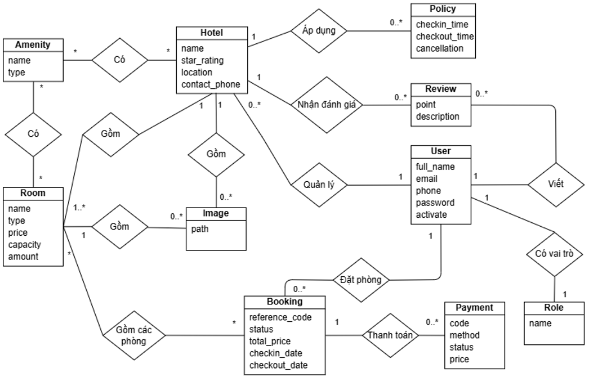
> Hình 2.9: Mô hình dữ liệu mức ý niệm

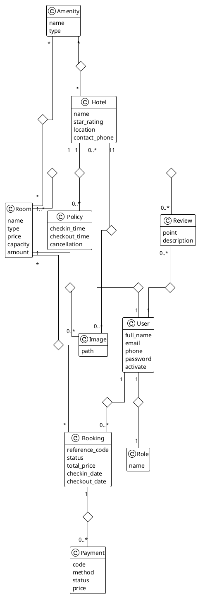
```plantuml
@startuml
!theme plain

skinparam monochrome true
skinparam shadowing false
skinparam backgroundColor white
skinparam defaultFontName "Times New Roman"
skinparam defaultTextAlignment center
skinparam classAttributeIconSize 0
skinparam linetype ortho
hide methods

class "Amenity" as ConceptAmenity {
  name
  type
}

class "Hotel" as ConceptHotel {
  name
  star_rating
  location
  contact_phone
}

class "Policy" as ConceptPolicy {
  checkin_time
  checkout_time
  cancellation
}

class "Review" as ConceptReview {
  point
  description
}

class "User" as ConceptUser {
  full_name
  email
  phone
  password
  activate
}

class "Role" as ConceptRole {
  name
}

class "Payment" as ConceptPayment {
  code
  method
  status
  price
}

class "Booking" as ConceptBooking {
  reference_code
  status
  total_price
  checkin_date
  checkout_date
}

class "Room" as ConceptRoom {
  name
  type
  price
  capacity
  amount
}

class "Image" as ConceptImage {
  path
}

diamond "Có" as AmenityHotel
diamond "Có" as AmenityRoom
diamond "Gồm" as HotelRoom
diamond "Gồm" as HotelImage
diamond "Gồm" as RoomImage
diamond "Gồm các\nphòng" as BookingRoom
diamond "Áp dụng" as HotelPolicy
diamond "Nhận đánh giá" as HotelReview
diamond "Viết" as UserReview
diamond "Quản lý" as UserHotel
diamond "Có vai trò" as UserRole
diamond "Đặt phòng" as UserBooking
diamond "Thanh toán" as BookingPayment

ConceptAmenity "*" -- AmenityHotel
AmenityHotel -- "*" ConceptHotel

ConceptAmenity "*" -- AmenityRoom
AmenityRoom -- "*" ConceptRoom

ConceptHotel "1" -- HotelRoom
HotelRoom -- "1..*" ConceptRoom

ConceptHotel "1" -- HotelImage
HotelImage -- "0..*" ConceptImage

ConceptRoom "1" -- RoomImage
RoomImage -- "0..*" ConceptImage

ConceptRoom "*" -- BookingRoom
BookingRoom -- "*" ConceptBooking

ConceptHotel "1" -- HotelPolicy
HotelPolicy -- "0..*" ConceptPolicy

ConceptHotel "1" -- HotelReview
HotelReview -- "0..*" ConceptReview

ConceptReview "0..*" -- UserReview
UserReview -- "1" ConceptUser

ConceptHotel "0..*" -- UserHotel
UserHotel -- "1" ConceptUser

ConceptUser "1" -- UserRole
UserRole -- "1" ConceptRole

ConceptUser "1" -- UserBooking
UserBooking -- "0..*" ConceptBooking

ConceptBooking "1" -- BookingPayment
BookingPayment -- "0..*" ConceptPayment
@enduml
```

### 3.1.2 Mức luận lý

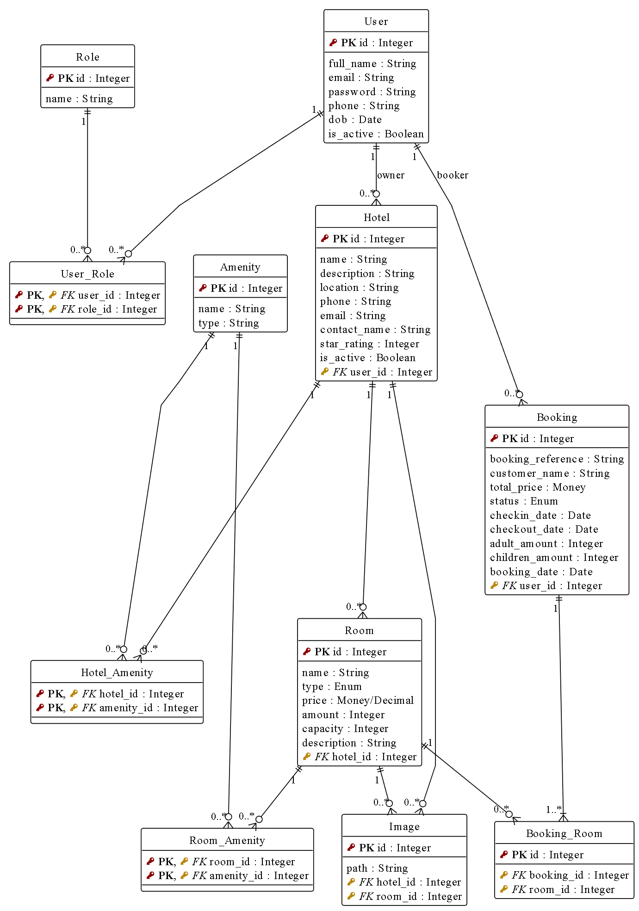
> Hình 2.10: Mô hình dữ liệu mức luận lý

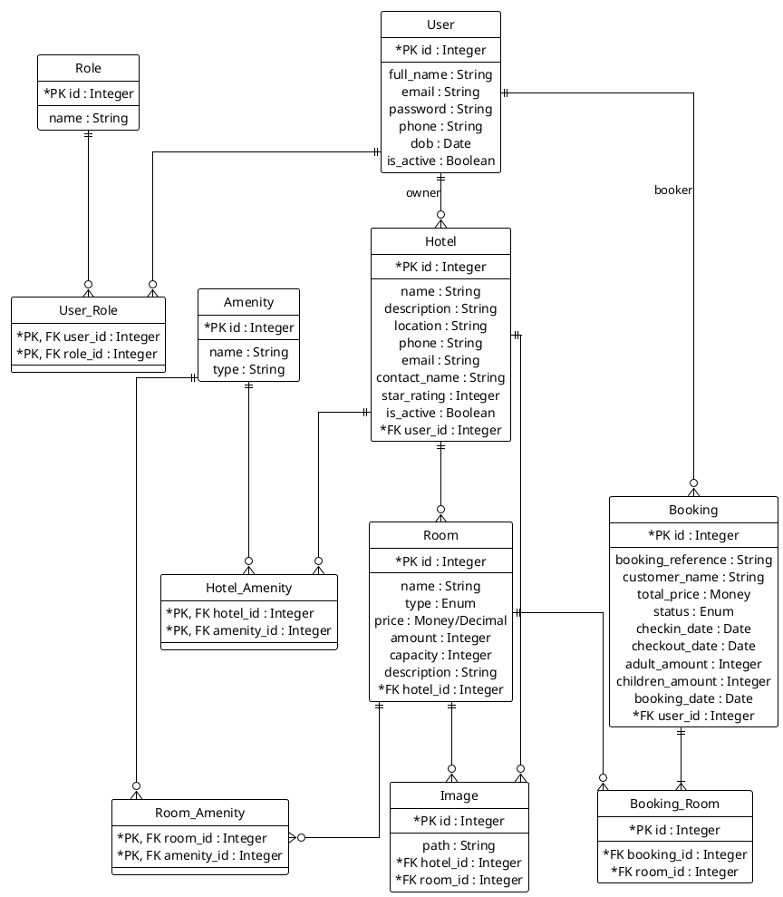
```plantuml
@startuml
!theme plain

skinparam monochrome true
skinparam shadowing false
skinparam backgroundColor white
skinparam defaultFontName "Times New Roman"
skinparam defaultTextAlignment center
skinparam classAttributeIconSize 0
skinparam linetype ortho
hide circle

entity "Role" as role {
  * PK id : Integer
  --
  name : String
}

entity "User_Role" as user_role {
  * PK, FK user_id : Integer
  * PK, FK role_id : Integer
}

entity "User" as user {
  * PK id : Integer
  --
  full_name : String
  email : String
  password : String
  phone : String
  dob : Date
  is_active : Boolean
}

entity "Amenity" as amenity {
  * PK id : Integer
  --
  name : String
  type : String
}

entity "Hotel_Amenity" as hotel_amenity {
  * PK, FK hotel_id : Integer
  * PK, FK amenity_id : Integer
}

entity "Room_Amenity" as room_amenity {
  * PK, FK room_id : Integer
  * PK, FK amenity_id : Integer
}

entity "Hotel" as hotel {
  * PK id : Integer
  --
  name : String
  description : String
  location : String
  phone : String
  email : String
  contact_name : String
  star_rating : Integer
  is_active : Boolean
  * FK user_id : Integer
}

entity "Room" as room {
  * PK id : Integer
  --
  name : String
  type : Enum
  price : Money/Decimal
  amount : Integer
  capacity : Integer
  description : String
  * FK hotel_id : Integer
}

entity "Image" as image {
  * PK id : Integer
  --
  path : String
  * FK hotel_id : Integer
  * FK room_id : Integer
}

entity "Booking" as booking {
  * PK id : Integer
  --
  booking_reference : String
  customer_name : String
  total_price : Money
  status : Enum
  checkin_date : Date
  checkout_date : Date
  adult_amount : Integer
  children_amount : Integer
  booking_date : Date
  * FK user_id : Integer
}

entity "Booking_Room" as booking_room {
  * PK id : Integer
  --
  * FK booking_id : Integer
  * FK room_id : Integer
}

role ||--o{ user_role
user ||--o{ user_role

user ||--o{ hotel : owner
user ||--o{ booking : booker

hotel ||--o{ room
hotel ||--o{ image
room ||--o{ image

booking ||--|{ booking_room
room ||--o{ booking_room

hotel ||--o{ hotel_amenity
amenity ||--o{ hotel_amenity

room ||--o{ room_amenity
amenity ||--o{ room_amenity
@enduml
```

### 3.1.3 Mức vật lý

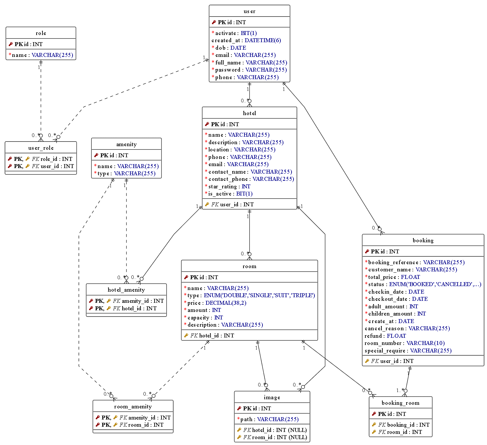
> Hình 2.11: Mô hình dữ liệu mức vật lý

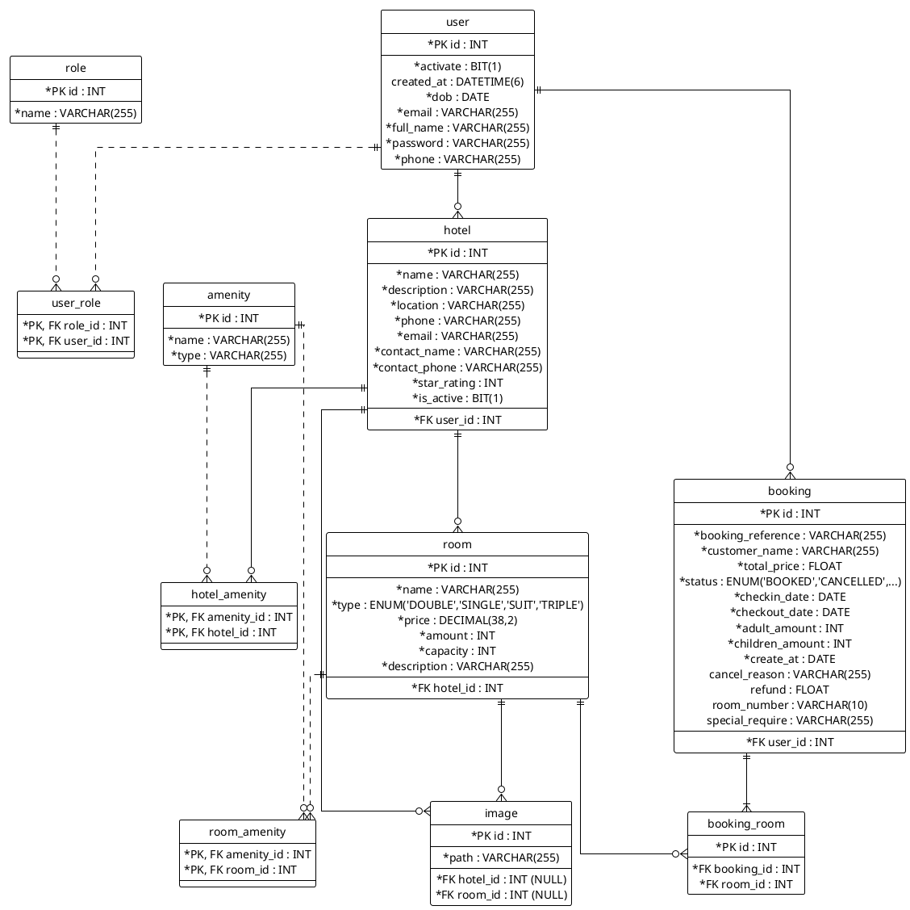
```plantuml
@startuml
!theme plain

skinparam monochrome true
skinparam shadowing false
skinparam backgroundColor white
skinparam defaultFontName "Times New Roman"
skinparam defaultTextAlignment center
skinparam classAttributeIconSize 0
skinparam linetype ortho
hide circle

entity "role" as role_physical {
  * PK id : INT
  --
  * name : VARCHAR(255)
}

entity "user_role" as user_role_physical {
  * PK, FK role_id : INT
  * PK, FK user_id : INT
}

entity "user" as user_physical {
  * PK id : INT
  --
  * activate : BIT(1)
  created_at : DATETIME(6)
  * dob : DATE
  * email : VARCHAR(255)
  * full_name : VARCHAR(255)
  * password : VARCHAR(255)
  * phone : VARCHAR(255)
}

entity "amenity" as amenity_physical {
  * PK id : INT
  --
  * name : VARCHAR(255)
  * type : VARCHAR(255)
}

entity "hotel_amenity" as hotel_amenity_physical {
  * PK, FK amenity_id : INT
  * PK, FK hotel_id : INT
}

entity "room_amenity" as room_amenity_physical {
  * PK, FK amenity_id : INT
  * PK, FK room_id : INT
}

entity "hotel" as hotel_physical {
  * PK id : INT
  --
  * name : VARCHAR(255)
  * description : VARCHAR(255)
  * location : VARCHAR(255)
  * phone : VARCHAR(255)
  * email : VARCHAR(255)
  * contact_name : VARCHAR(255)
  * contact_phone : VARCHAR(255)
  * star_rating : INT
  * is_active : BIT(1)
  --
  * FK user_id : INT
}

entity "room" as room_physical {
  * PK id : INT
  --
  * name : VARCHAR(255)
  * type : ENUM('DOUBLE','SINGLE','SUIT','TRIPLE')
  * price : DECIMAL(38,2)
  * amount : INT
  * capacity : INT
  * description : VARCHAR(255)
  --
  * FK hotel_id : INT
}

entity "image" as image_physical {
  * PK id : INT
  --
  * path : VARCHAR(255)
  --
  * FK hotel_id : INT (NULL)
  * FK room_id : INT (NULL)
}

entity "booking" as booking_physical {
  * PK id : INT
  --
  * booking_reference : VARCHAR(255)
  * customer_name : VARCHAR(255)
  * total_price : FLOAT
  * status : ENUM('BOOKED','CANCELLED',...)
  * checkin_date : DATE
  * checkout_date : DATE
  * adult_amount : INT
  * children_amount : INT
  * create_at : DATE
  cancel_reason : VARCHAR(255)
  refund : FLOAT
  room_number : VARCHAR(10)
  special_require : VARCHAR(255)
  --
  * FK user_id : INT
}

entity "booking_room" as booking_room_physical {
  * PK id : INT
  --
  * FK booking_id : INT
  * FK room_id : INT
}

role_physical ||..o{ user_role_physical
user_physical ||..o{ user_role_physical

user_physical ||--o{ hotel_physical
user_physical ||--o{ booking_physical

hotel_physical ||--o{ room_physical
hotel_physical ||--o{ image_physical
room_physical ||--o{ image_physical

booking_physical ||--|{ booking_room_physical
room_physical ||--o{ booking_room_physical

hotel_physical ||--o{ hotel_amenity_physical
amenity_physical ||..o{ hotel_amenity_physical

room_physical ||..o{ room_amenity_physical
amenity_physical ||..o{ room_amenity_physical
@enduml
```

### 3.1.4 Mô tả chi tiết bảng

Bảng Role

| Thuộc tính | Giải thích | Kiểu dữ liệu | K | U | M |
| --- | --- | --- | --- | --- | --- |
| id | Mã định danh của quyền | INT | x | x | x |
| name | Tên quyền hạn (ví dụ: ADMIN) | VARCHAR(255) |  |  | x |

Bảng User

| Thuộc tính | Giải thích | Kiểu dữ liệu | K | U | M |
| --- | --- | --- | --- | --- | --- |
| id | Mã định danh người dùng | INT | x | x | x |
| activate | Trạng thái kích hoạt (1: Active, 0: Inactive) | BIT(1) |  |  | x |
| created_at | Thời gian tạo tài khoản | DATETIME(6) |  |  |  |
| dob | Ngày sinh | DATE |  |  | x |
| email | Địa chỉ email | VARCHAR(255) |  |  | x |
| full_name | Họ và tên đầy đủ | VARCHAR(255) |  |  | x |
| password | Mật khẩu (đã mã hóa) | VARCHAR(255) |  |  | x |
| phone | Số điện thoại | VARCHAR(255) |  |  | x |

Bảng Hotel

| Thuộc tính | Giải thích | Kiểu dữ liệu | K | U | M |
| --- | --- | --- | --- | --- | --- |
| id | Mã định danh khách sạn | INT | x | x | x |
| name | Tên khách sạn | VARCHAR(255) |  |  | x |
| description | Mô tả về khách sạn | VARCHAR(255) |  |  | x |
| location | Địa chỉ/Vị trí | VARCHAR(255) |  |  | x |
| star_rating | Xếp hạng sao (ví dụ: 3, 4, 5) | INT |  |  | x |
| contact_name | Tên người liên hệ | VARCHAR(255) |  |  | x |
| contact_phone | Số điện thoại liên hệ | VARCHAR(255) |  |  | x |
| email | Email của khách sạn | VARCHAR(255) |  |  | x |
| is_active | Trạng thái hoạt động | BIT(1) |  |  | x |
| user_id | Mã người dùng sở hữu (FK) | INT |  |  | x |

Bảng Room

| Thuộc tính | Giải thích | Kiểu dữ liệu | K | U | M |
| --- | --- | --- | --- | --- | --- |
| id | Mã định danh phòng | INT | x | x | x |
| name | Tên phòng/Mã phòng | VARCHAR(255) |  |  | x |
| type | Loại phòng (DOUBLE, SINGLE, SUIT, TRIPLE) | ENUM |  |  | x |
| price | Giá phòng | DECIMAL(38,2) |  |  | x |
| capacity | Sức chứa (số người) | INT |  |  | x |
| amount | Số lượng phòng loại này | INT |  |  | x |
| description | Mô tả chi tiết phòng | VARCHAR(255) |  |  | x |
| hotel_id | Thuộc khách sạn nào (FK) | INT |  |  | x |

Bảng Booking

| Thuộc tính | Giải thích | Kiểu dữ liệu | K | U | M |
| --- | --- | --- | --- | --- | --- |
| id | Mã đơn đặt phòng | INT | x | x | x |
| booking_reference | Mã tham chiếu đặt phòng | VARCHAR(255) |  |  | x |
| customer_name | Tên khách hàng đặt | VARCHAR(255) |  |  | x |
| checkin_date | Ngày nhận phòng | DATE |  |  | x |
| checkout_date | Ngày trả phòng | DATE |  |  | x |
| create_at | Ngày tạo đơn | DATE |  |  | x |
| total_price | Tổng giá trị đơn hàng | FLOAT |  |  | x |
| status | Trạng thái (BOOKED, CANCELLED...) | ENUM |  |  | x |
| adult_amount | Số lượng người lớn | INT |  |  | x |
| children_amount | Số lượng trẻ em | INT |  |  | x |
| user_id | Người dùng thực hiện đặt (FK) | INT |  |  | x |
| cancel_reason | Lý do hủy (nếu có) | VARCHAR(255) |  |  |  |
| refund | Số tiền hoàn lại (nếu có) | FLOAT |  |  |  |
| room_number | Số phòng được gán | VARCHAR(10) |  |  |  |
| special_require | Yêu cầu đặc biệt | VARCHAR(255) |  |  |  |

Bảng Amenity

| Thuộc tính | Giải thích | Kiểu dữ liệu | K | U | M |
| --- | --- | --- | --- | --- | --- |
| id | Mã tiện nghi | INT | x | x | x |
| name | Tên tiện nghi | VARCHAR(255) |  |  | x |
| type | Loại tiện nghi | VARCHAR(255) |  |  | x |

Bảng Image

| Thuộc tính | Giải thích | Kiểu dữ liệu | K | U | M |
| --- | --- | --- | --- | --- | --- |
| id | Mã hình ảnh | INT | x | x | x |
| path | Đường dẫn lưu file ảnh | VARCHAR(255) |  |  | x |
| hotel_id | Ảnh thuộc khách sạn nào (FK) | INT |  |  |  |
| room_id | Ảnh thuộc phòng nào (FK) | INT |  |  |  |

Bảng Booking_room

| Thuộc tính | Giải thích | Kiểu dữ liệu | K | U | M |
| --- | --- | --- | --- | --- | --- |
| id | Mã chi tiết | INT | x | x | x |
| booking_id | Mã đơn đặt (FK) | INT |  |  | x |
| room_id | Mã phòng (FK) | INT |  |  | x |

Bảng Hotel_Amenity

| Thuộc tính | Giải thích | Kiểu dữ liệu | K | U | M |
| --- | --- | --- | --- | --- | --- |
| amenity_id | Mã tiện nghi (FK) | INT | x |  | x |
| hotel_id | Mã khách sạn (FK) | INT | x |  | x |

Bảng Room_Amenity

| Thuộc tính | Giải thích | Kiểu dữ liệu | K | U | M |
| --- | --- | --- | --- | --- | --- |
| amenity_id | Mã tiện nghi (FK) | INT | x |  | x |
| room_id | Mã phòng (FK) | INT | x |  | x |

Bảng User_Role

| Thuộc tính | Giải thích | Kiểu dữ liệu | K | U | M |
| --- | --- | --- | --- | --- | --- |
| role_id | Mã quyền (FK) | INT | x |  | x |
| user_id | Mã người dùng (FK) | INT | x |  | x |

## 3.2 Mô hình xử lý

### 3.2.1 Use case chi tiết

#### 3.2.1.1 Usecase đăng nhập

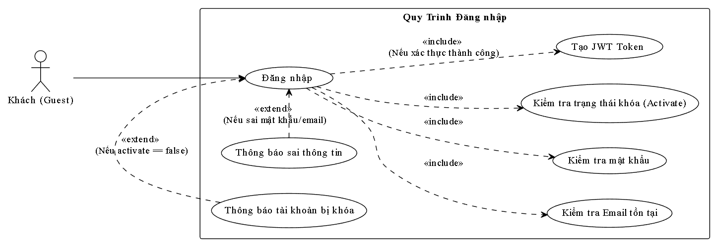
> Hình 3.1: Usecase đăng nhập

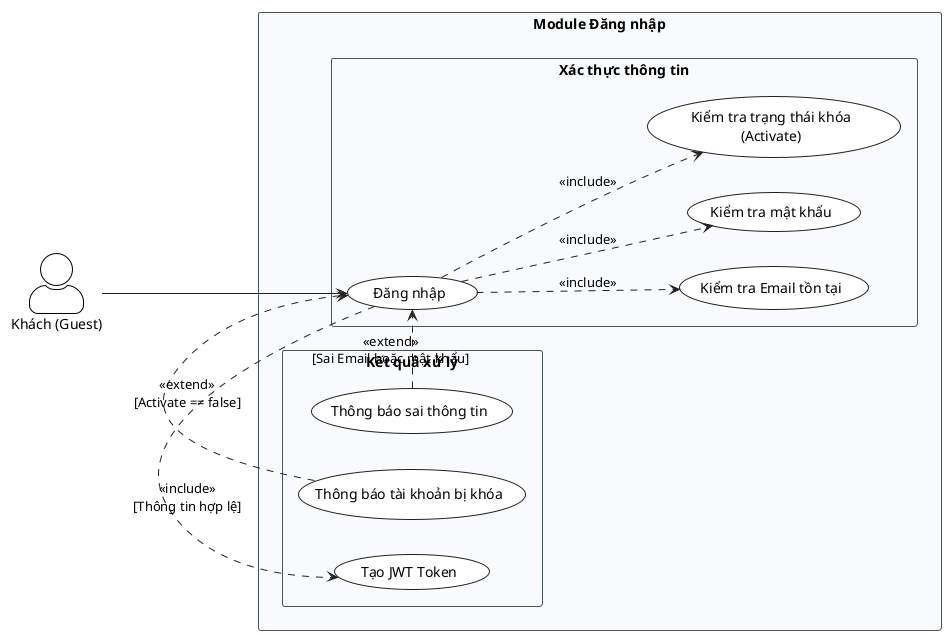
```plantuml
@startuml
!theme plain
left to right direction
skinparam shadowing false
skinparam packageStyle rectangle
skinparam actorStyle awesome
skinparam usecase {
  BackgroundColor #FFFFFF
  BorderColor #222222
  ArrowColor #222222
}
skinparam rectangle {
  BackgroundColor #F8FAFC
  BorderColor #475569
}

actor "Khách (Guest)" as Guest

rectangle "Module Đăng nhập" as LoginModule {
  package "Xác thực thông tin" {
    usecase "Đăng nhập" as Login
    usecase "Kiểm tra Email tồn tại" as CheckEmail
    usecase "Kiểm tra mật khẩu" as CheckPassword
    usecase "Kiểm tra trạng thái khóa\n(Activate)" as CheckActive
  }

  package "Kết quả xử lý" {
    usecase "Tạo JWT Token" as Token
    usecase "Thông báo sai thông tin" as WrongInfo
    usecase "Thông báo tài khoản bị khóa" as LockedAccount
  }
}

Guest --> Login
Login ..> CheckEmail : <<include>>
Login ..> CheckPassword : <<include>>
Login ..> CheckActive : <<include>>
Login ..> Token : <<include>>\n[Thông tin hợp lệ]
WrongInfo .> Login : <<extend>>\n[Sai Email hoặc mật khẩu]
LockedAccount .> Login : <<extend>>\n[Activate == false]
@enduml
```

Đặc tả Usecase đăng nhập

| Mục | Nội dung |
| --- | --- |
| Tên Use case | Đăng nhập |
| Actor | Khách (Guest) |
| Mô tả | Người dùng sử dụng Email và Mật khẩu để xác thực danh tính và truy cập vào hệ thống. Hệ thống sẽ cấp phát JWT Token nếu xác thực thành công. |
| Pre-conditions | Actor truy cập vào trang đăng nhập và chưa thực hiện đăng nhập. |
| Post-conditions | Success: Hệ thống trả về JWT Token, chuyển hướng người dùng vào trang chủ/trang quản trị. Fail: Hệ thống hiển thị thông báo lỗi tương ứng. |
| Luồng sự kiện chính | 1. Actor nhập Email và Mật khẩu. 2. Actor nhấn nút "Đăng nhập". 3. Hệ thống thực hiện kiểm tra Email tồn tại. 4. Hệ thống thực hiện kiểm tra mật khẩu chính xác. 5. Hệ thống thực hiện kiểm tra trạng thái khóa của tài khoản. 6. Nếu tất cả thông tin hợp lệ, hệ thống thực hiện tạo JWT Token. 7. Hệ thống hiển thị thông báo thành công và chuyển hướng Actor. |
| Luồng sự kiện phụ | - Nếu Email không tồn tại hoặc sai Mật khẩu: Hệ thống thực hiện thông báo sai thông tin. - Nếu tài khoản chưa kích hoạt (Activate == false): Hệ thống thực hiện thông báo tài khoản bị khóa. |
| <Include Use Case> Quy trình Kiểm tra & Xác thực | - Kiểm tra Email: Hệ thống truy vấn cơ sở dữ liệu để xác nhận email có tồn tại. - Kiểm tra Mật khẩu: Hệ thống so sánh mật khẩu nhập vào (đã hash) với mật khẩu trong cơ sở dữ liệu. - Kiểm tra Trạng thái: Hệ thống xem xét trạng thái is_active của tài khoản. - Tạo Token: Hệ thống sinh chuỗi JWT chứa thông tin người dùng để xác thực các phiên làm việc sau. |
| <Extend Use Case> Thông báo sai thông tin | Điều kiện: Khi quy trình kiểm tra Email hoặc Mật khẩu thất bại. Hành động: - Hệ thống hiển thị thông báo lỗi: "Tên đăng nhập hoặc mật khẩu không đúng". - Hệ thống xóa trường mật khẩu để người dùng nhập lại. |

#### 3.2.1.2 Usecase đăng ký

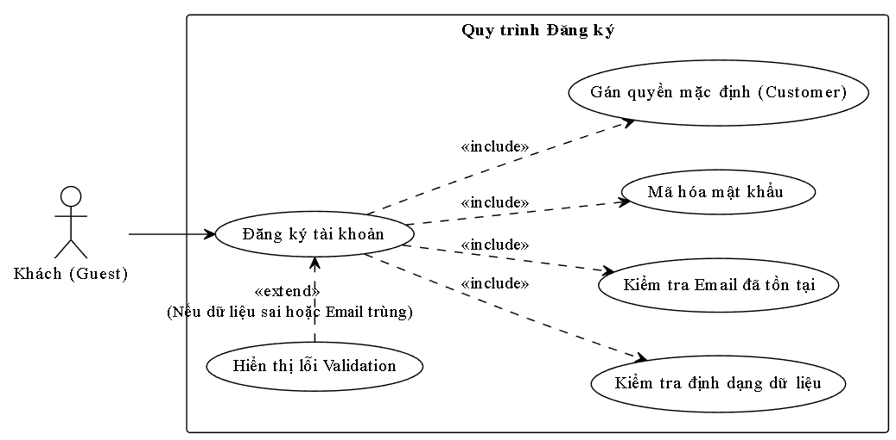
> Hình 3.2: Usecase đăng ký

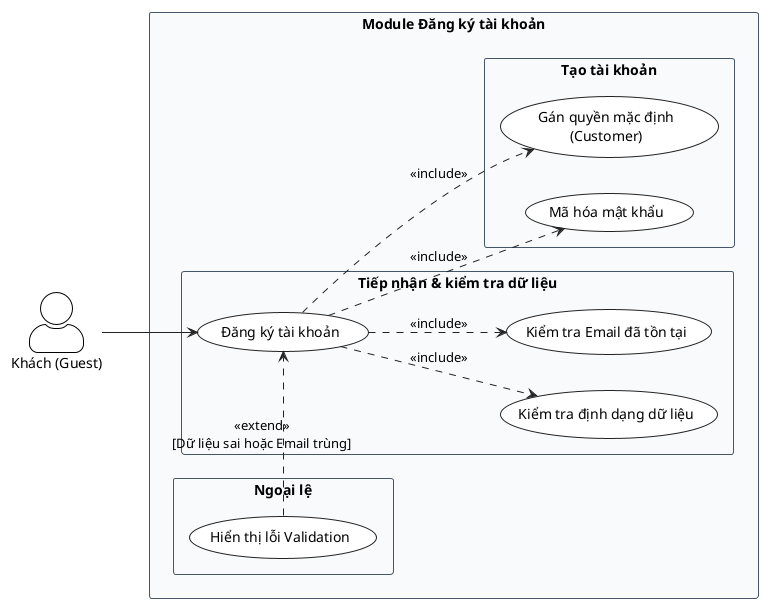
```plantuml
@startuml
!theme plain
left to right direction
skinparam shadowing false
skinparam packageStyle rectangle
skinparam actorStyle awesome
skinparam usecase {
  BackgroundColor #FFFFFF
  BorderColor #222222
  ArrowColor #222222
}
skinparam rectangle {
  BackgroundColor #F8FAFC
  BorderColor #475569
}

actor "Khách (Guest)" as Guest

rectangle "Module Đăng ký tài khoản" as RegisterModule {
  package "Tiếp nhận & kiểm tra dữ liệu" {
    usecase "Đăng ký tài khoản" as Register
    usecase "Kiểm tra định dạng dữ liệu" as ValidateData
    usecase "Kiểm tra Email đã tồn tại" as CheckEmail
  }

  package "Tạo tài khoản" {
    usecase "Mã hóa mật khẩu" as HashPassword
    usecase "Gán quyền mặc định\n(Customer)" as AssignRole
  }

  package "Ngoại lệ" {
    usecase "Hiển thị lỗi Validation" as ValidationError
  }
}

Guest --> Register
Register ..> ValidateData : <<include>>
Register ..> CheckEmail : <<include>>
Register ..> HashPassword : <<include>>
Register ..> AssignRole : <<include>>
ValidationError .> Register : <<extend>>\n[Dữ liệu sai hoặc Email trùng]
@enduml
```

Đặc tả Usecase đăng ký

| Mục | Nội dung |
| --- | --- |
| Tên Use case | Đăng ký tài khoản |
| Actor | Khách (Guest) |
| Mô tả | Người dùng (Khách) cung cấp thông tin cá nhân để tạo tài khoản mới trên hệ thống. Tài khoản sau khi tạo sẽ có quyền mặc định là Customer. |
| Pre-conditions | Actor đang ở trang đăng ký và chưa đăng nhập vào hệ thống. |
| Post-conditions | Success: Tài khoản mới được tạo trong cơ sở dữ liệu với mật khẩu đã mã hóa và quyền hạn chính xác. Fail: Hệ thống hiển thị thông báo lỗi cụ thể (do định dạng sai hoặc email đã tồn tại). |
| Luồng sự kiện chính | 1. Actor nhập các thông tin đăng ký (Email, Mật khẩu, Họ tên, v.v.). 2. Actor nhấn nút "Đăng ký". 3. Hệ thống thực hiện kiểm tra định dạng dữ liệu. 4. Hệ thống thực hiện kiểm tra Email đã tồn tại. 5. Hệ thống thực hiện mã hóa mật khẩu. 6. Hệ thống thực hiện gán quyền mặc định (Customer). 7. Hệ thống lưu thông tin và thông báo đăng ký thành công. |
| Luồng sự kiện phụ | - Nếu dữ liệu nhập vào sai định dạng hoặc Email đã được sử dụng: Hệ thống thực hiện hiển thị lỗi Validation. |
| <Include Use Case> Quy trình Xử lý dữ liệu | - Kiểm tra định dạng: Hệ thống xác thực tính hợp lệ của email, độ mạnh mật khẩu, và các trường bắt buộc. - Kiểm tra Email: Hệ thống truy vấn xem email đã có trong hệ thống chưa. - Mã hóa mật khẩu: Hệ thống chuyển đổi mật khẩu thô sang chuỗi mã hóa (hash) để bảo mật. - Gán quyền: Hệ thống mặc định thiết lập vai trò (Role) cho tài khoản mới là "Customer". |
| <Extend Use Case> Hiển thị lỗi Validation | Điều kiện: Khi quy trình kiểm tra định dạng thất bại hoặc quy trình kiểm tra Email phát hiện trùng lặp. Hành động: - Hệ thống hiển thị thông báo chi tiết lỗi (ví dụ: "Email không hợp lệ", "Email đã tồn tại", "Mật khẩu quá ngắn"). - Hệ thống yêu cầu người dùng nhập lại các thông tin chưa hợp lệ. |

#### 3.2.1.3 Usecase quản lý thông tin cá nhân

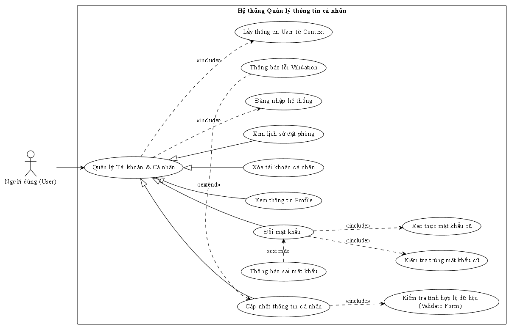
> Hình 3.3: Usecase quản lý thông tin cá nhân

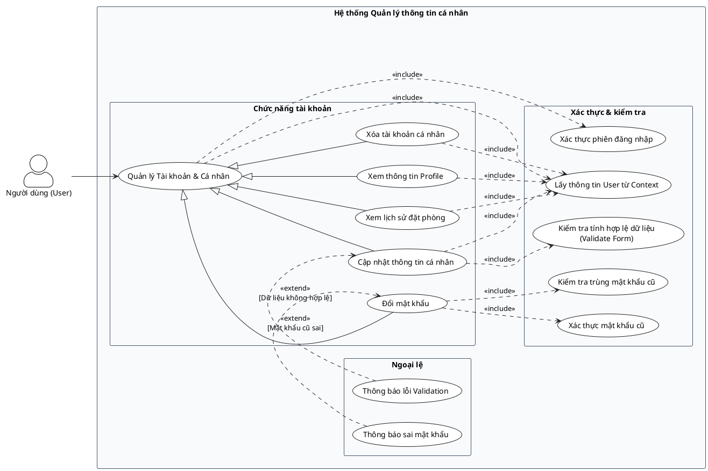
```plantuml
@startuml
!theme plain
left to right direction
skinparam shadowing false
skinparam packageStyle rectangle
skinparam actorStyle awesome
skinparam usecase {
  BackgroundColor #FFFFFF
  BorderColor #222222
  ArrowColor #222222
}
skinparam rectangle {
  BackgroundColor #F8FAFC
  BorderColor #475569
}

actor "Người dùng (User)" as User

rectangle "Hệ thống Quản lý thông tin cá nhân" as ProfileSystem {
  package "Chức năng tài khoản" {
    usecase "Quản lý Tài khoản & Cá nhân" as Account
    usecase "Cập nhật thông tin cá nhân" as UpdateProfile
    usecase "Đổi mật khẩu" as ChangePassword
    usecase "Xem thông tin Profile" as ViewProfile
    usecase "Xóa tài khoản cá nhân" as DeleteAccount
    usecase "Xem lịch sử đặt phòng" as BookingHistory
  }

  package "Xác thực & kiểm tra" {
    usecase "Xác thực phiên đăng nhập" as VerifySession
    usecase "Lấy thông tin User từ Context" as GetContext
    usecase "Kiểm tra tính hợp lệ dữ liệu\n(Validate Form)" as ValidateForm
    usecase "Xác thực mật khẩu cũ" as VerifyOldPassword
    usecase "Kiểm tra trùng mật khẩu cũ" as CheckDuplicatePassword
  }

  package "Ngoại lệ" {
    usecase "Thông báo lỗi Validation" as ValidationError
    usecase "Thông báo sai mật khẩu" as WrongPassword
  }
}

User --> Account
UpdateProfile -up-|> Account
ChangePassword -up-|> Account
ViewProfile -up-|> Account
DeleteAccount -up-|> Account
BookingHistory -up-|> Account
Account ..> VerifySession : <<include>>
Account ..> GetContext : <<include>>
UpdateProfile ..> GetContext : <<include>>
UpdateProfile ..> ValidateForm : <<include>>
ViewProfile ..> GetContext : <<include>>
DeleteAccount ..> GetContext : <<include>>
BookingHistory ..> GetContext : <<include>>
ChangePassword ..> VerifyOldPassword : <<include>>
ChangePassword ..> CheckDuplicatePassword : <<include>>
ValidationError .> UpdateProfile : <<extend>>\n[Dữ liệu không hợp lệ]
WrongPassword .> ChangePassword : <<extend>>\n[Mật khẩu cũ sai]
@enduml
```

Đặc tả Usecase cập nhật thông tin cá nhân

| Mục | Nội dung |
| --- | --- |
| Tên Use case | Cập nhật thông tin cá nhân |
| Actor | Người dùng (User) |
| Mô tả | Người dùng thay đổi các thông tin cá nhân (như họ tên, số điện thoại, địa chỉ...) để cập nhật hồ sơ của mình trên hệ thống. |
| Pre-conditions | - Actor đã đăng nhập thành công vào hệ thống. - Hệ thống đã lấy được thông tin User hiện tại (Context). |
| Post-conditions | Success: Thông tin mới được cập nhật vào cơ sở dữ liệu. Fail: Hệ thống hiển thị thông báo lỗi validation và giữ nguyên dữ liệu cũ. |
| Luồng sự kiện chính | 1. Actor chọn chức năng "Cập nhật thông tin" trên giao diện profile. 2. Actor chỉnh sửa các trường thông tin mong muốn. 3. Actor nhấn nút "Lưu thay đổi". 4. Hệ thống thực hiện kiểm tra tính hợp lệ dữ liệu (Validate Form). 5. Nếu dữ liệu hợp lệ, hệ thống lưu thông tin mới vào cơ sở dữ liệu. 6. Hệ thống hiển thị thông báo "Cập nhật thành công". |
| Luồng sự kiện phụ | - Nếu dữ liệu nhập vào không đúng định dạng (ví dụ: SĐT sai, ngày sinh không hợp lệ): Hệ thống thực hiện thông báo lỗi Validation. |
| <Include Use Case> Quy trình Nghiệp vụ | - Lấy Context: Hệ thống xác định chính xác User đang thao tác dựa trên phiên đăng nhập. - Kiểm tra tính hợp lệ: Hệ thống xét duyệt các quy tắc nghiệp vụ (độ dài chuỗi, định dạng số, các trường bắt buộc) đối với dữ liệu người dùng vừa nhập. |
| <Extend Use Case> Thông báo lỗi Validation | Điều kiện: Khi quy trình kiểm tra tính hợp lệ phát hiện dữ liệu sai quy chuẩn. Hành động: - Hệ thống hiển thị thông báo lỗi cụ thể ngay tại trường dữ liệu không hợp lệ. - Hệ thống yêu cầu người dùng nhập lại. |

Đặc tả Usecase đổi mật khẩu

| Mục | Nội dung |
| --- | --- |
| Tên Use case | Đổi mật khẩu |
| Actor | Người dùng (User) |
| Mô tả | Người dùng thay đổi mật khẩu đăng nhập hiện tại sang một mật khẩu mới để bảo mật tài khoản. |
| Pre-conditions | - Actor đã đăng nhập thành công. - Actor nhớ mật khẩu hiện tại. |
| Post-conditions | Success: Mật khẩu mới được mã hóa và cập nhật. Các phiên đăng nhập cũ có thể bị vô hiệu hóa (tùy chính sách). Fail: Mật khẩu không đổi, hệ thống báo lỗi sai mật khẩu cũ hoặc mật khẩu mới trùng lặp. |
| Luồng sự kiện chính | 1. Actor chọn chức năng "Đổi mật khẩu". 2. Actor nhập Mật khẩu cũ, Mật khẩu mới, và Xác nhận mật khẩu mới. 3. Actor nhấn nút "Đổi mật khẩu". 4. Hệ thống thực hiện xác thực mật khẩu cũ. 5. Hệ thống thực hiện kiểm tra trùng mật khẩu cũ (đảm bảo pass mới khác pass cũ). 6. Nếu hợp lệ, hệ thống thực hiện mã hóa và cập nhật mật khẩu mới. 7. Hệ thống hiển thị thông báo thành công. |
| Luồng sự kiện phụ | - Nếu Mật khẩu cũ không khớp với dữ liệu trong DB: Hệ thống thực hiện thông báo sai mật khẩu. - Nếu Mật khẩu mới giống hệt Mật khẩu cũ: Hệ thống hiển thị cảnh báo mật khẩu mới phải khác mật khẩu cũ. |
| <Include Use Case> Quy trình Kiểm tra bảo mật | - Xác thực mật khẩu cũ: Hệ thống so sánh chuỗi hash của mật khẩu nhập vào với mật khẩu đang lưu trong DB. - Kiểm tra trùng: Hệ thống đảm bảo tính bảo mật bằng cách ngăn người dùng sử dụng lại mật khẩu vừa dùng. |
| <Extend Use Case> Thông báo sai mật khẩu | Điều kiện: Khi bước xác thực mật khẩu cũ thất bại. Hành động: - Hệ thống hiển thị thông báo: "Mật khẩu hiện tại không đúng". - Hệ thống xóa các trường mật khẩu để nhập lại. |

Đặc tả Usecase xem thông tin profile

| Mục | Nội dung |
| --- | --- |
| Tên Use case | Xem thông tin Profile |
| Actor | Người dùng (User) |
| Mô tả | Người dùng truy cập vào trang cá nhân để xem các thông tin chi tiết về tài khoản của mình đang được lưu trữ trong hệ thống. |
| Pre-conditions | - Actor đã đăng nhập thành công - Hệ thống đã xác định được ngữ cảnh (Context) của người dùng. |
| Post-conditions | Success: Hệ thống hiển thị đầy đủ thông tin cá nhân (Họ tên, Email, SĐT, Avatar...). Fail: Hệ thống yêu cầu đăng nhập lại nếu phiên làm việc hết hạn. |
| Luồng sự kiện chính | 1. Actor chọn menu "Hồ sơ cá nhân". 2. Hệ thống thực hiện lấy thông tin User từ Context. 3. Hệ thống truy xuất dữ liệu chi tiết từ cơ sở dữ liệu. 4. Hệ thống hiển thị giao diện thông tin profile. |
| Luồng sự kiện phụ | - Nếu không lấy được thông tin User (Lỗi phiên): Hệ thống thực hiện chuyển hướng về trang đăng nhập. |
| <Include Use Case> Quy trình Nghiệp vụ | - Lấy thông tin User từ Context: Hệ thống xác định ID người dùng hiện tại từ Token hoặc Session để đảm bảo hiển thị đúng dữ liệu của người đó. |
| <Extend Use Case> Thông báo không thể hủy | Điều kiện: Khi đơn hàng đang ở trạng thái Checked-out hoặc Cancelled. Hành động: - Hệ thống hiển thị lỗi: "Đơn hàng này không thể hủy vì đã hoàn tất hoặc đã bị hủy". |
| <Extend Use Case> Thông báo không có quyền | Điều kiện: Khi quy trình kiểm tra quyền sở hữu thất bại. Hành động: - Hệ thống hiển thị cảnh báo bảo mật: "Bạn không có quyền thao tác trên đơn hàng này". |

Đặc tả Usecase xóa tài khoản cá nhân

| Mục | Nội dung |
| --- | --- |
| Tên Use case | Xóa tài khoản cá nhân |
| Actor | Người dùng (User) |
| Mô tả | Người dùng yêu cầu xóa vĩnh viễn (hoặc vô hiệu hóa) tài khoản của mình khỏi hệ thống. |
| Pre-conditions | - Actor đã đăng nhập thành công. |
| Post-conditions | Success: Tài khoản bị xóa/vô hiệu hóa, người dùng bị đăng xuất ngay lập tức. Fail: Hệ thống báo lỗi nếu có ràng buộc dữ liệu (ví dụ: đang có đơn đặt phòng chưa hoàn tất). |
| Luồng sự kiện chính | 1. Actor chọn chức năng "Xóa tài khoản" trong phần cài đặt. 2. Hệ thống hiển thị cảnh báo và yêu cầu xác nhận.  3. Actor xác nhận xóa. 4. Hệ thống thực hiện lấy thông tin User từ Context. 5. Hệ thống thực hiện chuyển trạng thái tài khoản sang "Đã xóa" (Soft Delete) hoặc xóa khỏi DB. 6. Hệ thống thực hiện đăng xuất người dùng và chuyển về trang chủ. |
| Luồng sự kiện phụ | - Actor hủy bỏ xác nhận: Hệ thống quay lại màn hình cài đặt. |
| <Include Use Case> Quy trình Nghiệp vụ | - Lấy thông tin User từ Context: Xác định chính xác tài khoản cần xóa. |
| <Extend Use Case> Thông báo không thể hủy | Điều kiện: Khi đơn hàng đang ở trạng thái Checked-out hoặc Cancelled. Hành động: - Hệ thống hiển thị lỗi: "Đơn hàng này không thể hủy vì đã hoàn tất hoặc đã bị hủy". |
| <Extend Use Case> Thông báo không có quyền | Điều kiện: Khi quy trình kiểm tra quyền sở hữu thất bại. Hành động: - Hệ thống hiển thị cảnh báo bảo mật: "Bạn không có quyền thao tác trên đơn hàng này". |

Đặc tả Usecase xem lịch sử đặt phòng

| Mục | Nội dung |
| --- | --- |
| Tên Use case | Xem lịch sử đặt phòng |
| Actor | Người dùng (User) |
| Mô tả | Người dùng xem lại danh sách các đơn đặt phòng mình đã thực hiện trong quá khứ và trạng thái của chúng. |
| Pre-conditions | - Actor đã đăng nhập thành công. |
| Post-conditions | Success: Danh sách lịch sử đặt phòng được hiển thị, sắp xếp theo thời gian. Fail: Hệ thống báo lỗi kết nối hoặc danh sách trống. |
| Luồng sự kiện chính | 1. Actor chọn mục "Lịch sử đặt phòng". 2. Hệ thống thực hiện lấy thông tin User từ Context. 3. Hệ thống truy vấn danh sách Booking gắn với ID người dùng đó. 4. Hệ thống hiển thị danh sách các đơn hàng (Ngày đặt, Khách sạn, Trạng thái...). |
| Luồng sự kiện phụ | - Nếu người dùng chưa từng đặt phòng: Hệ thống hiển thị thông báo "Bạn chưa có lịch sử đặt phòng nào". |
| <Include Use Case> Quy trình Nghiệp vụ | - Lấy thông tin User từ Context: Hệ thống sử dụng ID người dùng để lọc đúng các đơn hàng thuộc về họ. |
| <Extend Use Case> Thông báo không thể hủy | Điều kiện: Khi đơn hàng đang ở trạng thái Checked-out hoặc Cancelled. Hành động: - Hệ thống hiển thị lỗi: "Đơn hàng này không thể hủy vì đã hoàn tất hoặc đã bị hủy". |
| <Extend Use Case> Thông báo không có quyền | Điều kiện: Khi quy trình kiểm tra quyền sở hữu thất bại. Hành động: - Hệ thống hiển thị cảnh báo bảo mật: "Bạn không có quyền thao tác trên đơn hàng này". |

#### 3.2.1.4 Usecase quản trị người dùng

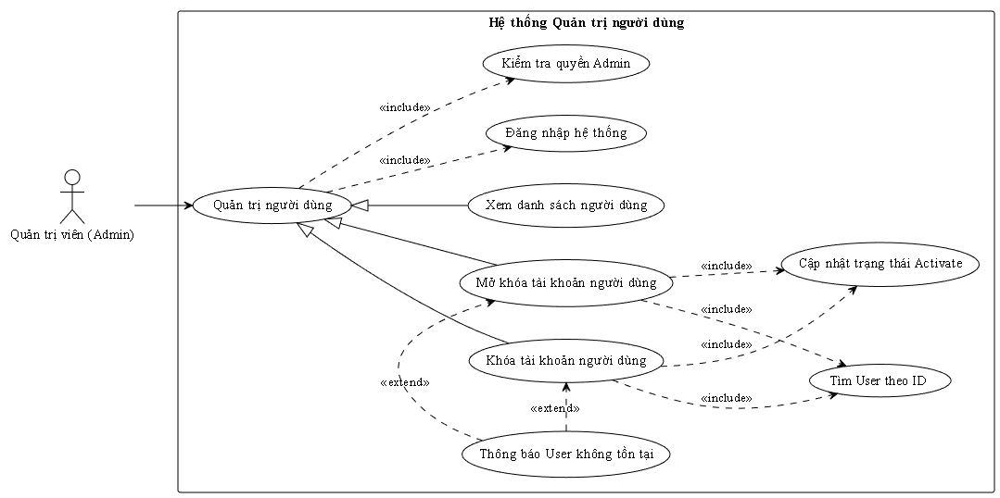
> Hình 3.4: Usecase quản lý người dùng

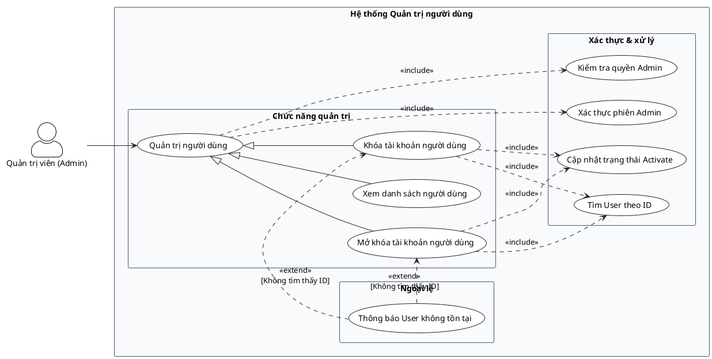
```plantuml
@startuml
!theme plain
left to right direction
skinparam shadowing false
skinparam packageStyle rectangle
skinparam actorStyle awesome
skinparam usecase {
  BackgroundColor #FFFFFF
  BorderColor #222222
  ArrowColor #222222
}
skinparam rectangle {
  BackgroundColor #F8FAFC
  BorderColor #475569
}

actor "Quản trị viên (Admin)" as Admin

rectangle "Hệ thống Quản trị người dùng" as UserAdminSystem {
  package "Chức năng quản trị" {
    usecase "Quản trị người dùng" as UserAdmin
    usecase "Xem danh sách người dùng" as ListUsers
    usecase "Khóa tài khoản người dùng" as LockUser
    usecase "Mở khóa tài khoản người dùng" as UnlockUser
  }

  package "Xác thực & xử lý" {
    usecase "Xác thực phiên Admin" as VerifyAdminSession
    usecase "Kiểm tra quyền Admin" as CheckAdmin
    usecase "Tìm User theo ID" as FindUser
    usecase "Cập nhật trạng thái Activate" as UpdateActive
  }

  package "Ngoại lệ" {
    usecase "Thông báo User không tồn tại" as UserNotFound
  }
}

Admin --> UserAdmin
ListUsers -up-|> UserAdmin
LockUser -up-|> UserAdmin
UnlockUser -up-|> UserAdmin
UserAdmin ..> VerifyAdminSession : <<include>>
UserAdmin ..> CheckAdmin : <<include>>
LockUser ..> FindUser : <<include>>
LockUser ..> UpdateActive : <<include>>
UnlockUser ..> FindUser : <<include>>
UnlockUser ..> UpdateActive : <<include>>
UserNotFound .> LockUser : <<extend>>\n[Không tìm thấy ID]
UserNotFound .> UnlockUser : <<extend>>\n[Không tìm thấy ID]
@enduml
```

Đặc tả Usecase xem danh sách người dùng

| Mục                                            | Nội dung                                                                                                                                                                                                              |
| ---------------------------------------------- | --------------------------------------------------------------------------------------------------------------------------------------------------------------------------------------------------------------------- |
| Tên Use case                                   | Xem danh sách người dùng                                                                                                                                                                                              |
| Actor                                          | Quản trị viên (Admin)                                                                                                                                                                                                 |
| Mô tả                                          | Admin xem toàn bộ danh sách tài khoản người dùng trong hệ thống để phục vụ công tác quản trị, giám sát và xử lý tài khoản.                                                                                            |
| Pre-conditions                                 | - Actor đã đăng nhập vào hệ thống. - Actor có quyền Admin.                                                                                                                                                         |
| Post-conditions                                | Success: Danh sách người dùng được hiển thị đầy đủ. Fail: Hệ thống từ chối truy cập nếu Actor không có quyền.                                                                                                      |
| Luồng sự kiện chính                            | 1. Actor truy cập mục "Quản lý người dùng". 2. Hệ thống thực hiện kiểm tra quyền Admin. 3. Nếu hợp lệ, hệ thống truy vấn danh sách User. 4. Hệ thống hiển thị danh sách người dùng kèm trạng thái tài khoản. |
| Luồng sự kiện phụ                              | - Nếu Actor không có quyền Admin: Hệ thống thực hiện thông báo không có quyền truy cập.                                                                                                                               |
| <Include Use Case> Quy trình Xác thực quyền | - Xác thực phiên Admin: Đảm bảo Actor đã xác thực phiên làm việc hợp lệ. - Kiểm tra quyền Admin: Xác minh Actor có vai trò Admin trước khi cho phép truy cập module quản trị.                                      |

Đặc tả Usecase khóa tài khoản người dùng

| Mục | Nội dung |
| --- | --- |
| Tên Use case | Khóa tài khoản người dùng |
| Actor | Quản trị viên (Admin) |
| Mô tả | Admin thực hiện khóa tài khoản của một người dùng cụ thể để ngăn họ đăng nhập vào hệ thống (ví dụ: do vi phạm chính sách). |
| Pre-conditions | - Actor đã đăng nhập và có quyền Admin.  - Tài khoản người dùng cần khóa đang ở trạng thái hoạt động (Active). |
| Post-conditions | Success: Trạng thái tài khoản chuyển sang "Locked" (hoặc Inactive). Fail: Hệ thống báo lỗi nếu người dùng không tồn tại. |
| Luồng sự kiện chính | 1. Actor tìm kiếm và chọn người dùng cần khóa từ danh sách. 2. Actor nhấn nút "Khóa tài khoản". 3. Hệ thống thực hiện tìm User theo ID. 4. Nếu tìm thấy, hệ thống thực hiện cập nhật trạng thái Activate thành False (Khóa). 5. Hệ thống hiển thị thông báo "Đã khóa tài khoản thành công". |
| Luồng sự kiện phụ | - Nếu ID người dùng không tồn tại: Hệ thống thực hiện thông báo User không tồn tại. |
| <Include Use Case> Quy trình Xử lý | - Tìm User theo ID: Xác định bản ghi người dùng trong CSDL. - Cập nhật trạng thái Activate: Thay đổi giá trị cờ trạng thái của người dùng. |
| <Extend Use Case> Thông báo User không tồn tại | Điều kiện: Khi không tìm thấy ID người dùng. Hành động: Hiển thị lỗi và hủy thao tác. |
| <Extend Use Case> Thông báo không có quyền | Điều kiện: Khi quy trình kiểm tra quyền sở hữu thất bại. Hành động: - Hệ thống hiển thị cảnh báo bảo mật: "Bạn không có quyền thao tác trên đơn hàng này". |

Đặc tả Usecase mở khóa tài khoản người dùng

| Mục | Nội dung |
| --- | --- |
| Tên Use case | Mở khóa tài khoản người dùng |
| Actor | Quản trị viên (Admin) |
| Mô tả | Admin khôi phục quyền truy cập cho một tài khoản người dùng đã bị khóa trước đó. |
| Pre-conditions | - Actor đã đăng nhập và có quyền Admin. - Tài khoản người dùng đang ở trạng thái bị khóa. |
| Post-conditions | Success: Trạng thái tài khoản chuyển sang "Active". Fail: Hệ thống báo lỗi nếu người dùng không tồn tại. |
| Luồng sự kiện chính | 1. Actor tìm kiếm và chọn người dùng bị khóa từ danh sách. 2. Actor nhấn nút "Mở khóa tài khoản". 3. Hệ thống thực hiện tìm User theo ID. 4. Nếu tìm thấy, hệ thống thực hiện cập nhật trạng thái Activate thành True (Hoạt động). 5. Hệ thống hiển thị thông báo "Đã mở khóa tài khoản thành công". |
| Luồng sự kiện phụ | - Nếu ID người dùng không tồn tại: Hệ thống thực hiện thông báo User không tồn tại. |
| <Include Use Case> Quy trình Xử lý | - Tìm User theo ID: Xác định bản ghi người dùng. - Cập nhật trạng thái Activate: Thay đổi giá trị cờ trạng thái của người dùng về hoạt động. |
| <Extend Use Case> Thông báo User không tồn tại | Điều kiện: Khi không tìm thấy ID người dùng. Hành động: Hiển thị lỗi và hủy thao tác. |
| <Extend Use Case> Thông báo không có quyền | Điều kiện: Khi quy trình kiểm tra quyền sở hữu thất bại. Hành động: - Hệ thống hiển thị cảnh báo bảo mật: "Bạn không có quyền thao tác trên đơn hàng này". |

#### 3.2.1.5 Usecase quản lý phòng

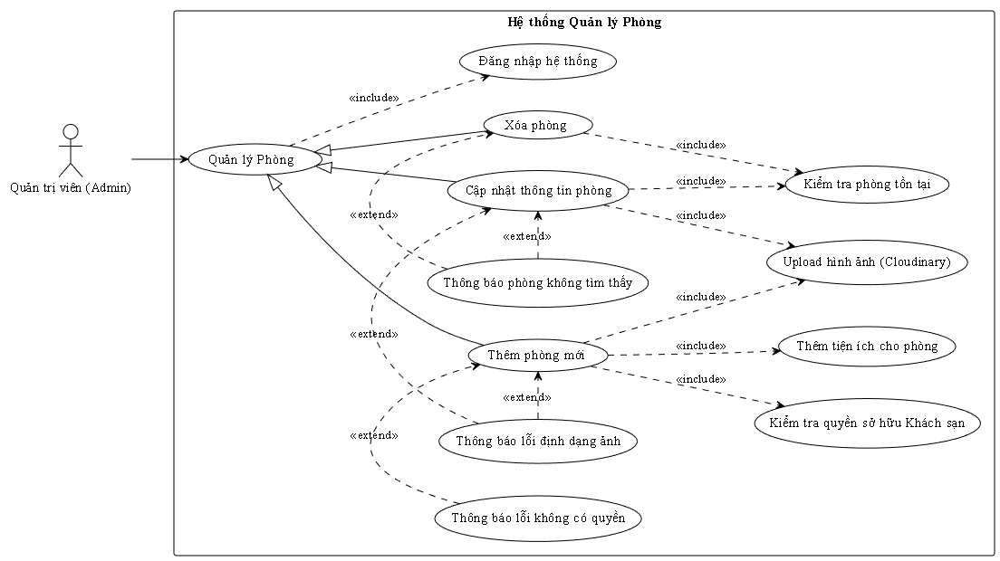
> Hình 3.5: Usecase quản lý phòng

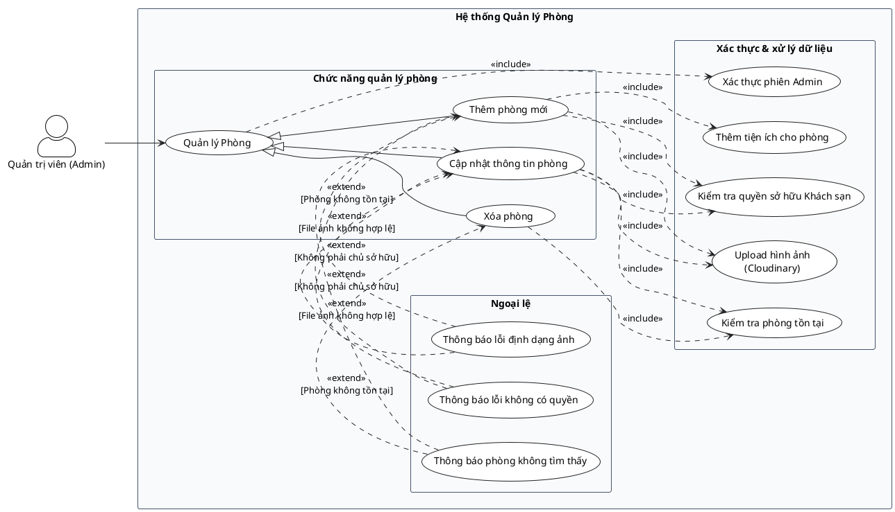
```plantuml
@startuml
!theme plain
left to right direction
skinparam shadowing false
skinparam packageStyle rectangle
skinparam actorStyle awesome
skinparam usecase {
  BackgroundColor #FFFFFF
  BorderColor #222222
  ArrowColor #222222
}
skinparam rectangle {
  BackgroundColor #F8FAFC
  BorderColor #475569
}

actor "Quản trị viên (Admin)" as Admin

rectangle "Hệ thống Quản lý Phòng" as RoomSystem {
  package "Chức năng quản lý phòng" {
    usecase "Quản lý Phòng" as RoomManage
    usecase "Thêm phòng mới" as AddRoom
    usecase "Cập nhật thông tin phòng" as UpdateRoom
    usecase "Xóa phòng" as DeleteRoom
  }

  package "Xác thực & xử lý dữ liệu" {
    usecase "Xác thực phiên Admin" as VerifyAdminSession
    usecase "Kiểm tra quyền sở hữu Khách sạn" as CheckHotelOwner
    usecase "Kiểm tra phòng tồn tại" as CheckRoom
    usecase "Upload hình ảnh\n(Cloudinary)" as UploadImage
    usecase "Thêm tiện ích cho phòng" as AddAmenity
  }

  package "Ngoại lệ" {
    usecase "Thông báo phòng không tìm thấy" as RoomNotFound
    usecase "Thông báo lỗi định dạng ảnh" as ImageError
    usecase "Thông báo lỗi không có quyền" as PermissionError
  }
}

Admin --> RoomManage
AddRoom -up-|> RoomManage
UpdateRoom -up-|> RoomManage
DeleteRoom -up-|> RoomManage
RoomManage ..> VerifyAdminSession : <<include>>
AddRoom ..> CheckHotelOwner : <<include>>
AddRoom ..> UploadImage : <<include>>
AddRoom ..> AddAmenity : <<include>>
UpdateRoom ..> CheckHotelOwner : <<include>>
UpdateRoom ..> CheckRoom : <<include>>
UpdateRoom ..> UploadImage : <<include>>
DeleteRoom ..> CheckRoom : <<include>>
RoomNotFound .> UpdateRoom : <<extend>>\n[Phòng không tồn tại]
RoomNotFound .> DeleteRoom : <<extend>>\n[Phòng không tồn tại]
ImageError .> AddRoom : <<extend>>\n[File ảnh không hợp lệ]
ImageError .> UpdateRoom : <<extend>>\n[File ảnh không hợp lệ]
PermissionError .> AddRoom : <<extend>>\n[Không phải chủ sở hữu]
PermissionError .> UpdateRoom : <<extend>>\n[Không phải chủ sở hữu]
@enduml
```

Đặc tả Usecase thêm phòng mới

| Mục                                               | Nội dung                                                                                                                                                                                                                                                                                                                                                                                                                                                |
| ------------------------------------------------- | ------------------------------------------------------------------------------------------------------------------------------------------------------------------------------------------------------------------------------------------------------------------------------------------------------------------------------------------------------------------------------------------------------------------------------------------------------- |
| Tên Use case                                      | Thêm phòng mới                                                                                                                                                                                                                                                                                                                                                                                                                                          |
| Actor                                             | Quản trị viên (Admin)                                                                                                                                                                                                                                                                                                                                                                                                                                   |
| Mô tả                                             | Admin tạo và thêm một phòng mới vào khách sạn mà mình quản lý. Quá trình này bao gồm nhập thông tin chi tiết, tải lên hình ảnh và gán các tiện ích cho phòng.                                                                                                                                                                                                                                                                                           |
| Pre-conditions                                    | - Actor đã đăng nhập và có quyền Admin. - Actor phải là chủ sở hữu của khách sạn mà phòng sẽ được thêm vào.                                                                                                                                                                                                                                                                                                                                          |
| Post-conditions                                   | Success: Phòng mới được tạo và lưu vào cơ sở dữ liệu với đầy đủ thông tin, ảnh và tiện ích. Fail: Hệ thống báo lỗi và không tạo phòng (do lỗi quyền hoặc dữ liệu).                                                                                                                                                                                                                                                                                   |
| Luồng sự kiện chính                               | 1. Actor chọn chức năng "Thêm phòng mới" trong giao diện quản lý khách sạn.  2. Actor nhập các thông tin cơ bản (Tên phòng, Loại phòng, Giá, Mô tả...). 3. Actor thực hiện Upload hình ảnh. 4. Actor chọn danh sách tiện ích và thực hiện Thêm tiện ích cho phòng. 5. Actor nhấn nút "Lưu". 6. Hệ thống thực hiện Kiểm tra quyền sở hữu Khách sạn. 7. Nếu hợp lệ, hệ thống lưu dữ liệu phòng và thông báo "Thêm phòng thành công". |
| Luồng sự kiện phụ                                 | - Nếu Actor không phải là chủ sở hữu khách sạn: Hệ thống thực hiện Thông báo lỗi không có quyền. - Nếu file ảnh upload bị lỗi hoặc sai định dạng: Hệ thống thực hiện Thông báo lỗi định dạng ảnh.                                                                                                                                                                                                                                                    |
| <Include Use Case> Quy trình Nghiệp vụ         | - Kiểm tra quyền sở hữu Khách sạn: Hệ thống xác minh ID của người đang thực hiện có khớp với chủ sở hữu (Owner) của khách sạn hay không. - Upload hình ảnh: Hệ thống xử lý việc tải ảnh lên Cloudinary và lấy về URL. - Thêm tiện ích cho phòng: Hệ thống liên kết các tiện ích (Amenities) đã chọn vào bản ghi của phòng mới.                                                                                                                    |
| <Extend Use Case> Thông báo lỗi không có quyền | Điều kiện: Khi quy trình kiểm tra quyền sở hữu trả về False. Hành động: - Hệ thống hiển thị thông báo: "Bạn không có quyền thêm phòng vào khách sạn này". - Hệ thống chặn hành động lưu.                                                                                                                                                                                                                                                       |
| <Extend Use Case> Thông báo lỗi định dạng ảnh  | Điều kiện: Khi file tải lên không phải là ảnh hoặc kích thước quá lớn. Hành động: - Hệ thống hiển thị cảnh báo: "Định dạng ảnh không hợp lệ hoặc file quá lớn".                                                                                                                                                                                                                                                                                   |

Đặc tả Usecase cập nhật thông tin phòng

| Mục | Nội dung |
| --- | --- |
| Tên Use case | Cập nhật thông tin phòng |
| Actor | Quản trị viên (Admin) |
| Mô tả | Admin thay đổi các thông tin chi tiết của một phòng đã tồn tại trong hệ thống (như giá cả, mô tả, loại phòng hoặc hình ảnh) để đảm bảo dữ liệu luôn chính xác. |
| Pre-conditions | - Actor đã đăng nhập và có quyền Admin. - Phòng cần cập nhật phải đang tồn tại trong hệ thống. |
| Post-conditions | Success: Thông tin phòng được cập nhật mới trong cơ sở dữ liệu. Fail: Hệ thống giữ nguyên thông tin cũ và báo lỗi (nếu phòng không tồn tại hoặc lỗi dữ liệu). |
| Luồng sự kiện chính | 1. Actor chọn chức năng "Chỉnh sửa" tại một phòng cụ thể trong danh sách. 2. Actor thay đổi các thông tin cần thiết (Giá, Mô tả...). 3. (Tùy chọn) Actor tải lên hình ảnh mới thay thế ảnh cũ. 4. Actor nhấn nút "Lưu thay đổi". 5. Hệ thống thực hiện kiểm tra phòng tồn tại. 6. (Nếu có ảnh mới) Hệ thống thực hiện upload hình ảnh. 7. Hệ thống lưu thông tin mới và thông báo cập nhật thành công. |
| Luồng sự kiện phụ | - Nếu ID phòng không tìm thấy trong DB: Hệ thống thực hiện thông báo phòng không tìm thấy. - Nếu ảnh tải lên bị lỗi định dạng: Hệ thống thực hiện thông báo lỗi định dạng ảnh. |
| <Include Use Case> Quy trình Nghiệp vụ | - Kiểm tra phòng tồn tại: Hệ thống truy vấn cơ sở dữ liệu để đảm bảo ID phòng đang thao tác là hợp lệ trước khi cho phép sửa. - Upload hình ảnh: Nếu người dùng thay đổi ảnh, hệ thống thực hiện tải ảnh mới lên Cloud server và cập nhật lại đường dẫn ảnh. |
| <Extend Use Case> Thông báo phòng không tìm thấy | Điều kiện: Khi quy trình kiểm tra sự tồn tại của phòng trả về kết quả rỗng (có thể do phòng vừa bị xóa bởi người khác). Hành động: - Hệ thống hiển thị lỗi: "Phòng này không còn tồn tại". - Hệ thống đưa người dùng quay lại danh sách phòng. |
| <Extend Use Case> Thông báo lỗi định dạng ảnh | Điều kiện: Khi file ảnh mới tải lên không đúng định dạng cho phép. Hành động: - Hệ thống hiển thị cảnh báo và yêu cầu chọn file khác. |

Đặc tả Usecase xóa phòng

| Mục | Nội dung |
| --- | --- |
| Tên Use case | Xóa phòng |
| Actor | Quản trị viên (Admin) |
| Mô tả | Admin thực hiện xóa vĩnh viễn một phòng khỏi danh sách phòng của khách sạn. Hành động này thường yêu cầu xác nhận kỹ lưỡng để tránh mất dữ liệu. |
| Pre-conditions | - Actor đã đăng nhập và có quyền Admin. - Phòng cần xóa đang hiện hữu trong danh sách quản lý. |
| Post-conditions | Success: Dữ liệu phòng bị xóa khỏi cơ sở dữ liệu. Fail: Hệ thống giữ nguyên dữ liệu và báo lỗi (nếu phòng không tìm thấy). |
| Luồng sự kiện chính | 1. Actor nhấn nút "Xóa" tại dòng thông tin của phòng cần xóa. 2. Hệ thống hiển thị hộp thoại yêu cầu xác nhận hành động. 3. Actor nhấn nút "Đồng ý" (Confirm). 4. Hệ thống thực hiện kiểm tra phòng tồn tại. 5. Nếu phòng hợp lệ, hệ thống thực hiện xóa dữ liệu phòng. 6. Hệ thống hiển thị thông báo "Đã xóa phòng thành công" và cập nhật lại danh sách. |
| Luồng sự kiện phụ | - Nếu trong quá trình xử lý, phòng không còn tồn tại trong DB (ví dụ: đã bị xóa bởi admin khác): Hệ thống thực hiện thông báo phòng không tìm thấy. |
| <Include Use Case> Quy trình Nghiệp vụ | - Kiểm tra phòng tồn tại: Hệ thống truy vấn cơ sở dữ liệu theo ID của phòng để đảm bảo đối tượng cần xóa là hợp lệ trước khi thực thi lệnh xóa. |
| <Extend Use Case> Thông báo phòng không tìm thấy | Điều kiện: Khi quy trình kiểm tra trả về kết quả rằng ID phòng không tồn tại. Hành động: - Hệ thống hiển thị thông báo lỗi: "Phòng này không tồn tại hoặc đã bị xóa". - Hệ thống tự động làm mới danh sách phòng để phản ánh dữ liệu thực tế. |
| <Extend Use Case> Thông báo lỗi định dạng ảnh | Điều kiện: Khi file ảnh mới tải lên không đúng định dạng cho phép. Hành động: - Hệ thống hiển thị cảnh báo và yêu cầu chọn file khác. |

#### 3.2.1.6 Usecase tra cứu phòng

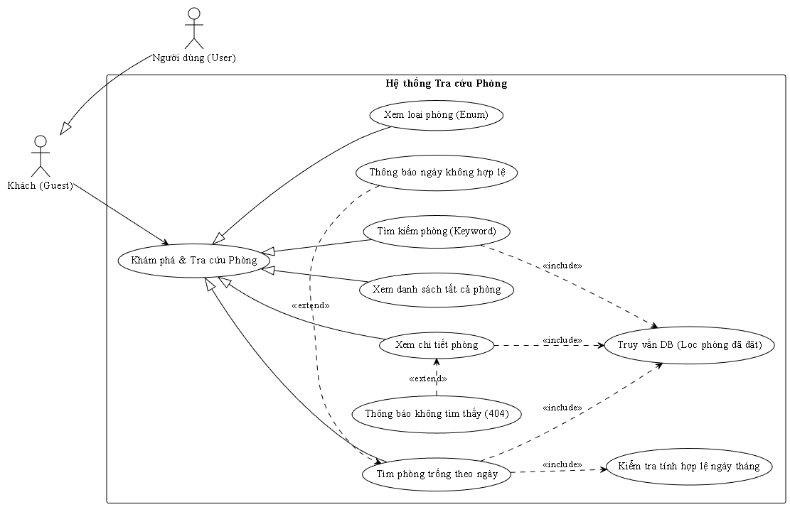
> Hình 3.6: Usecase tra cứu phòng

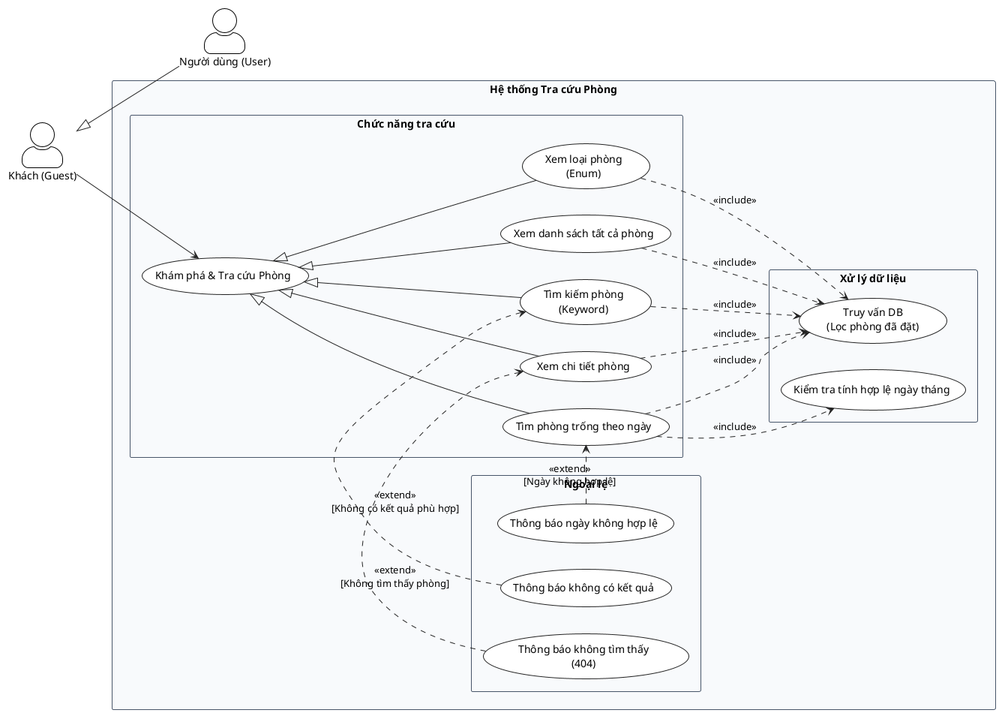
```plantuml
@startuml
!theme plain
left to right direction
skinparam shadowing false
skinparam packageStyle rectangle
skinparam actorStyle awesome
skinparam usecase {
  BackgroundColor #FFFFFF
  BorderColor #222222
  ArrowColor #222222
}
skinparam rectangle {
  BackgroundColor #F8FAFC
  BorderColor #475569
}

actor "Khách (Guest)" as Guest
actor "Người dùng (User)" as User
User -up-|> Guest

rectangle "Hệ thống Tra cứu Phòng" as RoomSearchSystem {
  package "Chức năng tra cứu" {
    usecase "Khám phá & Tra cứu Phòng" as SearchRoom
    usecase "Xem danh sách tất cả phòng" as ViewAllRooms
    usecase "Tìm phòng trống theo ngày" as FindAvailable
    usecase "Xem chi tiết phòng" as ViewRoomDetail
    usecase "Tìm kiếm phòng\n(Keyword)" as KeywordSearch
    usecase "Xem loại phòng\n(Enum)" as ViewRoomType
  }

  package "Xử lý dữ liệu" {
    usecase "Truy vấn DB\n(Lọc phòng đã đặt)" as QueryDB
    usecase "Kiểm tra tính hợp lệ ngày tháng" as ValidateDate
  }

  package "Ngoại lệ" {
    usecase "Thông báo ngày không hợp lệ" as InvalidDate
    usecase "Thông báo không tìm thấy\n(404)" as NotFound
    usecase "Thông báo không có kết quả" as NoResult
  }
}

Guest --> SearchRoom
ViewAllRooms -up-|> SearchRoom
FindAvailable -up-|> SearchRoom
ViewRoomDetail -up-|> SearchRoom
KeywordSearch -up-|> SearchRoom
ViewRoomType -up-|> SearchRoom
ViewAllRooms ..> QueryDB : <<include>>
FindAvailable ..> ValidateDate : <<include>>
FindAvailable ..> QueryDB : <<include>>
ViewRoomDetail ..> QueryDB : <<include>>
KeywordSearch ..> QueryDB : <<include>>
ViewRoomType ..> QueryDB : <<include>>
InvalidDate .> FindAvailable : <<extend>>\n[Ngày không hợp lệ]
NotFound .> ViewRoomDetail : <<extend>>\n[Không tìm thấy phòng]
NoResult .> KeywordSearch : <<extend>>\n[Không có kết quả phù hợp]
@enduml
```

Đặc tả Usecase xem danh sách tất cả phòng

| Mục                                                 | Nội dung                                                                                                                                                                                                                                               |
| --------------------------------------------------- | ------------------------------------------------------------------------------------------------------------------------------------------------------------------------------------------------------------------------------------------------------ |
| Tên Use case                                        | Xem danh sách tất cả phòng                                                                                                                                                                                                                             |
| Actor                                               | Khách (Guest), Người dùng (User)                                                                                                                                                                                                                       |
| Mô tả                                               | Người dùng truy cập vào trang danh sách để xem toàn bộ các phòng hiện có trong hệ thống mà không cần áp dụng bộ lọc tìm kiếm nào.                                                                                                                      |
| Pre-conditions                                      | Actor truy cập vào trang chủ hoặc trang danh sách phòng của hệ thống.                                                                                                                                                                                  |
| Post-conditions                                     | Success: Hệ thống hiển thị danh sách các phòng kèm thông tin tóm tắt (Hình ảnh, Tên, Giá...). Fail: Hệ thống thông báo lỗi kết nối hoặc danh sách trống.                                                                                            |
| Luồng sự kiện chính                                 | 1. Actor chọn menu "Phòng" hoặc "Danh sách phòng". 2. Hệ thống thực hiện truy vấn cơ sở dữ liệu để lấy danh sách phòng. 3. Hệ thống hiển thị danh sách phòng lên giao diện (có thể phân trang).                                                  |
| Luồng sự kiện phụ                                   | - Nếu hệ thống chưa có dữ liệu phòng nào: Hệ thống hiển thị thông báo "Chưa có phòng nào được cập nhật".                                                                                                                                               |
| <Include Use Case> Quy trình Nghiệp vụ           | Hệ thống lấy dữ liệu thô từ bảng Room để hiển thị.                                                                                                                                                                                                     |
| <Extend Use Case> Thông báo phòng không tìm thấy | Điều kiện: Khi quy trình kiểm tra trả về kết quả rằng ID phòng không tồn tại. Hành động: - Hệ thống hiển thị thông báo lỗi: "Phòng này không tồn tại hoặc đã bị xóa". - Hệ thống tự động làm mới danh sách phòng để phản ánh dữ liệu thực tế. |
| <Extend Use Case> Thông báo lỗi định dạng ảnh    | Điều kiện: Khi file ảnh mới tải lên không đúng định dạng cho phép. Hành động: - Hệ thống hiển thị cảnh báo và yêu cầu chọn file khác.                                                                                                            |

Đặc tả Usecase tìm phòng trống theo ngày

| Mục | Nội dung |
| --- | --- |
| Tên Use case | Tìm phòng trống theo ngày |
| Actor | Khách (Guest), Người dùng (User) |
| Mô tả | Người dùng nhập khoảng thời gian dự kiến lưu trú (Check-in, Check-out) để hệ thống lọc và hiển thị danh sách các phòng còn trống, chưa bị đặt trong khoảng thời gian đó. |
| Pre-conditions | Actor đang ở giao diện tìm kiếm phòng hoặc trang chủ. |
| Post-conditions | Success: Hệ thống hiển thị danh sách các phòng khả dụng trong khoảng ngày đã chọn. Fail: Hệ thống hiển thị thông báo lỗi ngày tháng hoặc thông báo không còn phòng trống. |
| Luồng sự kiện chính | 1. Actor chọn ngày Check-in và ngày Check-out trên bộ lọc. 2. Actor nhấn nút "Tìm kiếm" hoặc "Kiểm tra tình trạng". 3. Hệ thống thực hiện kiểm tra tính hợp lệ ngày tháng. 4. Hệ thống thực hiện truy vấn DB (lọc phòng đã đặt). 5. Hệ thống hiển thị danh sách phòng trống phù hợp. |
| Luồng sự kiện phụ | - Nếu ngày nhập vào không hợp lệ (ví dụ: Ngày về trước ngày đi, hoặc chọn ngày trong quá khứ): Hệ thống thực hiện thông báo ngày không hợp lệ. |
| <Include Use Case> Quy trình Nghiệp vụ | - Kiểm tra tính hợp lệ ngày tháng: Hệ thống xác thực logic thời gian (Check-out > Check-in >= Today). - Truy vấn DB: Hệ thống quét bảng Booking để loại trừ các ID phòng đã có lịch đặt trùng với khoảng thời gian khách chọn (Logic: NOT (ExistingCheckIn < NewCheckOut AND ExistingCheckOut > NewCheckIn)). |
| <Extend Use Case> Thông báo ngày không hợp lệ | Điều kiện: Khi quy trình kiểm tra ngày tháng phát hiện lỗi logic. Hành động: - Hệ thống hiển thị cảnh báo: "Ngày Check-in phải lớn hơn hiện tại và nhỏ hơn ngày Check-out". - Hệ thống yêu cầu nhập lại ngày. |
| <Extend Use Case> Thông báo lỗi định dạng ảnh | Điều kiện: Khi file ảnh mới tải lên không đúng định dạng cho phép. Hành động: - Hệ thống hiển thị cảnh báo và yêu cầu chọn file khác. |

Đặc tả Usecase xem chi tiết phòng

| Mục | Nội dung |
| --- | --- |
| Tên Use case | Xem chi tiết phòng |
| Actor | Khách (Guest), Người dùng (User) |
| Mô tả | Người dùng xem toàn bộ thông tin chi tiết của một phòng cụ thể, bao gồm hình ảnh chi tiết, danh sách tiện ích, mô tả đầy đủ và các đánh giá (nếu có). |
| Pre-conditions | Actor đang ở trang danh sách phòng hoặc trang kết quả tìm kiếm. |
| Post-conditions | Success: Hệ thống chuyển hướng sang trang chi tiết và hiển thị đầy đủ thông tin của phòng đó. Fail: Hệ thống hiển thị trang lỗi 404 hoặc thông báo không tìm thấy. |
| Luồng sự kiện chính | 1. Actor nhấn vào hình ảnh hoặc tên của một phòng bất kỳ trong danh sách. 2. Hệ thống thực hiện truy vấn DB theo ID phòng. 3. Nếu dữ liệu tồn tại, hệ thống tải thông tin chi tiết (Info, Images, Amenities). 4. Hệ thống hiển thị trang chi tiết phòng. |
| Luồng sự kiện phụ | - Nếu ID phòng trên URL không tồn tại trong cơ sở dữ liệu (do đường dẫn hỏng hoặc phòng đã bị xóa): Hệ thống thực hiện thông báo không tìm thấy (404). |
| <Include Use Case> Quy trình Nghiệp vụ | - Truy vấn DB: Hệ thống thực hiện câu lệnh tìm kiếm trong bảng Room (và các bảng liên kết như RoomImages, RoomAmenities) dựa trên ID được cung cấp. |
| <Extend Use Case> Thông báo không tìm thấy (404) | Điều kiện: Khi quy trình truy vấn DB trả về kết quả rỗng (Null). Hành động: - Hệ thống hiển thị trang lỗi: "Không tìm thấy phòng bạn yêu cầu". - Hệ thống cung cấp nút quay lại trang chủ hoặc danh sách phòng. |
| <Extend Use Case> Thông báo lỗi định dạng ảnh | Điều kiện: Khi file ảnh mới tải lên không đúng định dạng cho phép. Hành động: - Hệ thống hiển thị cảnh báo và yêu cầu chọn file khác. |

Đặc tả Usecase tìm kiếm phòng

| Mục | Nội dung |
| --- | --- |
| Tên Use case | Tìm kiếm phòng theo từ khóa |
| Actor | Khách (Guest), Người dùng (User) |
| Mô tả | Người dùng tìm kiếm các phòng cụ thể bằng cách nhập từ khóa (ví dụ: tên phòng, đặc điểm, view...). Hệ thống sẽ lọc và trả về các kết quả khớp với từ khóa đó. |
| Pre-conditions | Actor đang ở giao diện tìm kiếm hoặc trang danh sách phòng. |
| Post-conditions | Success: Hệ thống hiển thị danh sách các phòng có thông tin chứa từ khóa tìm kiếm. Fail: Hệ thống thông báo không tìm thấy kết quả phù hợp. |
| Luồng sự kiện chính | 1. Actor nhập từ khóa vào ô tìm kiếm (ví dụ: "Deluxe", "Sea View"). 2. Actor nhấn nút "Tìm kiếm". 3. Hệ thống thực hiện truy vấn cơ sở dữ liệu. 4. Hệ thống hiển thị danh sách kết quả tìm được. |
| Luồng sự kiện phụ | - Nếu không có phòng nào khớp với từ khóa: Hệ thống hiển thị thông báo "Không tìm thấy kết quả nào phù hợp với từ khóa của bạn". |
| <Include Use Case> Quy trình Nghiệp vụ | - Truy vấn cơ sở dữ liệu: Hệ thống thực hiện câu lệnh SELECT với điều kiện lọc LIKE %keyword% trên các trường Tên hoặc Mô tả của bảng Room. |
| <Extend Use Case> Thông báo lỗi định dạng ảnh | Điều kiện: Khi file ảnh mới tải lên không đúng định dạng cho phép. Hành động: - Hệ thống hiển thị cảnh báo và yêu cầu chọn file khác. |

Đặc tả Usecase xem loại phòng

| Mục | Nội dung |
| --- | --- |
| Tên Use case | Xem loại phòng |
| Actor | Khách (Guest), Người dùng (User) |
| Mô tả | Người dùng xem danh sách các hạng mục/loại phòng hiện có của khách sạn (ví dụ: Phòng đơn, Phòng đôi, VIP, Suite...) để hiểu rõ các phân khúc dịch vụ được cung cấp. |
| Pre-conditions | Actor truy cập vào trang chủ hoặc menu danh mục phòng. |
| Post-conditions | Success: Hệ thống hiển thị danh sách các loại phòng kèm mô tả đặc trưng. Fail: Hệ thống hiển thị danh sách trống (nếu chưa cấu hình) hoặc báo lỗi kết nối. |
| Luồng sự kiện chính | 1. Actor chọn menu "Loại phòng" hoặc bộ lọc theo hạng phòng. 2. Hệ thống thực hiện truy vấn dữ liệu loại phòng. 3. Hệ thống hiển thị danh sách các loại phòng lên giao diện. |
| Luồng sự kiện phụ | - Nếu hệ thống chưa có dữ liệu loại phòng nào: Hệ thống hiển thị thông báo "Chưa có dữ liệu loại phòng". |
| <Include Use Case> Quy trình Nghiệp vụ | - Truy vấn DB: Hệ thống lấy danh sách các giá trị Enum hoặc bảng danh mục loại phòng từ cơ sở dữ liệu để hiển thị cho người dùng. |
| <Extend Use Case> Thông báo lỗi định dạng ảnh | Điều kiện: Khi file ảnh mới tải lên không đúng định dạng cho phép. Hành động: - Hệ thống hiển thị cảnh báo và yêu cầu chọn file khác. |
#### 3.2.1.7 Usecase quản lý khách sạn

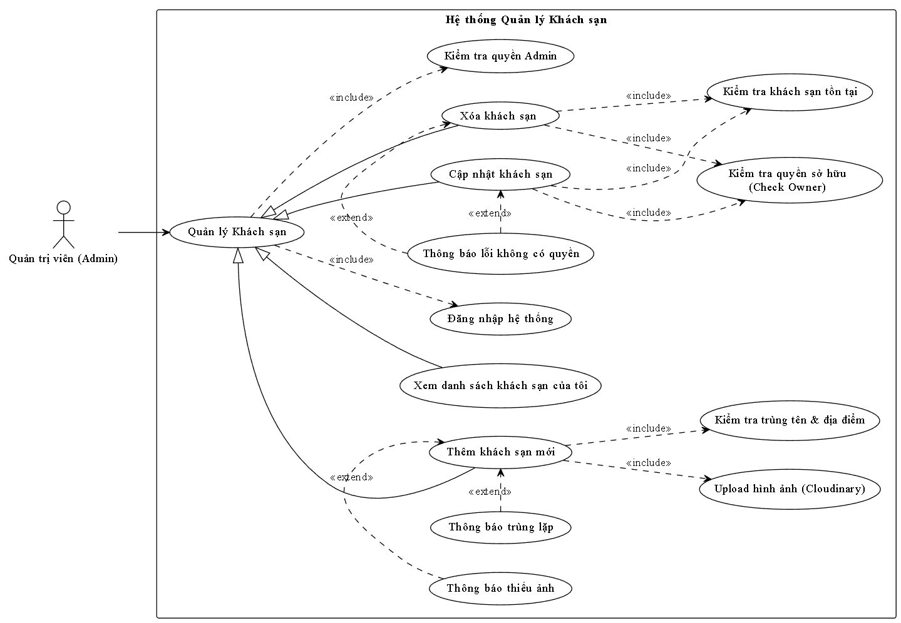
> Hình 3.7: Usecase quản lý khách sạn

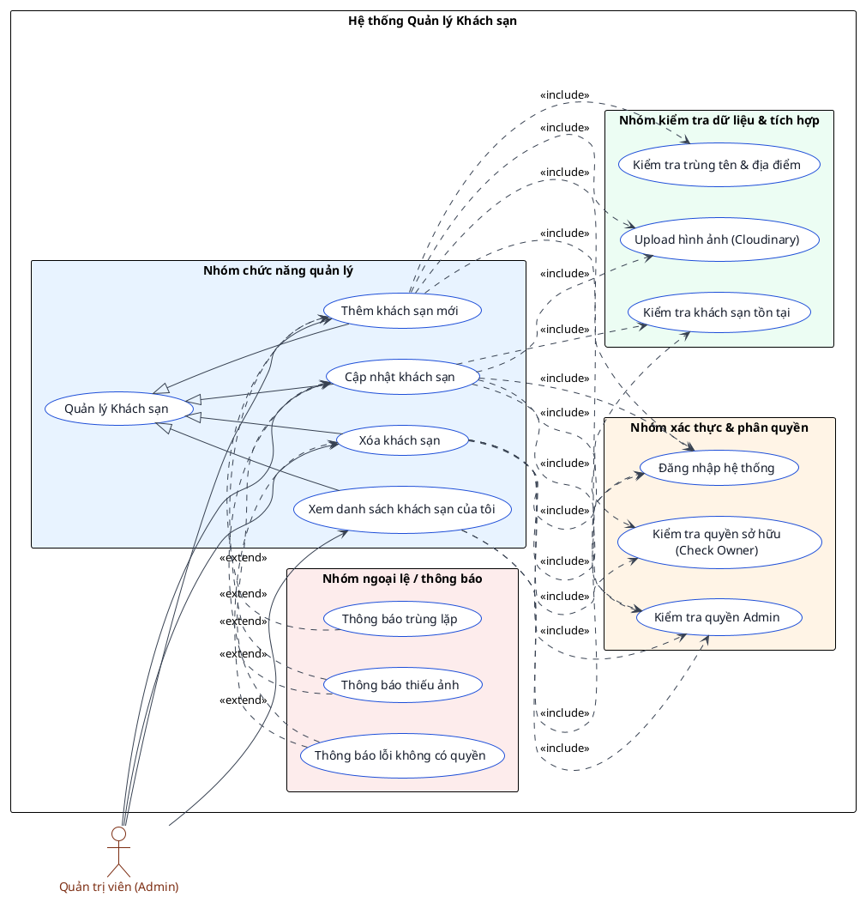
```plantuml
@startuml
!theme plain
skinparam shadowing false
skinparam packageStyle rectangle
skinparam defaultFontName "Times New Roman"
skinparam ArrowColor #374151
skinparam actor {
  BorderColor #7C2D12
  FontColor #7C2D12
}
skinparam usecase {
  BackgroundColor #FFFFFF
  BorderColor #1D4ED8
  FontColor #111827
}
left to right direction

actor "Quản trị viên (Admin)" as Admin

rectangle "Hệ thống Quản lý Khách sạn" {
  package "Nhóm chức năng quản lý" #E8F3FF {
    usecase "Quản lý Khách sạn" as HotelManage
    usecase "Thêm khách sạn mới" as AddHotel
    usecase "Cập nhật khách sạn" as UpdateHotel
    usecase "Xóa khách sạn" as DeleteHotel
    usecase "Xem danh sách khách sạn của tôi" as MyHotels
  }

  package "Nhóm xác thực & phân quyền" #FFF4E6 {
    usecase "Đăng nhập hệ thống" as LoginSystem
    usecase "Kiểm tra quyền Admin" as CheckAdmin
    usecase "Kiểm tra quyền sở hữu\n(Check Owner)" as CheckOwner
  }

  package "Nhóm kiểm tra dữ liệu & tích hợp" #ECFDF3 {
    usecase "Kiểm tra khách sạn tồn tại" as CheckHotelExists
    usecase "Kiểm tra trùng tên & địa điểm" as CheckDuplicate
    usecase "Upload hình ảnh (Cloudinary)" as UploadImage
  }

  package "Nhóm ngoại lệ / thông báo" #FDECEC {
    usecase "Thông báo lỗi không có quyền" as PermissionError
    usecase "Thông báo trùng lặp" as DuplicateError
    usecase "Thông báo thiếu ảnh" as MissingImage
  }
}

Admin --> AddHotel
Admin --> UpdateHotel
Admin --> DeleteHotel
Admin --> MyHotels

AddHotel -up-|> HotelManage
UpdateHotel -up-|> HotelManage
DeleteHotel -up-|> HotelManage
MyHotels -up-|> HotelManage

AddHotel ..> LoginSystem : <<include>>
AddHotel ..> CheckAdmin : <<include>>
AddHotel ..> CheckDuplicate : <<include>>
AddHotel ..> UploadImage : <<include>>
UpdateHotel ..> LoginSystem : <<include>>
UpdateHotel ..> CheckAdmin : <<include>>
UpdateHotel ..> CheckOwner : <<include>>
UpdateHotel ..> CheckHotelExists : <<include>>
UpdateHotel ..> UploadImage : <<include>>
DeleteHotel ..> LoginSystem : <<include>>
DeleteHotel ..> CheckAdmin : <<include>>
DeleteHotel ..> CheckOwner : <<include>>
DeleteHotel ..> CheckHotelExists : <<include>>
MyHotels ..> LoginSystem : <<include>>
MyHotels ..> CheckAdmin : <<include>>

PermissionError .> UpdateHotel : <<extend>>
PermissionError .> DeleteHotel : <<extend>>
DuplicateError .> AddHotel : <<extend>>
MissingImage .> AddHotel : <<extend>>
MissingImage .> UpdateHotel : <<extend>>
@enduml
```

Đặc tả Usecase thêm khách sạn mới

| Mục | Nội dung |
| --- | --- |
| Tên Use case | Thêm khách sạn mới |
| Actor | Quản trị viên (Admin) |
| Mô tả | Admin tạo và đăng ký một khách sạn mới vào hệ thống. Quá trình này bao gồm nhập thông tin định danh, địa chỉ và tải lên hình ảnh đại diện cho khách sạn. |
| Pre-conditions | - Actor đã đăng nhập vào hệ thống. - Actor có quyền Admin. |
| Post-conditions | Success: Khách sạn mới được lưu vào cơ sở dữ liệu và gán quyền sở hữu cho Admin tạo ra nó. Fail: Hệ thống báo lỗi trùng lặp hoặc lỗi dữ liệu (thiếu ảnh). |
| Luồng sự kiện chính | 1. Actor chọn chức năng "Thêm khách sạn". 2. Actor nhập thông tin (Tên, Địa chỉ, Thành phố, Mô tả...). 3. Actor thực hiện upload hình ảnh (Cloudinary). 4. Actor nhấn nút "Tạo mới". 5. Hệ thống thực hiện đăng nhập (kiểm tra session). 6. Hệ thống thực hiện kiểm tra quyền Admin. 7. Hệ thống thực hiện kiểm tra trùng tên & địa điểm. 8. Nếu hợp lệ, hệ thống lưu thông tin khách sạn mới. 9. Hệ thống hiển thị thông báo "Thêm khách sạn thành công". |
| Luồng sự kiện phụ | - Nếu tên hoặc địa chỉ khách sạn đã tồn tại: Hệ thống thực hiện thông báo trùng lặp. - Nếu người dùng không tải ảnh lên: Hệ thống thực hiện thông báo thiếu ảnh. |
| <Include Use Case> Quy trình Nghiệp vụ | - Kiểm tra quyền Admin: Hệ thống xác minh vai trò của tài khoản để đảm bảo chỉ quản trị viên mới được tạo khách sạn. - Upload hình ảnh: Hệ thống xử lý việc tải file ảnh lên server lưu trữ đám mây và trả về đường dẫn URL. - Kiểm tra trùng tên & địa điểm: Hệ thống so sánh thông tin nhập vào với dữ liệu hiện có để tránh việc tạo các bản ghi khách sạn trùng lặp (Duplicate). |
| <Extend Use Case> Thông báo trùng lặp | Điều kiện: Khi quy trình kiểm tra trùng lặp phát hiện dữ liệu tương tự đã tồn tại. Hành động: - Hệ thống hiển thị cảnh báo: "Khách sạn với tên và địa chỉ này đã tồn tại". - Hệ thống yêu cầu sửa lại thông tin. |
| <Extend Use Case> Thông báo thiếu ảnh | Điều kiện: Khi người dùng cố gắng lưu mà chưa có URL hình ảnh hợp lệ. Hành động: - Hệ thống hiển thị lỗi: "Vui lòng tải lên ít nhất một hình ảnh cho khách sạn". |

Đặc tả Usecase cập nhật khách sạn

| Mục | Nội dung |
| --- | --- |
| Tên Use case | Cập nhật khách sạn |
| Actor | Quản trị viên (Admin) |
| Mô tả | Admin thay đổi các thông tin chi tiết của một khách sạn đã tồn tại trong hệ thống (như tên, mô tả, tiện ích, hoặc ảnh đại diện) để cập nhật dữ liệu mới nhất. |
| Pre-conditions | - Actor đã đăng nhập và có quyền Admin. - Khách sạn cần cập nhật phải tồn tại. - Actor phải là người sở hữu (Owner) của khách sạn đó. |
| Post-conditions | Success: Thông tin khách sạn được cập nhật vào cơ sở dữ liệu. Fail: Hệ thống giữ nguyên thông tin cũ và báo lỗi (nếu không có quyền hoặc khách sạn không tồn tại). |
| Luồng sự kiện chính | 1. Actor chọn chức năng "Chỉnh sửa" tại khách sạn cần cập nhật. 2. Actor thay đổi các thông tin mong muốn (Tên, Mô tả, v.v.). 3. Actor nhấn nút "Lưu thay đổi". 4. Hệ thống thực hiện kiểm tra quyền sở hữu. 5. Hệ thống thực hiện kiểm tra khách sạn tồn tại. 6. Nếu hợp lệ, hệ thống lưu thông tin mới. 7. Hệ thống hiển thị thông báo "Cập nhật thành công". |
| Luồng sự kiện phụ | - Nếu Actor cố tình sửa khách sạn không thuộc quyền quản lý của mình: Hệ thống thực hiện thông báo lỗi không có quyền. |
| <Include Use Case> Quy trình Nghiệp vụ | - Kiểm tra quyền sở hữu: Hệ thống đối chiếu ID của Admin đang đăng nhập với ID chủ sở hữu (OwnerID) của khách sạn để đảm bảo tính bảo mật. - Kiểm tra khách sạn tồn tại: Hệ thống xác minh xem ID khách sạn có còn hợp lệ trong cơ sở dữ liệu hay không (tránh trường hợp vừa bị xóa). |
| <Extend Use Case> Thông báo lỗi không có quyền | Điều kiện: Khi quy trình kiểm tra quyền sở hữu trả về kết quả False (không khớp). Hành động: - Hệ thống hiển thị cảnh báo: "Bạn không có quyền chỉnh sửa khách sạn này".  - Hệ thống từ chối lưu thay đổi. |
| <Extend Use Case> Thông báo thiếu ảnh | Điều kiện: Khi người dùng cố gắng lưu mà chưa có URL hình ảnh hợp lệ. Hành động: - Hệ thống hiển thị lỗi: "Vui lòng tải lên ít nhất một hình ảnh cho khách sạn". |

Đặc tả Usecase xóa khách sạn

| Mục | Nội dung |
| --- | --- |
| Tên Use case | Xóa khách sạn |
| Actor | Quản trị viên (Admin) |
| Mô tả | Admin thực hiện xóa vĩnh viễn một khách sạn khỏi hệ thống. Hành động này yêu cầu quyền sở hữu đối với khách sạn đó và thường đi kèm bước xác nhận để tránh sai sót. |
| Pre-conditions | - Actor đã đăng nhập và có quyền Admin. - Khách sạn cần xóa đang tồn tại trong danh sách quản lý của Admin. |
| Post-conditions | Success: Dữ liệu khách sạn (và các phòng liên quan) bị xóa khỏi cơ sở dữ liệu. Fail: Hệ thống giữ nguyên dữ liệu và báo lỗi (nếu không có quyền hoặc khách sạn không tồn tại). |
| Luồng sự kiện chính | 1. Actor chọn nút "Xóa" tại khách sạn mong muốn trong danh sách. 2. Hệ thống hiển thị hộp thoại xác nhận. 3. Actor nhấn nút "Đồng ý" để xác nhận xóa. 4. Hệ thống thực hiện kiểm tra quyền sở hữu. 5. Hệ thống thực hiện kiểm tra khách sạn tồn tại. 6. Nếu hợp lệ, hệ thống xóa dữ liệu khách sạn. 7. Hệ thống hiển thị thông báo "Đã xóa khách sạn thành công". |
| Luồng sự kiện phụ | - Nếu Actor không phải là chủ sở hữu của khách sạn này: Hệ thống thực hiện thông báo lỗi không có quyền. |
| <Include Use Case> Quy trình Nghiệp vụ | - Kiểm tra quyền sở hữu: Hệ thống xác minh Admin hiện tại có phải là người tạo/sở hữu khách sạn này không (Owner Check). - Kiểm tra khách sạn tồn tại: Hệ thống đảm bảo ID khách sạn vẫn còn trong DB trước khi thực hiện lệnh xóa. |
| <Extend Use Case> Thông báo lỗi không có quyền | Điều kiện: Khi quy trình kiểm tra quyền sở hữu thất bại. Hành động: - Hệ thống hiển thị cảnh báo: "Bạn không có quyền xóa khách sạn này". - Hệ thống hủy bỏ thao tác xóa. |
| <Extend Use Case> Thông báo lỗi trùng tên | Điều kiện: Khi quy trình kiểm tra tên phát hiện sự trùng lặp. Hành động: - Hệ thống hiển thị cảnh báo: "Tên tiện ích đã được sử dụng". |

Đặc tả Usecase xem danh sách khách sạn của tôi

| Mục | Nội dung |
| --- | --- |
| Tên Use case | Xem danh sách khách sạn của tôi (View My Hotels) |
| Actor | Quản trị viên (Admin) |
| Mô tả | Admin xem danh sách toàn bộ các khách sạn mà mình đang sở hữu và quản lý. Tính năng này giúp Admin có cái nhìn tổng quan về tài sản của mình trên hệ thống. |
| Pre-conditions | - Actor đã đăng nhập vào hệ thống. - Actor có quyền Admin. |
| Post-conditions | Success: Hệ thống hiển thị danh sách các khách sạn do Admin này tạo/sở hữu. Fail: Hệ thống hiển thị danh sách trống (nếu chưa có khách sạn nào). |
| Luồng sự kiện chính | 1. Actor chọn menu "Khách sạn của tôi". 2. Hệ thống thực hiện kiểm tra quyền Admin. 3. Hệ thống truy vấn cơ sở dữ liệu để lấy danh sách khách sạn theo ID của Admin. 4. Hệ thống hiển thị danh sách khách sạn lên giao diện. |
| Luồng sự kiện phụ | - Nếu Admin chưa tạo khách sạn nào: Hệ thống hiển thị thông báo "Bạn chưa có khách sạn nào. Hãy tạo mới ngay!". |
| <Include Use Case> Quy trình Nghiệp vụ | - Kiểm tra quyền Admin: Hệ thống xác minh vai trò của tài khoản để đảm bảo người dùng có quyền truy cập vào khu vực quản lý. - Truy vấn theo Owner ID: (Ngầm định) Hệ thống lọc dữ liệu khách sạn trong DB với điều kiện owner_id == current_user_id. |
| <Extend Use Case> Thông báo lỗi không có quyền | Điều kiện: Khi quy trình kiểm tra quyền sở hữu trả về kết quả False (không khớp). Hành động: - Hệ thống hiển thị cảnh báo: "Bạn không có quyền chỉnh sửa khách sạn này". - Hệ thống từ chối lưu thay đổi. |
| <Extend Use Case> Thông báo thiếu ảnh | Điều kiện: Khi người dùng cố gắng lưu mà chưa có URL hình ảnh hợp lệ. Hành động: - Hệ thống hiển thị lỗi: "Vui lòng tải lên ít nhất một hình ảnh cho khách sạn". |

#### 3.2.1.8 Usecase tra cứu khách sạn

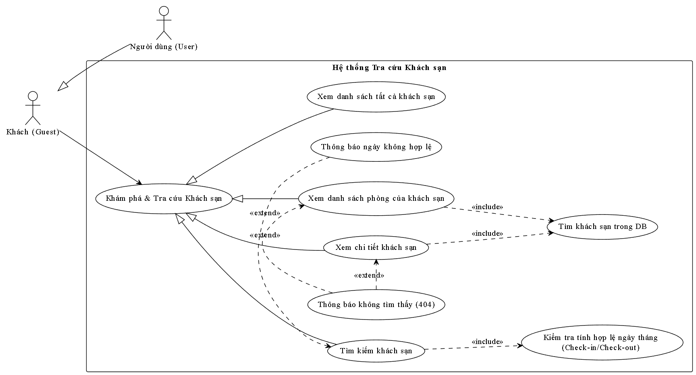
> Hình 3.8: Usecase tra cứu khách sạn

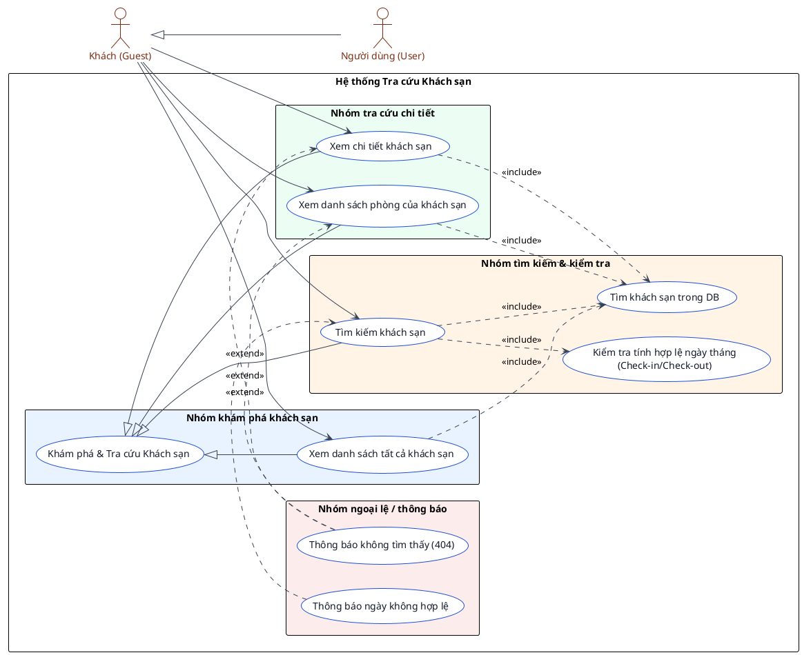
```plantuml
@startuml
!theme plain
skinparam shadowing false
skinparam packageStyle rectangle
skinparam defaultFontName "Times New Roman"
skinparam ArrowColor #374151
skinparam actor {
  BorderColor #7C2D12
  FontColor #7C2D12
}
skinparam usecase {
  BackgroundColor #FFFFFF
  BorderColor #1D4ED8
  FontColor #111827
}
left to right direction

actor "Khách (Guest)" as Guest
actor "Người dùng (User)" as User
User -up-|> Guest

rectangle "Hệ thống Tra cứu Khách sạn" {
  package "Nhóm khám phá khách sạn" #E8F3FF {
    usecase "Khám phá & Tra cứu Khách sạn" as SearchHotel
    usecase "Xem danh sách tất cả khách sạn" as ViewAllHotels
  }

  package "Nhóm tra cứu chi tiết" #ECFDF3 {
    usecase "Xem chi tiết khách sạn" as ViewHotelDetail
    usecase "Xem danh sách phòng của khách sạn" as ViewHotelRooms
  }

  package "Nhóm tìm kiếm & kiểm tra" #FFF4E6 {
    usecase "Tìm kiếm khách sạn" as FindHotel
    usecase "Tìm khách sạn trong DB" as FindHotelDB
    usecase "Kiểm tra tính hợp lệ ngày tháng\n(Check-in/Check-out)" as ValidateDate
  }

  package "Nhóm ngoại lệ / thông báo" #FDECEC {
    usecase "Thông báo ngày không hợp lệ" as InvalidDate
    usecase "Thông báo không tìm thấy (404)" as NotFound
  }
}

Guest --> ViewAllHotels
Guest --> ViewHotelDetail
Guest --> ViewHotelRooms
Guest --> FindHotel

ViewAllHotels -up-|> SearchHotel
ViewHotelRooms -up-|> SearchHotel
ViewHotelDetail -up-|> SearchHotel
FindHotel -up-|> SearchHotel

ViewAllHotels ..> FindHotelDB : <<include>>
ViewHotelRooms ..> FindHotelDB : <<include>>
ViewHotelDetail ..> FindHotelDB : <<include>>
FindHotel ..> FindHotelDB : <<include>>
FindHotel ..> ValidateDate : <<include>>

InvalidDate .> FindHotel : <<extend>>
NotFound .> ViewHotelDetail : <<extend>>
NotFound .> ViewHotelRooms : <<extend>>
@enduml
```

Đặc tả Usecase xem danh sách tất cả khách sạn

| Mục | Nội dung |
| --- | --- |
| Tên Use case | Xem danh sách tất cả khách sạn |
| Actor | Khách (Guest), Người dùng (User) |
| Mô tả | Người dùng truy cập vào trang danh sách để xem toàn bộ các khách sạn hiện có trên hệ thống. |
| Pre-conditions | Actor truy cập vào trang chủ hoặc menu "Khách sạn" của hệ thống. |
| Post-conditions | Success: Hệ thống hiển thị danh sách các khách sạn với thông tin tóm tắt (Tên, Địa chỉ, Ảnh đại diện...). Fail: Hệ thống hiển thị danh sách trống hoặc báo lỗi kết nối. |
| Luồng sự kiện chính | 1. Actor chọn menu "Danh sách Khách sạn". 2. Hệ thống thực hiện truy vấn cơ sở dữ liệu để lấy danh sách khách sạn. 3. Hệ thống hiển thị danh sách khách sạn lên giao diện (có thể phân trang). |
| Luồng sự kiện phụ | - Nếu hệ thống chưa có dữ liệu khách sạn nào: Hệ thống hiển thị thông báo "Chưa có khách sạn nào trong hệ thống". |
| <Include Use Case> Quy trình Nghiệp vụ | - Truy vấn DB: (Ngầm định) Hệ thống lấy dữ liệu từ bảng Hotel để hiển thị cho người dùng. |
| <Extend Use Case> Thông báo lỗi không có quyền | Điều kiện: Khi quy trình kiểm tra quyền sở hữu trả về kết quả False (không khớp). Hành động: - Hệ thống hiển thị cảnh báo: "Bạn không có quyền chỉnh sửa khách sạn này". - Hệ thống từ chối lưu thay đổi. |
| <Extend Use Case> Thông báo thiếu ảnh | Điều kiện: Khi người dùng cố gắng lưu mà chưa có URL hình ảnh hợp lệ. Hành động: - Hệ thống hiển thị lỗi: "Vui lòng tải lên ít nhất một hình ảnh cho khách sạn". |

Đặc tả Usecase xem chi tiết khách sạn

| Mục | Nội dung |
| --- | --- |
| Tên Use case | Xem chi tiết khách sạn |
| Actor | Khách (Guest), Người dùng (User) |
| Mô tả | Người dùng xem toàn bộ thông tin chi tiết của một khách sạn cụ thể, bao gồm hình ảnh, địa chỉ, mô tả, danh sách tiện ích và các phòng thuộc khách sạn đó. |
| Pre-conditions | Actor đang ở trang danh sách khách sạn hoặc trang kết quả tìm kiếm. |
| Post-conditions | Success: Hệ thống hiển thị trang chi tiết khách sạn với đầy đủ thông tin. Fail: Hệ thống hiển thị trang lỗi 404 nếu ID khách sạn không tồn tại. |
| Luồng sự kiện chính | 1. Actor nhấn vào tên hoặc hình ảnh của một khách sạn trong danh sách. 2. Hệ thống thực hiện tìm khách sạn trong DB. 3. Nếu tìm thấy, hệ thống tải thông tin chi tiết (Info, Images, Amenities). 4. Hệ thống hiển thị giao diện chi tiết khách sạn. |
| Luồng sự kiện phụ | - Nếu ID khách sạn không tồn tại trong hệ thống (ví dụ: truy cập qua link cũ): Hệ thống thực hiện thông báo không tìm thấy (404). |
| <Include Use Case> Quy trình Nghiệp vụ | - Tìm khách sạn trong DB: Hệ thống thực hiện truy vấn cơ sở dữ liệu dựa trên ID khách sạn được cung cấp để lấy dữ liệu. |
| <Extend Use Case> Thông báo không tìm thấy (404) | Điều kiện: Khi quy trình tìm kiếm trả về kết quả rỗng. Hành động: - Hệ thống hiển thị thông báo lỗi: "Không tìm thấy khách sạn bạn yêu cầu". - Hệ thống cung cấp nút quay lại danh sách. |
| <Extend Use Case> Thông báo thiếu ảnh | Điều kiện: Khi người dùng cố gắng lưu mà chưa có URL hình ảnh hợp lệ. Hành động: - Hệ thống hiển thị lỗi: "Vui lòng tải lên ít nhất một hình ảnh cho khách sạn". |

Đặc tả Usecase tìm kiếm khách sạn

| Mục | Nội dung |
| --- | --- |
| Tên Use case | Tìm kiếm khách sạn |
| Actor | Khách (Guest), Người dùng (User) |
| Mô tả | Người dùng tìm kiếm khách sạn dựa trên các tiêu chí như địa điểm, ngày nhận phòng (Check-in) và ngày trả phòng (Check-out) để tìm nơi lưu trú phù hợp. |
| Pre-conditions | Actor đang ở trang chủ hoặc giao diện tìm kiếm của hệ thống. |
| Post-conditions | Success: Hệ thống hiển thị danh sách các khách sạn thỏa mãn tiêu chí tìm kiếm. Fail: Hệ thống báo lỗi nếu ngày tháng nhập vào không hợp lệ. |
| Luồng sự kiện chính | 1. Actor nhập địa điểm cần tìm và chọn ngày Check-in, Check-out. 2. Actor nhấn nút "Tìm kiếm". 3. Hệ thống thực hiện kiểm tra tính hợp lệ ngày tháng. 4. Nếu ngày hợp lệ, hệ thống thực hiện truy vấn danh sách khách sạn phù hợp trong cơ sở dữ liệu. 5. Hệ thống hiển thị kết quả tìm kiếm lên giao diện. |
| Luồng sự kiện phụ | - Nếu ngày Check-in/Check-out không đúng logic (ví dụ: ngày về trước ngày đi): Hệ thống thực hiện thông báo ngày không hợp lệ. |
| <Include Use Case> Quy trình Nghiệp vụ | - Kiểm tra tính hợp lệ ngày tháng: Hệ thống xác thực dữ liệu thời gian để đảm bảo ngày Check-in phải lớn hơn hoặc bằng hiện tại và nhỏ hơn ngày Check-out. |
| <Extend Use Case> Thông báo ngày không hợp lệ | Điều kiện: Khi quy trình kiểm tra ngày tháng phát hiện lỗi logic. Hành động: - Hệ thống hiển thị cảnh báo: "Ngày chọn không hợp lệ (Ngày trả phòng phải sau ngày nhận phòng)". - Hệ thống yêu cầu người dùng chọn lại ngày. |
| <Extend Use Case> Thông báo thiếu ảnh | Điều kiện: Khi người dùng cố gắng lưu mà chưa có URL hình ảnh hợp lệ. Hành động: - Hệ thống hiển thị lỗi: "Vui lòng tải lên ít nhất một hình ảnh cho khách sạn". |

Đặc tả Usecase xem danh sách phòng của khách sạn

| Mục | Nội dung |
| --- | --- |
| Tên Use case | Xem danh sách phòng của khách sạn |
| Actor | Khách (Guest), Người dùng (User) |
| Mô tả | Người dùng xem danh sách các phòng thuộc về một khách sạn cụ thể mà họ đang quan tâm. Danh sách này thường hiển thị ngay trong trang chi tiết khách sạn. |
| Pre-conditions | Actor đang ở trang chi tiết của một khách sạn cụ thể. |
| Post-conditions | Success: Hệ thống hiển thị danh sách các phòng của khách sạn đó (kèm giá, loại phòng, tình trạng...). Fail: Hệ thống báo lỗi nếu không tìm thấy dữ liệu khách sạn. |
| Luồng sự kiện chính | 1. Actor cuộn xuống phần "Danh sách phòng" hoặc nhấn nút "Xem phòng trống". 2. Hệ thống thực hiện tìm khách sạn trong DB (để lấy danh sách phòng liên kết). 3. Hệ thống hiển thị danh sách các phòng thuộc khách sạn đó lên giao diện. |
| Luồng sự kiện phụ | - Nếu ID khách sạn bị sai hoặc không tồn tại: Hệ thống thực hiện thông báo không tìm thấy (404). |
| <Include Use Case> Quy trình Nghiệp vụ | - Tìm khách sạn trong DB: Hệ thống truy vấn cơ sở dữ liệu để lấy danh sách các bản ghi Phòng (Room) có hotel_id khớp với khách sạn đang xem. |
| <Extend Use Case> Thông báo không tìm thấy (404) | Điều kiện: Khi ID khách sạn không hợp lệ trong quá trình truy vấn. Hành động: - Hệ thống hiển thị thông báo lỗi dữ liệu hoặc chuyển hướng về trang danh sách. |
| <Extend Use Case> Thông báo thiếu ảnh | Điều kiện: Khi người dùng cố gắng lưu mà chưa có URL hình ảnh hợp lệ. Hành động: - Hệ thống hiển thị lỗi: "Vui lòng tải lên ít nhất một hình ảnh cho khách sạn". |

#### 3.2.1.9 Usecase quản lý đặt phòng

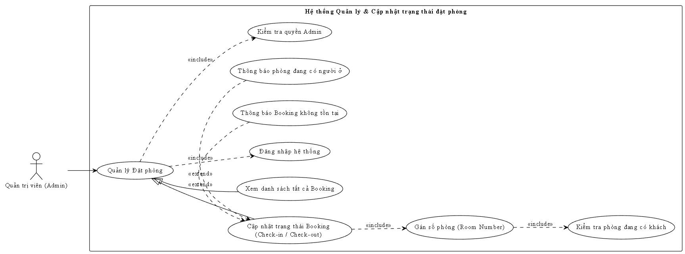
> Hình 3.9: Usecase quản lý đặt phòng

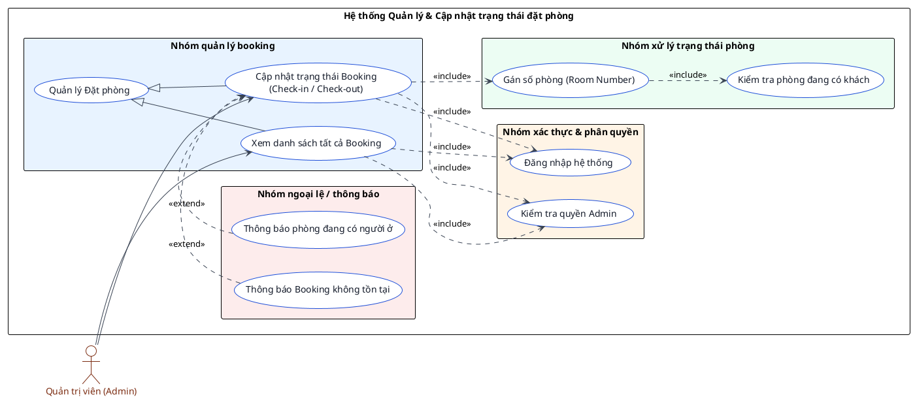
```plantuml
@startuml
!theme plain
skinparam shadowing false
skinparam packageStyle rectangle
skinparam defaultFontName "Times New Roman"
skinparam ArrowColor #374151
skinparam actor {
  BorderColor #7C2D12
  FontColor #7C2D12
}
skinparam usecase {
  BackgroundColor #FFFFFF
  BorderColor #1D4ED8
  FontColor #111827
}
left to right direction

actor "Quản trị viên (Admin)" as Admin

rectangle "Hệ thống Quản lý & Cập nhật trạng thái đặt phòng" {
  package "Nhóm quản lý booking" #E8F3FF {
    usecase "Quản lý Đặt phòng" as BookingManage
    usecase "Xem danh sách tất cả Booking" as ViewAllBookings
    usecase "Cập nhật trạng thái Booking\n(Check-in / Check-out)" as UpdateBookingStatus
  }

  package "Nhóm xác thực & phân quyền" #FFF4E6 {
    usecase "Đăng nhập hệ thống" as LoginSystem
    usecase "Kiểm tra quyền Admin" as CheckAdmin
  }

  package "Nhóm xử lý trạng thái phòng" #ECFDF3 {
    usecase "Gán số phòng (Room Number)" as AssignRoom
    usecase "Kiểm tra phòng đang có khách" as CheckRoomOccupied
  }

  package "Nhóm ngoại lệ / thông báo" #FDECEC {
    usecase "Thông báo phòng đang có người ở" as RoomOccupiedNotice
    usecase "Thông báo Booking không tồn tại" as BookingNotFound
  }
}

Admin --> ViewAllBookings
Admin --> UpdateBookingStatus

ViewAllBookings -up-|> BookingManage
UpdateBookingStatus -up-|> BookingManage

ViewAllBookings ..> LoginSystem : <<include>>
ViewAllBookings ..> CheckAdmin : <<include>>
UpdateBookingStatus ..> LoginSystem : <<include>>
UpdateBookingStatus ..> CheckAdmin : <<include>>
UpdateBookingStatus ..> AssignRoom : <<include>>
AssignRoom ..> CheckRoomOccupied : <<include>>

RoomOccupiedNotice .> UpdateBookingStatus : <<extend>>
BookingNotFound .> UpdateBookingStatus : <<extend>>
@enduml
```

Đặc tả Usecase xem danh sách tất cả Booking

| Mục | Nội dung |
| --- | --- |
| Tên Use case | Xem danh sách tất cả Booking |
| Actor | Quản trị viên (Admin) |
| Mô tả | Admin truy cập vào hệ thống để xem toàn bộ danh sách các đơn đặt phòng (Booking) nhằm theo dõi tình hình kinh doanh và quản lý. |
| Pre-conditions | - Actor đã đăng nhập vào hệ thống. - Actor có quyền Admin. |
| Post-conditions | Success: Hệ thống hiển thị danh sách các Booking với thông tin chi tiết (Khách hàng, Phòng, Ngày, Trạng thái...). Fail: Hệ thống báo lỗi không có quyền truy cập. |
| Luồng sự kiện chính | 1. Actor chọn chức năng "Quản lý Đặt phòng" trên menu. 2. Hệ thống thực hiện kiểm tra quyền Admin. 3. Nếu hợp lệ, hệ thống truy vấn dữ liệu các đơn đặt phòng. 4. Hệ thống hiển thị danh sách Booking lên giao diện. |
| Luồng sự kiện phụ | - Nếu Actor không phải Admin: Hệ thống từ chối truy cập và báo lỗi. |
| <Include Use Case> Quy trình Nghiệp vụ | - Kiểm tra quyền Admin: Hệ thống xác minh vai trò của tài khoản hiện tại để đảm bảo tính bảo mật cho module quản lý. |

Đặc tả Usecase cập nhật trạng thái Booking

| Mục | Nội dung |
| --- | --- |
| Tên Use case | Cập nhật trạng thái Booking |
| Actor | Quản trị viên (Admin) |
| Mô tả | Admin thay đổi trạng thái của đơn đặt phòng (ví dụ: từ "Đã đặt" sang "Check-in" hoặc "Check-out"). Khi Check-in, Admin cần gán số phòng cụ thể cho khách. |
| Pre-conditions | - Actor đã đăng nhập và có quyền Admin. - Đơn đặt phòng cần xử lý phải tồn tại trong hệ thống. |
| Post-conditions | Success: Trạng thái Booking được cập nhật, số phòng được gán (nếu Check-in). Fail: Hệ thống báo lỗi nếu phòng đã có người ở hoặc Booking không tìm thấy. |
| Luồng sự kiện chính | 1. Actor chọn một Booking cụ thể và nhấn "Cập nhật" (hoặc Check-in/Check-out). 2. Actor nhập/chọn số phòng (nếu thực hiện Check-in). 3. Hệ thống thực hiện gán số phòng. 4. Hệ thống thực hiện kiểm tra phòng đang có khách. 5. Nếu phòng trống và hợp lệ, hệ thống lưu trạng thái mới cho Booking. 6. Hệ thống thông báo cập nhật thành công. |
| Luồng sự kiện phụ | - Nếu phòng được chọn đang có người ở (Occupied): Hệ thống thực hiện thông báo phòng đang có người ở. - Nếu Booking không tồn tại (do bị xóa trước đó): Hệ thống thực hiện thông báo Booking không tồn tại. |
| <Include Use Case> Quy trình Xử lý | - Gán số phòng: Hệ thống liên kết mã phòng cụ thể với đơn đặt phòng hiện tại. - Kiểm tra phòng đang có khách: Hệ thống kiểm tra trạng thái thực tế của phòng trong khoảng thời gian đó để tránh trùng lặp (Double Booking). |
| <Extend Use Case> Thông báo phòng đang có người ở | Điều kiện: Khi quy trình kiểm tra phòng phát hiện phòng đã có khách hoặc chưa dọn dẹp. Hành động: - Hệ thống hiển thị cảnh báo: "Phòng này đang có người ở hoặc không khả dụng". - Hệ thống yêu cầu chọn phòng khác. |
| <Extend Use Case> Thông báo Booking không tồn tại | Điều kiện: Khi ID của Booking không tìm thấy trong cơ sở dữ liệu. Hành động: - Hệ thống báo lỗi và quay lại danh sách. |

#### 3.2.1.10 Usecase đặt phòng

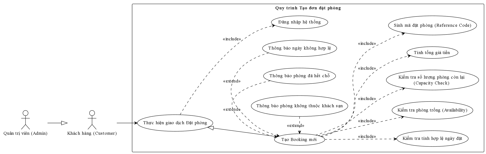
> Hình 3.10: Usecase quản lý đặt phòng

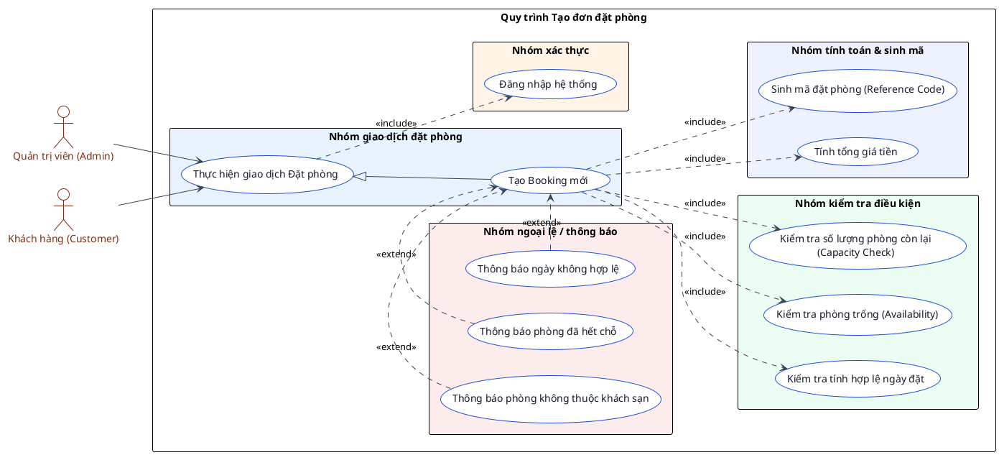
```plantuml
@startuml
!theme plain
skinparam shadowing false
skinparam packageStyle rectangle
skinparam defaultFontName "Times New Roman"
skinparam ArrowColor #374151
skinparam actor {
  BorderColor #7C2D12
  FontColor #7C2D12
}
skinparam usecase {
  BackgroundColor #FFFFFF
  BorderColor #1D4ED8
  FontColor #111827
}
left to right direction

actor "Quản trị viên (Admin)" as Admin
actor "Khách hàng (Customer)" as Customer

rectangle "Quy trình Tạo đơn đặt phòng" {
  package "Nhóm giao dịch đặt phòng" #E8F3FF {
    usecase "Thực hiện giao dịch Đặt phòng" as BookingTransaction
    usecase "Tạo Booking mới" as CreateBooking
  }

  package "Nhóm xác thực" #FFF4E6 {
    usecase "Đăng nhập hệ thống" as LoginSystem
  }

  package "Nhóm kiểm tra điều kiện" #ECFDF3 {
    usecase "Kiểm tra tính hợp lệ ngày đặt" as ValidateBookingDate
    usecase "Kiểm tra phòng trống (Availability)" as AvailabilityCheck
    usecase "Kiểm tra số lượng phòng còn lại\n(Capacity Check)" as CapacityCheck
  }

  package "Nhóm tính toán & sinh mã" #EEF2FF {
    usecase "Tính tổng giá tiền" as TotalPrice
    usecase "Sinh mã đặt phòng (Reference Code)" as ReferenceCode
  }

  package "Nhóm ngoại lệ / thông báo" #FDECEC {
    usecase "Thông báo ngày không hợp lệ" as InvalidDate
    usecase "Thông báo phòng đã hết chỗ" as FullRoomNotice
    usecase "Thông báo phòng không thuộc khách sạn" as RoomHotelNotice
  }
}

Customer --> BookingTransaction
Admin --> BookingTransaction

CreateBooking -up-|> BookingTransaction

BookingTransaction ..> LoginSystem : <<include>>
CreateBooking ..> ValidateBookingDate : <<include>>
CreateBooking ..> AvailabilityCheck : <<include>>
CreateBooking ..> CapacityCheck : <<include>>
CreateBooking ..> TotalPrice : <<include>>
CreateBooking ..> ReferenceCode : <<include>>

InvalidDate .> CreateBooking : <<extend>>
FullRoomNotice .> CreateBooking : <<extend>>
RoomHotelNotice .> CreateBooking : <<extend>>
@enduml
```

Đặc tả Usecase tạo booking mới

| Mục | Nội dung |
| --- | --- |
| Tên Use case | Tạo Booking mới |
| Actor | Khách hàng (Customer), Quản trị viên (Admin) |
| Mô tả | Người dùng thực hiện quy trình tạo một đơn đặt phòng mới, bao gồm việc chọn thời gian, kiểm tra phòng trống và xác nhận thanh toán để hệ thống ghi nhận giao dịch. |
| Pre-conditions | - Actor đã đăng nhập vào hệ thống. - Actor đang ở trang chi tiết phòng hoặc giao diện đặt phòng. |
| Post-conditions | Success: Đơn đặt phòng được tạo thành công, mã đặt phòng (Reference Code) được sinh ra. Fail: Hệ thống hiển thị thông báo lỗi cụ thể và không tạo đơn. |
| Luồng sự kiện chính | 1. Actor chọn ngày check-in, check-out và số lượng phòng cần đặt. 2. Actor nhấn nút "Đặt phòng". 3. Hệ thống thực hiện kiểm tra tính hợp lệ ngày đặt. 4. Hệ thống thực hiện kiểm tra phòng trống. 5. Hệ thống thực hiện kiểm tra số lượng phòng còn lại. 6. Hệ thống thực hiện tính tổng giá tiền. 7. Hệ thống thực hiện sinh mã đặt phòng. 8. Hệ thống lưu thông tin đơn hàng và thông báo đặt phòng thành công. |
| Luồng sự kiện phụ | - Nếu ngày check-in/check-out sai quy tắc: Hệ thống thực hiện thông báo ngày không hợp lệ. - Nếu phòng không còn trống trong khoảng thời gian chọn: Hệ thống thực hiện thông báo phòng đã hết chỗ. - Nếu có lỗi liên quan đến dữ liệu khách sạn: Hệ thống thực hiện thông báo phòng không thuộc khách sạn. |
| <Include Use Case> Quy trình Nghiệp vụ | - Kiểm tra tính hợp lệ ngày đặt: Hệ thống xác nhận ngày check-in phải trước ngày check-out và lớn hơn hoặc bằng ngày hiện tại. - Kiểm tra phòng trống: Hệ thống truy vấn cơ sở dữ liệu để đảm bảo phòng chưa được đặt trong khoảng thời gian khách chọn. - Kiểm tra số lượng phòng: Hệ thống xác minh sức chứa (Capacity) còn lại của loại phòng đó. - Tính tổng giá tiền: Hệ thống tự động tính toán chi phí dựa trên đơn giá phòng và số ngày lưu trú. - Sinh mã đặt phòng: Hệ thống tạo ra một mã tham chiếu duy nhất (Reference Code) để định danh cho đơn đặt phòng này. |
| <Extend Use Case> Các trường hợp ngoại lệ | Thông báo ngày không hợp lệ: - Điều kiện: Khi ngày nhập vào vi phạm logic nghiệp vụ. - Hành động: Hệ thống hiển thị lỗi "Ngày đặt không hợp lệ" và yêu cầu chọn lại. Thông báo phòng đã hết chỗ: - Điều kiện: Khi kết quả kiểm tra phòng trống trả về False. - Hành động: Hệ thống báo lỗi "Phòng đã hết chỗ trong khoảng thời gian này". Thông báo phòng không thuộc khách sạn: - Điều kiện: Khi dữ liệu phòng và khách sạn không khớp (lỗi dữ liệu hệ thống). - Hành động: Hệ thống hiển thị thông báo lỗi kỹ thuật tương ứng. |

#### 3.2.1.11 Usecase tra cứu và hủy đơn đặt phòng

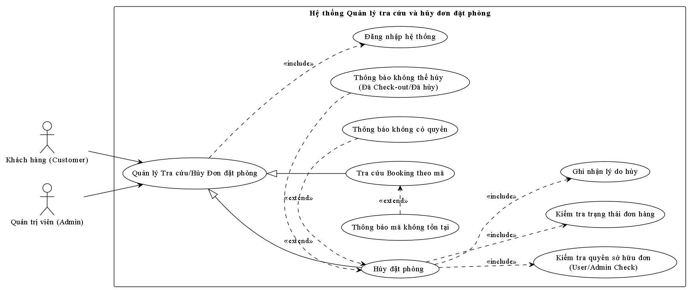
> Hình 3.11: Usecase tra cứu và hủy đơn đặt phòng

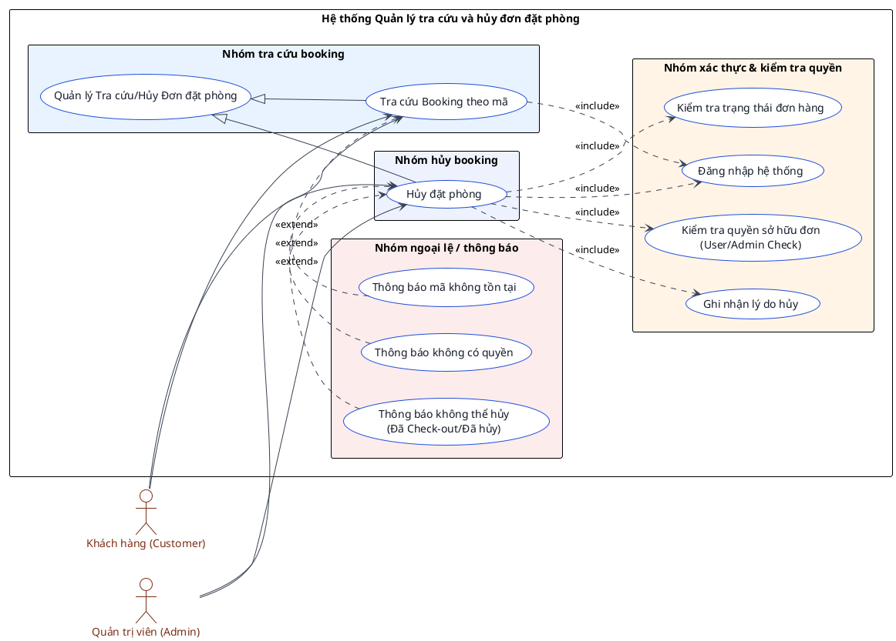
```plantuml
@startuml
!theme plain
skinparam shadowing false
skinparam packageStyle rectangle
skinparam defaultFontName "Times New Roman"
skinparam ArrowColor #374151
skinparam actor {
  BorderColor #7C2D12
  FontColor #7C2D12
}
skinparam usecase {
  BackgroundColor #FFFFFF
  BorderColor #1D4ED8
  FontColor #111827
}
left to right direction

actor "Khách hàng (Customer)" as Customer
actor "Quản trị viên (Admin)" as Admin

rectangle "Hệ thống Quản lý tra cứu và hủy đơn đặt phòng" {
  package "Nhóm tra cứu booking" #E8F3FF {
    usecase "Quản lý Tra cứu/Hủy Đơn đặt phòng" as SearchCancelManage
    usecase "Tra cứu Booking theo mã" as SearchBookingCode
  }

  package "Nhóm hủy booking" #EEF2FF {
    usecase "Hủy đặt phòng" as CancelBooking
  }

  package "Nhóm xác thực & kiểm tra quyền" #FFF4E6 {
    usecase "Đăng nhập hệ thống" as LoginSystem
    usecase "Kiểm tra quyền sở hữu đơn\n(User/Admin Check)" as CheckOrderOwner
    usecase "Kiểm tra trạng thái đơn hàng" as CheckOrderStatus
    usecase "Ghi nhận lý do hủy" as SaveCancelReason
  }

  package "Nhóm ngoại lệ / thông báo" #FDECEC {
    usecase "Thông báo mã không tồn tại" as CodeNotFound
    usecase "Thông báo không thể hủy\n(Đã Check-out/Đã hủy)" as CannotCancel
    usecase "Thông báo không có quyền" as PermissionError
  }
}

Customer --> SearchBookingCode
Customer --> CancelBooking
Admin --> SearchBookingCode
Admin --> CancelBooking

SearchBookingCode -up-|> SearchCancelManage
CancelBooking -up-|> SearchCancelManage

SearchBookingCode ..> LoginSystem : <<include>>
CancelBooking ..> LoginSystem : <<include>>
CancelBooking ..> CheckOrderOwner : <<include>>
CancelBooking ..> CheckOrderStatus : <<include>>
CancelBooking ..> SaveCancelReason : <<include>>

CannotCancel .> CancelBooking : <<extend>>
PermissionError .> CancelBooking : <<extend>>
CodeNotFound .> SearchBookingCode : <<extend>>
@enduml
```

Đặc tả Usecase tra cứu Booking theo mã

| Mục | Nội dung |
| --- | --- |
| Tên Use case | Tra cứu Booking theo mã |
| Actor | Khách hàng (Customer), Quản trị viên (Admin) |
| Mô tả | Người dùng tìm kiếm và xem chi tiết thông tin của một đơn đặt phòng cụ thể dựa trên mã đặt phòng (Reference Code) đã được cấp trước đó. |
| Pre-conditions | - Actor đã đăng nhập vào hệ thống. - Actor có mã đặt phòng cần tra cứu. |
| Post-conditions | Success: Hệ thống hiển thị đầy đủ thông tin chi tiết của đơn đặt phòng. Fail: Hệ thống thông báo không tìm thấy đơn hàng. |
| Luồng sự kiện chính | 1. Actor truy cập trang tra cứu. 2. Actor nhập mã đặt phòng (Reference Code). 3. Actor nhấn nút "Tìm kiếm". 4. Hệ thống thực hiện truy vấn đơn hàng trong cơ sở dữ liệu. 5. Nếu mã hợp lệ, hệ thống hiển thị thông tin chi tiết của Booking. 6. Hệ thống thực hiện kiểm tra quyền truy cập (ẩn danh tính nếu không phải chủ sở hữu - tùy nghiệp vụ). |
| Luồng sự kiện phụ | - Nếu mã đặt phòng không tồn tại trong hệ thống: Hệ thống thực hiện thông báo mã không tồn tại. |
| <Include Use Case> Quy trình Nghiệp vụ | - Đăng nhập: (Kế thừa từ Parent) Đảm bảo người dùng đã xác thực danh tính trước khi thực hiện tra cứu. |
| <Extend Use Case> Thông báo mã không tồn tại | Điều kiện: Khi kết quả truy vấn cơ sở dữ liệu trả về rỗng. Hành động: - Hệ thống hiển thị thông báo: "Mã đặt phòng không tồn tại". - Hệ thống yêu cầu người dùng kiểm tra và nhập lại. |

Đặc tả Usecase hủy đặt phòng

| Mục | Nội dung |
| --- | --- |
| Tên Use case | Hủy đặt phòng (Cancel Booking) |
| Actor | Khách hàng (Customer), Quản trị viên (Admin) |
| Mô tả | Người dùng thực hiện hủy một đơn đặt phòng đã đặt. Hệ thống cần kiểm tra các điều kiện về quyền hạn và trạng thái đơn hàng trước khi cho phép hủy. |
| Pre-conditions | - Actor đã đăng nhập. - Đơn đặt phòng đã được tìm thấy và đang hiển thị chi tiết. - Đơn hàng chưa Check-out hoặc chưa bị hủy trước đó. |
| Post-conditions | Success: Trạng thái đơn hàng chuyển sang "Cancelled", lý do hủy được ghi nhận. Fail: Hệ thống báo lỗi và giữ nguyên trạng thái đơn hàng. |
| Luồng sự kiện chính | 1. Actor nhấn nút "Hủy đặt phòng" trên giao diện chi tiết đơn hàng. 2. Actor nhập lý do hủy (tùy chọn hoặc bắt buộc). 3. Actor xác nhận hành động hủy. 4. Hệ thống thực hiện kiểm tra quyền sở hữu đơn. 5. Hệ thống thực hiện kiểm tra trạng thái đơn hàng. 6. Nếu hợp lệ, hệ thống thực hiện ghi nhận lý do hủy. 7. Hệ thống cập nhật trạng thái đơn hàng thành "Đã hủy" và thông báo thành công. |
| Luồng sự kiện phụ | - Nếu đơn hàng đã hoàn thành hoặc đã hủy trước đó: Hệ thống thực hiện thông báo không thể hủy. - Nếu Actor cố tình hủy đơn hàng không phải của mình (và không phải Admin): Hệ thống thực hiện thông báo không có quyền. |
| <Include Use Case> Quy trình Kiểm tra & Xử lý | - Kiểm tra quyền sở hữu: Hệ thống đối chiếu ID người dùng hiện tại với ID người đặt của đơn hàng (hoặc check quyền Admin). - Kiểm tra trạng thái: Hệ thống đảm bảo đơn hàng đang ở trạng thái cho phép hủy (ví dụ: "Confirmed" hoặc "Pending"). - Ghi nhận lý do: Hệ thống lưu trữ lý do hủy vào lịch sử đơn hàng để phục vụ thống kê hoặc CSKH. |
| <Extend Use Case> Thông báo không thể hủy | Điều kiện: Khi đơn hàng đang ở trạng thái Checked-out hoặc Cancelled. Hành động: - Hệ thống hiển thị lỗi: "Đơn hàng này không thể hủy vì đã hoàn tất hoặc đã bị hủy". |
| <Extend Use Case> Thông báo không có quyền | Điều kiện: Khi quy trình kiểm tra quyền sở hữu thất bại. Hành động: - Hệ thống hiển thị cảnh báo bảo mật: "Bạn không có quyền thao tác trên đơn hàng này". |

#### 3.2.1.12 Usecase quản lý tiện ích

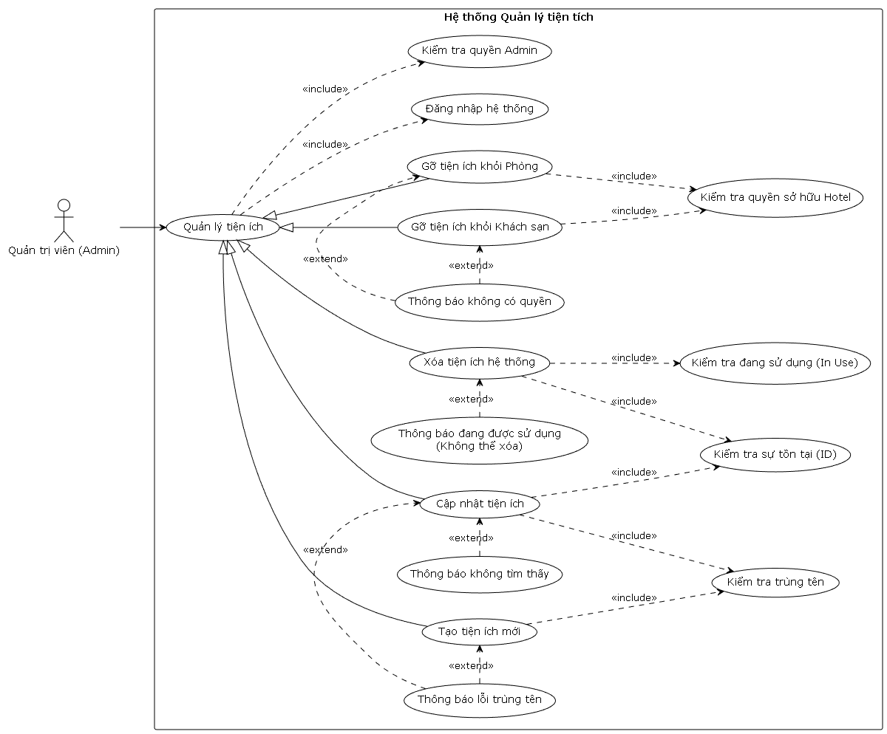
> Hình 3.12: Usecase quản lý tiện ích

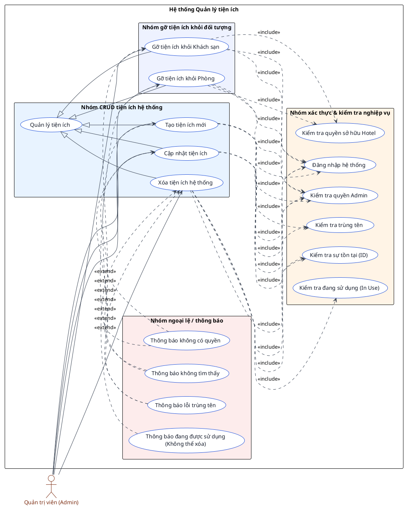
```plantuml
@startuml
!theme plain
skinparam shadowing false
skinparam packageStyle rectangle
skinparam defaultFontName "Times New Roman"
skinparam ArrowColor #374151
skinparam actor {
  BorderColor #7C2D12
  FontColor #7C2D12
}
skinparam usecase {
  BackgroundColor #FFFFFF
  BorderColor #1D4ED8
  FontColor #111827
}
left to right direction

actor "Quản trị viên (Admin)" as Admin

rectangle "Hệ thống Quản lý tiện ích" {
  package "Nhóm CRUD tiện ích hệ thống" #E8F3FF {
    usecase "Quản lý tiện ích" as AmenityManage
    usecase "Tạo tiện ích mới" as CreateAmenity
    usecase "Cập nhật tiện ích" as UpdateAmenity
    usecase "Xóa tiện ích hệ thống" as DeleteAmenity
  }

  package "Nhóm gỡ tiện ích khỏi đối tượng" #EEF2FF {
    usecase "Gỡ tiện ích khỏi Khách sạn" as RemoveFromHotel
    usecase "Gỡ tiện ích khỏi Phòng" as RemoveFromRoom
  }

  package "Nhóm xác thực & kiểm tra nghiệp vụ" #FFF4E6 {
    usecase "Đăng nhập hệ thống" as LoginSystem
    usecase "Kiểm tra quyền Admin" as CheckAdmin
    usecase "Kiểm tra quyền sở hữu Hotel" as CheckHotelOwner
    usecase "Kiểm tra sự tồn tại (ID)" as CheckExists
    usecase "Kiểm tra đang sử dụng (In Use)" as CheckInUse
    usecase "Kiểm tra trùng tên" as CheckDuplicateName
  }

  package "Nhóm ngoại lệ / thông báo" #FDECEC {
    usecase "Thông báo không có quyền" as PermissionError
    usecase "Thông báo đang được sử dụng\n(Không thể xóa)" as InUseNotice
    usecase "Thông báo không tìm thấy" as NotFound
    usecase "Thông báo lỗi trùng tên" as DuplicateNameNotice
  }
}

Admin --> CreateAmenity
Admin --> UpdateAmenity
Admin --> DeleteAmenity
Admin --> RemoveFromHotel
Admin --> RemoveFromRoom

CreateAmenity -up-|> AmenityManage
UpdateAmenity -up-|> AmenityManage
DeleteAmenity -up-|> AmenityManage
RemoveFromHotel -up-|> AmenityManage
RemoveFromRoom -up-|> AmenityManage

CreateAmenity ..> LoginSystem : <<include>>
CreateAmenity ..> CheckAdmin : <<include>>
CreateAmenity ..> CheckDuplicateName : <<include>>
UpdateAmenity ..> LoginSystem : <<include>>
UpdateAmenity ..> CheckAdmin : <<include>>
UpdateAmenity ..> CheckExists : <<include>>
UpdateAmenity ..> CheckDuplicateName : <<include>>
DeleteAmenity ..> LoginSystem : <<include>>
DeleteAmenity ..> CheckAdmin : <<include>>
DeleteAmenity ..> CheckExists : <<include>>
DeleteAmenity ..> CheckInUse : <<include>>
RemoveFromHotel ..> LoginSystem : <<include>>
RemoveFromHotel ..> CheckAdmin : <<include>>
RemoveFromHotel ..> CheckHotelOwner : <<include>>
RemoveFromRoom ..> LoginSystem : <<include>>
RemoveFromRoom ..> CheckAdmin : <<include>>
RemoveFromRoom ..> CheckHotelOwner : <<include>>

PermissionError .> RemoveFromRoom : <<extend>>
PermissionError .> RemoveFromHotel : <<extend>>
InUseNotice .> DeleteAmenity : <<extend>>
NotFound .> UpdateAmenity : <<extend>>
NotFound .> DeleteAmenity : <<extend>>
DuplicateNameNotice .> CreateAmenity : <<extend>>
DuplicateNameNotice .> UpdateAmenity : <<extend>>
@enduml
```

Đặc tả Usecase tạo tiện ích mới

| Mục | Nội dung |
| --- | --- |
| Tên Use case | Tạo tiện ích mới |
| Actor | Quản trị viên (Admin) |
| Mô tả | Admin thêm một loại tiện ích dịch vụ mới vào hệ thống danh mục chung (ví dụ: "Wifi miễn phí", "Hồ bơi", "Gym") để sau này có thể gán cho các khách sạn hoặc phòng cụ thể. |
| Pre-conditions | - Actor đã đăng nhập và có quyền Admin. - Actor đang ở giao diện quản lý danh sách tiện ích. |
| Post-conditions | Success: Tiện ích mới được tạo và lưu vào cơ sở dữ liệu. Fail: Hệ thống báo lỗi nếu tên tiện ích đã tồn tại. |
| Luồng sự kiện chính | 1. Actor nhấn nút "Thêm tiện ích mới". 2. Actor nhập thông tin tiện ích (Tên, Mô tả, Icon/Hình ảnh). 3. Actor nhấn nút "Lưu". 4. Hệ thống thực hiện kiểm tra quyền Admin. 5. Hệ thống thực hiện kiểm tra trùng tên. 6. Nếu hợp lệ, hệ thống lưu tiện ích mới vào cơ sở dữ liệu. 7. Hệ thống hiển thị thông báo "Thêm tiện ích thành công". |
| Luồng sự kiện phụ | - Nếu tên tiện ích nhập vào đã có trong hệ thống: Hệ thống thực hiện thông báo lỗi trùng tên. |
| <Include Use Case> Quy trình Nghiệp vụ | - Kiểm tra quyền Admin: (Kế thừa từ Parent) Hệ thống xác thực quyền hạn trước khi cho phép thực hiện hành động ghi dữ liệu. - Kiểm tra trùng tên: Hệ thống đối chiếu tên tiện ích mới với danh sách hiện có trong DB để đảm bảo tính duy nhất. |
| <Extend Use Case> Thông báo lỗi trùng tên | Điều kiện: Khi quy trình kiểm tra tên phát hiện sự trùng lặp. Hành động: - Hệ thống hiển thị cảnh báo: "Tên tiện ích này đã tồn tại trong hệ thống". - Hệ thống yêu cầu nhập tên khác. |
| <Extend Use Case>  Thông báo thiếu ảnh | Điều kiện: Khi người dùng cố gắng lưu mà chưa có URL hình ảnh hợp lệ. Hành động: - Hệ thống hiển thị lỗi: "Vui lòng tải lên ít nhất một hình ảnh cho khách sạn". |

Đặc tả Usecase cập nhật tiện ích

| Mục | Nội dung |
| --- | --- |
| Tên Use case | Cập nhật tiện ích |
| Actor | Quản trị viên (Admin) |
| Mô tả | Admin thay đổi thông tin chi tiết của một tiện ích đã có trong hệ thống (như tên, mô tả, hình ảnh) để sửa lỗi hoặc làm mới nội dung. |
| Pre-conditions | - Actor đã đăng nhập và có quyền Admin. - Tiện ích cần cập nhật phải đang tồn tại trong hệ thống. |
| Post-conditions | Success: Thông tin tiện ích được cập nhật mới vào cơ sở dữ liệu. Fail: Hệ thống giữ nguyên thông tin cũ và báo lỗi (nếu trùng tên hoặc không tìm thấy). |
| Luồng sự kiện chính | 1. Actor chọn chức năng "Chỉnh sửa" tại dòng tiện ích cần cập nhật. 2. Actor thay đổi các thông tin mong muốn (Tên, hình ảnh...). 3. Actor nhấn nút "Lưu thay đổi". 4. Hệ thống thực hiện kiểm tra sự tồn tại (ID). 5. Hệ thống thực hiện kiểm tra trùng tên. 6. Nếu hợp lệ, hệ thống lưu thông tin mới. 7. Hệ thống hiển thị thông báo "Cập nhật tiện ích thành công". |
| Luồng sự kiện phụ | - Nếu ID tiện ích không còn tồn tại trong DB (do đã bị xóa): Hệ thống thực hiện thông báo không tìm thấy. - Nếu tên mới bị trùng với một tiện ích khác: Hệ thống thực hiện thông báo lỗi trùng tên. |
| <Include Use Case> Quy trình Nghiệp vụ | - Kiểm tra sự tồn tại (ID): Hệ thống truy vấn DB để đảm bảo tiện ích đang thao tác vẫn còn hợp lệ. - Kiểm tra trùng tên: Hệ thống so sánh tên mới nhập vào với các tiện ích khác (trừ chính nó) để tránh trùng lặp. |
| <Extend Use Case> Thông báo không tìm thấy | Điều kiện: Khi quy trình kiểm tra sự tồn tại trả về kết quả rỗng. Hành động: - Hệ thống hiển thị lỗi: "Tiện ích này không tồn tại hoặc đã bị xóa". - Hệ thống quay lại danh sách. |
| <Extend Use Case> Thông báo lỗi trùng tên | Điều kiện: Khi quy trình kiểm tra tên phát hiện sự trùng lặp. Hành động: - Hệ thống hiển thị cảnh báo: "Tên tiện ích đã được sử dụng". |

Đặc tả Usecase xóa tiện ích hệ thống

| Mục | Nội dung |
| --- | --- |
| Tên Use case | Xóa tiện ích hệ thống |
| Actor | Quản trị viên (Admin) |
| Mô tả | Admin thực hiện xóa một loại tiện ích khỏi danh mục chung của hệ thống. Để bảo vệ dữ liệu, hệ thống chỉ cho phép xóa nếu tiện ích này chưa được gán cho bất kỳ khách sạn hay phòng nào. |
| Pre-conditions | - Actor đã đăng nhập và có quyền Admin. - Tiện ích cần xóa đang tồn tại. |
| Post-conditions | Success: Tiện ích bị xóa vĩnh viễn khỏi danh mục hệ thống. Fail: Hệ thống giữ nguyên dữ liệu và báo lỗi (nếu đang được sử dụng). |
| Luồng sự kiện chính | 1. Actor nhấn nút "Xóa" tại dòng tiện ích mong muốn. 2. Hệ thống hiển thị hộp thoại xác nhận xóa. 3. Actor nhấn nút "Đồng ý". 4. Hệ thống thực hiện kiểm tra sự tồn tại (ID). 5. Hệ thống thực hiện kiểm tra đang sử dụng (In Use). 6. Nếu không có ai đang sử dụng, hệ thống xóa tiện ích khỏi DB. 7. Hệ thống hiển thị thông báo "Đã xóa tiện ích thành công". |
| Luồng sự kiện phụ | - Nếu tiện ích đang được liên kết với ít nhất một khách sạn hoặc phòng: Hệ thống thực hiện thông báo đang được sử dụng. - Nếu tiện ích không tìm thấy: Hệ thống thực hiện thông báo không tìm thấy. |
| <Include Use Case> Quy trình Nghiệp vụ | - Kiểm tra sự tồn tại (ID): Xác minh ID tiện ích hợp lệ trong DB. - Kiểm tra đang sử dụng (In Use): Hệ thống quét các bảng liên kết (HotelAmenities, RoomAmenities) để đếm số lượng tham chiếu đến tiện ích này. Nếu count > 0, tiện ích được coi là "Đang sử dụng". |
| <Extend Use Case> Thông báo đang được sử dụng | Điều kiện: Khi quy trình kiểm tra "In Use" phát hiện tiện ích đang có ràng buộc dữ liệu. Hành động: - Hệ thống hiển thị cảnh báo: "Không thể xóa tiện ích này vì đang được sử dụng bởi các khách sạn/phòng". - Hệ thống hủy bỏ lệnh xóa. |
| <Extend Use Case> Thông báo lỗi trùng tên | Điều kiện: Khi quy trình kiểm tra tên phát hiện sự trùng lặp. Hành động: - Hệ thống hiển thị cảnh báo: "Tên tiện ích đã được sử dụng". |

Đặc tả Usecase gỡ tiện ích khỏi Khách sạn

| Mục | Nội dung |
| --- | --- |
| Tên Use case | Gỡ tiện ích khỏi Khách sạn |
| Actor | Quản trị viên (Admin) |
| Mô tả | Admin loại bỏ một tiện ích cụ thể khỏi danh sách tiện ích của một khách sạn. Hành động này chỉ ngắt liên kết giữa khách sạn và tiện ích, không xóa tiện ích khỏi hệ thống. |
| Pre-conditions | - Actor đã đăng nhập và có quyền Admin. - Tiện ích đang được gán cho khách sạn đó. |
| Post-conditions | Success: Liên kết giữa tiện ích và khách sạn bị xóa. Fail: Hệ thống giữ nguyên liên kết và báo lỗi (nếu không có quyền). |
| Luồng sự kiện chính | 1. Actor truy cập vào trang quản lý tiện ích của một khách sạn cụ thể. 2. Actor nhấn nút "Gỡ bỏ" tại dòng tiện ích muốn xóa. 3. Hệ thống hiển thị hộp thoại xác nhận. 4. Actor nhấn nút "Đồng ý". 5. Hệ thống thực hiện kiểm tra quyền sở hữu Hotel. 6. Nếu hợp lệ, hệ thống xóa liên kết tiện ích khỏi khách sạn. 7. Hệ thống hiển thị thông báo "Đã gỡ tiện ích khỏi khách sạn thành công". |
| Luồng sự kiện phụ | - Nếu Actor không phải là chủ sở hữu của khách sạn này: Hệ thống thực hiện thông báo không có quyền. |
| <Include Use Case> Quy trình Nghiệp vụ | - Kiểm tra quyền sở hữu Hotel: Hệ thống xác minh Admin hiện tại có quyền quản lý đối với khách sạn đang thao tác hay không (Owner Check). |
| <Extend Use Case> Thông báo không có quyền | Điều kiện: Khi quy trình kiểm tra quyền sở hữu trả về kết quả False. Hành động: - Hệ thống hiển thị cảnh báo: "Bạn không có quyền thay đổi tiện ích của khách sạn này". - Hệ thống hủy bỏ thao tác. |
| <Extend Use Case> Thông báo lỗi trùng tên | Điều kiện: Khi quy trình kiểm tra tên phát hiện sự trùng lặp. Hành động: - Hệ thống hiển thị cảnh báo: "Tên tiện ích đã được sử dụng". |

Đặc tả Usecase gỡ tiện ích khỏi Phòng

| Mục | Nội dung |
| --- | --- |
| Tên Use case | Gỡ tiện ích khỏi Phòng |
| Actor | Quản trị viên (Admin) |
| Mô tả | Admin loại bỏ một tiện ích cụ thể khỏi danh sách tiện ích của một phòng nghỉ. Hành động này chỉ ngắt liên kết giữa phòng và tiện ích, không xóa tiện ích khỏi hệ thống. |
| Pre-conditions | - Actor đã đăng nhập và có quyền Admin. - Tiện ích đang được gán cho phòng đó. |
| Post-conditions | Success: Liên kết giữa tiện ích và phòng bị xóa khỏi cơ sở dữ liệu. Fail: Hệ thống giữ nguyên liên kết và báo lỗi (nếu không có quyền). |
| Luồng sự kiện chính | 1. Actor truy cập vào trang cấu hình tiện ích của một phòng cụ thể. 2. Actor nhấn nút "Gỡ bỏ" tại dòng tiện ích muốn xóa. 3. Hệ thống hiển thị hộp thoại xác nhận. 4. Actor nhấn nút "Đồng ý". 5. Hệ thống thực hiện kiểm tra quyền sở hữu Phòng. 6. Nếu hợp lệ, hệ thống xóa liên kết tiện ích khỏi phòng. 7. Hệ thống hiển thị thông báo "Đã gỡ tiện ích khỏi phòng thành công". |
| Luồng sự kiện phụ | - Nếu Actor không phải là chủ sở hữu của khách sạn chứa phòng này: Hệ thống thực hiện thông báo không có quyền. |
| <Include Use Case> Quy trình Nghiệp vụ | - Kiểm tra quyền sở hữu Phòng: Hệ thống truy xuất khách sạn chứa phòng này, sau đó xác minh Admin hiện tại có phải là chủ sở hữu (Owner) của khách sạn đó hay không. |
| <Extend Use Case> Thông báo không có quyền | Điều kiện: Khi quy trình kiểm tra quyền sở hữu trả về kết quả False. Hành động: - Hệ thống hiển thị cảnh báo: "Bạn không có quyền thay đổi tiện ích của phòng này". - Hệ thống hủy bỏ thao tác. |
| <Extend Use Case> Thông báo lỗi trùng tên | Điều kiện: Khi quy trình kiểm tra tên phát hiện sự trùng lặp. Hành động: - Hệ thống hiển thị cảnh báo: "Tên tiện ích đã được sử dụng". |

### 3.2.2 Sơ đồ tuần tự

- Sơ đồ tuần tự đăng nhập

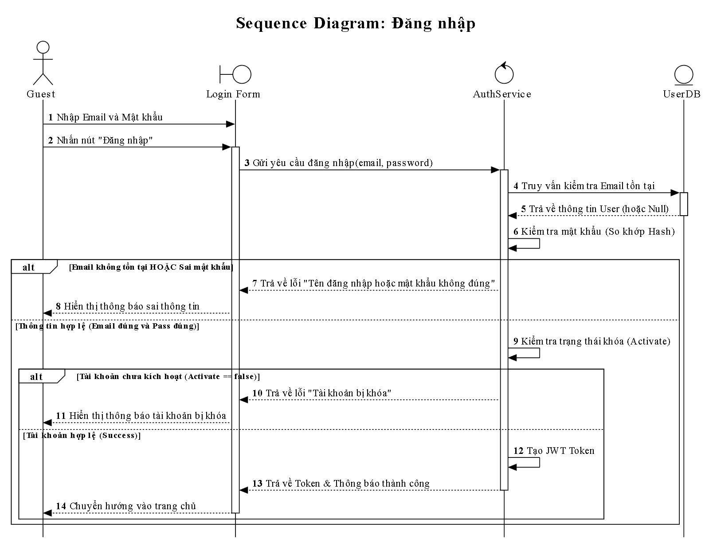
> Hình 3.13: Sơ đồ tuần tự đăng nhập

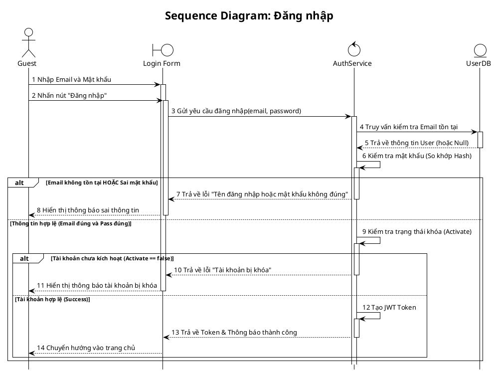
```plantuml
@startuml
!theme plain
skinparam monochrome true
skinparam shadowing false
hide footbox
autoactivate on
title Sequence Diagram: Đăng nhập

actor Guest
boundary "Login Form" as LoginForm
control AuthService
entity UserDB

Guest -> LoginForm : 1 Nhập Email và Mật khẩu
Guest -> LoginForm : 2 Nhấn nút "Đăng nhập"
LoginForm -> AuthService : 3 Gửi yêu cầu đăng nhập(email, password)
AuthService -> UserDB : 4 Truy vấn kiểm tra Email tồn tại
UserDB --> AuthService : 5 Trả về thông tin User (hoặc Null)
AuthService -> AuthService : 6 Kiểm tra mật khẩu (So khớp Hash)

alt Email không tồn tại HOẶC Sai mật khẩu
    AuthService --> LoginForm : 7 Trả về lỗi "Tên đăng nhập hoặc mật khẩu không đúng"
    LoginForm --> Guest : 8 Hiển thị thông báo sai thông tin
else Thông tin hợp lệ (Email đúng và Pass đúng)
    AuthService -> AuthService : 9 Kiểm tra trạng thái khóa (Activate)
    alt Tài khoản chưa kích hoạt (Activate == false)
        AuthService --> LoginForm : 10 Trả về lỗi "Tài khoản bị khóa"
        LoginForm --> Guest : 11 Hiển thị thông báo tài khoản bị khóa
    else Tài khoản hợp lệ (Success)
        AuthService -> AuthService : 12 Tạo JWT Token
        AuthService --> LoginForm : 13 Trả về Token & Thông báo thành công
        LoginForm --> Guest : 14 Chuyển hướng vào trang chủ
    end
end
@enduml
```

- Sơ đồ tuần tự đăng ký

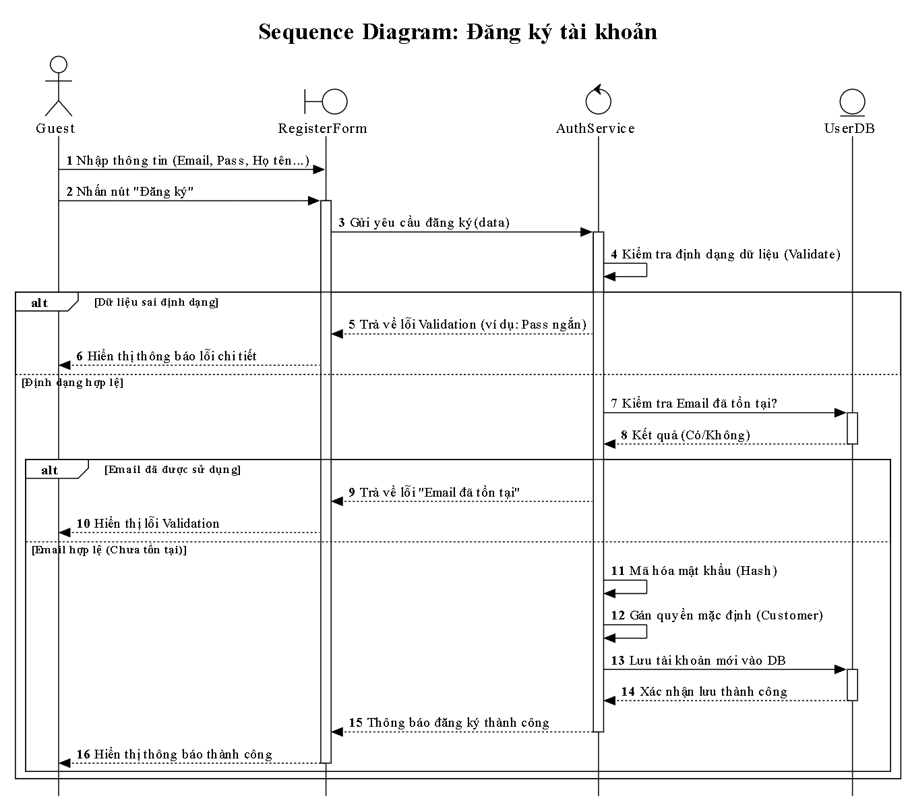
> Hình 3.14: Sơ đồ tuần tự đăng ký

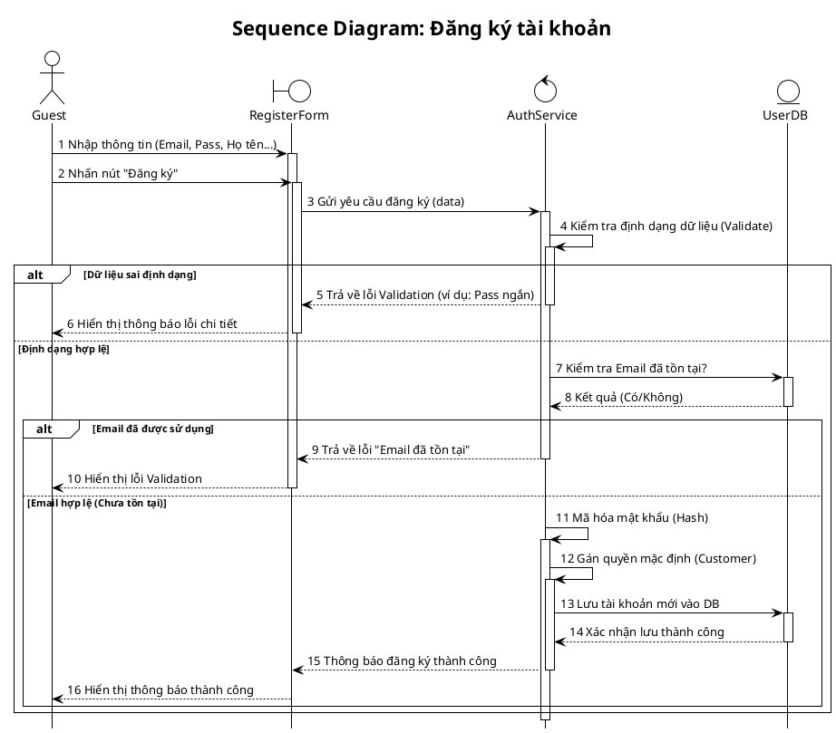
```plantuml
@startuml
!theme plain
skinparam monochrome true
skinparam shadowing false
hide footbox
autoactivate on
title Sequence Diagram: Đăng ký tài khoản

actor Guest
boundary RegisterForm
control AuthService
entity UserDB

Guest -> RegisterForm : 1 Nhập thông tin (Email, Pass, Họ tên...)
Guest -> RegisterForm : 2 Nhấn nút "Đăng ký"
RegisterForm -> AuthService : 3 Gửi yêu cầu đăng ký (data)
AuthService -> AuthService : 4 Kiểm tra định dạng dữ liệu (Validate)

alt Dữ liệu sai định dạng
    AuthService --> RegisterForm : 5 Trả về lỗi Validation (ví dụ: Pass ngắn)
    RegisterForm --> Guest : 6 Hiển thị thông báo lỗi chi tiết
else Định dạng hợp lệ
    AuthService -> UserDB : 7 Kiểm tra Email đã tồn tại?
    UserDB --> AuthService : 8 Kết quả (Có/Không)
    alt Email đã được sử dụng
        AuthService --> RegisterForm : 9 Trả về lỗi "Email đã tồn tại"
        RegisterForm --> Guest : 10 Hiển thị lỗi Validation
    else Email hợp lệ (Chưa tồn tại)
        AuthService -> AuthService : 11 Mã hóa mật khẩu (Hash)
        AuthService -> AuthService : 12 Gán quyền mặc định (Customer)
        AuthService -> UserDB : 13 Lưu tài khoản mới vào DB
        UserDB --> AuthService : 14 Xác nhận lưu thành công
        AuthService --> RegisterForm : 15 Thông báo đăng ký thành công
        RegisterForm --> Guest : 16 Hiển thị thông báo thành công
    end
end
@enduml
```

- Sơ đồ tuần tự cập nhật thông tin cá nhân

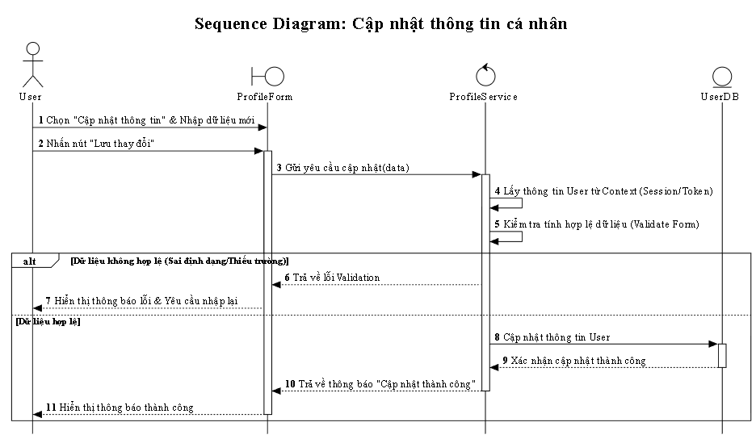
> Hình 3.15: Sơ đồ tuần tự cập nhật thông tin cá nhân

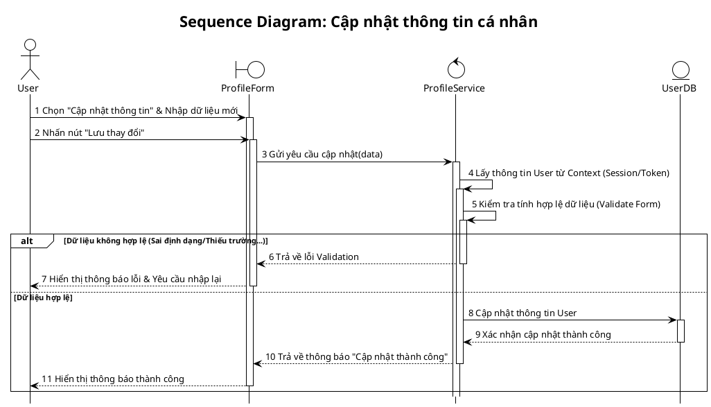
```plantuml
@startuml
!theme plain
skinparam monochrome true
skinparam shadowing false
hide footbox
autoactivate on
title Sequence Diagram: Cập nhật thông tin cá nhân

actor User
boundary ProfileForm
control ProfileService
entity UserDB

User -> ProfileForm : 1 Chọn "Cập nhật thông tin" & Nhập dữ liệu mới
User -> ProfileForm : 2 Nhấn nút "Lưu thay đổi"
ProfileForm -> ProfileService : 3 Gửi yêu cầu cập nhật(data)
ProfileService -> ProfileService : 4 Lấy thông tin User từ Context (Session/Token)
ProfileService -> ProfileService : 5 Kiểm tra tính hợp lệ dữ liệu (Validate Form)

alt Dữ liệu không hợp lệ (Sai định dạng/Thiếu trường...)
    ProfileService --> ProfileForm : 6 Trả về lỗi Validation
    ProfileForm --> User : 7 Hiển thị thông báo lỗi & Yêu cầu nhập lại
else Dữ liệu hợp lệ
    ProfileService -> UserDB : 8 Cập nhật thông tin User
    UserDB --> ProfileService : 9 Xác nhận cập nhật thành công
    ProfileService --> ProfileForm : 10 Trả về thông báo "Cập nhật thành công"
    ProfileForm --> User : 11 Hiển thị thông báo thành công
end
@enduml
```

- Sơ đồ tuần tự đổi mật khẩu

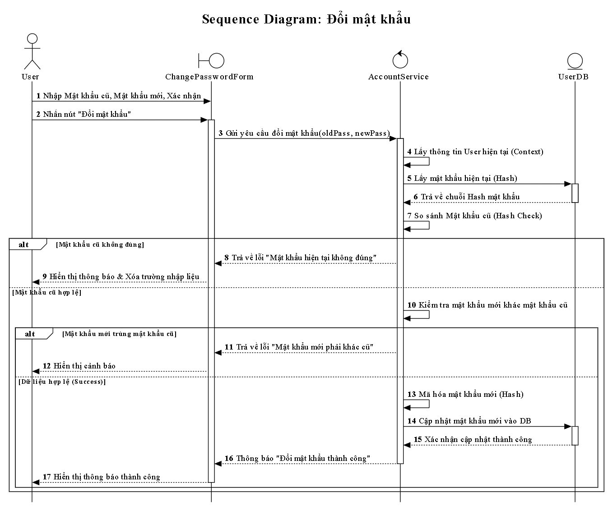
> Hình 3.16: Sơ đồ tuần tự đổi mật khẩu

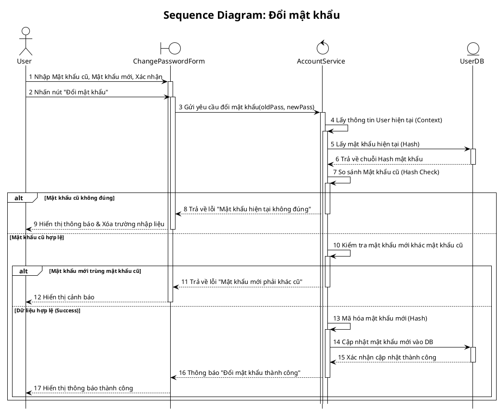
```plantuml
@startuml
!theme plain
skinparam monochrome true
skinparam shadowing false
hide footbox
autoactivate on
title Sequence Diagram: Đổi mật khẩu

actor User
boundary ChangePasswordForm
control AccountService
entity UserDB

User -> ChangePasswordForm : 1 Nhập Mật khẩu cũ, Mật khẩu mới, Xác nhận
User -> ChangePasswordForm : 2 Nhấn nút "Đổi mật khẩu"
ChangePasswordForm -> AccountService : 3 Gửi yêu cầu đổi mật khẩu(oldPass, newPass)
AccountService -> AccountService : 4 Lấy thông tin User hiện tại (Context)
AccountService -> UserDB : 5 Lấy mật khẩu hiện tại (Hash)
UserDB --> AccountService : 6 Trả về chuỗi Hash mật khẩu
AccountService -> AccountService : 7 So sánh Mật khẩu cũ (Hash Check)

alt Mật khẩu cũ không đúng
    AccountService --> ChangePasswordForm : 8 Trả về lỗi "Mật khẩu hiện tại không đúng"
    ChangePasswordForm --> User : 9 Hiển thị thông báo & Xóa trường nhập liệu
else Mật khẩu cũ hợp lệ
    AccountService -> AccountService : 10 Kiểm tra mật khẩu mới khác mật khẩu cũ
    alt Mật khẩu mới trùng mật khẩu cũ
        AccountService --> ChangePasswordForm : 11 Trả về lỗi "Mật khẩu mới phải khác cũ"
        ChangePasswordForm --> User : 12 Hiển thị cảnh báo
    else Dữ liệu hợp lệ (Success)
        AccountService -> AccountService : 13 Mã hóa mật khẩu mới (Hash)
        AccountService -> UserDB : 14 Cập nhật mật khẩu mới vào DB
        UserDB --> AccountService : 15 Xác nhận cập nhật thành công
        AccountService --> ChangePasswordForm : 16 Thông báo "Đổi mật khẩu thành công"
        ChangePasswordForm --> User : 17 Hiển thị thông báo thành công
    end
end
@enduml
```

- Sơ đồ tuần tự xem thông tin profile

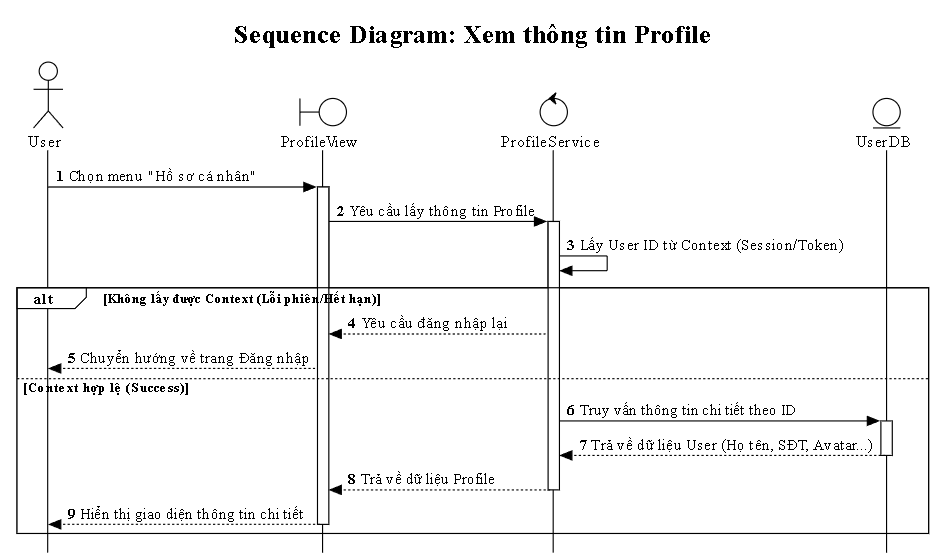
> Hình 3.17: Sơ đồ tuần tự xem thông tin profile

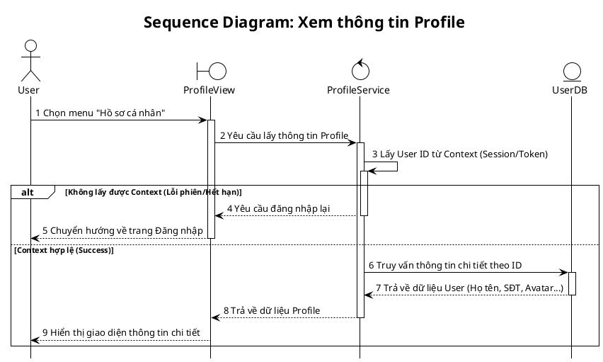
```plantuml
@startuml
!theme plain
skinparam monochrome true
skinparam shadowing false
hide footbox
autoactivate on
title Sequence Diagram: Xem thông tin Profile

actor User
boundary ProfileView
control ProfileService
entity UserDB

User -> ProfileView : 1 Chọn menu "Hồ sơ cá nhân"
ProfileView -> ProfileService : 2 Yêu cầu lấy thông tin Profile
ProfileService -> ProfileService : 3 Lấy User ID từ Context (Session/Token)

alt Không lấy được Context (Lỗi phiên/Hết hạn)
    ProfileService --> ProfileView : 4 Yêu cầu đăng nhập lại
    ProfileView --> User : 5 Chuyển hướng về trang Đăng nhập
else Context hợp lệ (Success)
    ProfileService -> UserDB : 6 Truy vấn thông tin chi tiết theo ID
    UserDB --> ProfileService : 7 Trả về dữ liệu User (Họ tên, SĐT, Avatar...)
    ProfileService --> ProfileView : 8 Trả về dữ liệu Profile
    ProfileView --> User : 9 Hiển thị giao diện thông tin chi tiết
end
@enduml
```

- Sơ đồ tuần tự xóa tài khoản cá nhân

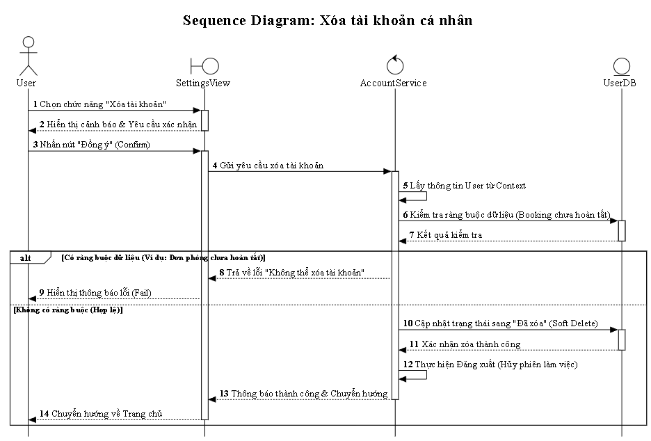
> Hình 3.18: Sơ đồ tuần tự xóa tài khoản cá nhân

```plantuml
@startuml
!theme plain
skinparam monochrome true
skinparam shadowing false
hide footbox
autoactivate on
title Sequence Diagram: Xóa tài khoản cá nhân

actor User
boundary SettingsView
control AccountService
entity UserDB

User -> SettingsView : 1 Chọn chức năng "Xóa tài khoản"
SettingsView --> User : 2 Hiển thị cảnh báo & Yêu cầu xác nhận
User -> SettingsView : 3 Nhấn nút "Đồng ý" (Confirm)
SettingsView -> AccountService : 4 Gửi yêu cầu xóa tài khoản
AccountService -> AccountService : 5 Lấy thông tin User từ Context
AccountService -> UserDB : 6 Kiểm tra ràng buộc dữ liệu (Booking chưa hoàn tất)
UserDB --> AccountService : 7 Kết quả kiểm tra

alt Có ràng buộc dữ liệu (Ví dụ: Đơn phòng chưa hoàn tất)
    AccountService --> SettingsView : 8 Trả về lỗi "Không thể xóa tài khoản"
    SettingsView --> User : 9 Hiển thị thông báo lỗi (Fail)
else Không có ràng buộc (Hợp lệ)
    AccountService -> UserDB : 10 Cập nhật trạng thái sang "Đã xóa" (Soft Delete)
    UserDB --> AccountService : 11 Xác nhận xóa thành công
    AccountService -> AccountService : 12 Thực hiện Đăng xuất (Hủy phiên làm việc)
    AccountService --> SettingsView : 13 Thông báo thành công & Chuyển hướng
    SettingsView --> User : 14 Chuyển hướng về Trang chủ
end
@enduml
```

- Sơ đồ tuần tự xem lịch sử đặt phòng

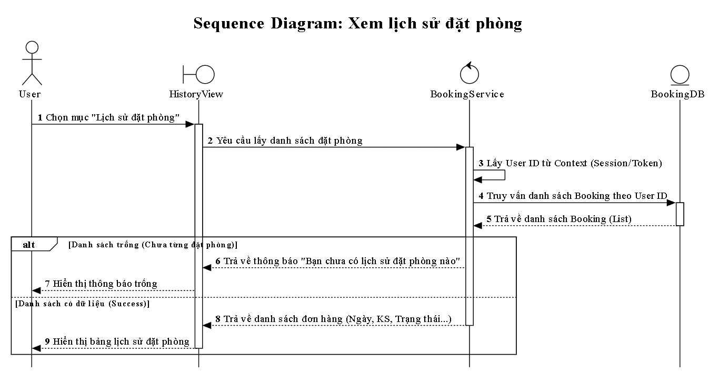
> Hình 3.19: Sơ đồ tuần tự xem lịch sử đặt phòng

```plantuml
@startuml
!theme plain
skinparam monochrome true
skinparam shadowing false
hide footbox
autoactivate on
title Sequence Diagram: Xem lịch sử đặt phòng

actor User
boundary HistoryView
control BookingService
entity BookingDB

User -> HistoryView : 1 Chọn mục "Lịch sử đặt phòng"
HistoryView -> BookingService : 2 Yêu cầu lấy danh sách đặt phòng
BookingService -> BookingService : 3 Lấy User ID từ Context (Session/Token)
BookingService -> BookingDB : 4 Truy vấn danh sách Booking theo User ID
BookingDB --> BookingService : 5 Trả về danh sách Booking (List)

alt Danh sách trống (Chưa từng đặt phòng)
    BookingService --> HistoryView : 6 Trả về thông báo "Bạn chưa có lịch sử đặt phòng nào"
    HistoryView --> User : 7 Hiển thị thông báo trống
else Danh sách có dữ liệu (Success)
    BookingService --> HistoryView : 8 Trả về danh sách đơn hàng (Ngày, KS, Trạng thái...)
    HistoryView --> User : 9 Hiển thị bảng lịch sử đặt phòng
end
@enduml
```

- Sơ đồ tuần tự xem danh sách người dùng

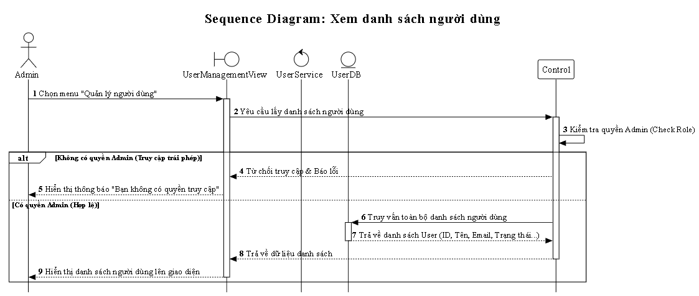
> Hình 3.20: Sơ đồ tuần tự xem danh sách người dùng

```plantuml
@startuml
!theme plain
skinparam monochrome true
skinparam shadowing false
hide footbox
autoactivate on
title Sequence Diagram: Xem danh sách người dùng

actor Admin
boundary UserManagementView
control UserService
entity UserDB
control Control

Admin -> UserManagementView : 1 Chọn menu "Quản lý người dùng"
UserManagementView -> Control : 2 Yêu cầu lấy danh sách người dùng
Control -> Control : 3 Kiểm tra quyền Admin (Check Role)

alt Không có quyền Admin (Truy cập trái phép)
    Control --> UserManagementView : 4 Từ chối truy cập & Báo lỗi
    UserManagementView --> Admin : 5 Hiển thị thông báo "Bạn không có quyền truy cập"
else Có quyền Admin (Hợp lệ)
    Control -> UserDB : 6 Truy vấn toàn bộ danh sách người dùng
    UserDB --> Control : 7 Trả về danh sách User (ID, Tên, Email, Trạng thái...)
    Control --> UserManagementView : 8 Trả về dữ liệu danh sách
    UserManagementView --> Admin : 9 Hiển thị danh sách người dùng lên giao diện
end
@enduml
```

- Sơ đồ tuần tự khóa tài khoản người dùng

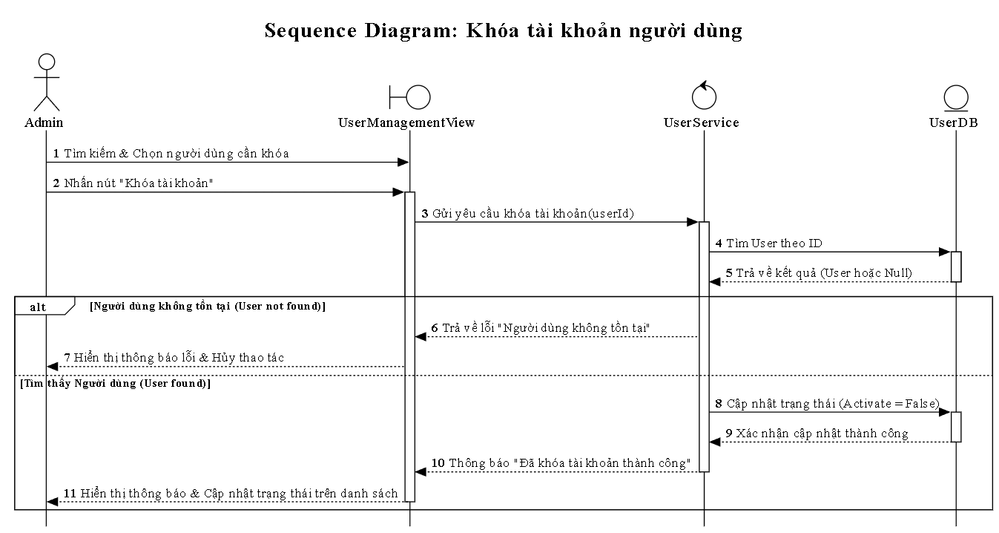
> Hình 3.21: Sơ đồ tuần tự khóa tài khoản người dùng

```plantuml
@startuml
!theme plain
skinparam monochrome true
skinparam shadowing false
hide footbox
autoactivate on
title Sequence Diagram: Khóa tài khoản người dùng

actor Admin
boundary UserManagementView
control UserService
entity UserDB

Admin -> UserManagementView : 1 Tìm kiếm & Chọn người dùng cần khóa
Admin -> UserManagementView : 2 Nhấn nút "Khóa tài khoản"
UserManagementView -> UserService : 3 Gửi yêu cầu khóa tài khoản(userId)
UserService -> UserDB : 4 Tìm User theo ID
UserDB --> UserService : 5 Trả về kết quả (User hoặc Null)

alt Người dùng không tồn tại (User not found)
    UserService --> UserManagementView : 6 Trả về lỗi "Người dùng không tồn tại"
    UserManagementView --> Admin : 7 Hiển thị thông báo lỗi & Hủy thao tác
else Tìm thấy Người dùng (User found)
    UserService -> UserDB : 8 Cập nhật trạng thái (Activate = False)
    UserDB --> UserService : 9 Xác nhận cập nhật thành công
    UserService --> UserManagementView : 10 Thông báo "Đã khóa tài khoản thành công"
    UserManagementView --> Admin : 11 Hiển thị thông báo & Cập nhật trạng thái trên danh sách
end
@enduml
```

- Sơ đồ tuần tự mở khóa tài khoản người dùng

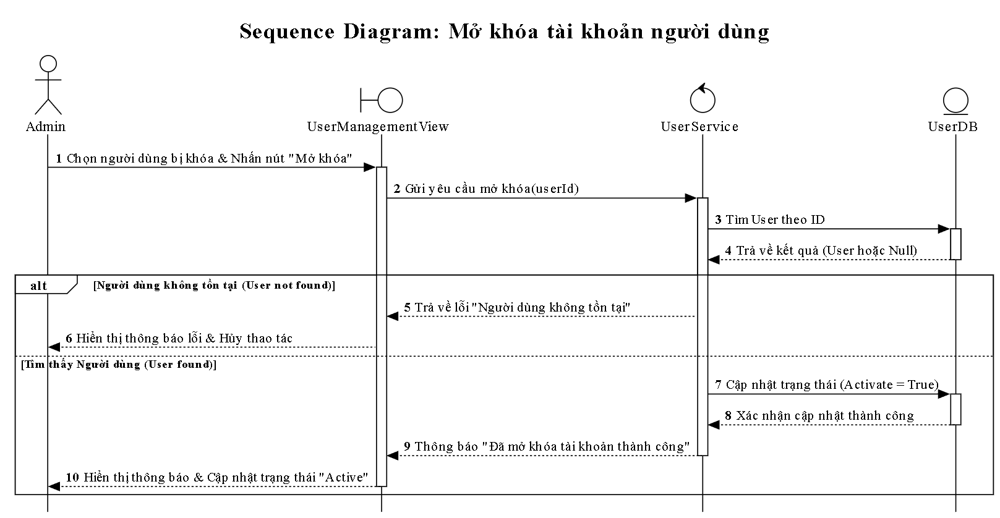
> Hình 3.22: Sơ đồ tuần tự mở khóa tài khoản người dùng

```plantuml
@startuml
!theme plain
skinparam monochrome true
skinparam shadowing false
hide footbox
autoactivate on
title Sequence Diagram: Mở khóa tài khoản người dùng

actor Admin
boundary UserManagementView
control UserService
entity UserDB

Admin -> UserManagementView : 1 Chọn người dùng bị khóa & Nhấn nút "Mở khóa"
UserManagementView -> UserService : 2 Gửi yêu cầu mở khóa(userId)
UserService -> UserDB : 3 Tìm User theo ID
UserDB --> UserService : 4 Trả về kết quả (User hoặc Null)

alt Người dùng không tồn tại (User not found)
    UserService --> UserManagementView : 5 Trả về lỗi "Người dùng không tồn tại"
    UserManagementView --> Admin : 6 Hiển thị thông báo lỗi & Hủy thao tác
else Tìm thấy Người dùng (User found)
    UserService -> UserDB : 7 Cập nhật trạng thái (Activate = True)
    UserDB --> UserService : 8 Xác nhận cập nhật thành công
    UserService --> UserManagementView : 9 Thông báo "Đã mở khóa tài khoản thành công"
    UserManagementView --> Admin : 10 Hiển thị thông báo & Cập nhật trạng thái "Active"
end
@enduml
```

- Sơ đồ tuần tự thêm phòng mới

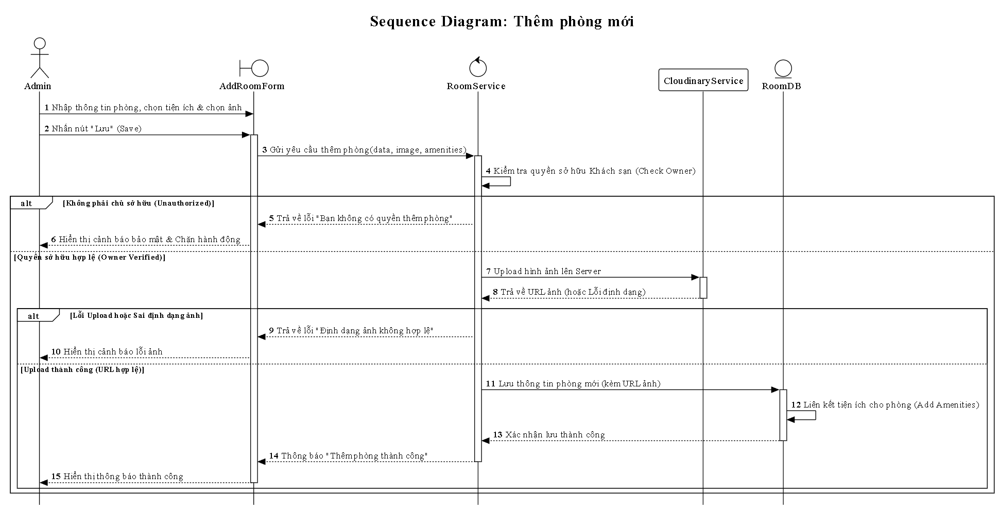
> Hình 3.23: Sơ đồ tuần tự thêm phòng mới

```plantuml
@startuml
!theme plain
skinparam monochrome true
skinparam shadowing false
hide footbox
autoactivate on
title Sequence Diagram: Thêm phòng mới

actor Admin
boundary AddRoomForm
control RoomService
participant CloudinaryService
entity RoomDB

Admin -> AddRoomForm : 1 Nhập thông tin phòng, chọn tiện ích & chọn ảnh
Admin -> AddRoomForm : 2 Nhấn nút "Lưu" (Save)
AddRoomForm -> RoomService : 3 Gửi yêu cầu thêm phòng(data, image, amenities)
RoomService -> RoomService : 4 Kiểm tra quyền sở hữu Khách sạn (Check Owner)

alt Không phải chủ sở hữu (Unauthorized)
    RoomService --> AddRoomForm : 5 Trả về lỗi "Bạn không có quyền thêm phòng"
    AddRoomForm --> Admin : 6 Hiển thị cảnh báo bảo mật & Chặn hành động
else Quyền sở hữu hợp lệ (Owner Verified)
    RoomService -> CloudinaryService : 7 Upload hình ảnh lên Server
    CloudinaryService --> RoomService : 8 Trả về URL ảnh (hoặc Lỗi định dạng)
    alt Lỗi Upload hoặc Sai định dạng ảnh
        RoomService --> AddRoomForm : 9 Trả về lỗi "Định dạng ảnh không hợp lệ"
        AddRoomForm --> Admin : 10 Hiển thị cảnh báo lỗi ảnh
    else Upload thành công (URL hợp lệ)
        RoomService -> RoomDB : 11 Lưu thông tin phòng mới (kèm URL ảnh)
        RoomDB -> RoomDB : 12 Liên kết tiện ích cho phòng (Add Amenities)
        RoomDB --> RoomService : 13 Xác nhận lưu thành công
        RoomService --> AddRoomForm : 14 Thông báo "Thêm phòng thành công"
        AddRoomForm --> Admin : 15 Hiển thị thông báo thành công
    end
end
@enduml
```

- Sơ đồ tuần tự cập nhật thông tin phòng

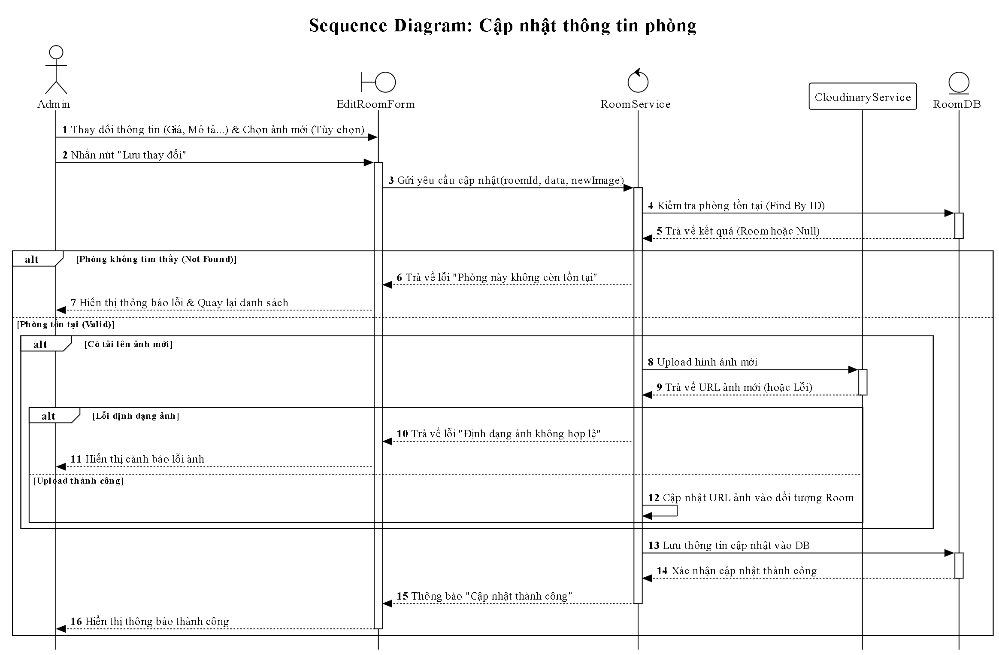
> Hình 3.24: Sơ đồ tuần tự cập nhật thông tin phòng

```plantuml
@startuml
!theme plain
skinparam monochrome true
skinparam shadowing false
hide footbox
autoactivate on
title Sequence Diagram: Cập nhật thông tin phòng

actor Admin
boundary EditRoomForm
control RoomService
participant CloudinaryService
entity RoomDB

Admin -> EditRoomForm : 1 Thay đổi thông tin (Giá, Mô tả...) & Chọn ảnh mới (Tùy chọn)
Admin -> EditRoomForm : 2 Nhấn nút "Lưu thay đổi"
EditRoomForm -> RoomService : 3 Gửi yêu cầu cập nhật(roomId, data, newImage)
RoomService -> RoomDB : 4 Kiểm tra phòng tồn tại (Find By ID)
RoomDB --> RoomService : 5 Trả về kết quả (Room hoặc Null)

alt Phòng không tìm thấy (Not Found)
    RoomService --> EditRoomForm : 6 Trả về lỗi "Phòng này không còn tồn tại"
    EditRoomForm --> Admin : 7 Hiển thị thông báo lỗi & Quay lại danh sách
else Phòng tồn tại (Valid)
    opt Có tải lên ảnh mới
        RoomService -> CloudinaryService : 8 Upload hình ảnh mới
        CloudinaryService --> RoomService : 9 Trả về URL ảnh mới (hoặc Lỗi)
        alt Lỗi định dạng ảnh
            RoomService --> EditRoomForm : 10 Trả về lỗi "Định dạng ảnh không hợp lệ"
            EditRoomForm --> Admin : 11 Hiển thị cảnh báo lỗi ảnh
        else Upload thành công
            RoomService -> RoomService : 12 Cập nhật URL ảnh vào đối tượng Room
        end
    end
    RoomService -> RoomDB : 13 Lưu thông tin cập nhật vào DB
    RoomDB --> RoomService : 14 Xác nhận cập nhật thành công
    RoomService --> EditRoomForm : 15 Thông báo "Cập nhật thành công"
    EditRoomForm --> Admin : 16 Hiển thị thông báo thành công
end
@enduml
```

- Sơ đồ tuần tự xóa phòng

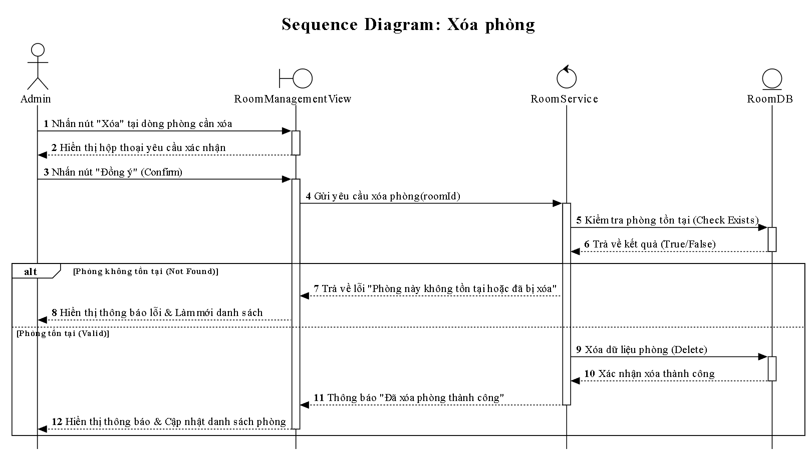
> Hình 3.25: Sơ đồ tuần tự xóa phòng

```plantuml
@startuml
!theme plain
skinparam monochrome true
skinparam shadowing false
hide footbox
autoactivate on
title Sequence Diagram: Xóa phòng

actor Admin
boundary RoomManagementView
control RoomService
entity RoomDB

Admin -> RoomManagementView : 1 Nhấn nút "Xóa" tại dòng phòng cần xóa
RoomManagementView --> Admin : 2 Hiển thị hộp thoại yêu cầu xác nhận
Admin -> RoomManagementView : 3 Nhấn nút "Đồng ý" (Confirm)
RoomManagementView -> RoomService : 4 Gửi yêu cầu xóa phòng(roomId)
RoomService -> RoomDB : 5 Kiểm tra phòng tồn tại (Check Exists)
RoomDB --> RoomService : 6 Trả về kết quả (True/False)

alt Phòng không tồn tại (Not Found)
    RoomService --> RoomManagementView : 7 Trả về lỗi "Phòng này không tồn tại hoặc đã bị xóa"
    RoomManagementView --> Admin : 8 Hiển thị thông báo lỗi & Làm mới danh sách
else Phòng tồn tại (Valid)
    RoomService -> RoomDB : 9 Xóa dữ liệu phòng (Delete)
    RoomDB --> RoomService : 10 Xác nhận xóa thành công
    RoomService --> RoomManagementView : 11 Thông báo "Đã xóa phòng thành công"
    RoomManagementView --> Admin : 12 Hiển thị thông báo & Cập nhật danh sách phòng
end
@enduml
```

- Sơ đồ tuần tự xem danh sách tất cả phòng

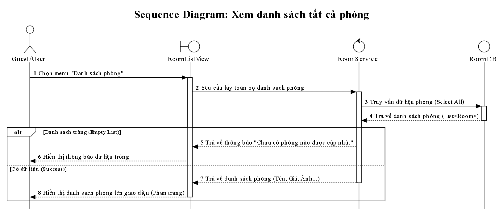
> Hình 3.26: Sơ đồ tuần tự xem danh sách tất cả phòng

```plantuml
@startuml
!theme plain
skinparam monochrome true
skinparam shadowing false
hide footbox
autoactivate on
title Sequence Diagram: Xem danh sách tất cả phòng

actor "Guest/User" as GuestUser
boundary RoomListView
control RoomService
entity RoomDB

GuestUser -> RoomListView : 1 Chọn menu "Danh sách phòng"
RoomListView -> RoomService : 2 Yêu cầu lấy toàn bộ danh sách phòng
RoomService -> RoomDB : 3 Truy vấn dữ liệu phòng (Select All)
RoomDB --> RoomService : 4 Trả về danh sách phòng (List<Room>)

alt Danh sách trống (Empty List)
    RoomService --> RoomListView : 5 Trả về thông báo "Chưa có phòng nào được cập nhật"
    RoomListView --> GuestUser : 6 Hiển thị thông báo dữ liệu trống
else Có dữ liệu (Success)
    RoomService --> RoomListView : 7 Trả về danh sách phòng (Tên, Giá, Ảnh...)
    RoomListView --> GuestUser : 8 Hiển thị danh sách phòng lên giao diện (Phân trang)
end
@enduml
```

- Sơ đồ tuần tự tìm phòng trống theo ngày

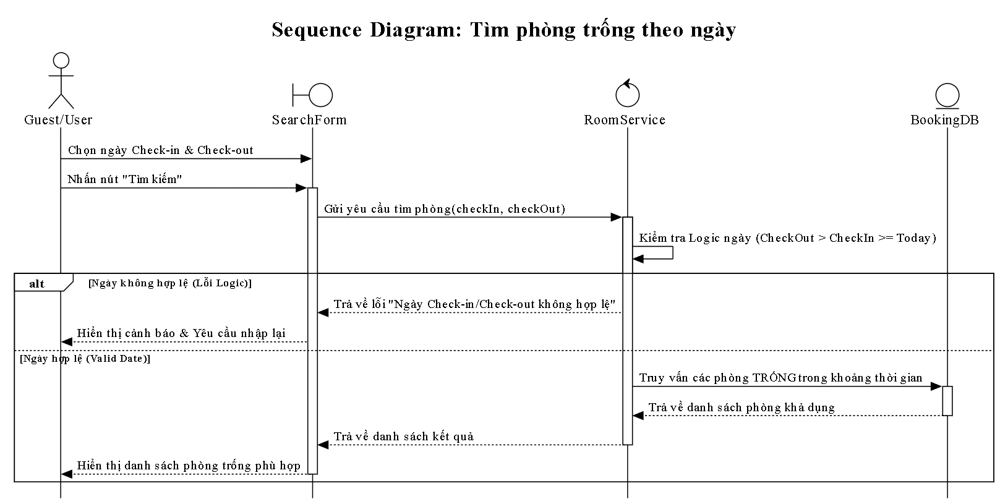
> Hình 3.27: Sơ đồ tuần tự tìm phòng trống theo ngày

```plantuml
@startuml
!theme plain
skinparam monochrome true
skinparam shadowing false
hide footbox
autoactivate on
title Sequence Diagram: Tìm phòng trống theo ngày

actor "Guest/User" as GuestUser
boundary SearchForm
control RoomService
entity BookingDB

GuestUser -> SearchForm : 1 Chọn ngày Check-in & Check-out
GuestUser -> SearchForm : 2 Nhấn nút "Tìm kiếm"
SearchForm -> RoomService : 3 Gửi yêu cầu tìm phòng(checkIn, checkOut)
RoomService -> RoomService : 4 Kiểm tra Logic ngày (CheckOut > CheckIn >= Today)

alt Ngày không hợp lệ (Lỗi Logic)
    RoomService --> SearchForm : 5 Trả về lỗi "Ngày Check-in/Check-out không hợp lệ"
    SearchForm --> GuestUser : 6 Hiển thị cảnh báo & Yêu cầu nhập lại
else Ngày hợp lệ (Valid Date)
    RoomService -> BookingDB : 7 Truy vấn các phòng TRỐNG trong khoảng thời gian
    BookingDB --> RoomService : 8 Trả về danh sách phòng khả dụng
    RoomService --> SearchForm : 9 Trả về danh sách kết quả
    SearchForm --> GuestUser : 10 Hiển thị danh sách phòng trống phù hợp
end
@enduml
```

- Sơ đồ tuần tự xem chi tiết phòng

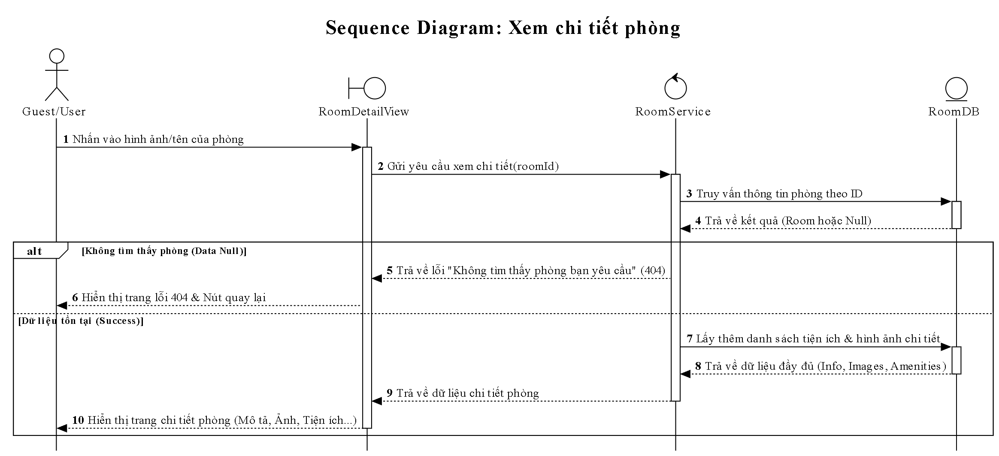
> Hình 3.28: Sơ đồ tuần tự xem chi tiết phòng

```plantuml
@startuml
!theme plain
skinparam monochrome true
skinparam shadowing false
hide footbox
autoactivate on
title Sequence Diagram: Xem chi tiết phòng

actor "Guest/User" as GuestUser
boundary RoomDetailView
control RoomService
entity RoomDB

GuestUser -> RoomDetailView : 1 Nhấn vào hình ảnh/tên của phòng
RoomDetailView -> RoomService : 2 Gửi yêu cầu xem chi tiết(roomId)
RoomService -> RoomDB : 3 Truy vấn thông tin phòng theo ID
RoomDB --> RoomService : 4 Trả về kết quả (Room hoặc Null)

alt Không tìm thấy phòng (Data Null)
    RoomService --> RoomDetailView : 5 Trả về lỗi "Không tìm thấy phòng bạn yêu cầu" (404)
    RoomDetailView --> GuestUser : 6 Hiển thị trang lỗi 404 & Nút quay lại
else Dữ liệu tồn tại (Success)
    RoomService -> RoomDB : 7 Lấy thêm danh sách tiện ích & hình ảnh chi tiết
    RoomDB --> RoomService : 8 Trả về dữ liệu đầy đủ (Info, Images, Amenities)
    RoomService --> RoomDetailView : 9 Trả về dữ liệu chi tiết phòng
    RoomDetailView --> GuestUser : 10 Hiển thị trang chi tiết phòng (Mô tả, Ảnh, Tiện ích...)
end
@enduml
```

- Sơ đồ tuần tự tìm kiếm phòng

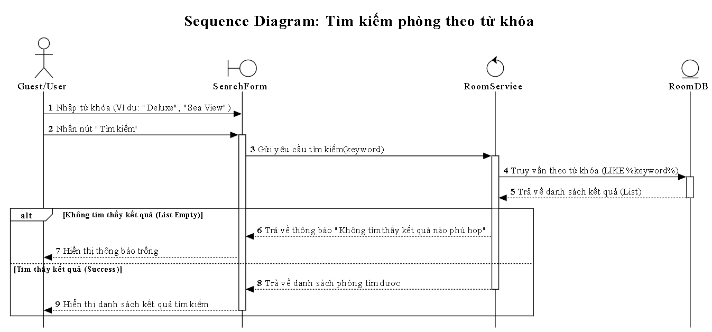
> Hình 3.29: Sơ đồ tuần tự tìm kiếm phòng theo từ khóa

```plantuml
@startuml
!theme plain
skinparam monochrome true
skinparam shadowing false
hide footbox
autoactivate on
title Sequence Diagram: Tìm kiếm phòng theo từ khóa

actor "Guest/User" as GuestUser
boundary SearchForm
control RoomService
entity RoomDB

GuestUser -> SearchForm : 1 Nhập từ khóa (Ví dụ: "Deluxe", "Sea View")
GuestUser -> SearchForm : 2 Nhấn nút "Tìm kiếm"
SearchForm -> RoomService : 3 Gửi yêu cầu tìm kiếm(keyword)
RoomService -> RoomDB : 4 Truy vấn theo từ khóa (LIKE %keyword%)
RoomDB --> RoomService : 5 Trả về danh sách kết quả (List)

alt Không tìm thấy kết quả (List Empty)
    RoomService --> SearchForm : 6 Trả về thông báo "Không tìm thấy kết quả nào phù hợp"
    SearchForm --> GuestUser : 7 Hiển thị thông báo trống
else Tìm thấy kết quả (Success)
    RoomService --> SearchForm : 8 Trả về danh sách phòng tìm được
    SearchForm --> GuestUser : 9 Hiển thị danh sách kết quả tìm kiếm
end
@enduml
```

- Sơ đồ tuần tự xem loại phòng

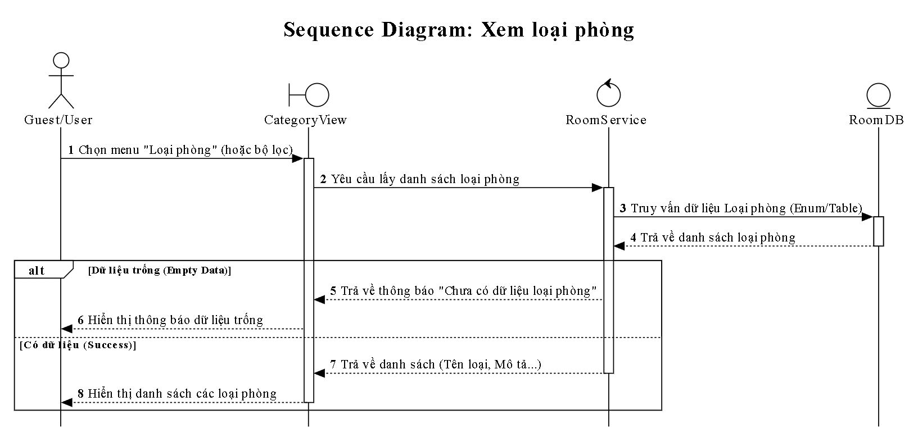
> Hình 3.30: Sơ đồ tuần tự xem loại phòng

```plantuml
@startuml
!theme plain
skinparam monochrome true
skinparam shadowing false
hide footbox
autoactivate on
title Sequence Diagram: Xem loại phòng

actor "Guest/User" as GuestUser
boundary CategoryView
control RoomService
entity RoomDB

GuestUser -> CategoryView : 1 Chọn menu "Loại phòng" (hoặc bộ lọc)
CategoryView -> RoomService : 2 Yêu cầu lấy danh sách loại phòng
RoomService -> RoomDB : 3 Truy vấn dữ liệu Loại phòng (Enum/Table)
RoomDB --> RoomService : 4 Trả về danh sách loại phòng

alt Dữ liệu trống (Empty Data)
    RoomService --> CategoryView : 5 Trả về thông báo "Chưa có dữ liệu loại phòng"
    CategoryView --> GuestUser : 6 Hiển thị thông báo dữ liệu trống
else Có dữ liệu (Success)
    RoomService --> CategoryView : 7 Trả về danh sách (Tên loại, Mô tả...)
    CategoryView --> GuestUser : 8 Hiển thị danh sách các loại phòng
end
@enduml
```

- Sơ đồ tuần tự thêm khách sạn mới

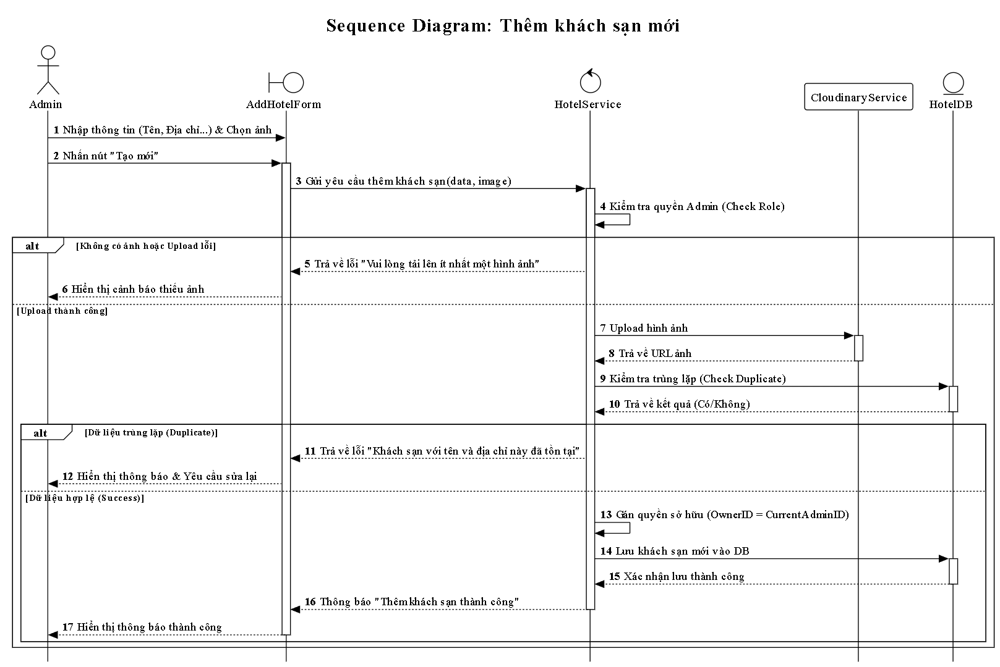
> Hình 3.31: Sơ đồ tuần tự thêm khách sạn mới

```plantuml
@startuml
!theme plain
skinparam monochrome true
skinparam shadowing false
hide footbox
autoactivate on
title Sequence Diagram: Thêm khách sạn mới

actor Admin
boundary AddHotelForm
control HotelService
participant CloudinaryService
entity HotelDB

Admin -> AddHotelForm : 1 Nhập thông tin (Tên, Địa chỉ...) & Chọn ảnh
Admin -> AddHotelForm : 2 Nhấn nút "Tạo mới"
AddHotelForm -> HotelService : 3 Gửi yêu cầu thêm khách sạn(data, image)
HotelService -> HotelService : 4 Kiểm tra quyền Admin (Check Role)

alt Không có ảnh hoặc Upload lỗi
    HotelService --> AddHotelForm : 5 Trả về lỗi "Vui lòng tải lên ít nhất một hình ảnh"
    AddHotelForm --> Admin : 6 Hiển thị cảnh báo thiếu ảnh
else Upload thành công
    HotelService -> CloudinaryService : 7 Upload hình ảnh
    CloudinaryService --> HotelService : 8 Trả về URL ảnh
    HotelService -> HotelDB : 9 Kiểm tra trùng lặp (Check Duplicate)
    HotelDB --> HotelService : 10 Trả về kết quả (Có/Không)
    alt Dữ liệu trùng lặp (Duplicate)
        HotelService --> AddHotelForm : 11 Trả về lỗi "Khách sạn với tên và địa chỉ này đã tồn tại"
        AddHotelForm --> Admin : 12 Hiển thị thông báo & Yêu cầu sửa lại
    else Dữ liệu hợp lệ (Success)
        HotelService -> HotelService : 13 Gán quyền sở hữu (OwnerID = CurrentAdminID)
        HotelService -> HotelDB : 14 Lưu khách sạn mới vào DB
        HotelDB --> HotelService : 15 Xác nhận lưu thành công
        HotelService --> AddHotelForm : 16 Thông báo "Thêm khách sạn thành công"
        AddHotelForm --> Admin : 17 Hiển thị thông báo thành công
    end
end
@enduml
```

- Sơ đồ tuần tự cập nhật khách sạn

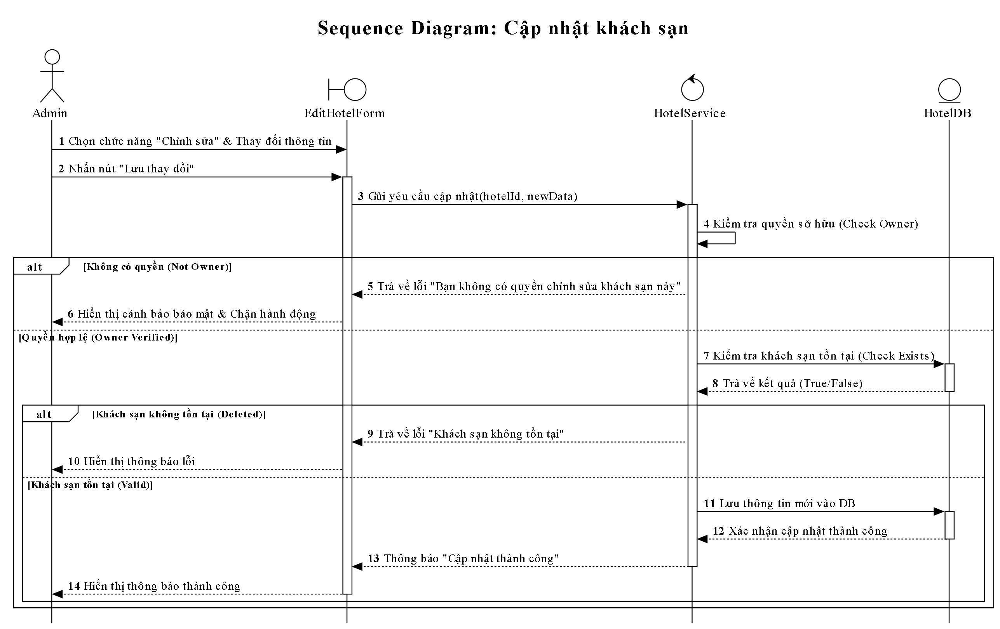
> Hình 3.32: Sơ đồ tuần tự cập nhật khách sạn

```plantuml
@startuml
!theme plain
skinparam monochrome true
skinparam shadowing false
hide footbox
autoactivate on
title Sequence Diagram: Cập nhật khách sạn

actor Admin
boundary EditHotelForm
control HotelService
entity HotelDB

Admin -> EditHotelForm : 1 Chọn chức năng "Chỉnh sửa" & Thay đổi thông tin
Admin -> EditHotelForm : 2 Nhấn nút "Lưu thay đổi"
EditHotelForm -> HotelService : 3 Gửi yêu cầu cập nhật(hotelId, newData)
HotelService -> HotelService : 4 Kiểm tra quyền sở hữu (Check Owner)

alt Không có quyền (Not Owner)
    HotelService --> EditHotelForm : 5 Trả về lỗi "Bạn không có quyền chỉnh sửa khách sạn này"
    EditHotelForm --> Admin : 6 Hiển thị cảnh báo bảo mật & Chặn hành động
else Quyền hợp lệ (Owner Verified)
    HotelService -> HotelDB : 7 Kiểm tra khách sạn tồn tại (Check Exists)
    HotelDB --> HotelService : 8 Trả về kết quả (True/False)
    alt Khách sạn không tồn tại (Deleted)
        HotelService --> EditHotelForm : 9 Trả về lỗi "Khách sạn không tồn tại"
        EditHotelForm --> Admin : 10 Hiển thị thông báo lỗi
    else Khách sạn tồn tại (Valid)
        HotelService -> HotelDB : 11 Lưu thông tin mới vào DB
        HotelDB --> HotelService : 12 Xác nhận cập nhật thành công
        HotelService --> EditHotelForm : 13 Thông báo "Cập nhật thành công"
        EditHotelForm --> Admin : 14 Hiển thị thông báo thành công
    end
end
@enduml
```

- Sơ đồ tuần tự xóa khách sạn

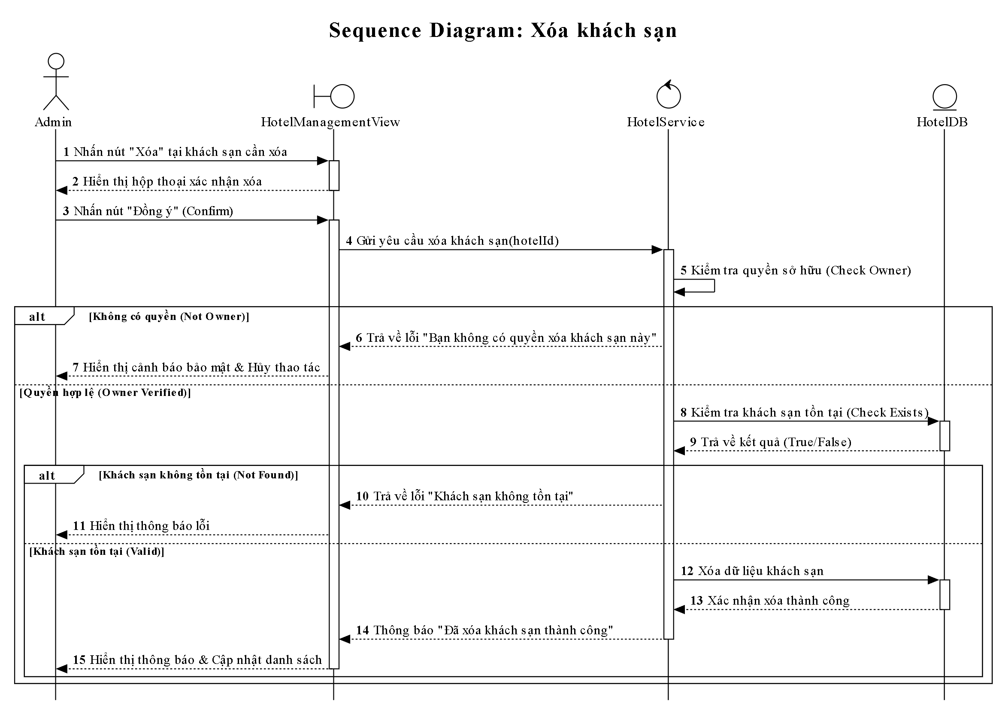
> Hình 3.33: Sơ đồ tuần tự xóa khách sạn

```plantuml
@startuml
!theme plain
skinparam monochrome true
skinparam shadowing false
hide footbox
autoactivate on
title Sequence Diagram: Xóa khách sạn

actor Admin
boundary HotelManagementView
control HotelService
entity HotelDB

Admin -> HotelManagementView : 1 Nhấn nút "Xóa" tại khách sạn cần xóa
HotelManagementView --> Admin : 2 Hiển thị hộp thoại xác nhận xóa
Admin -> HotelManagementView : 3 Nhấn nút "Đồng ý" (Confirm)
HotelManagementView -> HotelService : 4 Gửi yêu cầu xóa khách sạn(hotelId)
HotelService -> HotelService : 5 Kiểm tra quyền sở hữu (Check Owner)

alt Không có quyền (Not Owner)
    HotelService --> HotelManagementView : 6 Trả về lỗi "Bạn không có quyền xóa khách sạn này"
    HotelManagementView --> Admin : 7 Hiển thị cảnh báo bảo mật & Hủy thao tác
else Quyền hợp lệ (Owner Verified)
    HotelService -> HotelDB : 8 Kiểm tra khách sạn tồn tại (Check Exists)
    HotelDB --> HotelService : 9 Trả về kết quả (True/False)
    alt Khách sạn không tồn tại (Not Found)
        HotelService --> HotelManagementView : 10 Trả về lỗi "Khách sạn không tồn tại"
        HotelManagementView --> Admin : 11 Hiển thị thông báo lỗi
    else Khách sạn tồn tại (Valid)
        HotelService -> HotelDB : 12 Xóa dữ liệu khách sạn
        HotelDB --> HotelService : 13 Xác nhận xóa thành công
        HotelService --> HotelManagementView : 14 Thông báo "Đã xóa khách sạn thành công"
        HotelManagementView --> Admin : 15 Hiển thị thông báo & Cập nhật danh sách
    end
end
@enduml
```

- Sơ đồ tuần tự xem danh sách khách sạn của tôi

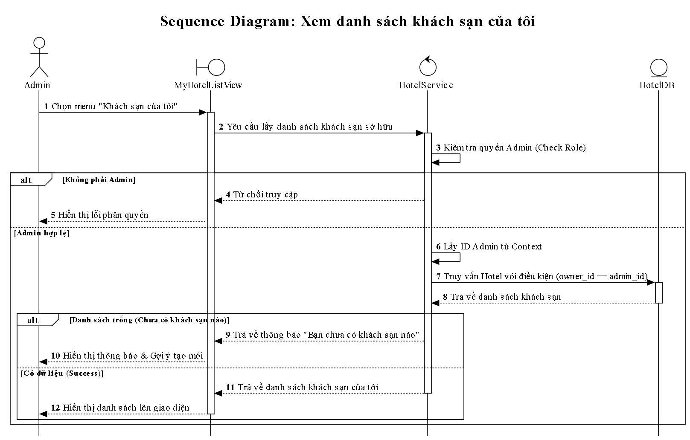
> Hình 3.34: Sơ đồ tuần tự xem danh sách khách sạn của tôi

```plantuml
@startuml
!theme plain
skinparam monochrome true
skinparam shadowing false
hide footbox
autoactivate on
title Sequence Diagram: Xem danh sách khách sạn của tôi

actor Admin
boundary MyHotelListView
control HotelService
entity HotelDB

Admin -> MyHotelListView: 1 Chọn menu "Khách sạn của tôi"
MyHotelListView -> HotelService: 2 Yêu cầu lấy danh sách khách sạn sở hữu
HotelService -> HotelService: 3 Kiểm tra quyền Admin (Check Role)

alt [Không phải Admin]
    HotelService --> MyHotelListView: 4 Từ chối truy cập
    MyHotelListView --> Admin: 5 Hiển thị lỗi phân quyền
else [Admin hợp lệ]
    HotelService -> HotelService: 6 Lấy ID Admin từ Context
    HotelService -> HotelDB: 7 Truy vấn Hotel với điều kiện (owner_id == admin_id)
    HotelDB --> HotelService: 8 Trả về danh sách khách sạn

    alt [Danh sách trống (Chưa có khách sạn nào)]
        HotelService --> MyHotelListView: 9 Trả về thông báo "Bạn chưa có khách sạn nào"
        MyHotelListView --> Admin: 10 Hiển thị thông báo & Gợi ý tạo mới
    else [Có dữ liệu (Success)]
        HotelService --> MyHotelListView: 11 Trả về danh sách khách sạn của tôi
        MyHotelListView --> Admin: 12 Hiển thị danh sách lên giao diện
    end
end

@enduml
```

- Sơ đồ tuần tự xem danh sách tất cả khách sạn

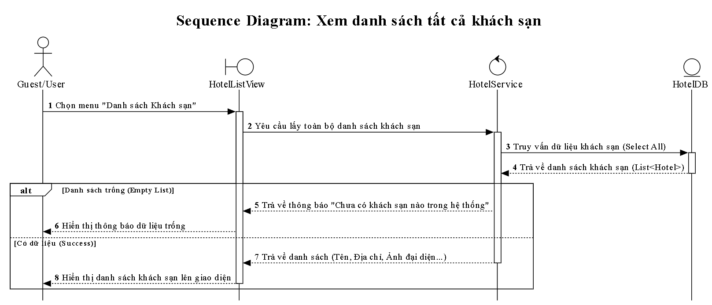
> Hình 3.35: Sơ đồ tuần tự xem danh sách tất cả khách sạn

```plantuml
@startuml
!theme plain
skinparam monochrome true
skinparam shadowing false
hide footbox
autoactivate on
title Sequence Diagram: Xem danh sách tất cả khách sạn

actor "Guest/User" as GuestUser
boundary HotelListView
control HotelService
entity HotelDB

GuestUser -> HotelListView: 1 Chọn menu "Danh sách Khách sạn"
HotelListView -> HotelService: 2 Yêu cầu lấy toàn bộ danh sách khách sạn
HotelService -> HotelDB: 3 Truy vấn dữ liệu khách sạn (Select All)
HotelDB --> HotelService: 4 Trả về danh sách khách sạn (List<Hotel>)

alt [Danh sách trống (Empty List)]
    HotelService --> HotelListView: 5 Trả về thông báo "Chưa có khách sạn nào trong hệ thống"
    HotelListView --> GuestUser: 6 Hiển thị thông báo dữ liệu trống
else [Có dữ liệu (Success)]
    HotelService --> HotelListView: 7 Trả về danh sách (Tên, Địa chỉ, Ảnh đại diện...)
    HotelListView --> GuestUser: 8 Hiển thị danh sách khách sạn lên giao diện
end

@enduml
```

- Sơ đồ tuần tự xem chi tiết khách sạn

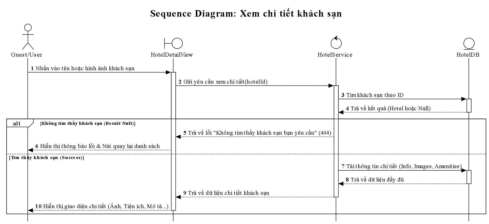
> Hình 3.36: Sơ đồ tuần tự xem chi tiết khách sạn

```plantuml
@startuml
!theme plain
skinparam monochrome true
skinparam shadowing false
hide footbox
autoactivate on
title Sequence Diagram: Xem chi tiết khách sạn

actor "Guest/User" as GuestUser
boundary HotelDetailView
control HotelService
entity HotelDB

GuestUser -> HotelDetailView: 1 Nhấn vào tên hoặc hình ảnh khách sạn
HotelDetailView -> HotelService: 2 Gửi yêu cầu xem chi tiết(hotelId)
HotelService -> HotelDB: 3 Tìm khách sạn theo ID
HotelDB --> HotelService: 4 Trả về kết quả (Hotel hoặc Null)

alt [Không tìm thấy khách sạn (Result Null)]
    HotelService --> HotelDetailView: 5 Trả về lỗi "Không tìm thấy khách sạn bạn yêu cầu" (404)
    HotelDetailView --> GuestUser: 6 Hiển thị thông báo lỗi & Nút quay lại danh sách
else [Tìm thấy khách sạn (Success)]
    HotelService -> HotelDB: 7 Tải thông tin chi tiết (Info, Images, Amenities)
    HotelDB --> HotelService: 8 Trả về dữ liệu đầy đủ
    HotelService --> HotelDetailView: 9 Trả về dữ liệu chi tiết khách sạn
    HotelDetailView --> GuestUser: 10 Hiển thị giao diện chi tiết (Ảnh, Tiện ích, Mô tả...)
end

@enduml
```

- Sơ đồ tuần tự tìm kiếm khách sạn

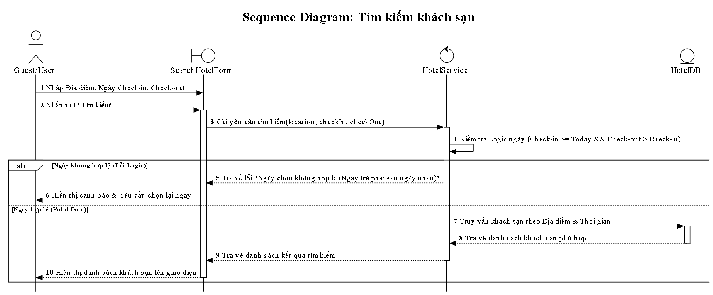
> Hình 3.37: Sơ đồ tuần tự tìm kiếm khách sạn

```plantuml
@startuml
!theme plain
skinparam monochrome true
skinparam shadowing false
hide footbox
autoactivate on
title Sequence Diagram: Tìm kiếm khách sạn

actor "Guest/User" as GuestUser
boundary SearchHotelForm
control HotelService
entity HotelDB

GuestUser -> SearchHotelForm: 1 Nhập Địa điểm, Ngày Check-in, Check-out
GuestUser -> SearchHotelForm: 2 Nhấn nút "Tìm kiếm"
SearchHotelForm -> HotelService: 3 Gửi yêu cầu tìm kiếm(location, checkIn, checkOut)
HotelService -> HotelService: 4 Kiểm tra Logic ngày (Check-in >= Today && Check-out > Check-in)

alt [Ngày không hợp lệ (Lỗi Logic)]
    HotelService --> SearchHotelForm: 5 Trả về lỗi "Ngày chọn không hợp lệ (Ngày trả phải sau ngày nhận)"
    SearchHotelForm --> GuestUser: 6 Hiển thị cảnh báo & Yêu cầu chọn lại ngày
else [Ngày hợp lệ (Valid Date)]
    HotelService -> HotelDB: 7 Truy vấn khách sạn theo Địa điểm & Thời gian
    HotelDB --> HotelService: 8 Trả về danh sách khách sạn phù hợp
    HotelService --> SearchHotelForm: 9 Trả về danh sách kết quả tìm kiếm
    SearchHotelForm --> GuestUser: 10 Hiển thị danh sách khách sạn lên giao diện
end

@enduml
```

- Sơ đồ tuần tự xem danh sách phòng của khách sạn

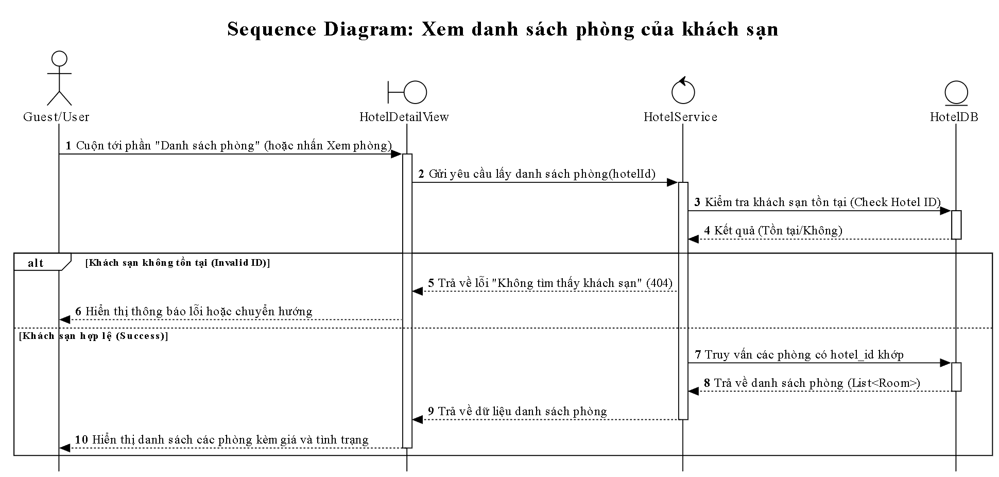
> Hình 3.38: Sơ đồ tuần tự xem danh sách phòng của khách sạn

```plantuml
@startuml
!theme plain
skinparam monochrome true
skinparam shadowing false
hide footbox
autoactivate on
title Sequence Diagram: Xem danh sách phòng của khách sạn

actor "Guest/User" as GuestUser
boundary HotelDetailView
control HotelService
entity HotelDB

GuestUser -> HotelDetailView: 1 Cuộn tới phần "Danh sách phòng" (hoặc nhấn Xem phòng)
HotelDetailView -> HotelService: 2 Gửi yêu cầu lấy danh sách phòng(hotelId)
HotelService -> HotelDB: 3 Kiểm tra khách sạn tồn tại (Check Hotel ID)
HotelDB --> HotelService: 4 Kết quả (Tồn tại/Không)

alt [Khách sạn không tồn tại (Invalid ID)]
    HotelService --> HotelDetailView: 5 Trả về lỗi "Không tìm thấy khách sạn" (404)
    HotelDetailView --> GuestUser: 6 Hiển thị thông báo lỗi hoặc chuyển hướng
else [Khách sạn hợp lệ (Success)]
    HotelService -> HotelDB: 7 Truy vấn các phòng có hotel_id khớp
    HotelDB --> HotelService: 8 Trả về danh sách phòng (List<Room>)
    HotelService --> HotelDetailView: 9 Trả về dữ liệu danh sách phòng
    HotelDetailView --> GuestUser: 10 Hiển thị danh sách các phòng kèm giá và tình trạng
end

@enduml
```

- Sơ đồ tuần tự xem danh sách tất cả booking

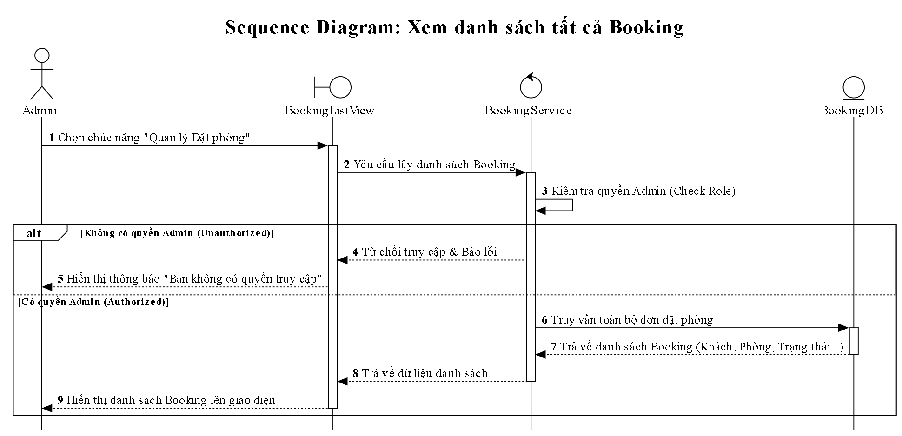
> Hình 3.39: Sơ đồ tuần tự xem danh sách tất cả booking

```plantuml
@startuml
!theme plain
skinparam monochrome true
skinparam shadowing false
hide footbox
autoactivate on
title Sequence Diagram: Xem danh sách tất cả Booking

actor Admin
boundary BookingListView
control BookingService
entity BookingDB

Admin -> BookingListView: 1 Chọn chức năng "Quản lý Đặt phòng"
BookingListView -> BookingService: 2 Yêu cầu lấy danh sách Booking
BookingService -> BookingService: 3 Kiểm tra quyền Admin (Check Role)

alt [Không có quyền Admin (Unauthorized)]
    BookingService --> BookingListView: 4 Từ chối truy cập & Báo lỗi
    BookingListView --> Admin: 5 Hiển thị thông báo "Bạn không có quyền truy cập"
else [Có quyền Admin (Authorized)]
    BookingService -> BookingDB: 6 Truy vấn toàn bộ đơn đặt phòng
    BookingDB --> BookingService: 7 Trả về danh sách Booking (Khách, Phòng, Trạng thái...)
    BookingService --> BookingListView: 8 Trả về dữ liệu danh sách
    BookingListView --> Admin: 9 Hiển thị danh sách Booking lên giao diện
end

@enduml
```

- Sơ đồ tuần tự cập nhật trạng thái booking

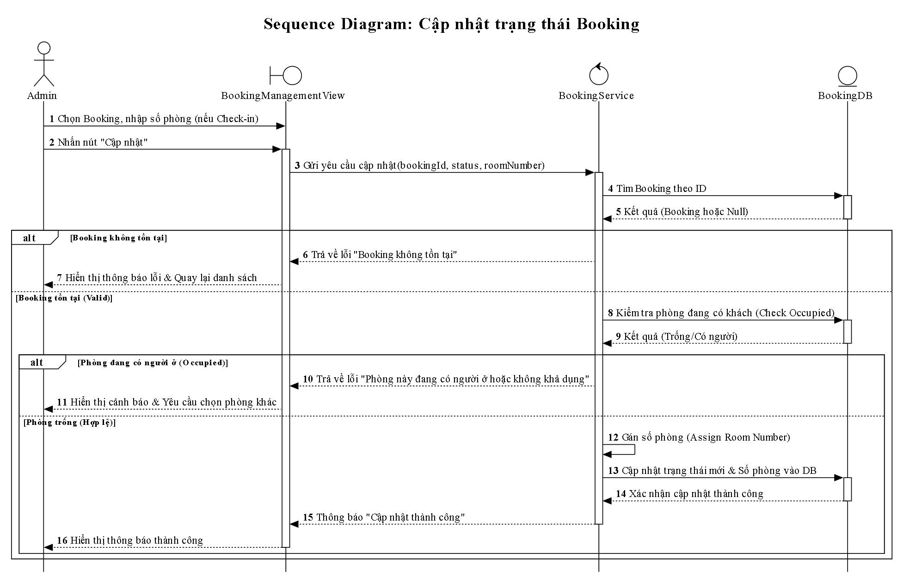
> Hình 3.40: Sơ đồ tuần tự cập nhật trạng thái booking

```plantuml
@startuml
!theme plain
skinparam monochrome true
skinparam shadowing false
hide footbox
autoactivate on
title Sequence Diagram: Cập nhật trạng thái Booking

actor Admin
boundary BookingManagementView
control BookingService
entity BookingDB

Admin -> BookingManagementView: 1 Chọn Booking, nhập số phòng (nếu Check-in)
Admin -> BookingManagementView: 2 Nhấn nút "Cập nhật"
BookingManagementView -> BookingService: 3 Gửi yêu cầu cập nhật(bookingId, status, roomNumber)
BookingService -> BookingDB: 4 Tìm Booking theo ID
BookingDB --> BookingService: 5 Kết quả (Booking hoặc Null)

alt [Booking không tồn tại]
    BookingService --> BookingManagementView: 6 Trả về lỗi "Booking không tồn tại"
    BookingManagementView --> Admin: 7 Hiển thị thông báo lỗi & Quay lại danh sách
else [Booking tồn tại (Valid)]
    BookingService -> BookingDB: 8 Kiểm tra phòng đang có khách (Check Occupied)
    BookingDB --> BookingService: 9 Kết quả (Trống/Có người)

    alt [Phòng đang có người ở (Occupied)]
        BookingService --> BookingManagementView: 10 Trả về lỗi "Phòng này đang có người ở hoặc không khả dụng"
        BookingManagementView --> Admin: 11 Hiển thị cảnh báo & Yêu cầu chọn phòng khác
    else [Phòng trống (Hợp lệ)]
        BookingService -> BookingService: 12 Gán số phòng (Assign Room Number)
        BookingService -> BookingDB: 13 Cập nhật trạng thái mới & số phòng vào DB
        BookingDB --> BookingService: 14 Xác nhận cập nhật thành công
        BookingService --> BookingManagementView: 15 Thông báo "Cập nhật thành công"
        BookingManagementView --> Admin: 16 Hiển thị thông báo thành công
    end
end

@enduml
```

- Sơ đồ tuần tự tạo booking mới

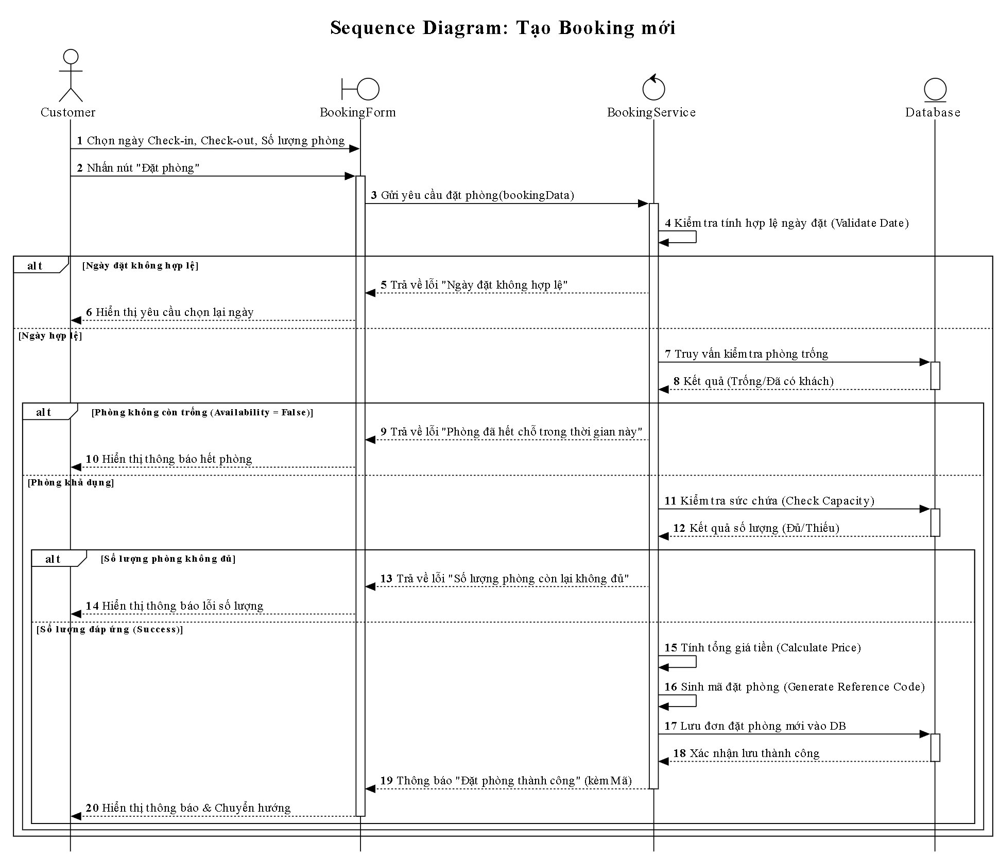
> Hình 3.41: Sơ đồ tuần tự tạo booking mới

```plantuml
@startuml
!theme plain
skinparam monochrome true
skinparam shadowing false
hide footbox
autoactivate on
title Sequence Diagram: Tạo Booking mới

actor Customer
boundary BookingForm
control BookingService
entity Database

Customer -> BookingForm: 1 Chọn ngày Check-in, Check-out, Số lượng phòng
Customer -> BookingForm: 2 Nhấn nút "Đặt phòng"
BookingForm -> BookingService: 3 Gửi yêu cầu đặt phòng(bookingData)
BookingService -> BookingService: 4 Kiểm tra tính hợp lệ ngày đặt (Validate Date)

alt [Ngày đặt không hợp lệ]
    BookingService --> BookingForm: 5 Trả về lỗi "Ngày đặt không hợp lệ"
    BookingForm --> Customer: 6 Hiển thị yêu cầu chọn lại ngày
else [Ngày hợp lệ]
    BookingService -> Database: 7 Truy vấn kiểm tra phòng trống
    Database --> BookingService: 8 Kết quả (Trống/Đã có khách)

    alt [Phòng không còn trống (Availability = False)]
        BookingService --> BookingForm: 9 Trả về lỗi "Phòng đã hết chỗ trong thời gian này"
        BookingForm --> Customer: 10 Hiển thị thông báo hết phòng
    else [Phòng khả dụng]
        BookingService -> Database: 11 Kiểm tra sức chứa (Check Capacity)
        Database --> BookingService: 12 Kết quả số lượng (Đủ/Thiếu)

        alt [Số lượng phòng không đủ]
            BookingService --> BookingForm: 13 Trả về lỗi "Số lượng phòng còn lại không đủ"
            BookingForm --> Customer: 14 Hiển thị thông báo lỗi số lượng
        else [Số lượng đáp ứng (Success)]
            BookingService -> BookingService: 15 Tính tổng giá tiền (Calculate Price)
            BookingService -> BookingService: 16 Sinh mã đặt phòng (Generate Reference Code)
            BookingService -> Database: 17 Lưu đơn đặt phòng mới vào DB
            Database --> BookingService: 18 Xác nhận lưu thành công
            BookingService --> BookingForm: 19 Thông báo "Đặt phòng thành công" (kèm Mã)
            BookingForm --> Customer: 20 Hiển thị thông báo & Chuyển hướng
        end
    end
end

@enduml
```

- Sơ đồ tuần tự tra cứu booking theo mã

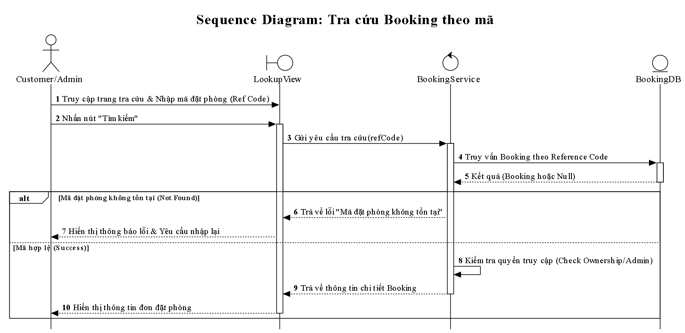
> Hình 3.42: Sơ đồ tuần tự tra cứu booking theo mã

```plantuml
@startuml
!theme plain
skinparam monochrome true
skinparam shadowing false
hide footbox
autoactivate on
title Sequence Diagram: Tra cứu Booking theo mã

actor "Customer/Admin" as User
boundary LookupView
control BookingService
entity BookingDB

User -> LookupView: 1 Truy cập trang tra cứu & Nhập mã đặt phòng (Ref Code)
User -> LookupView: 2 Nhấn nút "Tìm kiếm"
LookupView -> BookingService: 3 Gửi yêu cầu tra cứu(refCode)
BookingService -> BookingDB: 4 Truy vấn Booking theo Reference Code
BookingDB --> BookingService: 5 Kết quả (Booking hoặc Null)

alt [Mã đặt phòng không tồn tại (Not Found)]
    BookingService --> LookupView: 6 Trả về lỗi "Mã đặt phòng không tồn tại"
    LookupView --> User: 7 Hiển thị thông báo lỗi & Yêu cầu nhập lại
else [Mã hợp lệ (Success)]
    BookingService -> BookingService: 8 Kiểm tra quyền truy cập (Check Ownership/Admin)
    BookingService --> LookupView: 9 Trả về thông tin chi tiết Booking
    LookupView --> User: 10 Hiển thị thông tin đơn đặt phòng
end

@enduml
```

- Sơ đồ tuần tự hủy đặt phòng

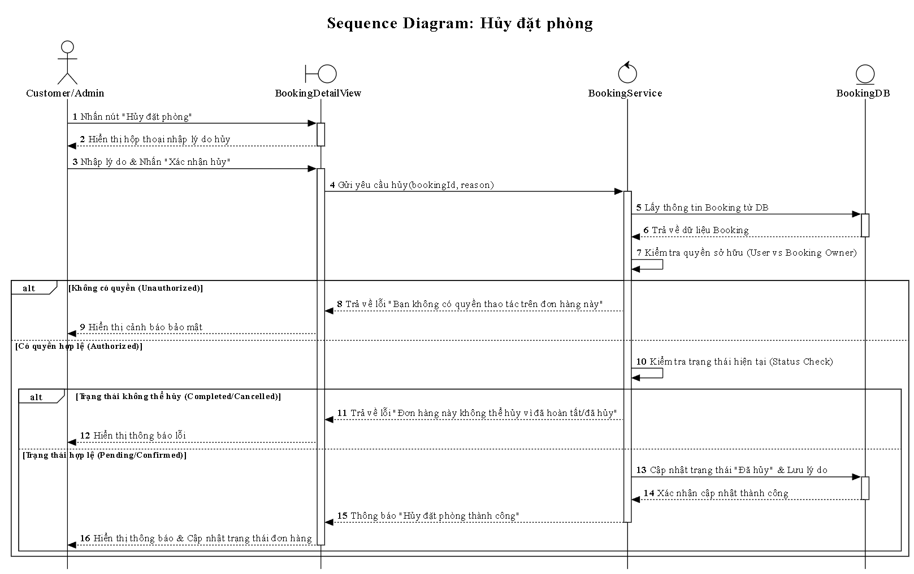
> Hình 3.43: Sơ đồ tuần tự hủy đặt phòng

```plantuml
@startuml
!theme plain
skinparam monochrome true
skinparam shadowing false
hide footbox
autoactivate on
title Sequence Diagram: Hủy đặt phòng

actor "Customer/Admin" as User
boundary BookingDetailView
control BookingService
entity BookingDB

User -> BookingDetailView: 1 Nhấn nút "Hủy đặt phòng"
BookingDetailView --> User: 2 Hiển thị hộp thoại nhập lý do hủy
User -> BookingDetailView: 3 Nhập lý do & Nhấn "Xác nhận hủy"
BookingDetailView -> BookingService: 4 Gửi yêu cầu hủy(bookingId, reason)
BookingService -> BookingDB: 5 Lấy thông tin Booking từ DB
BookingDB --> BookingService: 6 Trả về dữ liệu Booking
BookingService -> BookingService: 7 Kiểm tra quyền sở hữu (User vs Booking Owner)

alt [Không có quyền (Unauthorized)]
    BookingService --> BookingDetailView: 8 Trả về lỗi "Bạn không có quyền thao tác trên đơn hàng này"
    BookingDetailView --> User: 9 Hiển thị cảnh báo bảo mật
else [Có quyền hợp lệ (Authorized)]
    BookingService -> BookingService: 10 Kiểm tra trạng thái hiện tại (Status Check)

    alt [Trạng thái không thể hủy (Completed/Cancelled)]
        BookingService --> BookingDetailView: 11 Trả về lỗi "Đơn hàng này không thể hủy vì đã hoàn tất/đã hủy"
        BookingDetailView --> User: 12 Hiển thị thông báo lỗi
    else [Trạng thái hợp lệ (Pending/Confirmed)]
        BookingService -> BookingDB: 13 Cập nhật trạng thái "Đã hủy" & Lưu lý do
        BookingDB --> BookingService: 14 Xác nhận cập nhật thành công
        BookingService --> BookingDetailView: 15 Thông báo "Hủy đặt phòng thành công"
        BookingDetailView --> User: 16 Hiển thị thông báo & Cập nhật trạng thái đơn hàng
    end
end

@enduml
```

- Sơ đồ tuần tự tạo tiện ích mới

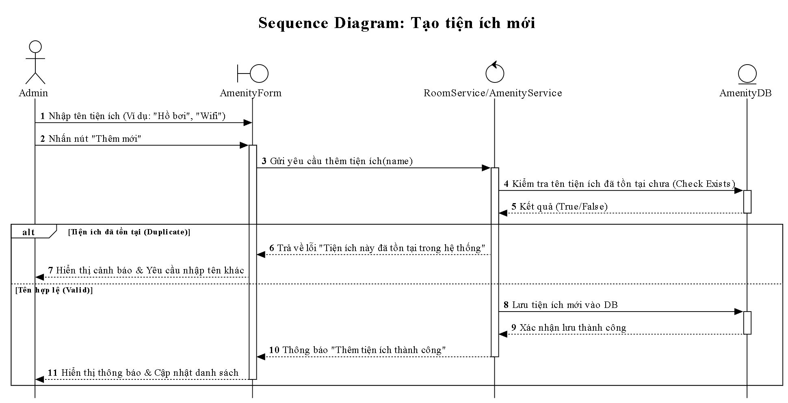
> Hình 3.44: Sơ đồ tuần tự tạo tiện ích mới

```plantuml
@startuml
!theme plain
skinparam monochrome true
skinparam shadowing false
hide footbox
autoactivate on
title Sequence Diagram: Tạo tiện ích mới

actor Admin
boundary AmenityForm
control "RoomService/AmenityService" as AmenityService
entity AmenityDB

Admin -> AmenityForm: 1 Nhập tên tiện ích (Ví dụ: "Hồ bơi", "Wifi")
Admin -> AmenityForm: 2 Nhấn nút "Thêm mới"
AmenityForm -> AmenityService: 3 Gửi yêu cầu thêm tiện ích(name)
AmenityService -> AmenityDB: 4 Kiểm tra tên tiện ích đã tồn tại chưa (Check Exists)
AmenityDB --> AmenityService: 5 Kết quả (True/False)

alt [Tiện ích đã tồn tại (Duplicate)]
    AmenityService --> AmenityForm: 6 Trả về lỗi "Tiện ích này đã tồn tại trong hệ thống"
    AmenityForm --> Admin: 7 Hiển thị cảnh báo & Yêu cầu nhập tên khác
else [Tên hợp lệ (Valid)]
    AmenityService -> AmenityDB: 8 Lưu tiện ích mới vào DB
    AmenityDB --> AmenityService: 9 Xác nhận lưu thành công
    AmenityService --> AmenityForm: 10 Thông báo "Thêm tiện ích thành công"
    AmenityForm --> Admin: 11 Hiển thị thông báo & Cập nhật danh sách
end

@enduml
```

- Sơ đồ tuần tự cập nhật tiện ích

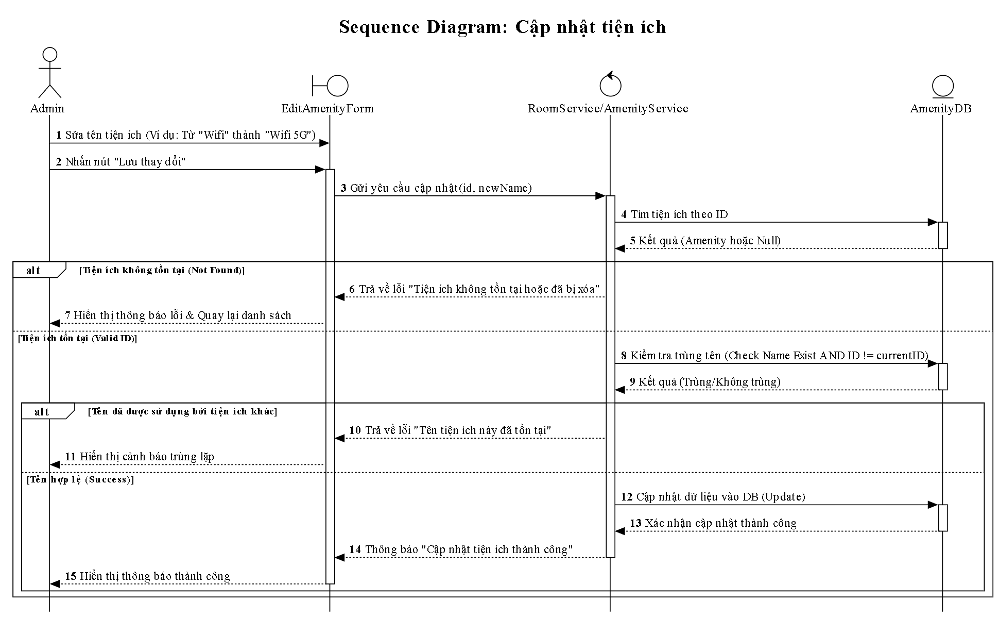
> Hình 3.45: Sơ đồ tuần tự cập nhật tiện ích

```plantuml
@startuml
!theme plain
skinparam monochrome true
skinparam shadowing false
hide footbox
autoactivate on
title Sequence Diagram: Cập nhật tiện ích

actor Admin
boundary EditAmenityForm
control "RoomService/AmenityService" as AmenityService
entity AmenityDB

Admin -> EditAmenityForm: 1 Sửa tên tiện ích (Ví dụ: Từ "Wifi" thành "Wifi 5G")
Admin -> EditAmenityForm: 2 Nhấn nút "Lưu thay đổi"
EditAmenityForm -> AmenityService: 3 Gửi yêu cầu cập nhật(id, newName)
AmenityService -> AmenityDB: 4 Tìm tiện ích theo ID
AmenityDB --> AmenityService: 5 Kết quả (Amenity hoặc Null)

alt [Tiện ích không tồn tại (Not Found)]
    AmenityService --> EditAmenityForm: 6 Trả về lỗi "Tiện ích không tồn tại hoặc đã bị xóa"
    EditAmenityForm --> Admin: 7 Hiển thị thông báo lỗi & Quay lại danh sách
else [Tiện ích tồn tại (Valid ID)]
    AmenityService -> AmenityDB: 8 Kiểm tra trùng tên (Check Name Exist AND ID != currentID)
    AmenityDB --> AmenityService: 9 Kết quả (Trùng/Không trùng)

    alt [Tên đã được sử dụng bởi tiện ích khác]
        AmenityService --> EditAmenityForm: 10 Trả về lỗi "Tên tiện ích này đã tồn tại"
        EditAmenityForm --> Admin: 11 Hiển thị cảnh báo trùng lặp
    else [Tên hợp lệ (Success)]
        AmenityService -> AmenityDB: 12 Cập nhật dữ liệu vào DB (Update)
        AmenityDB --> AmenityService: 13 Xác nhận cập nhật thành công
        AmenityService --> EditAmenityForm: 14 Thông báo "Cập nhật tiện ích thành công"
        EditAmenityForm --> Admin: 15 Hiển thị thông báo thành công
    end
end

@enduml
```

- Sơ đồ tuần tự xóa tiện ích hệ thống

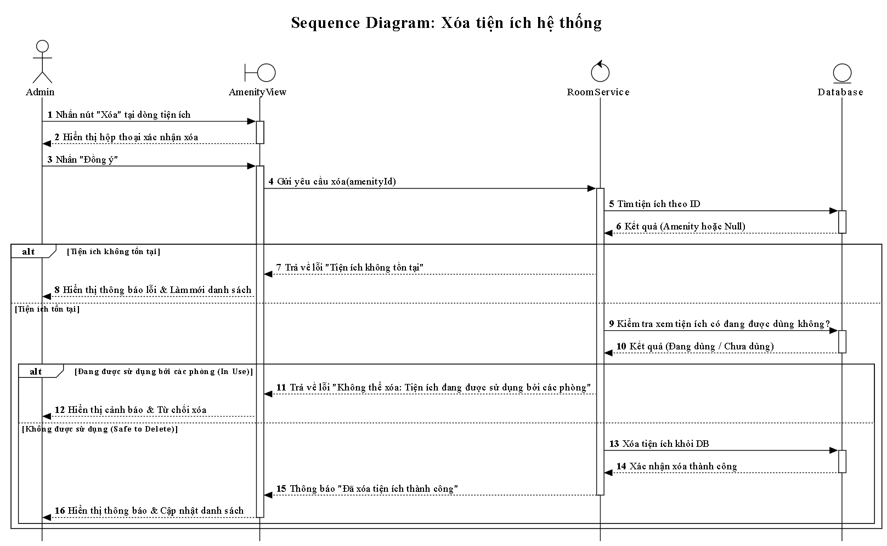
> Hình 3.46: Sơ đồ tuần tự xóa tiện ích hệ thống

```plantuml
@startuml
!theme plain
skinparam monochrome true
skinparam shadowing false
hide footbox
autoactivate on
title Sequence Diagram: Xóa tiện ích hệ thống

actor Admin
boundary AmenityView
control RoomService
entity Database

Admin -> AmenityView: 1 Nhấn nút "Xóa" tại dòng tiện ích
AmenityView --> Admin: 2 Hiển thị hộp thoại xác nhận xóa
Admin -> AmenityView: 3 Nhấn "Đồng ý"
AmenityView -> RoomService: 4 Gửi yêu cầu xóa(amenityId)
RoomService -> Database: 5 Tìm tiện ích theo ID
entity --> RoomService: 6 Kết quả (Amenity hoặc Null)

alt [Tiện ích không tồn tại]
    RoomService --> AmenityView: 7 Trả về lỗi "Tiện ích không tồn tại"
    AmenityView --> Admin: 8 Hiển thị thông báo lỗi & Làm mới danh sách
else [Tiện ích tồn tại]
    RoomService -> Database: 9 Kiểm tra xem tiện ích có đang được dùng không?
    Database --> RoomService: 10 Kết quả (Đang dùng / Chưa dùng)

    alt [Đang được sử dụng bởi các phòng (In Use)]
        RoomService --> AmenityView: 11 Trả về lỗi "Không thể xóa: Tiện ích đang được sử dụng bởi các phòng"
        AmenityView --> Admin: 12 Hiển thị cảnh báo & Từ chối xóa
    else [Không được sử dụng (Safe to Delete)]
        RoomService -> Database: 13 Xóa tiện ích khỏi DB
        Database --> RoomService: 14 Xác nhận xóa thành công
        RoomService --> AmenityView: 15 Thông báo "Đã xóa tiện ích thành công"
        AmenityView --> Admin: 16 Hiển thị thông báo & Cập nhật danh sách
    end
end

@enduml
```

- Sơ đồ tuần tự gỡ tiện ích khỏi khách sạn

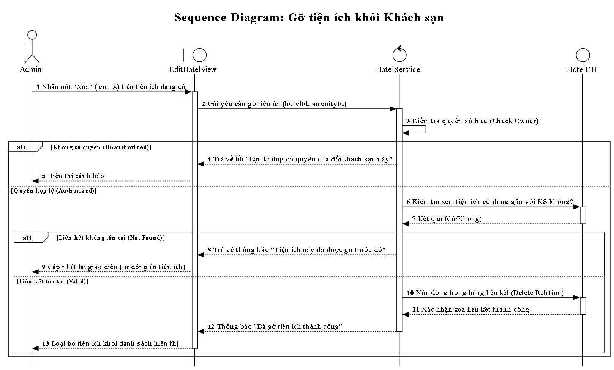
> Hình 3.47: Sơ đồ tuần tự gỡ tiện ích khỏi khách sạn

```plantuml
@startuml
!theme plain
skinparam monochrome true
skinparam shadowing false
hide footbox
autoactivate on
title Sequence Diagram: Gỡ tiện ích khỏi Khách sạn

actor Admin
boundary EditHotelView
control HotelService
entity HotelDB

Admin -> EditHotelView: 1 Nhấn nút "Xóa" (icon X) trên tiện ích đang có
EditHotelView -> HotelService: 2 Gửi yêu cầu gỡ tiện ích(hotelId, amenityId)
HotelService -> HotelService: 3 Kiểm tra quyền sở hữu (Check Owner)

alt [Không có quyền (Unauthorized)]
    HotelService --> EditHotelView: 4 Trả về lỗi "Bạn không có quyền sửa đổi khách sạn này"
    EditHotelView --> Admin: 5 Hiển thị cảnh báo
else [Quyền hợp lệ (Authorized)]
    HotelService -> HotelDB: 6 Kiểm tra xem tiện ích có đang gắn với KS không?
    HotelDB --> HotelService: 7 Kết quả (Có/Không)

    alt [Liên kết không tồn tại (Not Found)]
        HotelService --> EditHotelView: 8 Trả về thông báo "Tiện ích này đã được gỡ trước đó"
        EditHotelView --> Admin: 9 Cập nhật lại giao diện (tự động ẩn tiện ích)
    else [Liên kết tồn tại (Valid)]
        HotelService -> HotelDB: 10 Xóa dòng trong bảng liên kết (Delete Relation)
        HotelDB --> HotelService: 11 Xác nhận xóa liên kết thành công
        HotelService --> EditHotelView: 12 Thông báo "Đã gỡ tiện ích thành công"
        EditHotelView --> Admin: 13 Loại bỏ tiện ích khỏi danh sách hiển thị
    end
end

@enduml
```

- Sơ đồ tuần tự gỡ tiện ích khỏi phòng

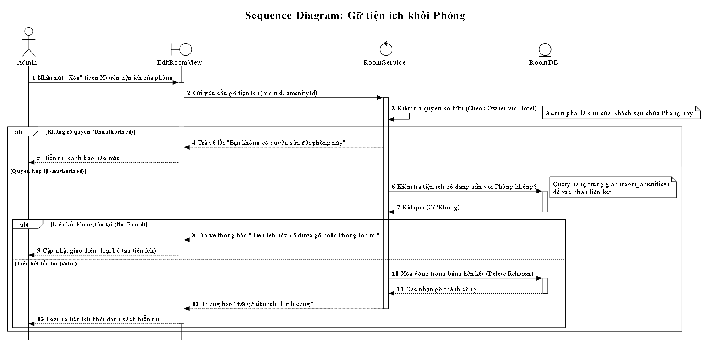
> Hình 3.48: Sơ đồ tuần tự gỡ tiện ích khỏi phòng

```plantuml
@startuml
!theme plain
skinparam monochrome true
skinparam shadowing false
hide footbox
autoactivate on
title Sequence Diagram: Gỡ tiện ích khỏi Phòng

actor Admin
boundary EditRoomView
control RoomService
entity RoomDB

Admin -> EditRoomView: 1 Nhấn nút "Xóa" (icon X) trên tiện ích của phòng
EditRoomView -> RoomService: 2 Gửi yêu cầu gỡ tiện ích(roomId, amenityId)
RoomService -> RoomService: 3 Kiểm tra quyền sở hữu (Check Owner via Hotel)
note right of RoomDB
Admin phải là chủ của Khách sạn chứa Phòng này
end note

alt [Không có quyền (Unauthorized)]
    RoomService --> EditRoomView: 4 Trả về lỗi "Bạn không có quyền sửa đổi phòng này"
    EditRoomView --> Admin: 5 Hiển thị cảnh báo bảo mật
else [Quyền hợp lệ (Authorized)]
    RoomService -> RoomDB: 6 Kiểm tra tiện ích có đang gắn với Phòng không?
    note right of RoomDB
    Query bảng trung gian (room_amenities)
    để xác nhận liên kết
    end note
    RoomDB --> RoomService: 7 Kết quả (Có/Không)

    alt [Liên kết không tồn tại (Not Found)]
        RoomService --> EditRoomView: 8 Trả về thông báo "Tiện ích này đã được gỡ hoặc không tồn tại"
        EditRoomView --> Admin: 9 Cập nhật giao diện (loại bỏ tag tiện ích)
    else [Liên kết tồn tại (Valid)]
        RoomService -> RoomDB: 10 Xóa dòng trong bảng liên kết (Delete Relation)
        RoomDB --> RoomService: 11 Xác nhận gỡ thành công
        RoomService --> EditRoomView: 12 Thông báo "Đã gỡ tiện ích thành công"
        EditRoomView --> Admin: 13 Loại bỏ tiện ích khỏi danh sách hiển thị
    end
end

@enduml
```

### 3.2.3 Sơ đồ hoạt động (activity)

- Sơ đồ hoạt động đăng nhập

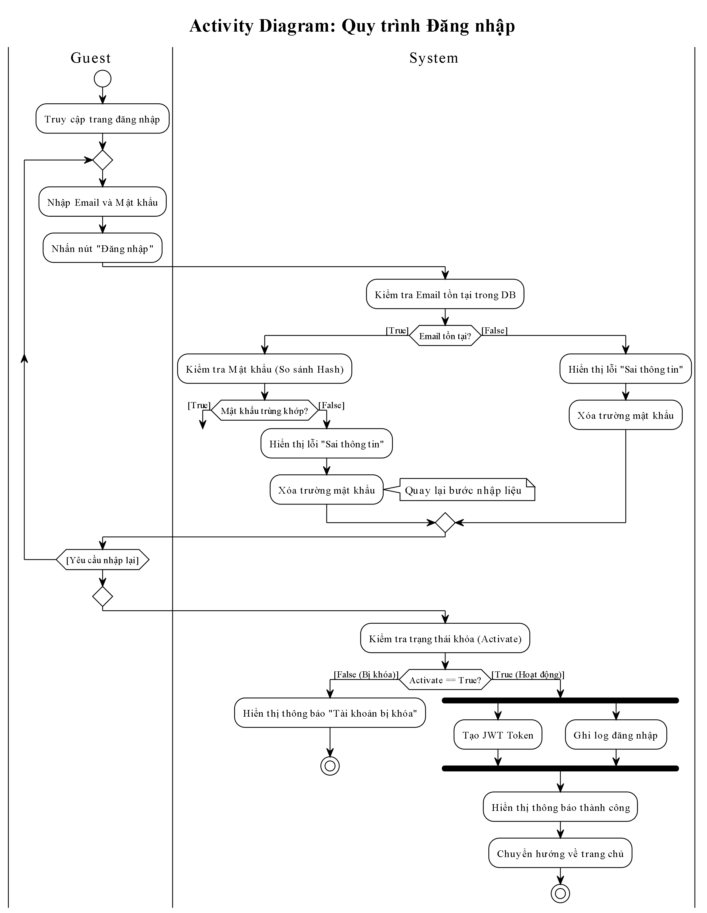
> Hình 3.49: Sơ đồ hoạt động đăng nhập

```plantuml
@startuml
!theme plain
skinparam monochrome true
skinparam shadowing false
title Activity Diagram: Quy trình Đăng nhập

|Guest|
start
:Truy cập trang đăng nhập;

repeat
  :Nhập Email và Mật khẩu;
  :Nhấn nút "Đăng nhập";

  |System|
  :Kiểm tra Email tồn tại trong DB;

  if (Email tồn tại?) then ([True])
    :Kiểm tra Mật khẩu (So sánh Hash);

    if (Mật khẩu trùng khớp?) then ([True])
      :Kiểm tra trạng thái khóa (Activate);

      if (Activate == True?) then ([True (Hoạt động)])
        fork
          :Tạo JWT Token;
        fork again
          :Ghi log đăng nhập;
        end fork

        :Hiển thị thông báo thành công;
        :Chuyển hướng về trang chủ;
        stop
      else ([False (Bị khóa)])
        :Hiển thị thông báo "Tài khoản bị khóa";
        stop
      endif
    else ([False])
      :Hiển thị lỗi "Sai thông tin";
      :Xóa trường mật khẩu;
    endif
  else ([False])
    :Hiển thị lỗi "Sai thông tin";
    :Xóa trường mật khẩu;
  endif

  |Guest|
  :[Yêu cầu nhập lại];
repeat while (Yêu cầu nhập lại?) is ([Yêu cầu nhập lại])

@enduml
```

- Sơ đồ hoạt động đăng ký

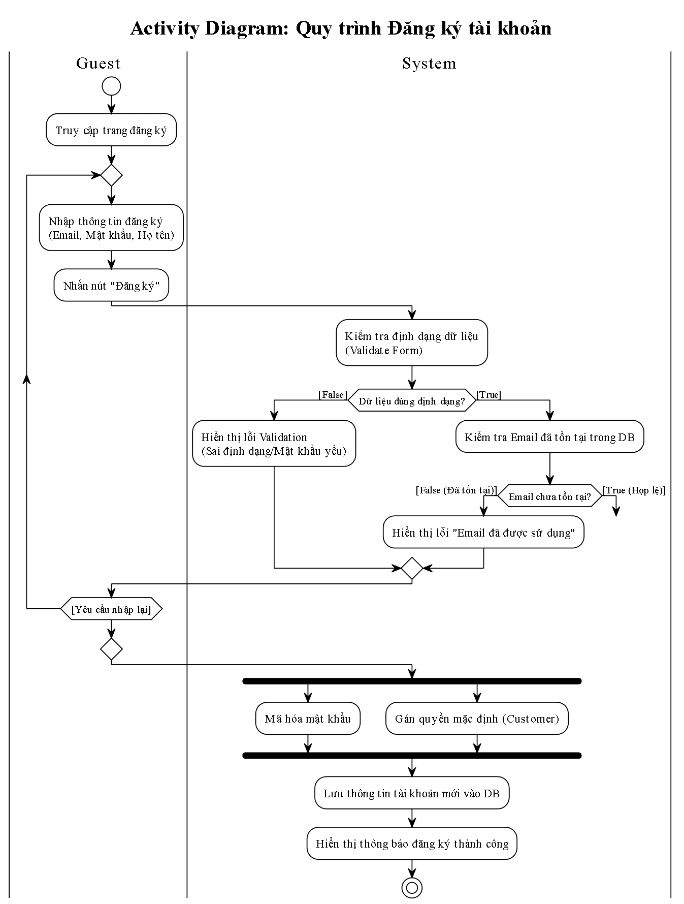
> Hình 3.50: Sơ đồ hoạt động đăng ký tài khoản

```plantuml
@startuml
!theme plain
skinparam monochrome true
skinparam shadowing false
title Activity Diagram: Quy trình Đăng ký tài khoản

|Guest|
start
:Truy cập trang đăng ký;

repeat
  :Nhập thông tin đăng ký
(Email, Mật khẩu, Họ tên);
  :Nhấn nút "Đăng ký";

  |System|
  :Kiểm tra định dạng dữ liệu
(Validate Form);

  if (Dữ liệu đúng định dạng?) then ([True])
    :Kiểm tra Email đã tồn tại trong DB;

    if (Email chưa tồn tại?) then ([True (Hợp lệ)])
      fork
        :Mã hóa mật khẩu;
      fork again
        :Gán quyền mặc định (Customer);
      end fork

      :Lưu thông tin tài khoản mới vào DB;
      :Hiển thị thông báo đăng ký thành công;
      stop
    else ([False (Đã tồn tại)])
      :Hiển thị lỗi "Email đã được sử dụng";
    endif
  else ([False])
    :Hiển thị lỗi Validation
(Sai định dạng/Mật khẩu yếu);
  endif

  |Guest|
  :[Yêu cầu nhập lại];
repeat while (Yêu cầu nhập lại?) is ([Yêu cầu nhập lại])

@enduml
```

- Sơ đồ hoạt động cập nhật thông tin cá nhân

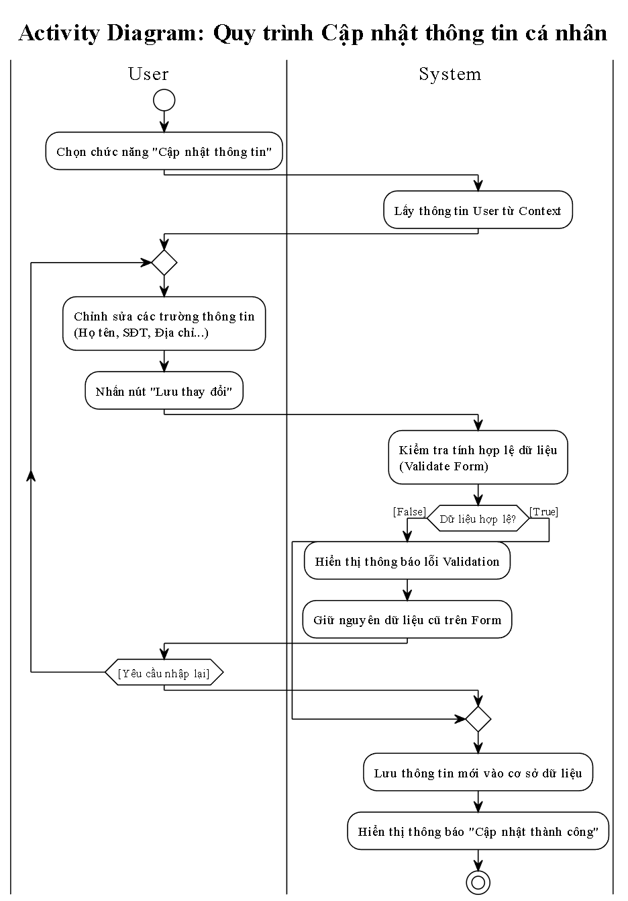
> Hình 3.51: Sơ đồ hoạt động cập nhật thông tin cá nhân

```plantuml
@startuml
!theme plain
skinparam monochrome true
skinparam shadowing false
title Activity Diagram: Quy trình Cập nhật thông tin cá nhân

|User|
start
:Chọn chức năng "Cập nhật thông tin";

|System|
:Lấy thông tin User từ Context;

|User|
repeat
  :Chỉnh sửa các trường thông tin
(Họ tên, SĐT, Địa chỉ...);
  :Nhấn nút "Lưu thay đổi";

  |System|
  :Kiểm tra tính hợp lệ dữ liệu
(Validate Form);

  if (Dữ liệu hợp lệ?) then ([True])
    :Lưu thông tin mới vào cơ sở dữ liệu;
    :Hiển thị thông báo "Cập nhật thành công";
    stop
  else ([False])
    :Hiển thị thông báo lỗi Validation;
    :Giữ nguyên dữ liệu cũ trên Form;
  endif

  |User|
  :[Yêu cầu nhập lại];
repeat while (Yêu cầu nhập lại?) is ([Yêu cầu nhập lại])

@enduml
```

- Sơ đồ hoạt động đổi mật khẩu

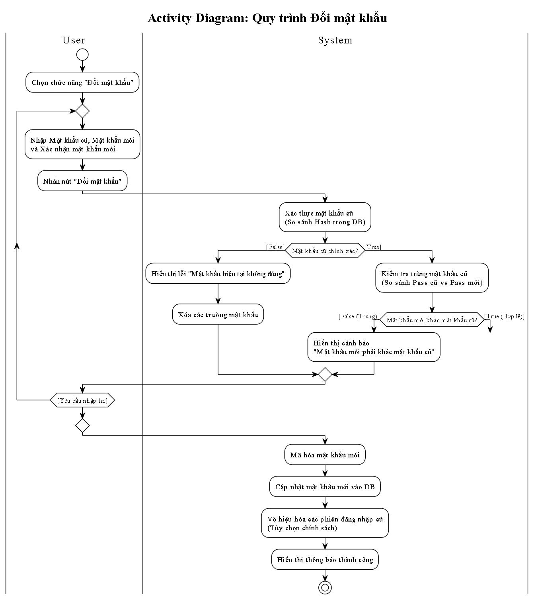
> Hình 3.52: Sơ đồ hoạt động đổi mật khẩu

```plantuml
@startuml
!theme plain
skinparam monochrome true
skinparam shadowing false
title Activity Diagram: Quy trình Đổi mật khẩu

|User|
start
:Chọn chức năng "Đổi mật khẩu";

repeat
  :Nhập Mật khẩu cũ, Mật khẩu mới
và Xác nhận mật khẩu mới;
  :Nhấn nút "Đổi mật khẩu";

  |System|
  :Xác thực mật khẩu cũ
(So sánh Hash trong DB);

  if (Mật khẩu cũ chính xác?) then ([True])
    :Kiểm tra trùng mật khẩu cũ
(So sánh Pass cũ vs Pass mới);

    if (Mật khẩu mới khác mật khẩu cũ?) then ([True (Hợp lệ)])
      :Mã hóa mật khẩu mới;
      :Cập nhật mật khẩu mới vào DB;
      :Vô hiệu hóa các phiên đăng nhập cũ
(Tùy chọn chính sách);
      :Hiển thị thông báo thành công;
      stop
    else ([False (Trùng)])
      :Hiển thị cảnh báo
"Mật khẩu mới phải khác mật khẩu cũ";
    endif
  else ([False])
    :Hiển thị lỗi "Mật khẩu hiện tại không đúng";
    :Xóa các trường mật khẩu;
  endif

  |User|
  :[Yêu cầu nhập lại];
repeat while (Yêu cầu nhập lại?) is ([Yêu cầu nhập lại])

@enduml
```

- Sơ đồ hoạt động xem thông tin Profile

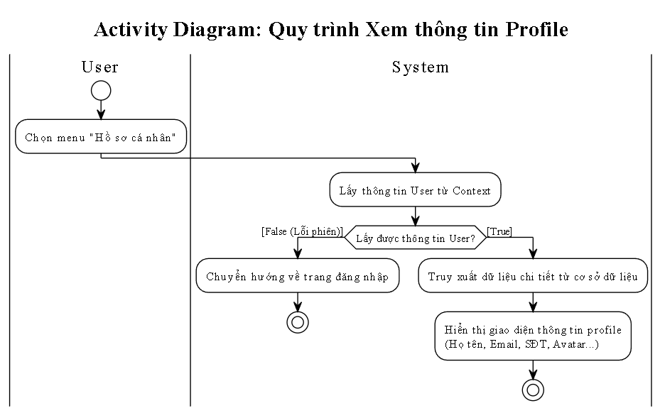
> Hình 3.53: Sơ đồ hoạt động xem thông tin profile

```plantuml
@startuml
!theme plain
skinparam monochrome true
skinparam shadowing false
title Activity Diagram: Quy trình Xem thông tin Profile

|User|
start
:Chọn menu "Hồ sơ cá nhân";

|System|
:Lấy thông tin User từ Context;

if (Lấy được thông tin User?) then ([True])
  :Truy xuất dữ liệu chi tiết từ cơ sở dữ liệu;
  :Hiển thị giao diện thông tin profile
(Họ tên, Email, SĐT, Avatar...);
  stop
else ([False (Lỗi phiên)])
  :Chuyển hướng về trang đăng nhập;
  stop
endif

@enduml
```

- Sơ đồ hoạt động xóa tài khoản cá nhân

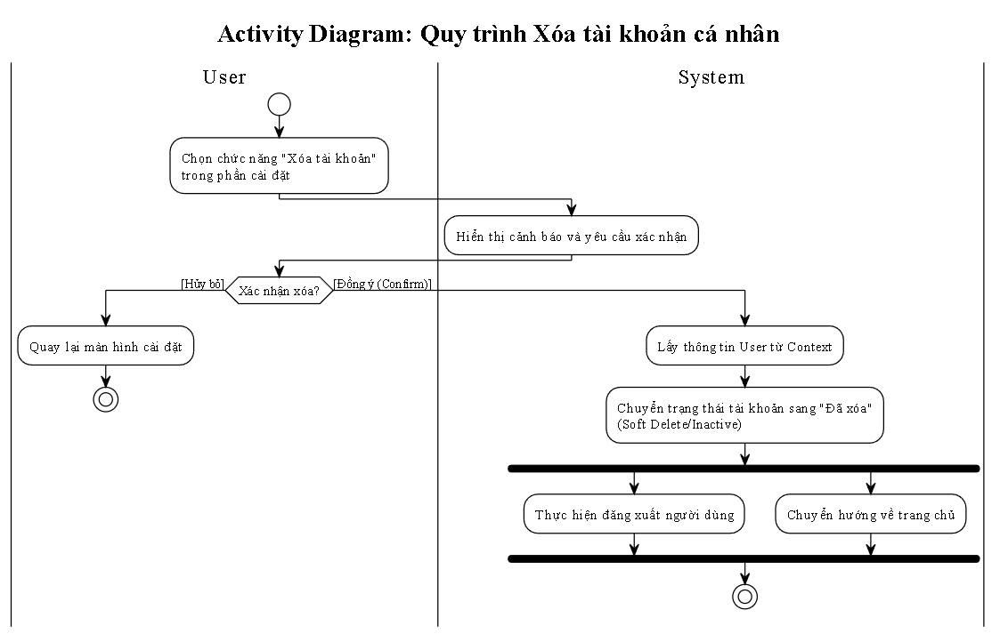
> Hình 3.54: Sơ đồ hoạt động xóa tài khoản cá nhân

```plantuml
@startuml
!theme plain
skinparam monochrome true
skinparam shadowing false
title Activity Diagram: Quy trình Xóa tài khoản cá nhân

|User|
start
:Chọn chức năng "Xóa tài khoản"
trong phần cài đặt;

|System|
:Hiển thị cảnh báo và yêu cầu xác nhận;

|User|
if (Xác nhận xóa?) then ([Đồng ý (Confirm)])
  |System|
  :Lấy thông tin User từ Context;
  :Chuyển trạng thái tài khoản sang "Đã xóa"
(Soft Delete/Inactive);

  fork
    :Thực hiện đăng xuất người dùng;
  fork again
    :Chuyển hướng về trang chủ;
  end fork

  stop
else ([Hủy bỏ])
  :Quay lại màn hình cài đặt;
  stop
endif

@enduml
```

- Sơ đồ hoạt động xem lịch sử đặt phòng

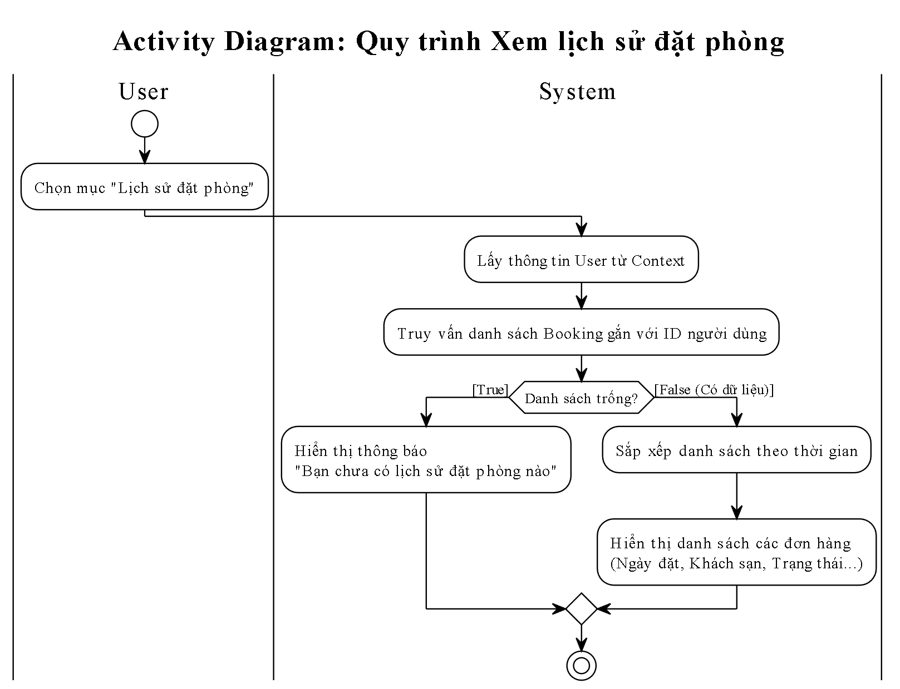
> Hình 3.55: Sơ đồ hoạt động xem lịch sử đặt phòng

```plantuml
@startuml
!theme plain
skinparam monochrome true
skinparam shadowing false
title Activity Diagram: Quy trình Xem lịch sử đặt phòng

|User|
start
:Chọn mục "Lịch sử đặt phòng";

|System|
:Lấy thông tin User từ Context;
:Truy vấn danh sách Booking gắn với ID người dùng;

if (Danh sách trống?) then ([True])
  :Hiển thị thông báo
"Bạn chưa có lịch sử đặt phòng nào";
  stop
else ([False (Có dữ liệu)])
  :Sắp xếp danh sách theo thời gian;
  :Hiển thị danh sách các đơn hàng
(Ngày đặt, Khách sạn, Trạng thái...);
  stop
endif

@enduml
```

- Sơ đồ hoạt động xem danh sách người dùng

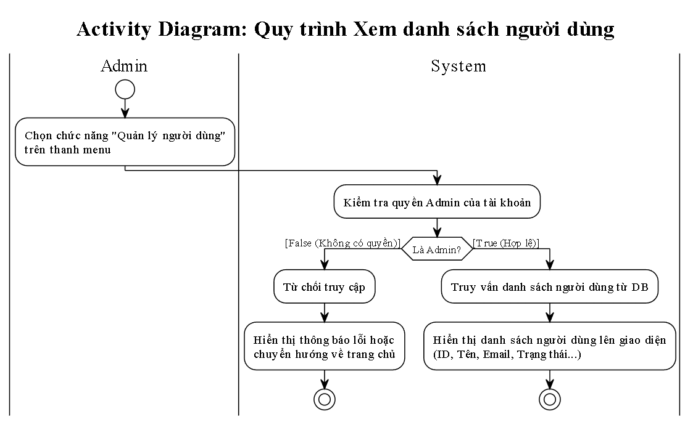
> Hình 3.56: Sơ đồ hoạt động xem danh sách người dùng

```plantuml
@startuml
!theme plain
skinparam monochrome true
skinparam shadowing false
title Activity Diagram: Quy trình Xem danh sách người dùng

|Admin|
start
:Chọn chức năng "Quản lý người dùng"
trên thanh menu;

|System|
:Kiểm tra quyền Admin của tài khoản;

if (Là Admin?) then ([True (Hợp lệ)])
  :Truy vấn danh sách người dùng từ DB;
  :Hiển thị danh sách người dùng lên giao diện
(ID, Tên, Email, Trạng thái...);
  stop
else ([False (Không có quyền)])
  :Từ chối truy cập;
  :Hiển thị thông báo lỗi hoặc
chuyển hướng về trang chủ;
  stop
endif

@enduml
```

- Sơ đồ hoạt động khóa tài khoản người dùng

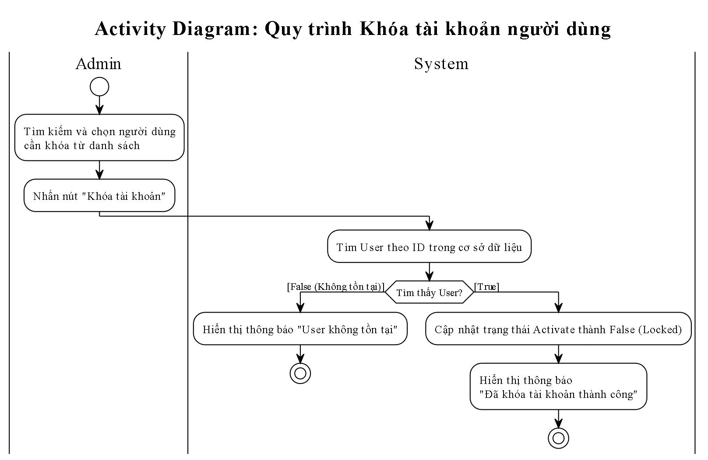
> Hình 3.57: Sơ đồ hoạt động khóa tài khoản người dùng

```plantuml
@startuml
!theme plain
skinparam monochrome true
skinparam shadowing false
title Activity Diagram: Quy trình Khóa tài khoản người dùng

|Admin|
start
:Tìm kiếm và chọn người dùng
cần khóa từ danh sách;
:Nhấn nút "Khóa tài khoản";

|System|
:Tìm User theo ID trong cơ sở dữ liệu;

if (Tìm thấy User?) then ([True])
  :Cập nhật trạng thái Activate thành False (Locked);
  :Hiển thị thông báo
"Đã khóa tài khoản thành công";
  stop
else ([False (Không tồn tại)])
  :Hiển thị thông báo "User không tồn tại";
  stop
endif

@enduml
```

- Sơ đồ hoạt động mở khóa tài khoản người dùng

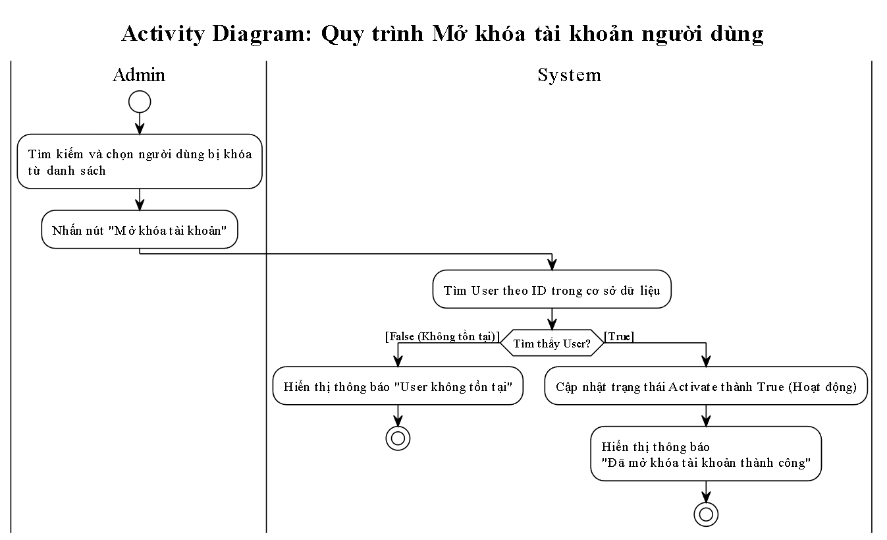
> Hình 3.58: Sơ đồ hoạt động mở khóa tài khoản người dùng

```plantuml
@startuml
!theme plain
skinparam monochrome true
skinparam shadowing false
title Activity Diagram: Quy trình Mở khóa tài khoản người dùng

|Admin|
start
:Tìm kiếm và chọn người dùng bị khóa
từ danh sách;
:Nhấn nút "Mở khóa tài khoản";

|System|
:Tìm User theo ID trong cơ sở dữ liệu;

if (Tìm thấy User?) then ([True])
  :Cập nhật trạng thái Activate thành True (Hoạt động);
  :Hiển thị thông báo
"Đã mở khóa tài khoản thành công";
  stop
else ([False (Không tồn tại)])
  :Hiển thị thông báo "User không tồn tại";
  stop
endif

@enduml
```

- Sơ đồ hoạt động thêm phòng mới

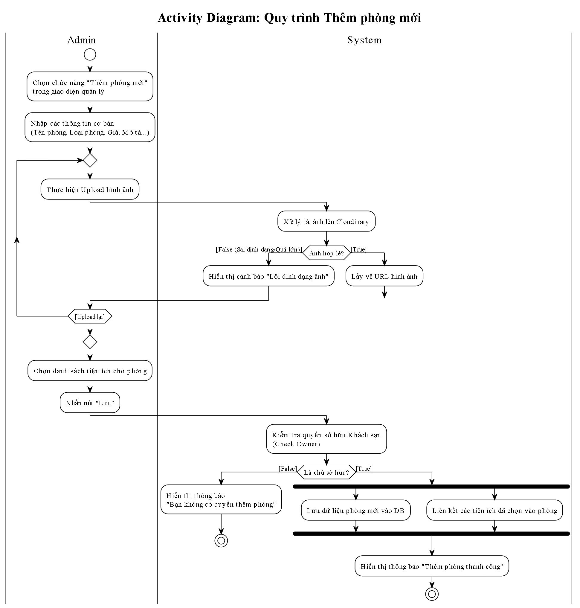
> Hình 3.59: Sơ đồ hoạt động thêm phòng mới

```plantuml
@startuml
!theme plain
skinparam monochrome true
skinparam shadowing false
title Activity Diagram: Quy trình Thêm phòng mới

|Admin|
start
:Chọn chức năng "Thêm phòng mới"
trong giao diện quản lý;
:Nhập các thông tin cơ bản
(Tên phòng, Loại phòng, Giá, Mô tả...);

repeat
  :Thực hiện Upload hình ảnh;

  |System|
  :Xử lý tải ảnh lên Cloudinary;

  if (Ảnh hợp lệ?) then ([True])
    :Lấy về URL hình ảnh;
  else ([False (Sai định dạng/Quá lớn)])
    :Hiển thị cảnh báo "Lỗi định dạng ảnh";

    |Admin|
    :[Upload lại];
  endif
repeat while (Upload lại?) is ([Upload lại])

|Admin|
:Chọn danh sách tiện ích cho phòng;
:Nhấn nút "Lưu";

|System|
:Kiểm tra quyền sở hữu Khách sạn
(Check Owner);

if (Là chủ sở hữu?) then ([True])
  fork
    :Lưu dữ liệu phòng mới vào DB;
  fork again
    :Liên kết các tiện ích đã chọn vào phòng;
  end fork

  :Hiển thị thông báo "Thêm phòng thành công";
  stop
else ([False])
  :Hiển thị thông báo
"Bạn không có quyền thêm phòng";
  stop
endif

@enduml
```

- Sơ đồ hoạt động cập nhật thông tin phòng

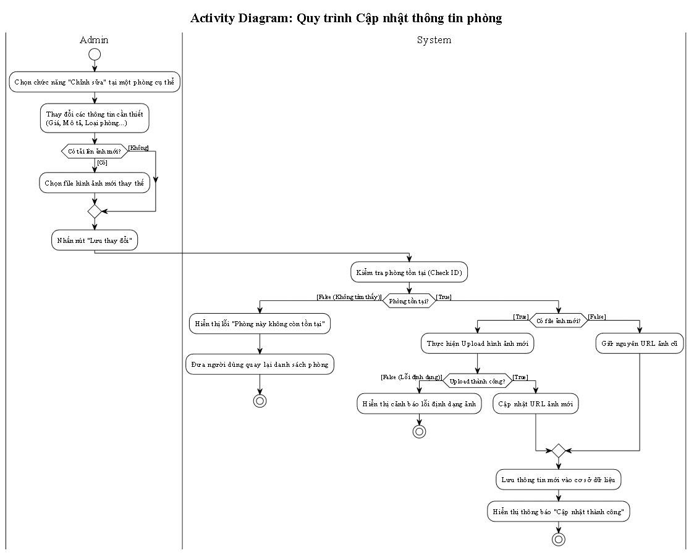
> Hình 3.60: Sơ đồ hoạt động cập nhật thông tin phòng

```plantuml
@startuml
!theme plain
skinparam monochrome true
skinparam shadowing false
title Activity Diagram: Quy trình Cập nhật thông tin phòng

|Admin|
start
:Chọn chức năng "Chỉnh sửa" tại một phòng cụ thể;
:Thay đổi các thông tin cần thiết
(Giá, Mô tả, Loại phòng...);

if (Có tải ảnh mới?) then ([Có])
  :Chọn file hình ảnh mới thay thế;
else ([Không])
endif

:Nhấn nút "Lưu thay đổi";

|System|
:Kiểm tra phòng tồn tại (Check ID);

if (Phòng tồn tại?) then ([True])
  if (Có file ảnh mới?) then ([True])
    :Thực hiện Upload hình ảnh mới;

    if (Upload thành công?) then ([True])
      :Cập nhật URL ảnh mới;
    else ([False (Lỗi định dạng)])
      :Hiển thị cảnh báo lỗi định dạng ảnh;
      stop
    endif
  else ([False])
    :Giữ nguyên URL ảnh cũ;
  endif

  :Lưu thông tin mới vào cơ sở dữ liệu;
  :Hiển thị thông báo "Cập nhật thành công";
  stop
else ([False (Không tìm thấy)])
  :Hiển thị lỗi "Phòng này không còn tồn tại";
  :Đưa người dùng quay lại danh sách phòng;
  stop
endif

@enduml
```

- Sơ đồ hoạt động xóa phòng

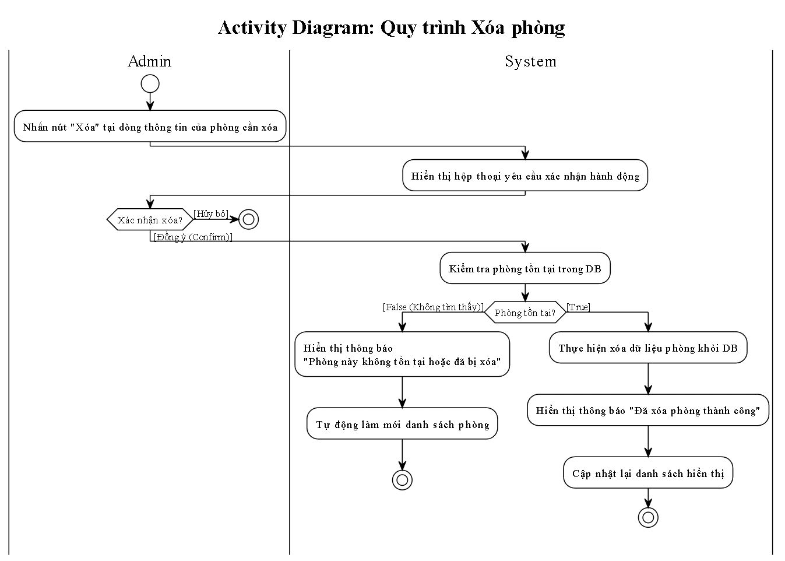
> Hình 3.61: Sơ đồ hoạt động xóa phòng

```plantuml
@startuml
!theme plain
skinparam monochrome true
skinparam shadowing false
title Activity Diagram: Quy trình Xóa phòng

|Admin|
start
:Nhấn nút "Xóa" tại dòng thông tin của phòng cần xóa;

|System|
:Hiển thị hộp thoại yêu cầu xác nhận hành động;

|Admin|
if (Xác nhận xóa?) then ([Đồng ý (Confirm)])
  |System|
  :Kiểm tra phòng tồn tại trong DB;

  if (Phòng tồn tại?) then ([True])
    :Thực hiện xóa dữ liệu phòng khỏi DB;
    :Hiển thị thông báo "Đã xóa phòng thành công";
    :Cập nhật lại danh sách hiển thị;
    stop
  else ([False (Không tìm thấy)])
    :Hiển thị thông báo
"Phòng này không tồn tại hoặc đã bị xóa";
    :Tự động làm mới danh sách phòng;
    stop
  endif
else ([Hủy bỏ])
  stop
endif

@enduml
```

- Sơ đồ hoạt động xem danh sách tất cả phòng

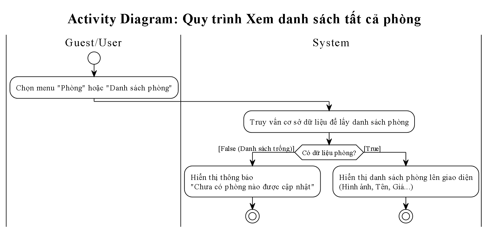
> Hình 3.62: Sơ đồ hoạt động xem danh sách tất cả phòng

```plantuml
@startuml
!theme plain
skinparam monochrome true
skinparam shadowing false
title Activity Diagram: Quy trình Xem danh sách tất cả phòng

|Guest/User|
start
:Chọn menu "Phòng" hoặc "Danh sách phòng";

|System|
:Truy vấn cơ sở dữ liệu để lấy danh sách phòng;

if (Có dữ liệu phòng?) then ([True])
  :Hiển thị danh sách phòng lên giao diện
(Hình ảnh, Tên, Giá...);
  stop
else ([False (Danh sách trống)])
  :Hiển thị thông báo
"Chưa có phòng nào được cập nhật";
  stop
endif

@enduml
```

- Sơ đồ hoạt động tìm phòng trống theo ngày

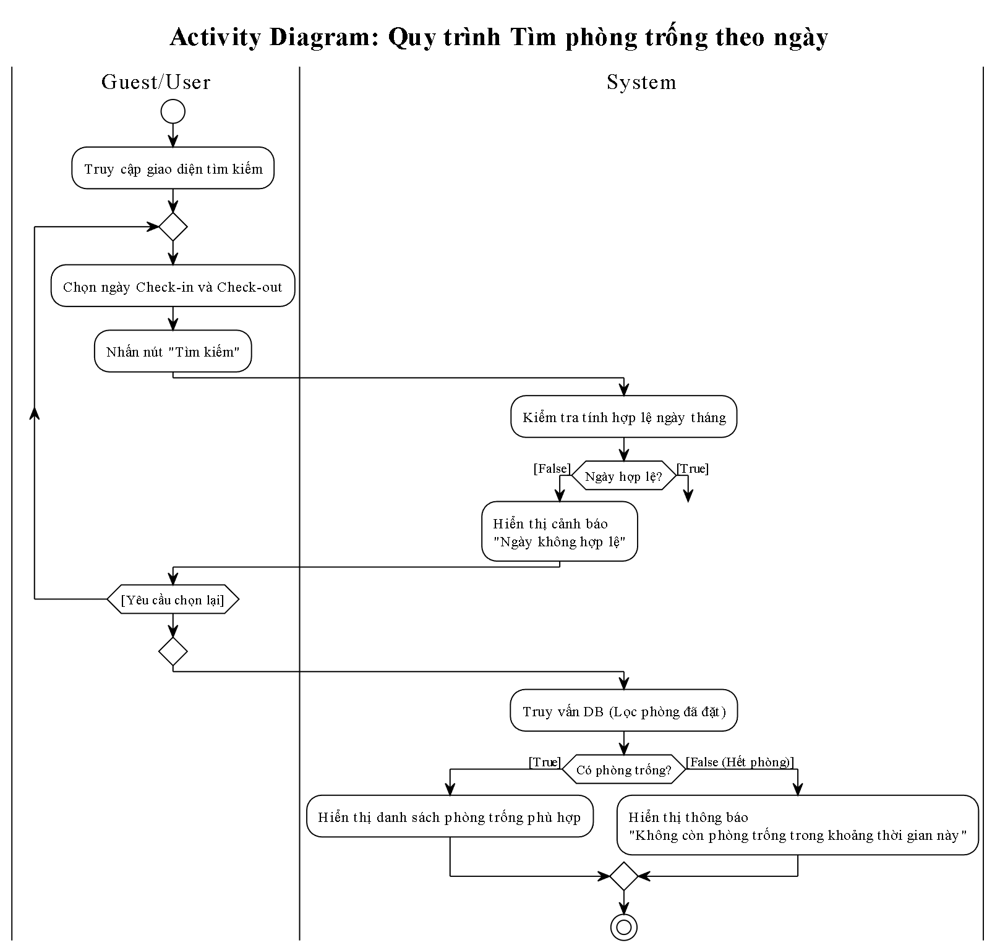
> Hình 3.63: Sơ đồ hoạt động tìm phòng trống theo ngày

```plantuml
@startuml
!theme plain
skinparam monochrome true
skinparam shadowing false
title Activity Diagram: Quy trình Tìm phòng trống theo ngày

|Guest/User|
start
:Truy cập giao diện tìm kiếm;

repeat
  :Chọn ngày Check-in và Check-out;
  :Nhấn nút "Tìm kiếm";

  |System|
  :Kiểm tra tính hợp lệ ngày tháng;

  if (Ngày hợp lệ?) then ([True])
  else ([False])
    :Hiển thị cảnh báo
"Ngày không hợp lệ";

    |Guest/User|
    :[Yêu cầu chọn lại];
  endif
repeat while (Chọn lại?) is ([Yêu cầu chọn lại])

|System|
:Truy vấn DB (Lọc phòng đã đặt);

if (Có phòng trống?) then ([True])
  :Hiển thị danh sách phòng trống phù hợp;
else ([False (Hết phòng)])
  :Hiển thị thông báo
"Không còn phòng trống trong khoảng thời gian này";
endif

stop

@enduml
```

- Sơ đồ hoạt động xem chi tiết phòng

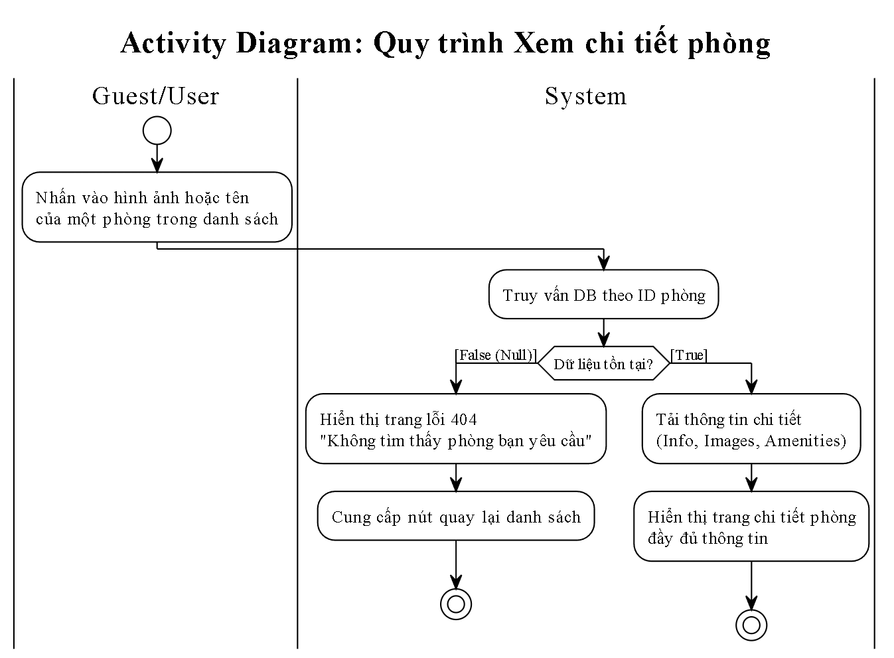
> Hình 3.64: Sơ đồ hoạt động xem chi tiết phòng

```plantuml
@startuml
!theme plain
skinparam monochrome true
skinparam shadowing false
title Activity Diagram: Quy trình Xem chi tiết phòng

|Guest/User|
start
:Nhấn vào hình ảnh hoặc tên\ncủa một phòng trong danh sách;

|System|
:Truy vấn DB theo ID phòng;
if (Dữ liệu tồn tại?) then ([True])
  :Tải thông tin chi tiết\n(Info, Images, Amenities);
  :Hiển thị trang chi tiết phòng\nđầy đủ thông tin;
  stop
else ([False (Null)])
  :Hiển thị trang lỗi 404\n"Không tìm thấy phòng bạn yêu cầu";
  :Cung cấp nút quay lại danh sách;
  stop
endif
@enduml
```

- Sơ đồ hoạt động tìm kiếm phòng

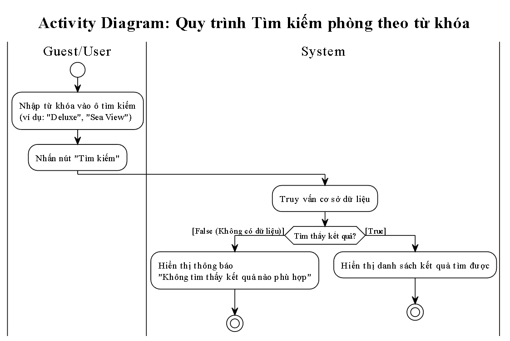
> Hình 3.65: Sơ đồ hoạt động tìm kiếm phòng

```plantuml
@startuml
!theme plain
skinparam monochrome true
skinparam shadowing false
title Activity Diagram: Quy trình Tìm kiếm phòng theo từ khóa

|Guest/User|
start
:Nhập từ khóa vào ô tìm kiếm\n(ví dụ: "Deluxe", "Sea View");
:Nhấn nút "Tìm kiếm";

|System|
:Truy vấn cơ sở dữ liệu;
if (Tìm thấy kết quả?) then ([True])
  :Hiển thị danh sách kết quả tìm được;
  stop
else ([False (Không có dữ liệu)])
  :Hiển thị thông báo\n"Không tìm thấy kết quả nào phù hợp";
  stop
endif
@enduml
```

- Sơ đồ hoạt động xem loại phòng

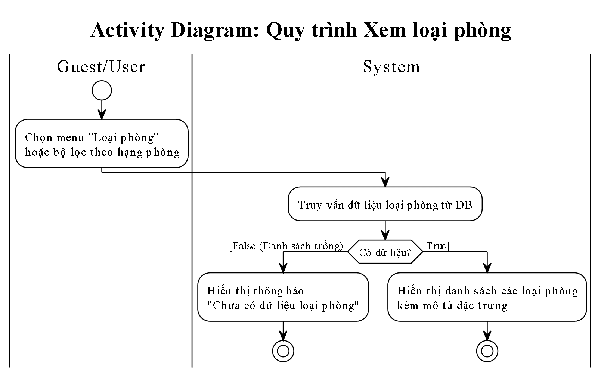
> Hình 3.66: Sơ đồ hoạt động xem loại phòng

```plantuml
@startuml
!theme plain
skinparam monochrome true
skinparam shadowing false
title Activity Diagram: Quy trình Xem loại phòng

|Guest/User|
start
:Chọn menu "Loại phòng"\nhoặc bộ lọc theo hạng phòng;

|System|
:Truy vấn dữ liệu loại phòng từ DB;
if (Có dữ liệu?) then ([True])
  :Hiển thị danh sách các loại phòng\nkèm mô tả đặc trưng;
  stop
else ([False (Danh sách trống)])
  :Hiển thị thông báo\n"Chưa có dữ liệu loại phòng";
  stop
endif
@enduml
```

- Sơ đồ hoạt động thêm khách sạn mới

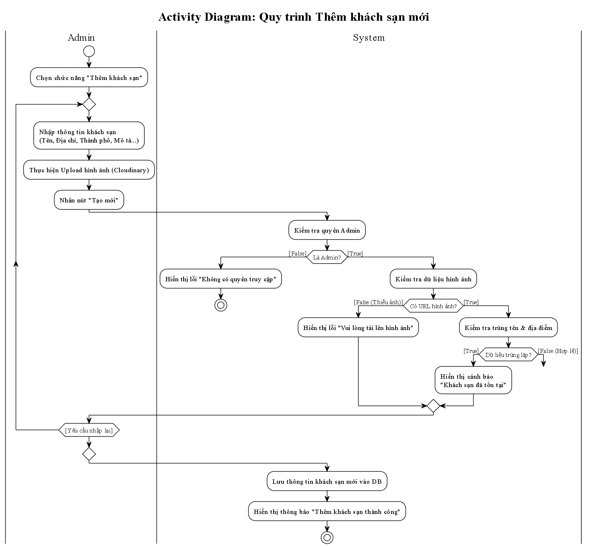
> Hình 3.67: Sơ đồ hoạt động thêm khách sạn mới

```plantuml
@startuml
!theme plain
skinparam monochrome true
skinparam shadowing false
title Activity Diagram: Quy trình Thêm khách sạn mới

|Admin|
start
:Chọn chức năng "Thêm khách sạn";

repeat
  :Nhập thông tin khách sạn\n(Tên, Địa chỉ, Thành phố, Mô tả...);
  :Thực hiện Upload hình ảnh (Cloudinary);
  :Nhấn nút "Tạo mới";

  |System|
  :Kiểm tra quyền Admin;
  if (Là Admin?) then ([True])
    :Kiểm tra dữ liệu hình ảnh;
    if (Có URL hình ảnh?) then ([True])
      :Kiểm tra trùng tên & địa điểm;
      if (Dữ liệu trùng lặp?) then ([False (Hợp lệ)])
      else ([True])
        :Hiển thị cảnh báo\n"Khách sạn đã tồn tại";
        |Admin|
        :[Yêu cầu nhập lại];
      endif
    else ([False (Thiếu ảnh)])
      :Hiển thị lỗi "Vui lòng tải lên hình ảnh";
      |Admin|
      :[Yêu cầu nhập lại];
    endif
  else ([False])
    :Hiển thị lỗi: "Không có quyền truy cập";
    stop
  endif
repeat while (Dữ liệu hợp lệ?) is ([False]) not ([True])

|System|
:Lưu thông tin khách sạn mới vào DB;
:Hiển thị thông báo "Thêm khách sạn thành công";
stop
@enduml
```

- Sơ đồ hoạt động cập nhật khách sạn

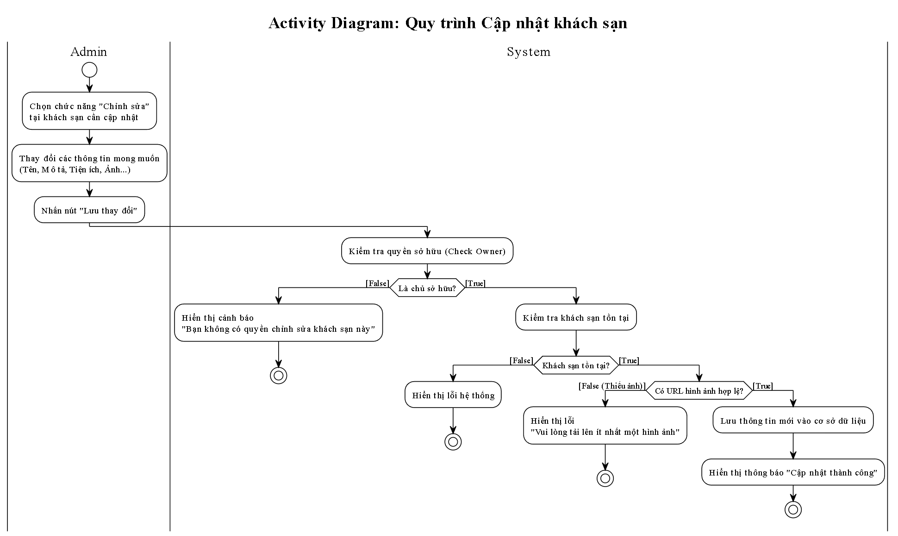
> Hình 3.68: Sơ đồ hoạt động cập nhật khách sạn

```plantuml
@startuml
!theme plain
skinparam monochrome true
skinparam shadowing false
title Activity Diagram: Quy trình Cập nhật khách sạn

|Admin|
start
:Chọn chức năng "Chỉnh sửa"\ntại khách sạn cần cập nhật;
:Thay đổi các thông tin mong muốn\n(Tên, Mô tả, Tiện ích, Ảnh...);
:Nhấn nút "Lưu thay đổi";

|System|
:Kiểm tra quyền sở hữu (Check Owner);
if (Là chủ sở hữu?) then ([True])
  :Kiểm tra khách sạn tồn tại;
  if (Khách sạn tồn tại?) then ([True])
    if (Có URL hình ảnh hợp lệ?) then ([True])
      :Lưu thông tin mới vào cơ sở dữ liệu;
      :Hiển thị thông báo "Cập nhật thành công";
      stop
    else ([False (Thiếu ảnh)])
      :Hiển thị lỗi\n"Vui lòng tải lên ít nhất một hình ảnh";
      stop
    endif
  else ([False])
    :Hiển thị lỗi hệ thống;
    stop
  endif
else ([False])
  :Hiển thị cảnh báo\n"Bạn không có quyền chỉnh sửa khách sạn này";
  stop
endif
@enduml
```

- Sơ đồ hoạt động xóa khách sạn

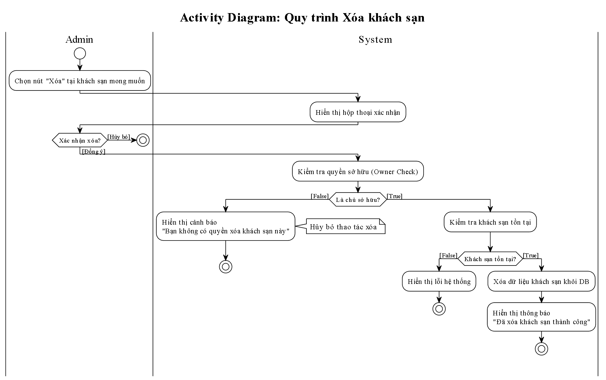
> Hình 3.69: Sơ đồ hoạt động xóa khách sạn

```plantuml
@startuml
!theme plain
skinparam monochrome true
skinparam shadowing false
title Activity Diagram: Quy trình Xóa khách sạn

|Admin|
start
:Chọn nút "Xóa" tại khách sạn mong muốn;

|System|
:Hiển thị hộp thoại xác nhận;

|Admin|
if (Xác nhận xóa?) then ([Đồng ý])
  |System|
  :Kiểm tra quyền sở hữu (Owner Check);
  if (Là chủ sở hữu?) then ([True])
    :Kiểm tra khách sạn tồn tại;
    if (Khách sạn tồn tại?) then ([True])
      :Xóa dữ liệu khách sạn khỏi DB;
      :Hiển thị thông báo\n"Đã xóa khách sạn thành công";
      stop
    else ([False])
      :Hiển thị lỗi hệ thống;
      stop
    endif
  else ([False])
    :Hủy bỏ thao tác Xóa;
    :Hiển thị cảnh báo\n"Bạn không có quyền xóa khách sạn này";
    stop
  endif
else ([Hủy bỏ])
  stop
endif
@enduml
```

- Sơ đồ hoạt động xem danh sách khách sạn của tôi

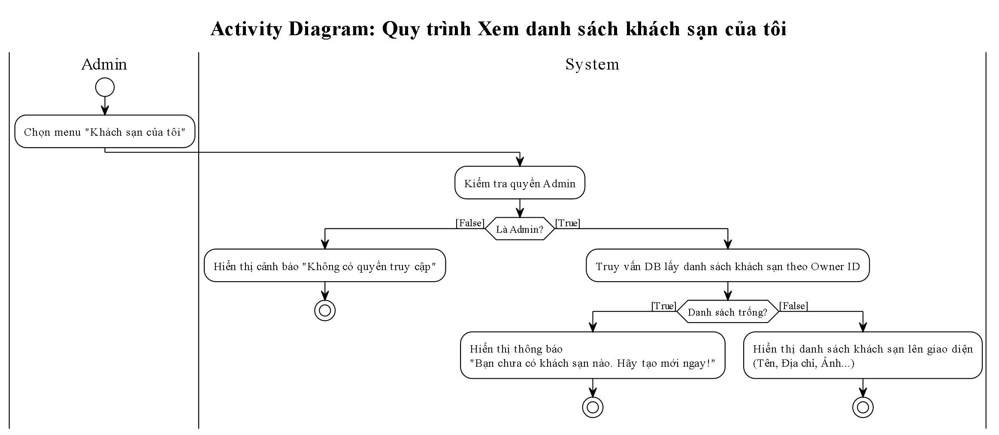
> Hình 3.70: Sơ đồ hoạt động xem danh sách khách sạn của tôi

```plantuml
@startuml
!theme plain
skinparam monochrome true
skinparam shadowing false
title Activity Diagram: Quy trình Xem danh sách khách sạn của tôi

|Admin|
start
:Chọn menu "Khách sạn của tôi";

|System|
:Kiểm tra quyền Admin;
if (Là Admin?) then ([True])
  :Truy vấn DB lấy danh sách khách sạn theo Owner ID;
  if (Danh sách trống?) then ([True])
    :Hiển thị thông báo\n"Bạn chưa có khách sạn nào. Hãy tạo mới ngay!";
    stop
  else ([False])
    :Hiển thị danh sách khách sạn lên giao diện\n(Tên, Địa chỉ, Ảnh...);
    stop
  endif
else ([False])
  :Hiển thị cảnh báo "Không có quyền truy cập";
  stop
endif
@enduml
```

- Sơ đồ hoạt động xem danh sách tất cả khách sạn

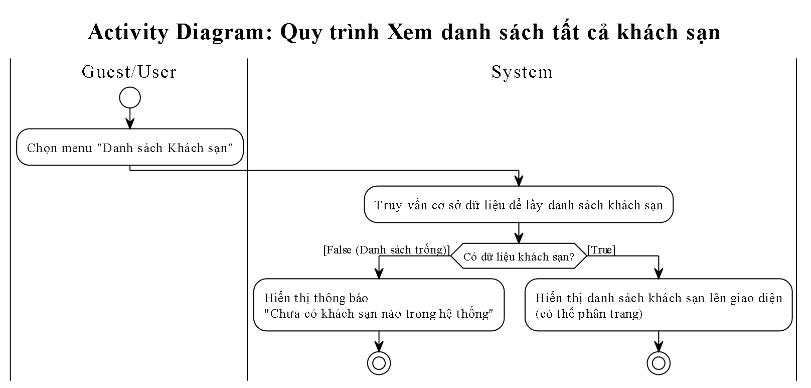
> Hình 3.71: Sơ đồ hoạt động danh sách tất cả khách sạn

```plantuml
@startuml
!theme plain
skinparam monochrome true
skinparam shadowing false
title Activity Diagram: Quy trình Xem danh sách tất cả khách sạn

|Guest/User|
start
:Chọn menu "Danh sách Khách sạn";

|System|
:Truy vấn cơ sở dữ liệu để lấy danh sách khách sạn;
if (Có dữ liệu khách sạn?) then ([True])
  :Hiển thị danh sách khách sạn lên giao diện\n(có thể phân trang);
  stop
else ([False (Danh sách trống)])
  :Hiển thị thông báo\n"Chưa có khách sạn nào trong hệ thống";
  stop
endif
@enduml
```

- Sơ đồ hoạt động xem chi tiết khách sạn

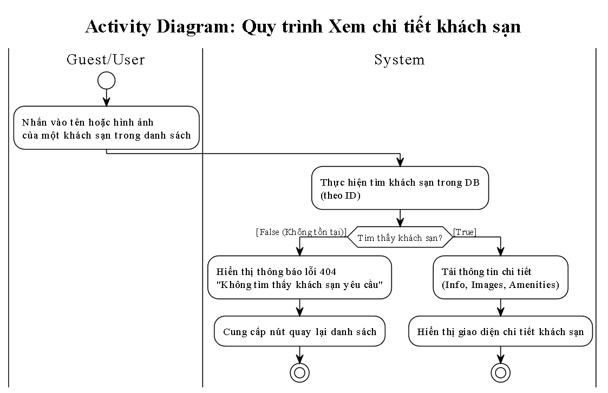
> Hình 3.72: Sơ đồ hoạt động xem chi tiết khách sạn

```plantuml
@startuml
!theme plain
skinparam monochrome true
skinparam shadowing false
title Activity Diagram: Quy trình Xem chi tiết khách sạn

|Guest/User|
start
:Nhấn vào tên hoặc hình ảnh\ncủa một khách sạn trong danh sách;

|System|
:Thực hiện tìm khách sạn trong DB\n(theo ID);
if (Tìm thấy khách sạn?) then ([True])
  :Tải thông tin chi tiết\n(Info, Images, Amenities);
  :Hiển thị giao diện chi tiết khách sạn;
  stop
else ([False (Không tồn tại)])
  :Hiển thị thông báo lỗi 404\n"Không tìm thấy khách sạn yêu cầu";
  :Cung cấp nút quay lại danh sách;
  stop
endif
@enduml
```

- Sơ đồ hoạt động tìm kiếm khách sạn

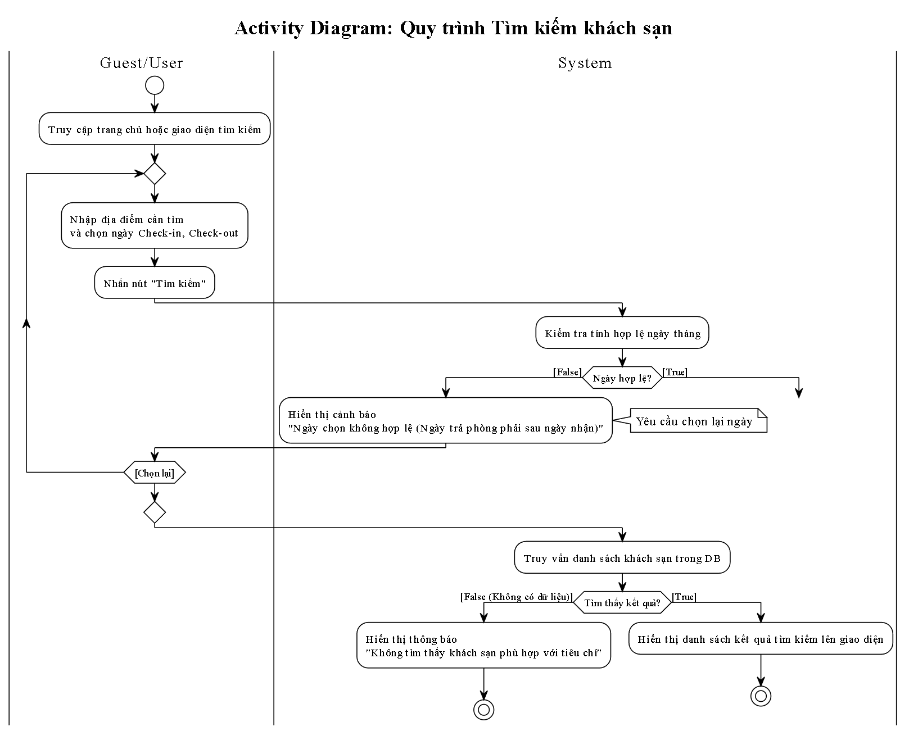
> Hình 3.73: Sơ đồ hoạt động tìm kiếm khách sạn

```plantuml
@startuml
!theme plain
skinparam monochrome true
skinparam shadowing false
title Activity Diagram: Quy trình Tìm kiếm khách sạn

|Guest/User|
start
:Truy cập trang chủ hoặc giao diện tìm kiếm;

repeat
  :Nhập địa điểm cần tìm\nvà chọn ngày Check-in, Check-out;
  :Nhấn nút "Tìm kiếm";

  |System|
  :Kiểm tra tính hợp lệ ngày tháng;
  if (Ngày hợp lệ?) then ([True])
  else ([False])
    :Hiển thị cảnh báo\n"Ngày chọn không hợp lệ (Ngày trả phòng phải sau ngày nhận)";
    :Yêu cầu chọn lại ngày;
    |Guest/User|
    :[Chọn lại];
  endif
repeat while (Ngày hợp lệ?) is ([False]) not ([True])

|System|
:Truy vấn danh sách khách sạn trong DB;
if (Tìm thấy kết quả?) then ([True])
  :Hiển thị danh sách kết quả tìm kiếm lên giao diện;
  stop
else ([False (Không có dữ liệu)])
  :Hiển thị thông báo\n"Không tìm thấy khách sạn phù hợp với tiêu chí";
  stop
endif
@enduml
```

- Sơ đồ hoạt động xem danh sách phòng của khách sạn

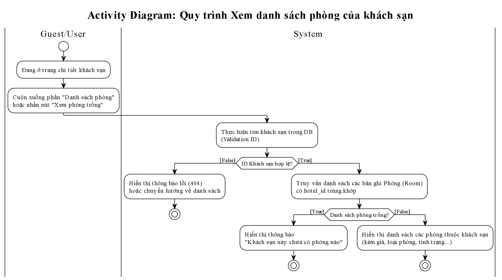
> Hình 3.74: Sơ đồ hoạt động xem danh sách phòng của khách sạn

```plantuml
@startuml
!theme plain
skinparam monochrome true
skinparam shadowing false
title Activity Diagram: Quy trình Xem danh sách phòng của khách sạn

|Guest/User|
start
:Đang ở trang chi tiết khách sạn;
:Cuộn xuống phần "Danh sách phòng"\nhoặc nhấn nút "Xem phòng trống";

|System|
:Thực hiện tìm khách sạn trong DB\n(Validation ID);
if (ID Khách sạn hợp lệ?) then ([True])
  :Truy vấn danh sách các bản ghi Phòng (Room)\ncó hotel_id trùng khớp;
  if (Danh sách phòng trống?) then ([True])
    :Hiển thị thông báo\n"Khách sạn này chưa có phòng nào";
    stop
  else ([False])
    :Hiển thị danh sách các phòng thuộc khách sạn\n(kèm giá, loại phòng, tình trạng...);
    stop
  endif
else ([False])
  :Hiển thị thông báo lỗi (404)\nhoặc chuyển hướng về danh sách;
  stop
endif
@enduml
```

- Sơ đồ hoạt động xem danh sách tất cả Booking

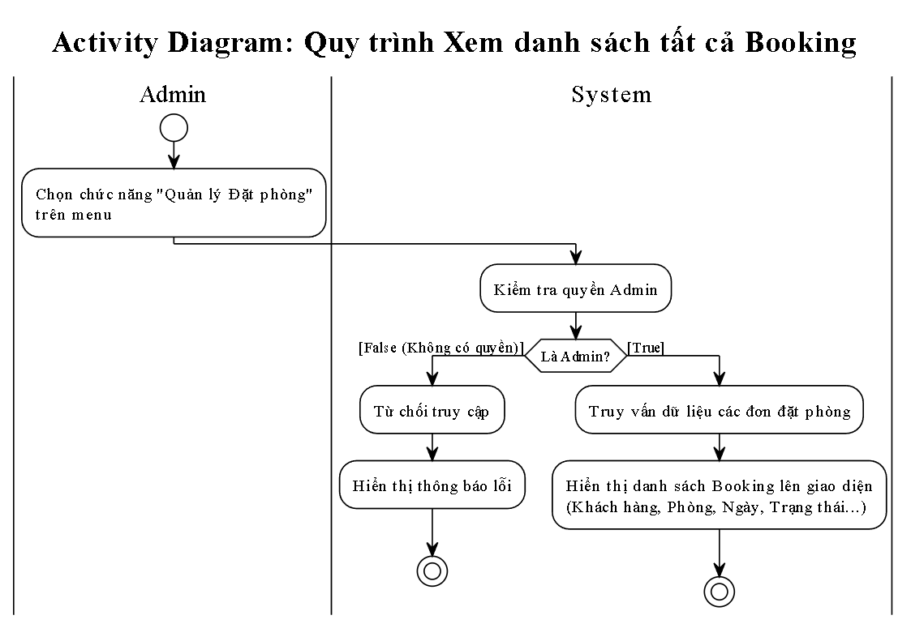
> Hình 3.75: Sơ đồ hoạt động xem danh sách tất cả Booking

```plantuml
@startuml
!theme plain
skinparam monochrome true
skinparam shadowing false
title Activity Diagram: Quy trình Xem danh sách tất cả Booking

|Admin|
start
:Chọn chức năng "Quản lý Đặt phòng"\ntrên menu;

|System|
:Kiểm tra quyền Admin;
if (Là Admin?) then ([True])
  :Truy vấn dữ liệu các đơn đặt phòng;
  :Hiển thị danh sách Booking lên giao diện\n(Khách hàng, Phòng, Ngày, Trạng thái...);
  stop
else ([False (Không có quyền)])
  :Từ chối truy cập;
  :Hiển thị thông báo lỗi;
  stop
endif
@enduml
```

- Sơ đồ hoạt động cập nhật trạng thái Booking

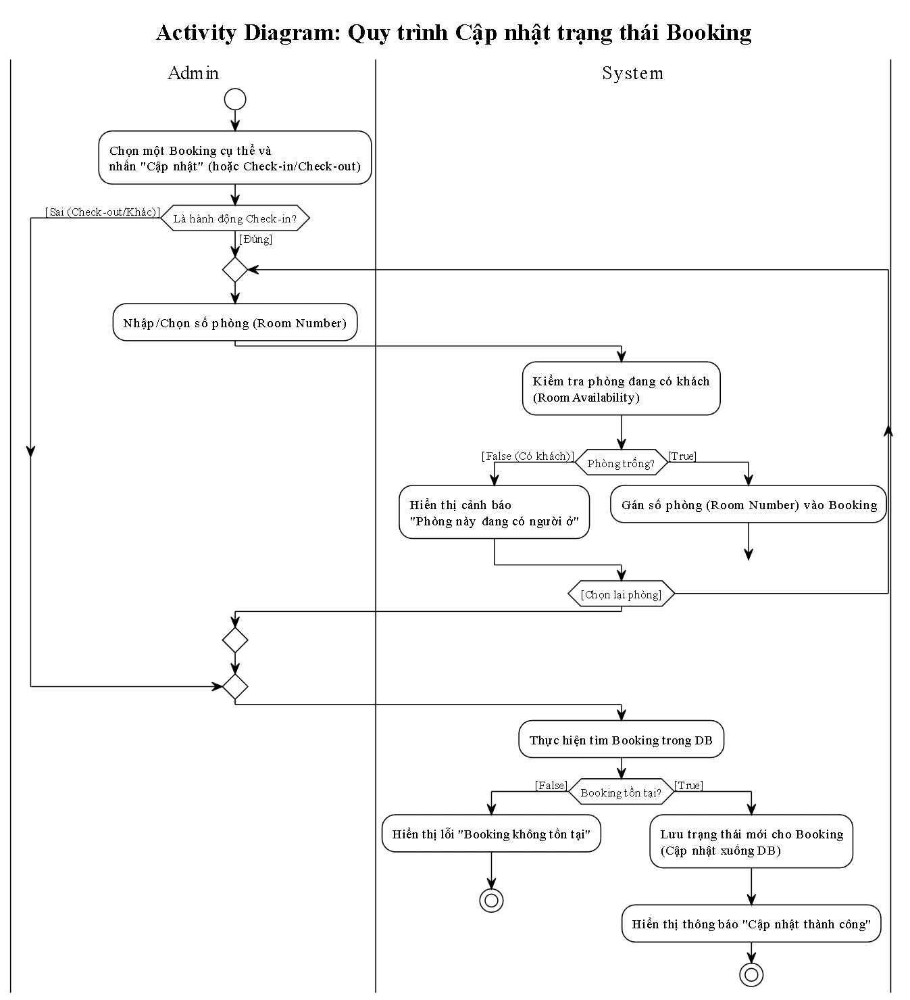
> Hình 3.76: Sơ đồ hoạt động cập nhật trạng thái booking

```plantuml
@startuml
!theme plain
skinparam monochrome true
skinparam shadowing false
title Activity Diagram: Quy trình Cập nhật trạng thái Booking

|Admin|
start
:Chọn một Booking cụ thể và\nnhấn "Cập nhật" (hoặc Check-in/Check-out);

if (Là hành động Check-in?) then ([Đúng])
  repeat
    :Nhập/Chọn số phòng (Room Number);

    |System|
    :Kiểm tra phòng đang có khách\n(Room Availability);
    if (Phòng trống?) then ([True])
      :Gán số phòng (Room Number) vào Booking;
    else ([False (Có khách)])
      :Hiển thị cảnh báo\n"Phòng này đang có người ở";
      |Admin|
      :[Chọn lại phòng];
    endif
  repeat while (Phòng trống?) is ([False]) not ([True])
else ([Sai (Check-out/Khác)])
endif

|System|
:Thực hiện tìm Booking trong DB;
if (Booking tồn tại?) then ([True])
  :Lưu trạng thái mới cho Booking\n(Cập nhật xuống DB);
  :Hiển thị thông báo "Cập nhật thành công";
  stop
else ([False])
  :Hiển thị lỗi "Booking không tồn tại";
  stop
endif
@enduml
```

- Sơ đồ hoạt động tạo Booking mới

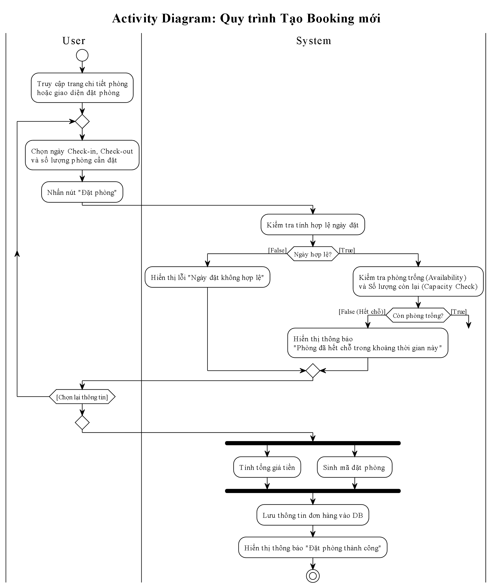
> Hình 3.77: Sơ đồ hoạt động tạo booking mới

```plantuml
@startuml
!theme plain
skinparam monochrome true
skinparam shadowing false
title Activity Diagram: Quy trình Tạo Booking mới

|User|
start
:Truy cập trang chi tiết phòng\nhoặc giao diện đặt phòng;

repeat
  :Chọn ngày Check-in, Check-out\nvà số lượng phòng cần đặt;
  :Nhấn nút "Đặt phòng";

  |System|
  :Kiểm tra tính hợp lệ ngày đặt;
  if (Ngày hợp lệ?) then ([True])
    :Kiểm tra phòng trống (Availability)\nvà Số lượng còn lại (Capacity Check);
    if (Còn phòng trống?) then ([True])
    else ([False (Hết chỗ)])
      :Hiển thị thông báo\n"Phòng đã hết chỗ trong khoảng thời gian này";
      |User|
      :[Chọn lại thông tin];
    endif
  else ([False])
    :Hiển thị lỗi "Ngày đặt không hợp lệ";
    |User|
    :[Chọn lại thông tin];
  endif
repeat while (Thông tin hợp lệ?) is ([False]) not ([True])

|System|
fork
  :Tính tổng giá tiền;
fork again
  :Sinh mã đặt phòng;
end fork
:Lưu thông tin đơn hàng vào DB;
:Hiển thị thông báo "Đặt phòng thành công";
stop
@enduml
```

- Sơ đồ hoạt động tra cứu Booking theo mã

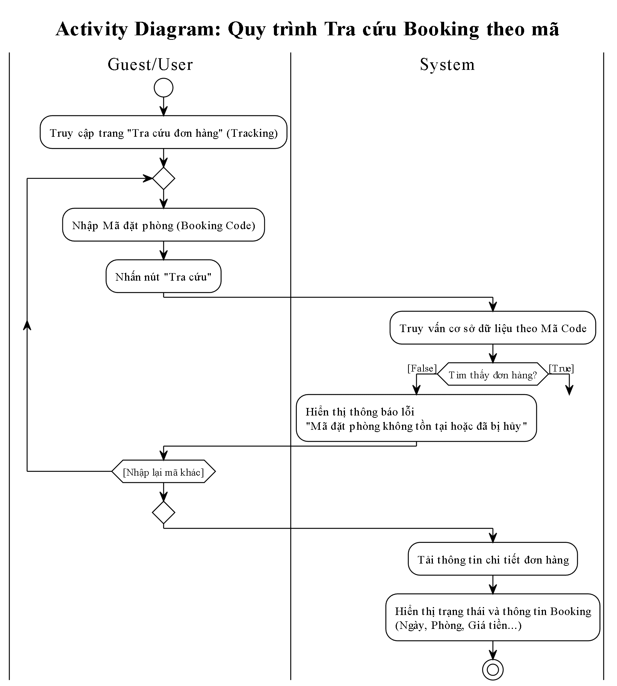
> Hình 3.78: Sơ đồ hoạt động tra cứu booking theo mã

```plantuml
@startuml
!theme plain
skinparam monochrome true
skinparam shadowing false
title Activity Diagram: Quy trình Tra cứu Booking theo mã

|Guest/User|
start
:Truy cập trang "Tra cứu đơn hàng" (Tracking);

repeat
  :Nhập Mã đặt phòng (Booking Code);
  :Nhấn nút "Tra cứu";

  |System|
  :Truy vấn cơ sở dữ liệu theo Mã Code;
  if (Tìm thấy đơn hàng?) then ([True])
    :Tải thông tin chi tiết đơn hàng;
    :Hiển thị trạng thái và thông tin Booking\n(Ngày, Phòng, Giá tiền...);
    stop
  else ([False])
    :Hiển thị thông báo lỗi\n"Mã đặt phòng không tồn tại hoặc đã bị hủy";
    |Guest/User|
    :[Nhập lại mã khác];
  endif
repeat while (Tìm thấy đơn hàng?) is ([False]) not ([True])
@enduml
```

- Sơ đồ hoạt động hủy đặt phòng

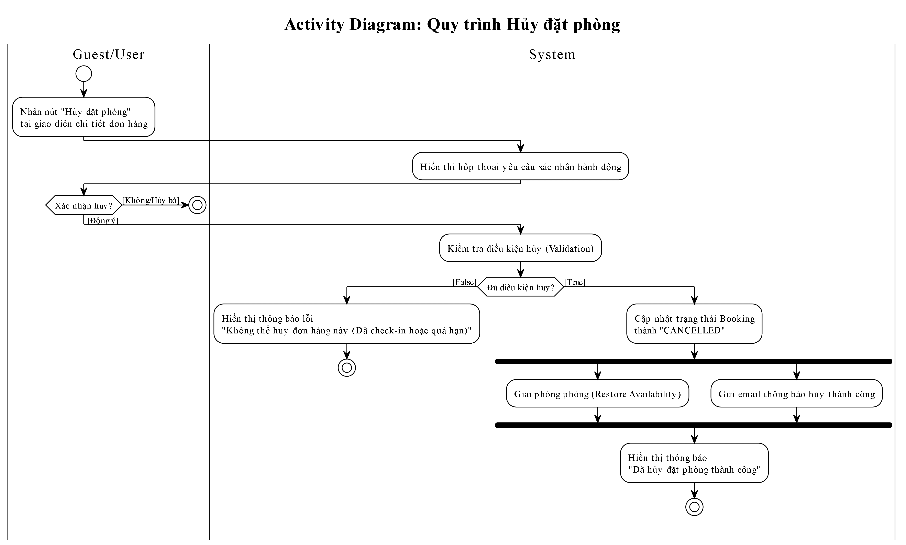
> Hình 3.79: Sơ đồ hoạt động hủy đặt phòng

```plantuml
@startuml
!theme plain
skinparam monochrome true
skinparam shadowing false
title Activity Diagram: Quy trình Hủy đặt phòng

|Guest/User|
start
:Nhấn nút "Hủy đặt phòng"\ntại giao diện chi tiết đơn hàng;

|System|
:Hiển thị hộp thoại yêu cầu xác nhận hành động;

|Guest/User|
if (Xác nhận hủy?) then ([Đồng ý])
  |System|
  :Kiểm tra điều kiện hủy (Validation);
  if (Đủ điều kiện hủy?) then ([True])
    :Cập nhật trạng thái Booking\nthành "CANCELLED";
    fork
      :Giải phóng phòng (Restore Availability);
    fork again
      :Gửi email thông báo hủy thành công;
    end fork
    :Hiển thị thông báo\n"Đã hủy đặt phòng thành công";
    stop
  else ([False])
    :Hiển thị thông báo lỗi\n"Không thể hủy đơn hàng này (Đã check-in hoặc quá hạn)";
    stop
  endif
else ([Không/Hủy bỏ])
  stop
endif
@enduml
```

- Sơ đồ hoạt động tạo tiện ích mới

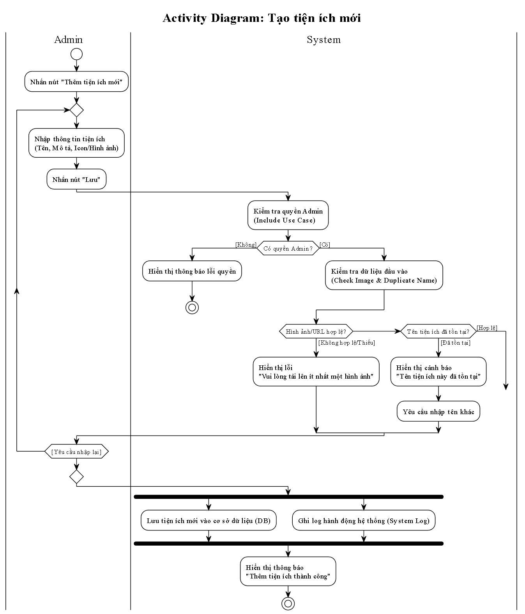
> Hình 3.80: Sơ đồ hoạt động tạo tiện ích mới

```plantuml
@startuml
!theme plain
skinparam monochrome true
skinparam shadowing false
title Activity Diagram: Tạo tiện ích mới

|Admin|
start
:Nhấn nút "Thêm tiện ích mới";

repeat
  :Nhập thông tin tiện ích\n(Tên, Mô tả, Icon/Hình ảnh);
  :Nhấn nút "Lưu";

  |System|
  :Kiểm tra quyền Admin\n(Include Use Case);
  if (Có quyền Admin?) then ([Có])
    :Kiểm tra dữ liệu đầu vào\n(Check Image & Duplicate Name);
    if (Hình ảnh/URL hợp lệ?) then ([Hợp lệ])
      if (Tên tiện ích đã tồn tại?) then ([Đã tồn tại])
        :Hiển thị cảnh báo\n"Tên tiện ích này đã tồn tại";
        :Yêu cầu nhập tên khác;
        |Admin|
        :[Yêu cầu nhập lại];
      else ([Hợp lệ])
        |System|
      endif
    else ([Không hợp lệ/Thiếu])
      :Hiển thị lỗi\n"Vui lòng tải lên ít nhất một hình ảnh";
      |Admin|
      :[Yêu cầu nhập lại];
    endif
  else ([Không])
    :Hiển thị thông báo lỗi quyền;
    stop
  endif
repeat while (Dữ liệu hợp lệ?) is ([False]) not ([True])

|System|
fork
  :Lưu tiện ích mới vào cơ sở dữ liệu (DB);
fork again
  :Ghi log hành động hệ thống (System Log);
end fork
:Hiển thị thông báo\n"Thêm tiện ích thành công";
stop
@enduml
```

- Sơ đồ hoạt động cập nhật tiện ích

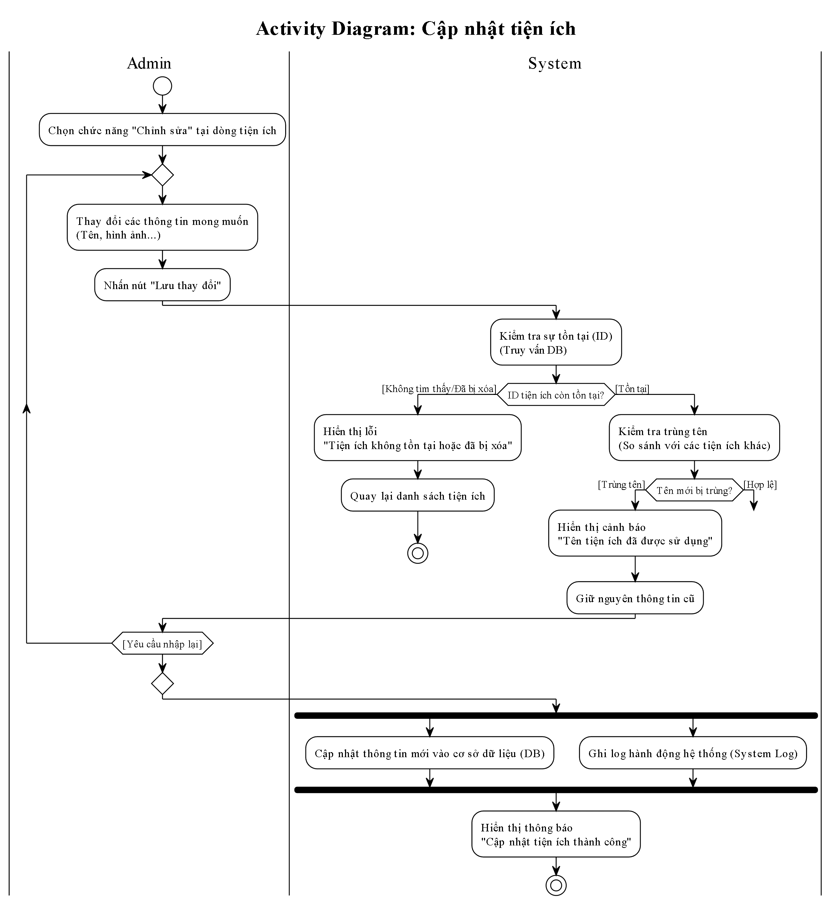
> Hình 3.81: Sơ đồ hoạt động cập nhật tiện ích

```plantuml
@startuml
!theme plain
skinparam monochrome true
skinparam shadowing false
title Activity Diagram: Cập nhật tiện ích

|Admin|
start
:Chọn chức năng "Chỉnh sửa" tại dòng tiện ích;

repeat
  :Thay đổi các thông tin mong muốn\n(Tên, hình ảnh...);
  :Nhấn nút "Lưu thay đổi";

  |System|
  :Kiểm tra sự tồn tại (ID)\n(Truy vấn DB);
  if (ID tiện ích còn tồn tại?) then ([Tồn tại])
    :Kiểm tra trùng tên\n(So sánh với các tiện ích khác);
    if (Tên mới bị trùng?) then ([Trùng tên])
      :Hiển thị cảnh báo\n"Tên tiện ích đã được sử dụng";
      :Giữ nguyên thông tin cũ;
      |Admin|
      :[Yêu cầu nhập lại];
    else ([Hợp lệ])
      |System|
    endif
  else ([Không tìm thấy/Đã bị xóa])
    :Hiển thị lỗi\n"Tiện ích không tồn tại hoặc đã bị xóa";
    :Quay lại danh sách tiện ích;
    stop
  endif
repeat while (Dữ liệu hợp lệ?) is ([False]) not ([True])

|System|
fork
  :Cập nhật thông tin mới vào cơ sở dữ liệu (DB);
fork again
  :Ghi log hành động hệ thống (System Log);
end fork
:Hiển thị thông báo\n"Cập nhật tiện ích thành công";
stop
@enduml
```

- Sơ đồ hoạt động xóa tiện ích hệ thống

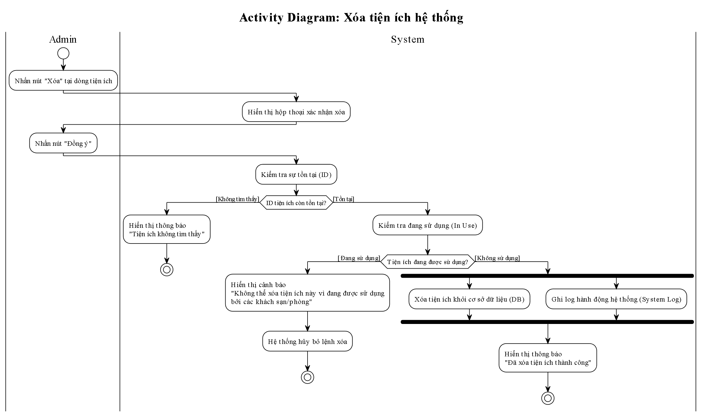
> Hình 3.82: Sơ đồ hoạt động xóa tiện ích hệ thống

```plantuml
@startuml
!theme plain
skinparam monochrome true
skinparam shadowing false
title Activity Diagram: Xóa tiện ích hệ thống

|Admin|
start
:Nhấn nút "Xóa" tại dòng tiện ích;

|System|
:Hiển thị hộp thoại xác nhận xóa;

|Admin|
:Nhấn nút "Đồng ý";

|System|
:Kiểm tra sự tồn tại (ID);
if (ID tiện ích còn tồn tại?) then ([Tồn tại])
  :Kiểm tra đang sử dụng (In Use);
  if (Tiện ích đang được sử dụng?) then ([Đang sử dụng])
    :Hiển thị cảnh báo\n"Không thể xóa tiện ích này vì đang được sử dụng\nbởi các khách sạn/phòng";
    :Hệ thống hủy bỏ lệnh xóa;
    stop
  else ([Không sử dụng])
    fork
      :Xóa tiện ích khỏi cơ sở dữ liệu (DB);
    fork again
      :Ghi log hành động hệ thống (System Log);
    end fork
    :Hiển thị thông báo\n"Đã xóa tiện ích thành công";
    stop
  endif
else ([Không tìm thấy])
  :Hiển thị thông báo\n"Tiện ích không tìm thấy";
  stop
endif
@enduml
```

- Sơ đồ hoạt động gỡ tiện ích khỏi Khách sạn

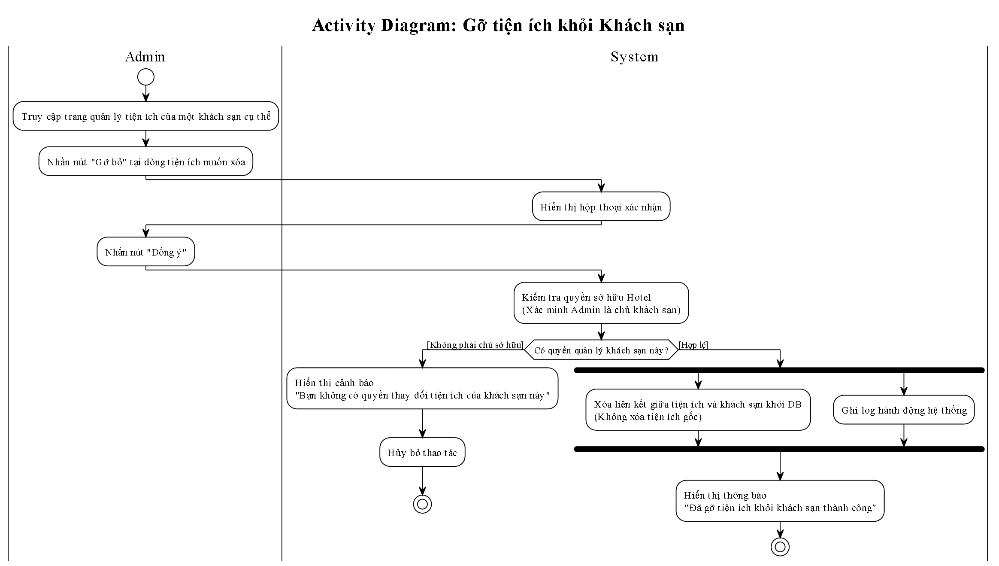
> Hình 3.83: Sơ đồ hoạt động gỡ tiện ích khỏi khách sạn

```plantuml
@startuml
!theme plain
skinparam monochrome true
skinparam shadowing false
title Activity Diagram: Gỡ tiện ích khỏi Khách sạn

|Admin|
start
:Truy cập trang quản lý tiện ích của một khách sạn cụ thể;
:Nhấn nút "Gỡ bỏ" tại dòng tiện ích muốn xóa;

|System|
:Hiển thị hộp thoại xác nhận;

|Admin|
:Nhấn nút "Đồng ý";

|System|
:Kiểm tra quyền sở hữu Hotel\n(Xác minh Admin là chủ khách sạn);
if (Có quyền quản lý khách sạn này?) then ([Hợp lệ])
  fork
    :Xóa liên kết giữa tiện ích và khách sạn khỏi DB\n(Không xóa tiện ích gốc);
  fork again
    :Ghi log hành động hệ thống;
  end fork
  :Hiển thị thông báo\n"Đã gỡ tiện ích khỏi khách sạn thành công";
  stop
else ([Không phải chủ sở hữu])
  :Hiển thị cảnh báo\n"Bạn không có quyền thay đổi tiện ích của khách sạn này";
  :Hủy bỏ thao tác;
  stop
endif
@enduml
```

- Sơ đồ hoạt động gỡ tiện ích khỏi Phòng

> Hình 3.84: Sơ đồ hoạt động gỡ tiện ích khỏi phòng

```plantuml
@startuml
!theme plain
skinparam monochrome true
skinparam shadowing false
title Activity Diagram: Gỡ tiện ích khỏi Phòng

|Admin|
start
:Truy cập vào trang cấu hình tiện ích của một phòng cụ thể;
:Nhấn nút "Gỡ bỏ" tại dòng tiện ích muốn xóa;

|System|
:Hiển thị hộp thoại xác nhận;

|Admin|
:Nhấn nút "Đồng ý";

|System|
:Kiểm tra quyền sở hữu Phòng\n(Xác minh Admin là chủ khách sạn chứa phòng);
if (Có quyền sở hữu?) then ([Hợp lệ])
  fork
    :Xóa liên kết giữa tiện ích và phòng khỏi DB\n(Không xóa tiện ích gốc);
  fork again
    :Ghi log hành động hệ thống;
  end fork
  :Hiển thị thông báo\n"Đã gỡ tiện ích khỏi phòng thành công";
  stop
else ([Không phải chủ sở hữu])
  :Hiển thị cảnh báo\n"Bạn không có quyền thay đổi tiện ích của phòng này";
  :Hủy bỏ thao tác;
  stop
endif
@enduml
```

## 3.3 Hệ thống màn hình

- Giao diện đăng nhập

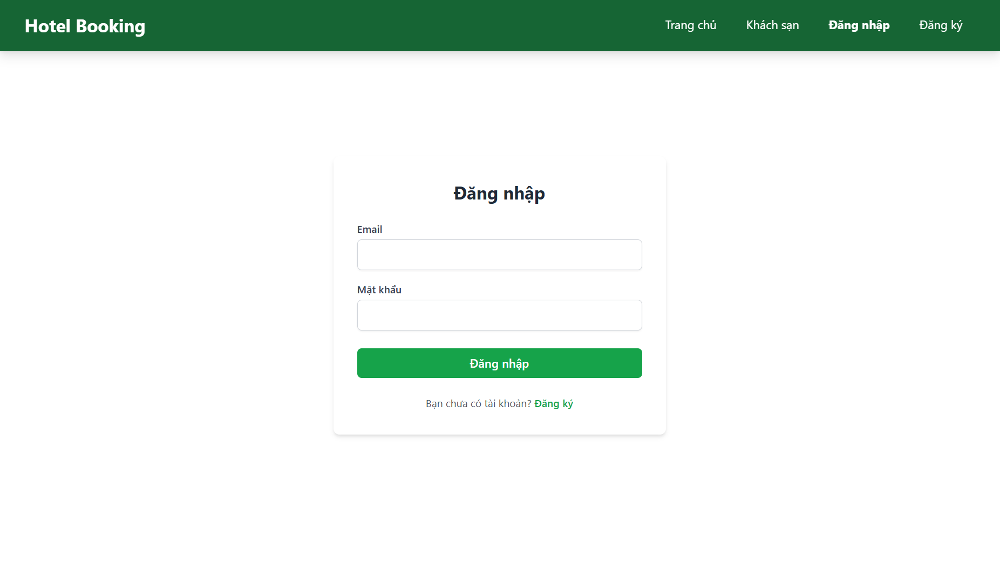
> Hình 3.85: Giao diện đăng nhập

- Giao diện đăng ký

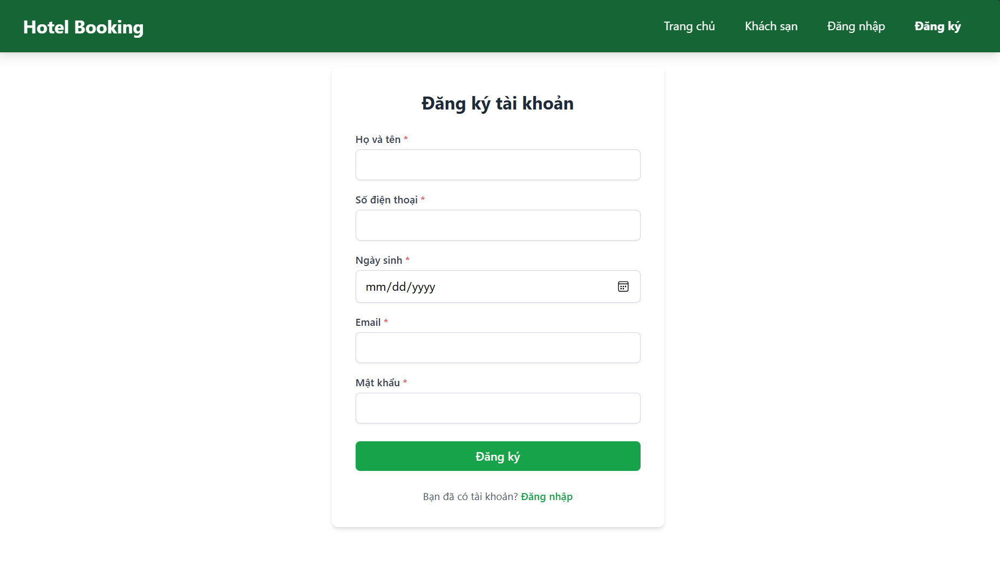
> Hình 3.86: Giao diện đăng ký

- Giao diện trang chủ

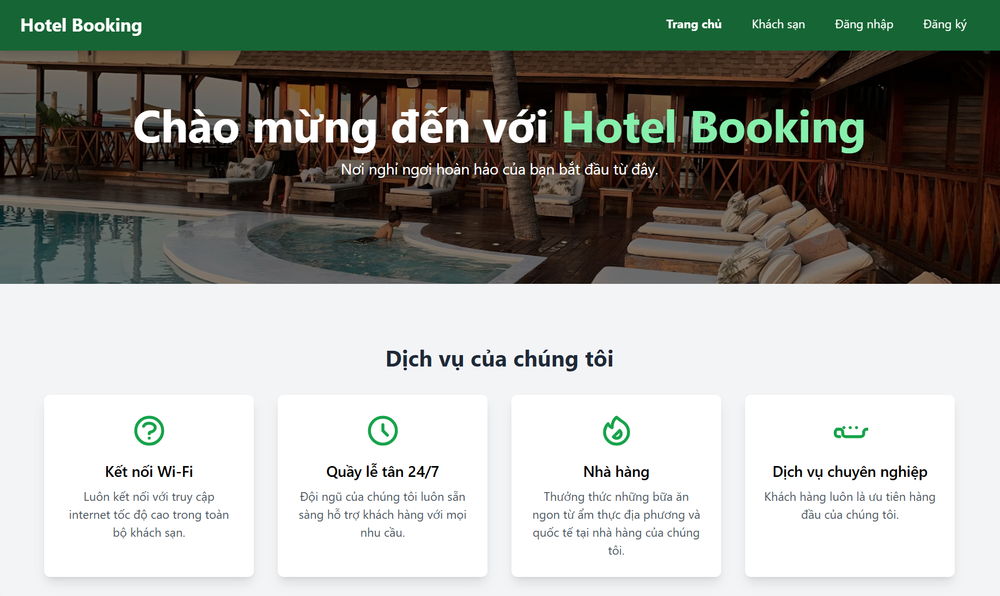
> Hình 3.87: Giao diện trang chủ

- Giao diện xem tất cả khách sạn

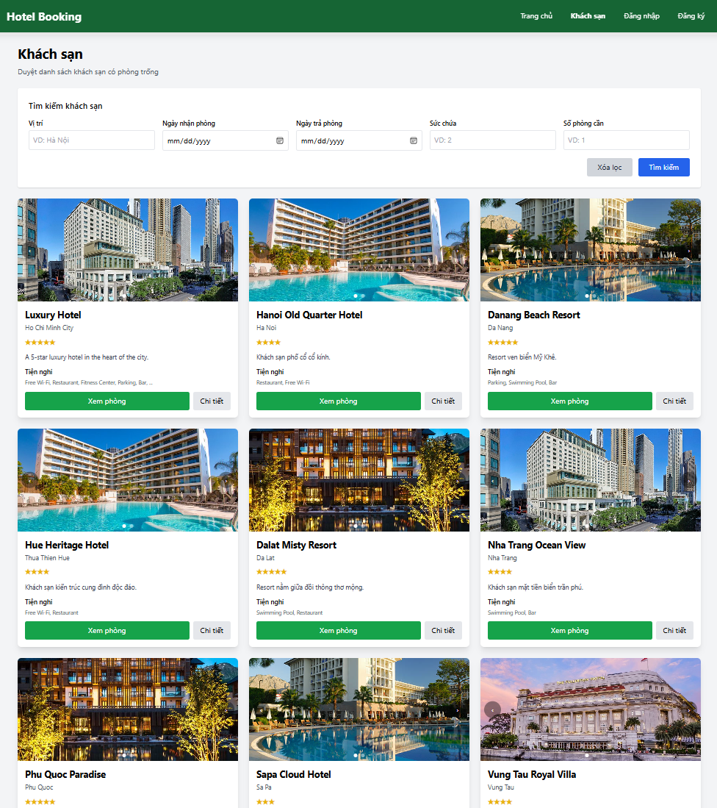
> Hình 3.88: Giao diện xem tất cả khách sạn

- Giao diện xem chi tiết khách sạn

> Hình 3.89: Giao diện xem chi tiết khách sạn

- Giao diện xem phòng của một khách sạn

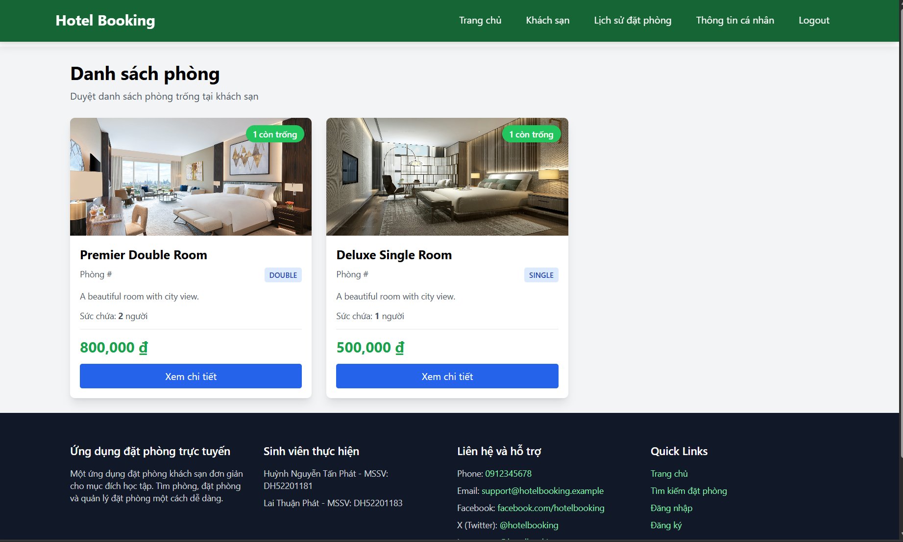
> Hình 3.90: Giao diện xem phòng của một khách sạn

- Giao diện xem chi tiết thông tin phòng và form đặt phòng

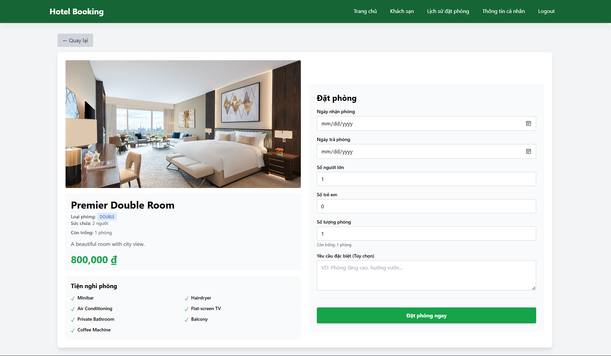
> Hình 3.91: Giao diện xem chi tiết thông tin phòng và form đặt phòng

- Giao diện đặt phòng thành công

> Hình 3.92: Giao diện đặt phòng thành công

- Giao diện lịch sử đặt phòng và tìm kiếm

> Hình 3.93: Giao diện lịch sử đặt phòng và tìm kiếm

- Giao xem chi tiết thông tin đặt phòng

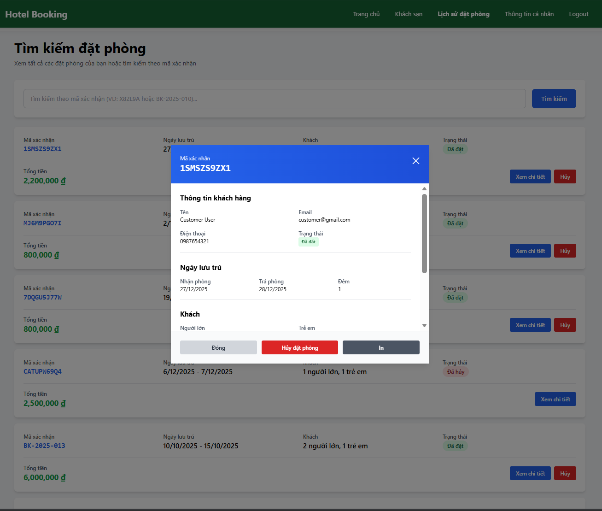
> Hình 3.94: Giao xem chi tiết thông tin đặt phòng

- Giao diện khi chọn hủy đặt phòng:

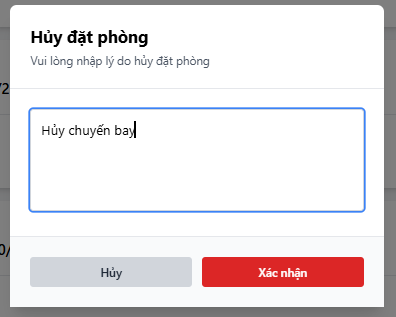
> Hình 3.95: Giao diện khi chọn hủy đặt phòng

- Giao diện thông tin cá nhân (thông tin cá nhân và thay đổi mật khẩu)

> Hình 3.96: Giao diện thông tin cá nhân

- Giao diện chính trang quản trị (Quản trị viên)

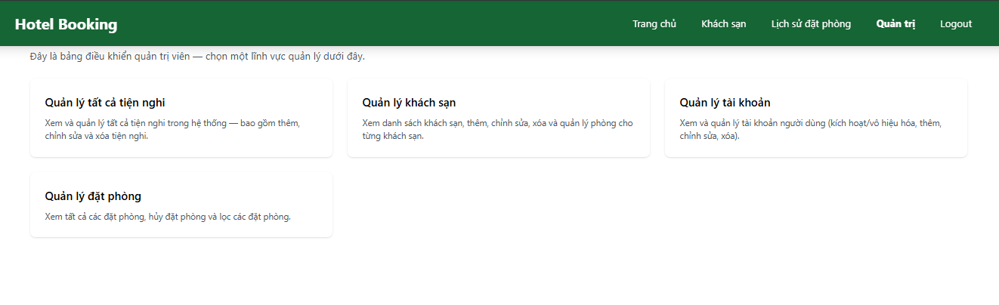
> Hình 3.97: Giao diện chính trang quản trị

- Giao diện quản lý tài khoản (Quản trị viên)

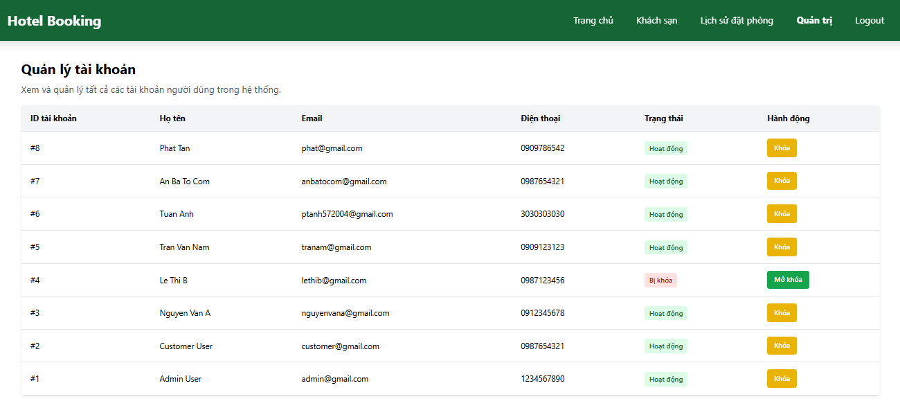
> Hình 3.98: Giao diện quản lý tài khoản

- Giao diện quản lý khách sạn (Quản trị viên)

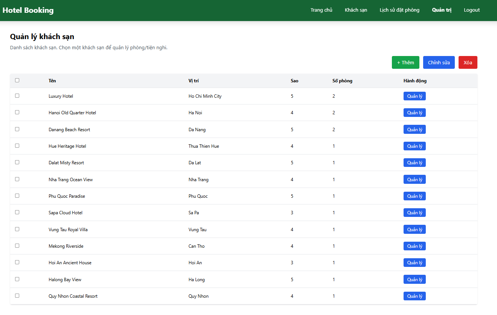
> Hình 3.99: Giao diện quản lý khách sạn

- Giao diện khi nhấn vào “Quản lý” của một khách sạn cụ thể

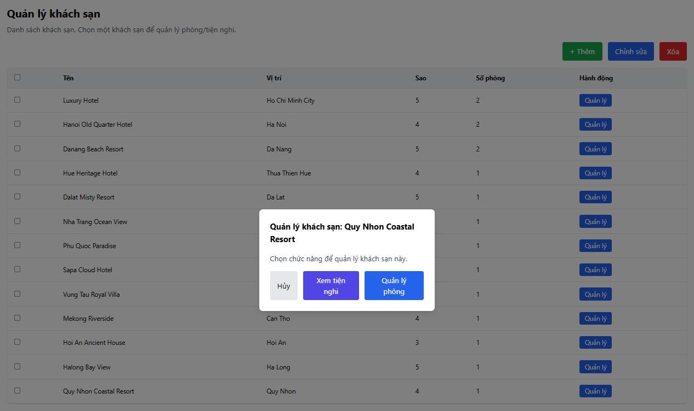
> Hình 3.100: Giao diện khi nhấn vào “Quản lý” của một khách sạn cụ thể

- Giao diện quản lý phòng của một khách sạn

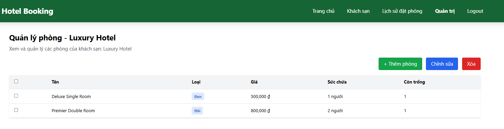
> Hình 3.101: Giao diện quản lý phòng của một khách sạn

- Giao diện thêm một phòng mới cho khách sạn hiện tại

> Hình 3.102: Giao diện thêm một phòng mới cho khách sạn hiện tại

- Giao diện chỉnh sửa phòng

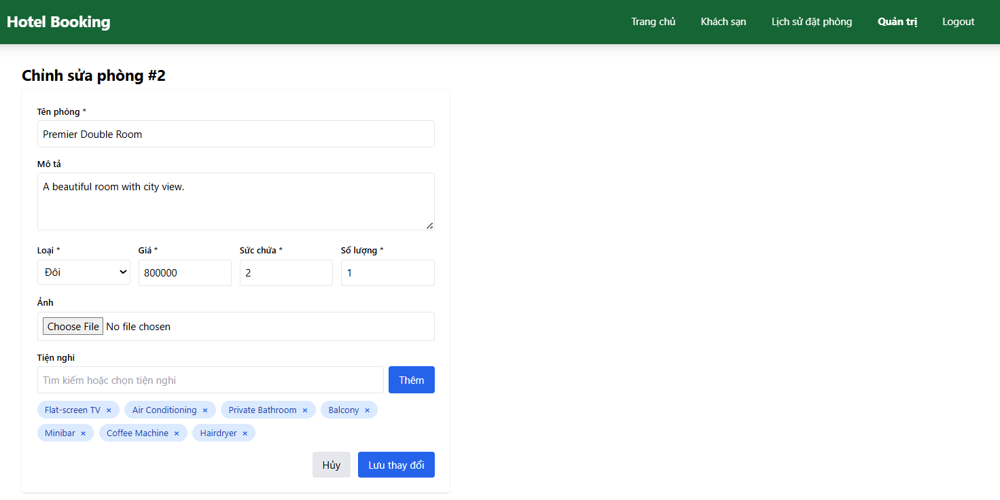
> Hình 3.103: Giao diện chỉnh sửa phòng

- Giao diện xác nhận khi xóa một phòng

> Hình 3.104: Giao diện xác nhận khi xóa một phòng

- Giao diện thêm mới một khách sạn (Quản trị viên)

> Hình 3.105: Giao diện thêm mới một khách sạn

- Giao diện chỉnh sửa một khách sạn (Quản trị viên)

> Hình 3.106: Giao diện chỉnh sửa một khách sạn

- Giao diện xác nhận trước khi xóa một khách sạn (Quản trị viên)

> Hình 3.107: Giao diện xác nhận trước khi xóa một khách sạn

- Giao diện quản lý và tìm kiếm đặt phòng (Quản trị viên)

> Hình 3.108: Giao diện quản lý và tìm kiếm đặt phòng

- Giao diện chuyển đổi trạng thái nhận từ “đã đặt” thành “đã nhận phòng”

> Hình 3.109: Giao diện chuyển đổi trạng thái nhận từ “đã đặt” thành “đã nhận phòng”

- Giao diện quản lý tiện nghi (Quản trị viên)

> Hình 3.110: Giao diện quản lý tiện nghi

- Giao diện thêm mới một tiện nghi (Quản trị viên)

> Hình 3.111: Giao diện thêm mới một tiện nghi

- Giao diện chỉnh sửa một tiên nghi

> Hình 3.112: Giao diện chỉnh sửa một tiên nghi

- Giao diện xác nhận xóa một tiện nghi

> Hình 3.113: Giao diện xác nhận xóa một tiện nghi

- Giao diện xem tất cả tiện nghi các cấp của một khách sạn

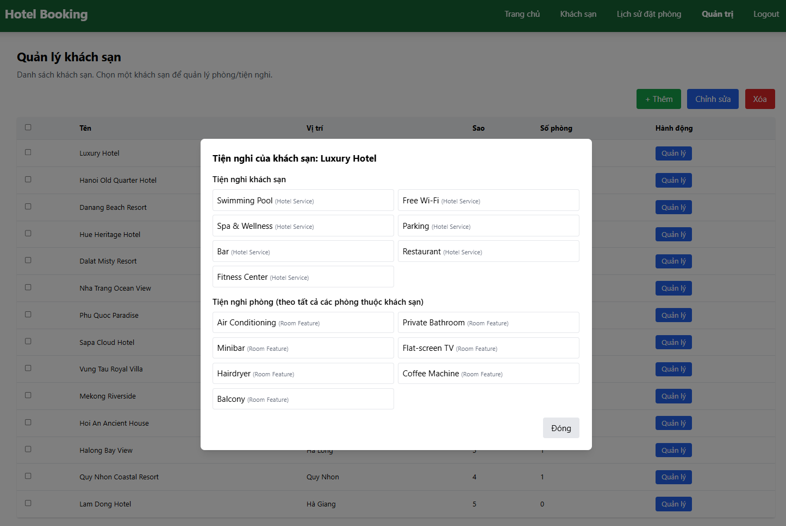
> Hình 3.113: Giao diện xem tất cả tiện nghi các cấp của một khách sạn
