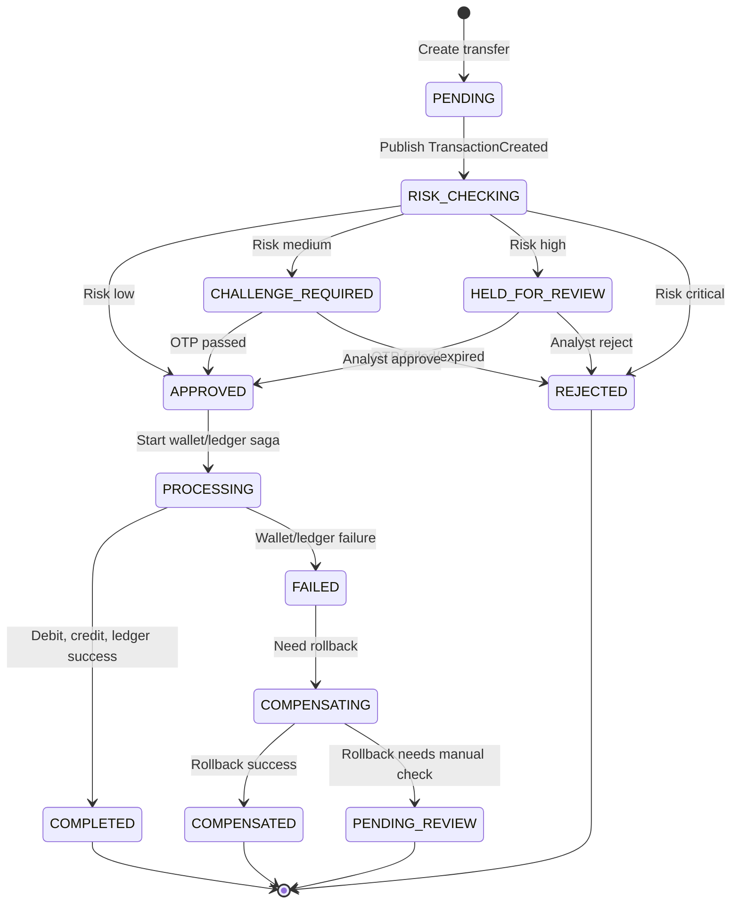

# 01. Nghiệp vụ tổng quan

## 1. Mục tiêu hệ thống

`Real-time Banking and Payment Risk Platform` là hệ thống mô phỏng nền tảng ngân hàng/thanh toán có khả năng xử lý giao dịch gần realtime, đánh giá rủi ro gian lận, đảm bảo không trừ tiền lặp, ghi nhận ledger hai chiều và hiển thị trạng thái giao dịch realtime trên dashboard.

MVP nên tập trung vào một nghiệp vụ cốt lõi:

```text
User A chuyển tiền cho User B
```

Sau khi flow này chắc, có thể mở rộng sang merchant payment, manual review nâng cao, rule engine configurable, observability đầy đủ hoặc ML fraud scoring.

## 2. Vấn đề nghiệp vụ cần giải quyết

Trong hệ thống banking/payment, một giao dịch tiền tệ có nhiều rủi ro:

- User bấm gửi hai lần hoặc client retry do mất mạng, tạo duplicate payment.
- Giao dịch có dấu hiệu fraud như số tiền lớn, thiết bị mới, IP lạ, receiver blacklist.
- Một service trong chuỗi xử lý bị lỗi, ví dụ debit thành công nhưng credit thất bại.
- Dashboard và user cần biết trạng thái giao dịch gần realtime.
- Dòng tiền cần audit được bằng ledger, không chỉ update balance đơn giản.

Hệ thống này giải quyết bằng các pattern:

| Pattern | Vai trò nghiệp vụ |
|---|---|
| Idempotency Key | Không tạo 2 giao dịch cho cùng request retry |
| Saga Orchestration | Điều phối nhiều service và rollback khi lỗi |
| Transactional Outbox | Lưu DB và publish event an toàn hơn |
| Idempotent Consumer/Inbox | Không xử lý trùng Kafka message |
| Double-entry Ledger | Mỗi money movement có debit và credit để audit |
| Event-driven Architecture | Các service giao tiếp bất đồng bộ qua Kafka |
| WebSocket/STOMP | Dashboard nhận trạng thái realtime |

## 3. Phạm vi MVP

### In scope

- Đăng ký, đăng nhập, JWT.
- User profile và KYC giả lập: `PENDING`, `VERIFIED`, `BLOCKED`.
- Wallet/account: deposit giả lập, xem balance, reserve, debit, credit.
- Tạo transfer từ User A sang User B.
- Idempotency key ở API tạo transfer.
- Fraud risk check bằng rule cơ bản.
- Saga flow cho transaction.
- Compensation khi một bước tiền tệ thất bại.
- Double-entry ledger.
- Kafka event flow.
- Notification realtime qua WebSocket.
- React dashboard: transfer form, transaction list/detail, risk alert, wallet balance.
- Docker Compose, Swagger/OpenAPI, Zipkin/log correlation.

### Out of scope cho bản 1 tháng

- Tiền thật hoặc external banking/payment gateway thật.
- PCI DSS production-grade.
- Kubernetes.
- CI/CD phức tạp.
- Mobile app.
- Multi-currency thật.
- AI fraud detection phức tạp.
- Event sourcing full system.
- Admin portal quá đầy đủ.
- Reconciliation/End-of-Day batch đầy đủ. MVP chỉ định nghĩa khái niệm và kiểm tra ledger cơ bản.

## 4. Actor và stakeholder

| Actor                     | Vai trò                                                       |
| ------------------------- | ------------------------------------------------------------- |
| Customer/User             | Đăng nhập, xem ví, tạo transfer, nhận trạng thái giao dịch    |
| Admin                     | Verify KYC, cấu hình blacklist/rule cơ bản                    |
| Risk Analyst              | Review giao dịch bị hold, approve hoặc reject                 |
| API Gateway               | Routing, auth check, rate limit, request logging              |
| Transaction Service       | Tạo giao dịch, giữ state machine, idempotency, điều phối Saga |
| Fraud Service/Risk Engine | Tính risk score, đưa ra decision, publish risk event          |
| Wallet Service            | Reserve, release, debit, credit balance                       |
| Ledger Service            | Ghi debit/credit entry bất biến                               |
| Notification Service      | Push status, fraud alert, OTP giả lập                         |
| React Dashboard           | Hiển thị transaction status, fraud alert, metrics             |
| System Auditor            | Xem audit log, ledger, status history                         |

## 5. Domain glossary

| Thuật ngữ | Ý nghĩa |
|---|---|
| Transaction | Giao dịch chuyển tiền hoặc payment |
| Transfer | Giao dịch chuyển tiền nội bộ User A sang User B |
| Wallet | Ví/tài khoản chứa balance của user |
| Available Balance | Số dư có thể dùng |
| Reserved Balance | Số tiền đang giữ để chờ xử lý |
| Idempotency Key | Key client gửi để request retry không tạo giao dịch mới |
| Saga | Chuỗi local transaction giữa nhiều service |
| Compensation | Bước hoàn tác nghiệp vụ khi Saga lỗi |
| Risk Score | Điểm rủi ro từ 0 đến 100 |
| Risk Decision | Kết quả đánh giá: approve, challenge, hold, decline |
| Velocity Check | Kiểm tra tần suất/tổng tiền trong cửa sổ thời gian |
| Double-entry Ledger | Ghi song song debit và credit cho mỗi money movement |
| Outbox Event | Event lưu cùng DB transaction trước khi publish Kafka |
| Inbox/Processed Message | Dấu vết message đã xử lý để chống consume trùng |
| Reconciliation | Đối soát số dư wallet với tổng ledger entry để phát hiện lệch tiền |
| End of Day | Quy trình cuối ngày để khóa số liệu, tổng hợp ledger, đối soát và tạo báo cáo |

## 6. Business capability

| Capability | Mô tả |
|---|---|
| Authentication | Đăng ký, đăng nhập, JWT, role USER/ADMIN/ANALYST |
| KYC/User Management | Profile, trạng thái KYC, verify user |
| Wallet Management | Tạo ví, deposit giả lập, xem balance, giữ/trừ/cộng tiền |
| Transfer Processing | Tạo transfer, validate sender/receiver/amount, tracking status |
| Idempotency Control | Lưu key, request hash, response cũ, chặn body khác cùng key |
| Fraud Risk Evaluation | Rule engine, velocity check, blacklist, risk score, risk decision |
| Saga Coordination | Điều phối fraud, wallet, ledger, notification |
| Ledger Accounting | Ghi immutable debit/credit entries, đảm bảo tổng debit bằng tổng credit |
| Notification | Alert realtime qua WebSocket, OTP giả lập nếu có challenge |
| Auditability | Status history, audit log, review actor/note, ledger trail, correlation id |
| Observability | Logs, metrics, tracing bằng Zipkin/Grafana nếu còn thời gian |

## 7. Transaction lifecycle



## 8. Risk decision policy

| Risk score | Risk level | Decision | Ý nghĩa |
|---:|---|---|---|
| 0 - 29 | LOW | APPROVE | Cho xử lý tiếp |
| 30 - 59 | MEDIUM | CHALLENGE | Cần OTP/MFA giả lập |
| 60 - 79 | HIGH | HOLD | Giữ để analyst review |
| 80 - 100 | CRITICAL | DECLINE/FREEZE | Từ chối, có thể khóa tạm |

Decision logic bản đầu:

```text
if sender KYC is not VERIFIED:
    decision = DECLINE
else if receiver in blacklist:
    decision = DECLINE
else if risk_score >= 80:
    decision = DECLINE
else if risk_score >= 60:
    decision = HOLD
else if risk_score >= 30:
    decision = CHALLENGE
else:
    decision = APPROVE
```

## 9. Fraud rules nên implement

### Level 1 - bắt buộc

| Rule | Điều kiện | Điểm gợi ý | Decision impact |
|---|---|---:|---|
| KYC_NOT_VERIFIED | Sender chưa VERIFIED | 100 | DECLINE |
| RECEIVER_BLACKLISTED | Receiver nằm trong blacklist | 100 | DECLINE |
| AMOUNT_THRESHOLD | Amount > 50,000,000 VND | 30 | CHALLENGE/HOLD |
| INSUFFICIENT_BALANCE | Available balance không đủ | N/A | FAILED |

### Level 2 - nên có

| Rule | Điều kiện | Điểm gợi ý |
|---|---|---:|
| VELOCITY_COUNT_5M | Hơn 5 transfer trong 5 phút | 25 |
| VELOCITY_AMOUNT_10M | Tổng tiền > 100,000,000 VND trong 10 phút | 30 |
| MANY_RECEIVERS_10M | Gửi cho hơn 3 receiver trong 10 phút | 25 |
| NEW_DEVICE | Thiết bị mới | 15 |
| NEW_BENEFICIARY | Người nhận mới | 15 |

### Level 3 - nếu còn thời gian

- Risk score theo user profile.
- Merchant category risk.
- Geo-location mismatch giả lập.
- Account takeover signals, ví dụ đổi mật khẩu trong 24 giờ.

## 10. Definition of Done nghiệp vụ

Project được xem là đủ chất khi demo được:

- User login và tạo transfer.
- Duplicate request với cùng `Idempotency-Key` không tạo giao dịch thứ hai.
- Transfer low-risk hoàn thành và có ledger debit/credit.
- Transfer high-risk bị reject hoặc hold có reason rõ.
- Fraud alert xuất hiện realtime trên dashboard.
- Wallet không âm và có reserve/release/debit/credit rõ.
- Kafka event flow chạy qua nhiều service.
- Transaction status history/audit log đọc được.
- Docker Compose chạy được toàn bộ hệ thống.

## 11. Reconciliation trong phạm vi demo

Trong doanh nghiệp, reconciliation là nghiệp vụ bắt buộc để kiểm tra dòng tiền không bị lệch giữa các hệ thống. Với project demo này, reconciliation đầy đủ được để ngoài scope, nhưng hệ thống vẫn nên chứng minh được hiểu biết cơ bản:

- Mỗi transaction `COMPLETED` phải có đúng cặp ledger `DEBIT` và `CREDIT`.
- Tổng `DEBIT` phải bằng tổng `CREDIT` cho từng transaction.
- Wallet balance có thể được kiểm tra lại từ ledger entries trong demo script hoặc test.
- Nếu phát hiện lệch, transaction nên được đưa vào trạng thái `PENDING_REVIEW` thay vì tự sửa dữ liệu ledger.

Future improvement:

- End-of-Day batch.
- Báo cáo đối soát theo ngày.
- Reconciliation giữa wallet balance, ledger và external payment/bank rail.
- Report exception cho giao dịch bị lệch hoặc thiếu ledger entry.
