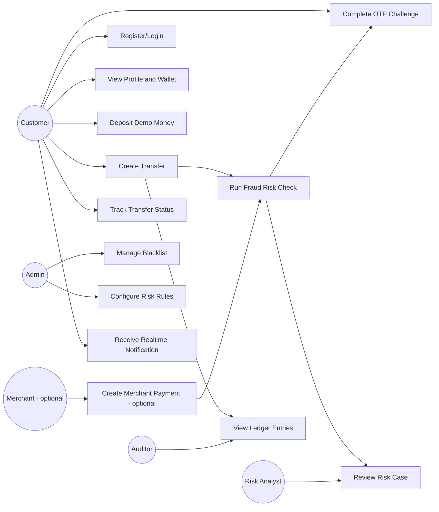

# 02. Use cases

## 1. Use case overview

## 2. UC01 - Register/Login

| Field            | Nội dung                                                                                                 |
| ---------------- | -------------------------------------------------------------------------------------------------------- |
| Actor            | Customer                                                                                                 |
| Trigger          | User mở web banking/dashboard                                                                            |
| Precondition     | User chưa login                                                                                          |
| Main flow        | User đăng ký hoặc đăng nhập, Auth Service kiểm tra credential, tạo JWT, Gateway dùng JWT cho request sau |
| Alternative flow | Sai password, tài khoản bị khóa, token hết hạn                                                           |
| Output           | Access token, refresh token optional, user profile                                                       |
| Service chính    | auth-service, api-gateway                                                                                |

## 3. UC02 - Verify user/KYC giả lập

| Field | Nội dung |
|---|---|
| Actor | Admin |
| Trigger | Admin muốn cho phép user chuyển tiền |
| Precondition | User tồn tại |
| Main flow | Admin xem profile, đổi KYC từ `PENDING` sang `VERIFIED`, hệ thống tạo wallet nếu chưa có |
| Alternative flow | User bị đánh dấu `BLOCKED`, không được chuyển tiền |
| Output | User KYC status, wallet created event |
| Service chính | user-service, wallet-service |

## 4. UC03 - Deposit demo money

| Field | Nội dung |
|---|---|
| Actor | Customer hoặc Admin demo |
| Trigger | Cần nạp số dư để test transfer |
| Precondition | User đã VERIFIED và có wallet |
| Main flow | Gửi deposit request, Wallet Service cộng balance, ghi wallet transaction |
| Alternative flow | Amount không hợp lệ hoặc wallet frozen |
| Output | Balance mới |
| Service chính | wallet-service |

## 5. UC04 - Create bank transfer

| Field | Nội dung |
|---|---|
| Actor | Customer |
| Trigger | User A gửi tiền cho User B |
| Precondition | User A logged in, KYC VERIFIED, wallet active |
| Main flow | Client gửi `POST /transfers` kèm `Idempotency-Key`, Transaction Service validate request, lưu transaction `PENDING`, lưu outbox event, publish `transaction.created` |
| Alternative flow | Thiếu idempotency key, duplicate key với body khác, sender/receiver invalid, amount <= 0 |
| Output | Transaction id, status ban đầu |
| Service chính | transaction-service, api-gateway |

## 6. UC05 - Idempotent retry transfer

| Field | Nội dung |
|---|---|
| Actor | Customer/client app |
| Trigger | Client retry vì timeout/mất mạng |
| Precondition | Request đầu đã dùng cùng `Idempotency-Key` |
| Main flow | Transaction Service tìm idempotency record, so sánh request hash, trả lại response cũ |
| Alternative flow | Cùng key nhưng body khác thì trả lỗi `409 Conflict` hoặc `422 Unprocessable Entity` |
| Output | Không tạo transaction thứ hai |
| Service chính | transaction-service |

## 7. UC06 - Run fraud risk check

| Field | Nội dung |
|---|---|
| Actor | Fraud Service/Risk Engine |
| Trigger | Consume `transaction.created` |
| Precondition | Transaction đang `PENDING` hoặc `RISK_CHECKING` |
| Main flow | Load feature từ DB/Redis, chạy fraud rules, tính score, lưu fraud check, publish decision |
| Alternative flow | Feature store lỗi, rule engine lỗi, Kafka message duplicate |
| Output | `fraud.passed`, `fraud.rejected`, `risk.challenge_required`, hoặc `risk.hold_required` |
| Service chính | fraud-service, Redis, Kafka |

## 8. UC07 - OTP challenge

| Field | Nội dung |
|---|---|
| Actor | Customer |
| Trigger | Risk decision là `CHALLENGE` |
| Precondition | OTP challenge đã được tạo |
| Main flow | Notification Service gửi OTP giả lập, Customer nhập OTP, OTP được verify, transaction tiếp tục sang `APPROVED` |
| Alternative flow | OTP sai quá 3 lần, OTP expired |
| Output | `challenge.passed` hoặc `challenge.failed` |
| Service chính | notification-service, transaction-service |

## 9. UC08 - Manual risk review

| Field | Nội dung |
|---|---|
| Actor | Risk Analyst |
| Trigger | Risk decision là `HOLD` |
| Precondition | Risk case được tạo |
| Main flow | Analyst xem transaction detail, rule hit, user history, device/IP, chọn approve hoặc reject, nhập note |
| Alternative flow | Analyst không đủ quyền, case đã đóng |
| Output | Case closed, transaction `APPROVED` hoặc `REJECTED`, audit log có `reviewed_by`, `review_note`, decision và timestamp |
| Service chính | case-service hoặc fraud-service, transaction-service, audit |

Audit requirement:

- Mỗi analyst decision phải lưu người review, thời điểm review, quyết định, reason code và review note.
- Không cho sửa/xóa review note sau khi case đóng; nếu cần cập nhật, tạo audit entry mới.
- Transaction detail phải truy vết được ai đã approve/reject khi giao dịch bị hold.

## 10. UC09 - Wallet reserve/debit/credit

| Field | Nội dung |
|---|---|
| Actor | Wallet Service |
| Trigger | Transaction đã được approve |
| Precondition | Sender có available balance đủ |
| Main flow | Reserve amount, debit sender, credit receiver, publish wallet events |
| Alternative flow | Không đủ tiền, wallet frozen, duplicate message |
| Output | Balance cập nhật, `wallet.debited`, `wallet.credited` |
| Service chính | wallet-service |

## 11. UC10 - Write double-entry ledger

| Field | Nội dung |
|---|---|
| Actor | Ledger Service |
| Trigger | Wallet debit/credit thành công |
| Precondition | Transaction approved, wallet movement hợp lệ |
| Main flow | Ghi 2 ledger entry: sender `DEBIT`, receiver `CREDIT`, validate tổng debit bằng tổng credit |
| Alternative flow | Duplicate message, ledger write fail |
| Output | `ledger.recorded` hoặc lỗi để saga xử lý |
| Service chính | ledger-service |

## 12. UC11 - Compensation/rollback

| Field | Nội dung |
|---|---|
| Actor | Transaction Service/Saga Orchestrator |
| Trigger | Một bước sau debit fail, ví dụ credit receiver hoặc ledger fail |
| Precondition | Đã có bước tiền tệ thành công cần hoàn tác |
| Main flow | Publish compensation command, wallet release/refund, tạo reversal entry nếu cần, transaction chuyển `FAILED` hoặc `PENDING_REVIEW` |
| Alternative flow | Compensation cũng fail, cần manual review |
| Output | `transaction.compensated`, failure reason |
| Service chính | transaction-service, wallet-service, ledger-service |

## 13. UC12 - Realtime dashboard notification

| Field | Nội dung |
|---|---|
| Actor | Customer, Admin, Analyst |
| Trigger | Có transaction status change hoặc fraud alert |
| Precondition | Dashboard đã connect WebSocket |
| Main flow | Notification Service consume event, lưu notification, push qua `/ws` topic |
| Alternative flow | WebSocket disconnected, client reconnect và fetch REST history |
| Output | UI cập nhật status/alert không cần refresh |
| Service chính | notification-service, frontend |

## 14. UC13 - Merchant payment optional

| Field | Nội dung |
|---|---|
| Actor | Merchant |
| Trigger | Merchant tạo payment intent |
| Precondition | Merchant có API key hợp lệ |
| Main flow | Payment Service tạo payment intent, gọi risk check, nếu approve thì mock gateway authorize, webhook trả status |
| Alternative flow | Challenge, hold, decline |
| Output | Payment status và webhook |
| Service chính | payment-service, fraud-service, notification/webhook |

## 15. Use case ưu tiên làm trước

| Ưu tiên | Use case | Lý do |
|---:|---|---|
| 1 | UC04 Create bank transfer | Flow lõi của project |
| 2 | UC05 Idempotent retry | Điểm khác biệt payment API |
| 3 | UC06 Fraud risk check | Điểm khác biệt realtime risk |
| 4 | UC09 Wallet reserve/debit/credit | Xử lý tiền |
| 5 | UC10 Double-entry ledger | Audit dòng tiền |
| 6 | UC12 Realtime notification | Demo realtime dashboard |
| 7 | UC11 Compensation | Chứng minh hiểu distributed transaction |
| 8 | UC07/UC08 Challenge/Hold | Nâng cấp nghiệp vụ risk |
