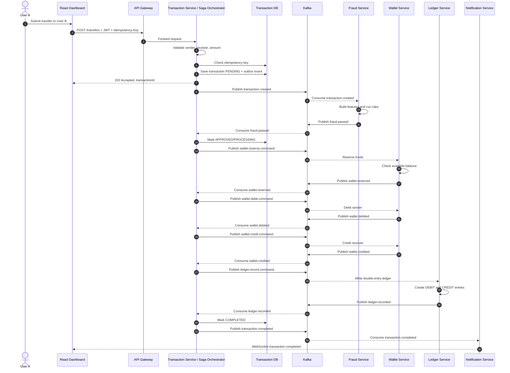
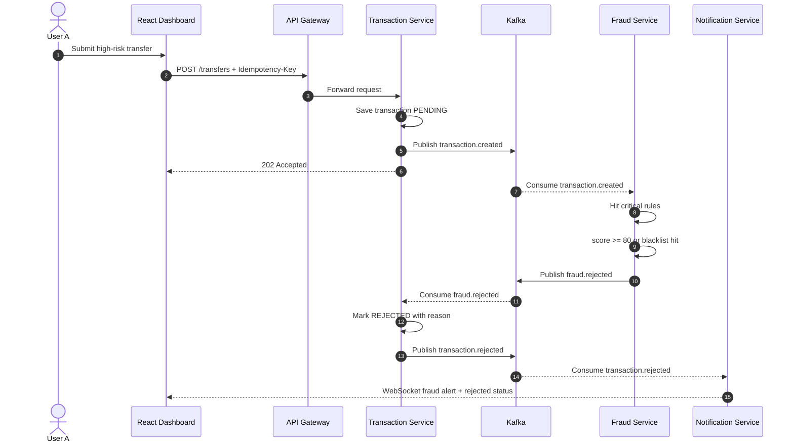
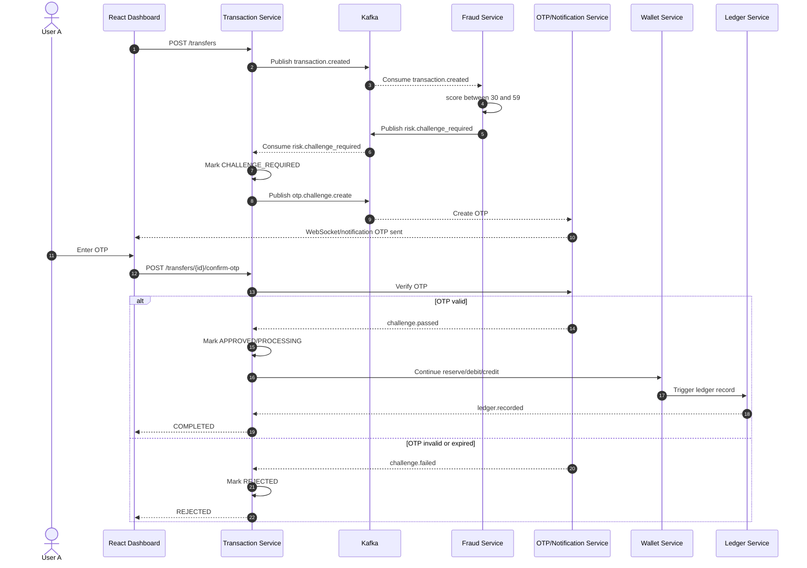
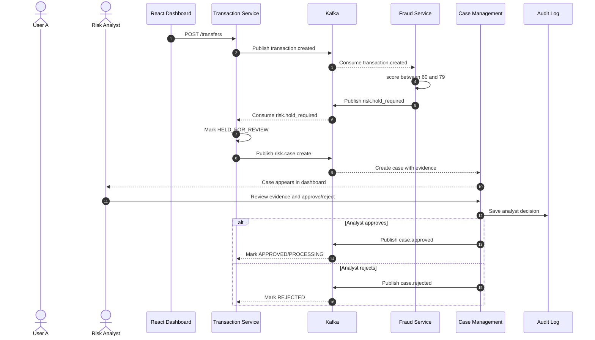
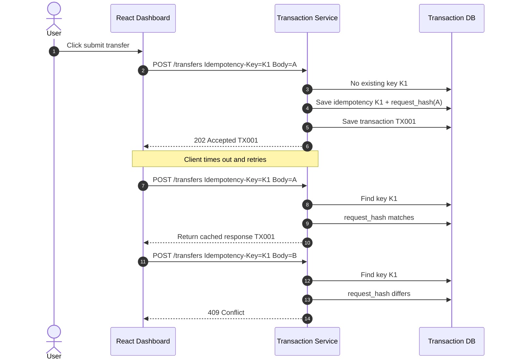
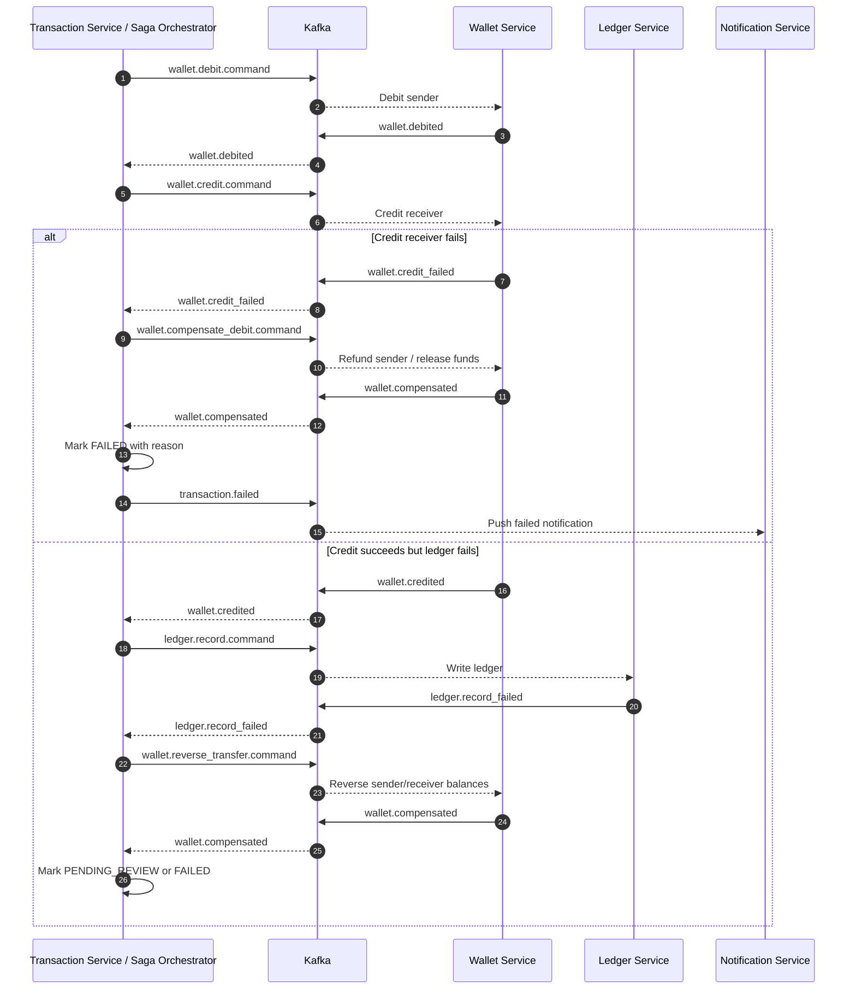

# 01. Sequence diagrams

## 1. Happy path - transfer hoàn thành

## 2. Fraud reject path

## 3. Medium risk - OTP challenge

## 4. High risk - manual review hold

## 5. Idempotency retry

## 6. Compensation khi credit hoặc ledger fail

