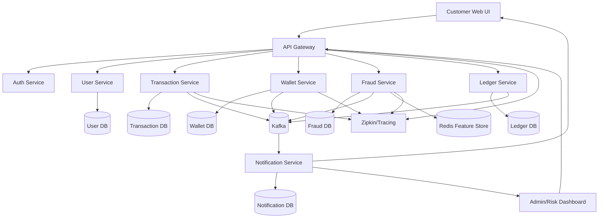
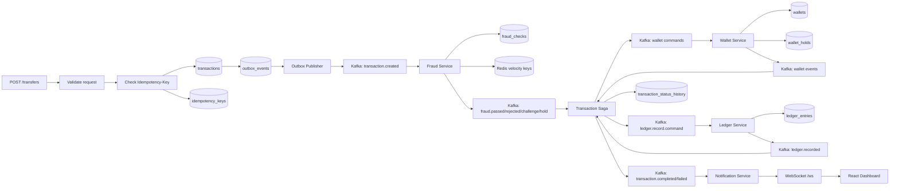
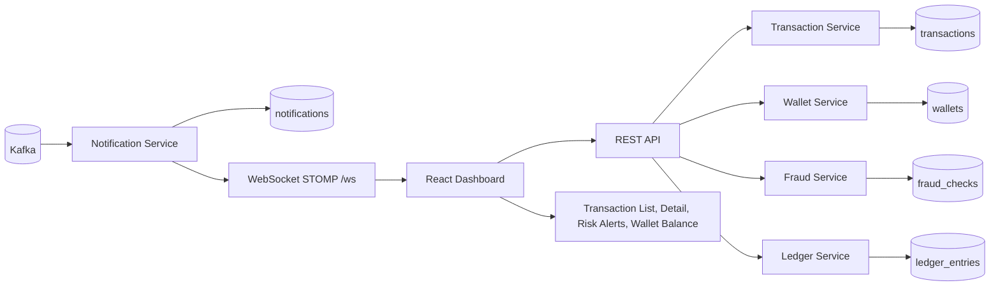
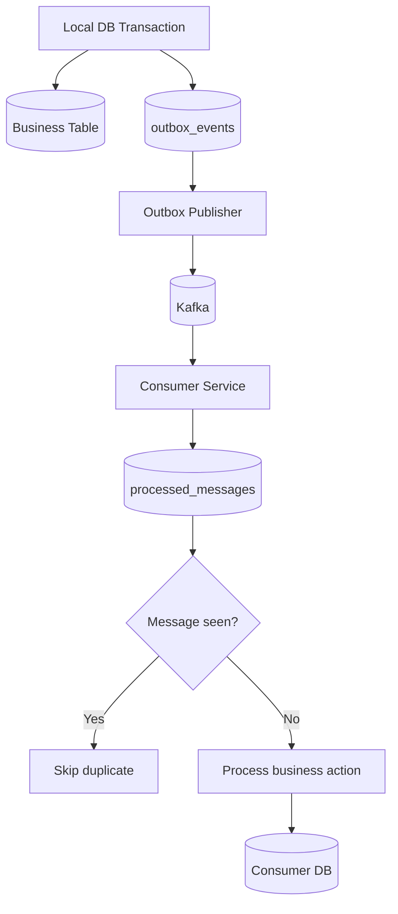
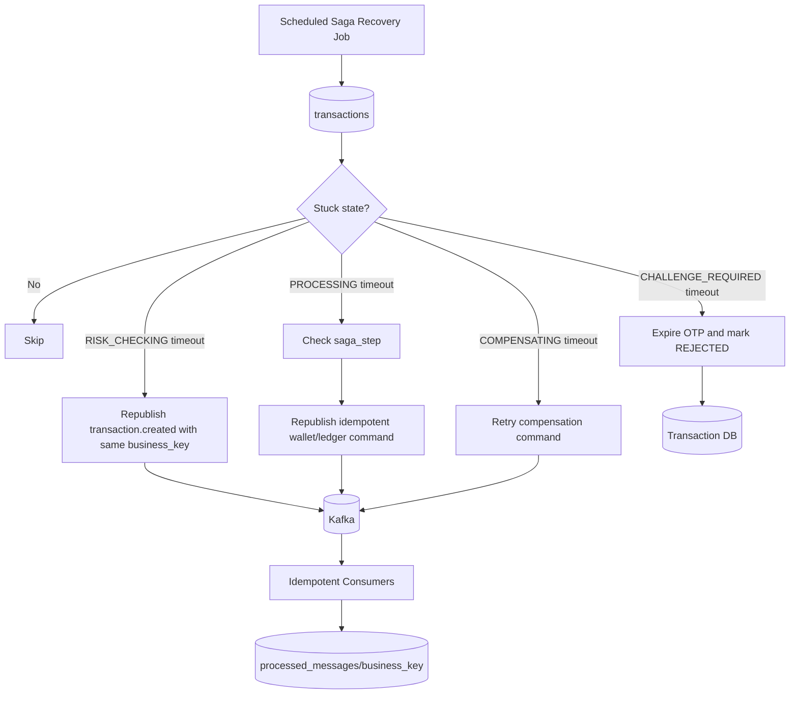

# 02. Data flow

## 1. Context data flow



## 2. Event-driven transfer data flow



## 3. Risk feature data flow

```mermaid
flowchart TD
    TxCreated[transaction.created event] --> FeatureBuilder[Feature Builder]

    FeatureBuilder --> UserProfile[(User/Profile DB)]
    FeatureBuilder --> TxHistory[(Transaction History)]
    FeatureBuilder --> Redis[(Redis)]
    FeatureBuilder --> Blacklist[(Blacklist Table)]

    Redis --> V1[velocity:user:{id}:5m]
    Redis --> V2[amount:user:{id}:10m]
    Redis --> V3[receiver:user:{id}:10m]
    Redis --> V4[device:{fingerprint}]

    FeatureBuilder --> Features[Feature Set]
    Features --> RuleEngine[Rule Engine]
    RuleEngine --> Rules[(Active Fraud Rules)]
    RuleEngine --> Score[Risk Score]
    Score --> DecisionPolicy[Decision Policy]
    DecisionPolicy --> RiskDecision[(fraud_checks/risk_decisions)]
    RiskDecision --> Kafka[Kafka: risk decision event]
```

## 4. Realtime dashboard data flow



## 5. Data flow theo trạng thái transaction

| Bước | Input | Service xử lý | Output |
|---:|---|---|---|
| 1 | Transfer request | API Gateway | Request đã auth, correlation id |
| 2 | Request + Idempotency-Key | Transaction Service | Transaction `PENDING`, outbox event |
| 3 | `transaction.created` | Fraud Service | Risk score, decision, reason |
| 4 | `fraud.passed` | Transaction Service | Status `APPROVED/PROCESSING` |
| 5 | Wallet command | Wallet Service | Reserve/debit/credit event |
| 6 | Wallet success | Ledger Service | Debit/credit ledger entries |
| 7 | `ledger.recorded` | Transaction Service | Status `COMPLETED` |
| 8 | Status event | Notification Service | WebSocket alert/dashboard update |

## 6. Data ownership

| Data | Owner service | Ghi bởi | Đọc bởi |
|---|---|---|---|
| User profile/KYC | user-service | user-service/admin | transaction, fraud |
| Wallet balance | wallet-service | wallet-service | wallet API, dashboard |
| Transaction status | transaction-service | transaction-service | dashboard, notification |
| Idempotency key | transaction-service | transaction-service | transaction-service |
| Fraud check/decision | fraud-service | fraud-service | dashboard, transaction |
| Ledger entry | ledger-service | ledger-service | auditor, dashboard |
| Notification | notification-service | notification-service | dashboard/user |
| Audit log | audit/transaction-service | nhiều service | auditor/admin |

## 7. Reliability data flow



Ý nghĩa:

- Outbox giúp tránh lỗi lưu DB thành công nhưng publish Kafka thất bại.
- Inbox/processed_messages giúp tránh Kafka message bị xử lý lặp.
- Idempotency key giúp tránh API retry tạo duplicate transaction.

## 8. Saga recovery data flow



Rule:

- Recovery job không được tạo business operation mới.
- Mọi retry phải dùng cùng `business_key` để consumer bỏ qua nếu đã xử lý.
- Nếu retry vượt quá max attempt, transaction chuyển `PENDING_REVIEW` và notification được gửi cho admin/analyst.
