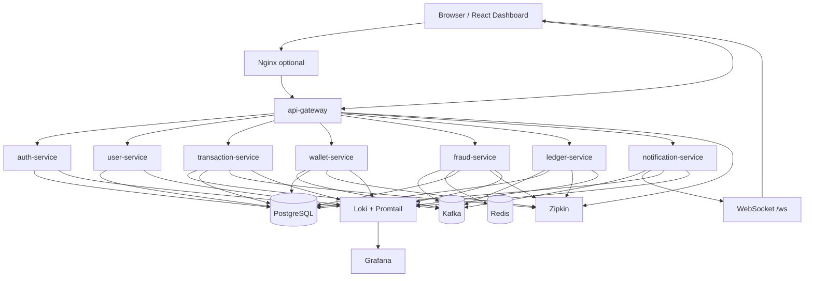

# 04. Infrastructure and deployment

## 1. Mục tiêu

File này mô tả topology hạ tầng cho bản demo chạy bằng Docker Compose. Mục tiêu không phải production-grade Kubernetes, mà là giúp người khác clone repo và chạy được toàn bộ hệ thống bằng một lệnh.

## 2. Docker Compose topology



## 3. Container list

| Container | Vai trò |
|---|---|
| `frontend` | React dashboard |
| `nginx` optional | Reverse proxy cho frontend/API nếu muốn demo gọn |
| `api-gateway` | Entry point API, JWT validation, routing |
| `auth-service` | Register/login/JWT |
| `user-service` | User profile/KYC |
| `transaction-service` | Transfer API, idempotency, Saga orchestration |
| `wallet-service` | Balance, reserve, debit, credit |
| `fraud-service` | Rule-based risk check, velocity check |
| `ledger-service` | Double-entry ledger |
| `notification-service` | WebSocket notification |
| `postgres` | Database server cho demo |
| `kafka` | Event broker |
| `redis` | Feature store/cache cho fraud velocity |
| `zipkin` | Distributed tracing |
| `loki` optional | Centralized log storage |
| `promtail` optional | Collect container logs and push to Loki |
| `grafana` optional | View metrics/logs/dashboard |
| `kafka-ui` optional | Xem topic/message khi demo |

## 4. Database topology

Để demo đơn giản, có thể dùng một PostgreSQL container nhưng chia schema/database logic theo service.

```text
postgres
  auth_db or schema_auth
  user_db or schema_user
  transaction_db or schema_transaction
  wallet_db or schema_wallet
  fraud_db or schema_fraud
  ledger_db or schema_ledger
  notification_db or schema_notification
```

Rule:

- Mỗi service chỉ ghi database/schema của chính nó.
- Service khác muốn lấy dữ liệu nên dùng API hoặc event/read model, không join chéo DB.
- Migration nên dùng Flyway/Liquibase theo từng service.

## 5. Kafka topology

Kafka dùng cho event-driven flow giữa transaction, fraud, wallet, ledger và notification.

Với demo local:

- Dùng Kafka KRaft mode nếu muốn đơn giản hơn, không cần Zookeeper.
- Hoặc dùng Kafka + Zookeeper nếu image/docker-compose bạn chọn yêu cầu.
- Thêm `kafka-ui` để dễ demo topic và event.

Topic quan trọng:

- `transaction.created`
- `fraud.passed`
- `fraud.rejected`
- `risk.challenge_required`
- `risk.hold_required`
- `wallet.reserve.command`
- `wallet.reserved`
- `wallet.debit.command`
- `wallet.debited`
- `wallet.credit.command`
- `wallet.credited`
- `ledger.record.command`
- `ledger.recorded`
- `transaction.completed`
- `transaction.failed`

## 6. Redis usage

Redis dùng cho fraud velocity và cache feature ngắn hạn.

Key gợi ý:

```text
velocity:user:{userId}:5m
amount:user:{userId}:10m
receiver:user:{userId}:10m
device:{fingerprint}
```

Redis không phải source of truth cho tiền. Wallet balance và ledger phải nằm trong PostgreSQL.

## 7. Network and ports gợi ý

| Service | Port |
|---|---:|
| frontend | 3000 hoặc 5173 |
| api-gateway | 8080 |
| auth-service | 8081 |
| user-service | 8082 |
| transaction-service | 8083 |
| wallet-service | 8084 |
| fraud-service | 8085 |
| ledger-service | 8086 |
| notification-service | 8087 |
| postgres | 5432 |
| kafka | 9092 |
| redis | 6379 |
| zipkin | 9411 |
| kafka-ui optional | 8090 |

## 8. Local deployment checklist

- `docker compose up` chạy được toàn bộ infra và services.
- Mỗi service có `/actuator/health`.
- Gateway route được tới các API chính.
- Kafka topics được tạo tự động hoặc bằng init script.
- Database migration chạy khi service start.
- Seed data có ít nhất 2 user verified, 1 receiver blacklist, wallet balance demo.
- Zipkin nhận trace từ gateway, transaction, fraud, wallet, ledger.
- Logs từ các service được gom về Loki/Grafana nếu bật observability profile.
- Frontend connect được REST API và WebSocket.

## 9. Centralized logging

Trong microservices, không nên debug bằng cách SSH hoặc exec vào từng container để xem log riêng lẻ. Bản demo nên có chiến lược gom log tập trung.

### Default cho demo

Dùng Loki + Promtail + Grafana vì nhẹ và hợp với Docker Compose:

```text
service stdout logs
  -> Docker log driver / container log files
  -> Promtail
  -> Loki
  -> Grafana Explore/Dashboard
```

### Log fields tối thiểu

Mỗi service nên log dạng JSON hoặc structured log có các field:

```json
{
  "timestamp": "2026-05-04T10:00:00Z",
  "level": "INFO",
  "service": "transaction-service",
  "correlationId": "corr_001",
  "transactionId": "txn_001",
  "eventType": "transaction.created",
  "message": "Transaction created"
}
```

Field quan trọng:

- `service`
- `correlationId`
- `transactionId`
- `userId` nếu không nhạy cảm
- `eventId`
- `eventType`
- `sagaStep`
- `errorCode`

### Khi nào dùng ELK

ELK Stack gồm Elasticsearch, Logstash và Kibana phù hợp hơn nếu muốn mô phỏng enterprise logging hoặc full-text search mạnh. Với MVP/CV demo, Loki là đủ; ELK nên để optional/future improvement để tránh Docker Compose quá nặng.
