# 05. CI/CD pipeline

## 1. Mục tiêu

Pipeline CI/CD giúp chứng minh project nhiều service có thể được test, build và đóng gói nhất quán. Với MVP/CV demo, không cần triển khai production phức tạp; chỉ cần pipeline cơ bản, tự động và dễ giải thích.

## 2. Pipeline overview

```mermaid
flowchart LR
    Push[Code Push / Pull Request] --> Checkout[Checkout code]
    Checkout --> Lint[Lint / Format Check]
    Lint --> UnitTest[Run Unit Tests]
    UnitTest --> IntegrationTest[Run Integration Tests optional]
    IntegrationTest --> Build[Build Backend and Frontend]
    Build --> Docker[Build Multi-stage Docker Images]
    Docker --> Scan[Image Scan optional]
    Scan --> Registry[Push Images to Registry]
    Registry --> Deploy[Trigger Deployment]
    Deploy --> Smoke[Smoke Test / Health Check]
```



## 3. GitHub Actions stages

| Stage | Mục đích | Bắt buộc cho MVP |
|---|---|---|
| Checkout | Lấy source code | Có |
| Setup Java/Node | Chuẩn bị Java 21/17 và Node.js | Có |
| Lint/format | Bắt lỗi style cơ bản | Nên có |
| Unit test | Test fraud rules, idempotency, wallet, ledger | Có |
| Integration test | Test transfer success, duplicate key, fraud reject | Nên có |
| Build app | Build Spring Boot jar và React bundle | Có |
| Docker build | Build image cho từng service | Có |
| Push registry | Push image lên GHCR/Docker Hub | Optional cho local demo, nên có cho CV |
| Deploy trigger | SSH/VPS/webhook hoặc manual environment | Optional |
| Smoke test | Gọi `/actuator/health` và gateway route | Nên có |

## 4. Multi-service Docker strategy

Mỗi backend service nên có Dockerfile multi-stage:

```text
builder stage
  -> run mvn package / gradle build
runtime stage
  -> copy jar
  -> run with slim JRE image
```

Image tag gợi ý:

```text
ghcr.io/{owner}/rtb-api-gateway:{git_sha}
ghcr.io/{owner}/rtb-transaction-service:{git_sha}
ghcr.io/{owner}/rtb-wallet-service:{git_sha}
ghcr.io/{owner}/rtb-fraud-service:{git_sha}
ghcr.io/{owner}/rtb-ledger-service:{git_sha}
ghcr.io/{owner}/rtb-notification-service:{git_sha}
```

## 5. Branching policy cho demo

```text
feature/*
  -> pull request
  -> CI: lint + unit tests + build
main
  -> CI: full tests + Docker build
  -> optional push to registry
  -> optional deploy to demo environment
```

## 6. Quality gates

Pull request không nên merge nếu:

- Unit test fail.
- Build fail.
- Docker image build fail.
- Migration check fail.
- Contract test/event schema check fail nếu đã có.

Main branch nên tạo artifact:

- Backend jars.
- Frontend build.
- Docker images.
- Test report.

## 7. Deployment strategy cho MVP

Với project CV, deployment có thể giữ đơn giản:

```text
GitHub Actions
  -> build images
  -> push GHCR/Docker Hub
  -> VPS pulls latest images
  -> docker compose up -d
  -> smoke test health endpoints
```

Nếu chưa deploy VPS, vẫn có thể ghi rõ pipeline dừng ở bước build/push image và local run bằng Docker Compose.

