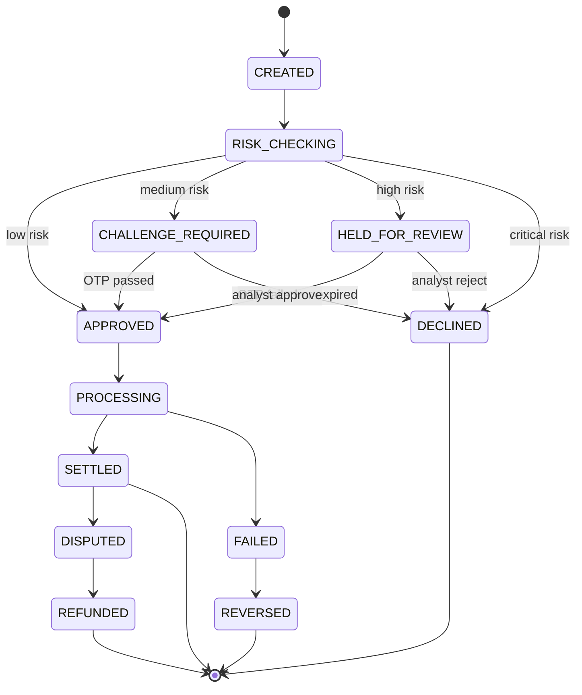
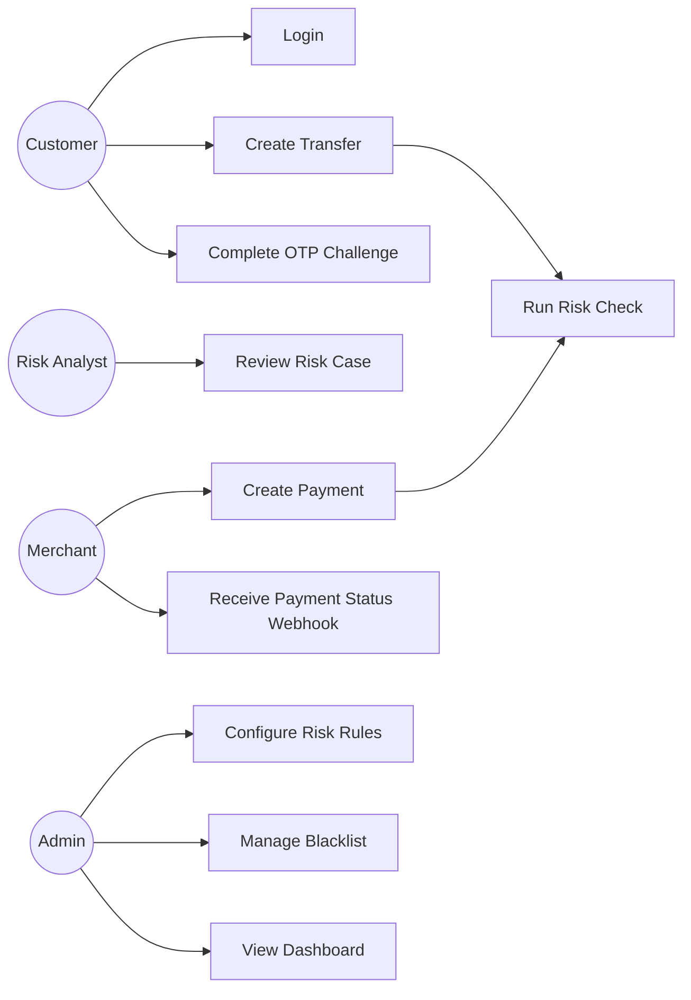
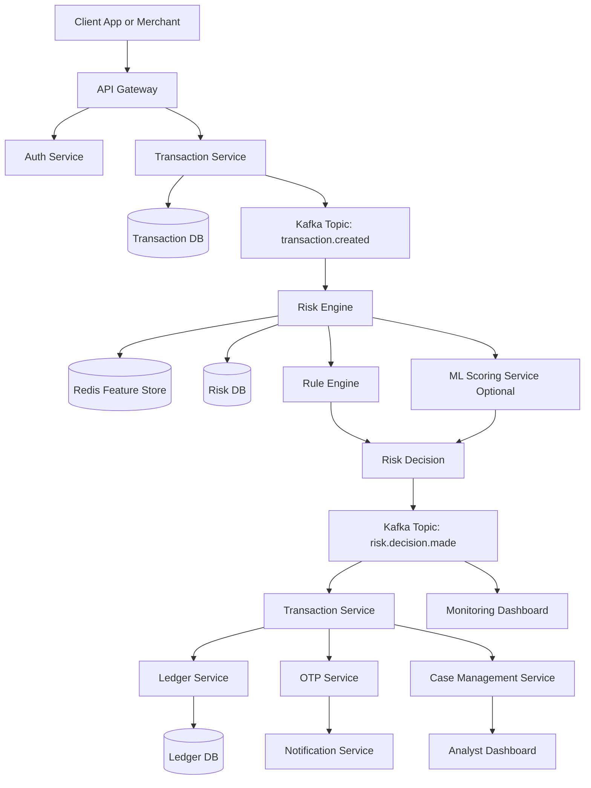
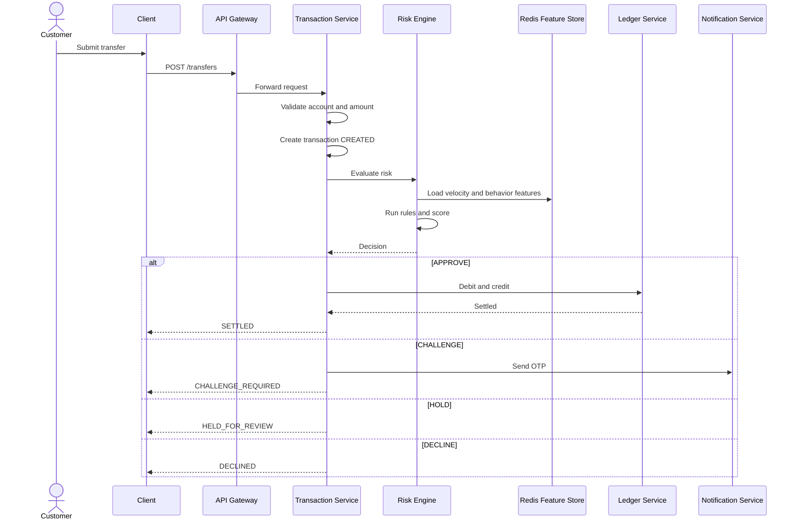
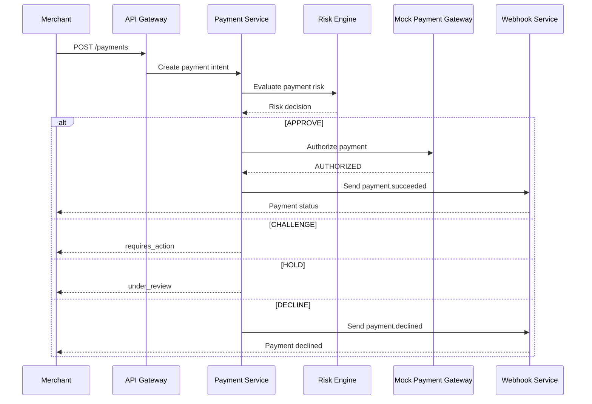
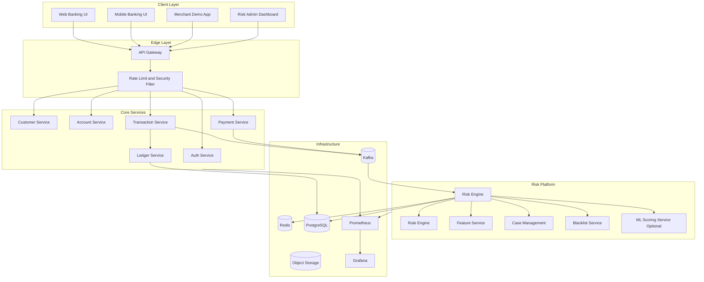
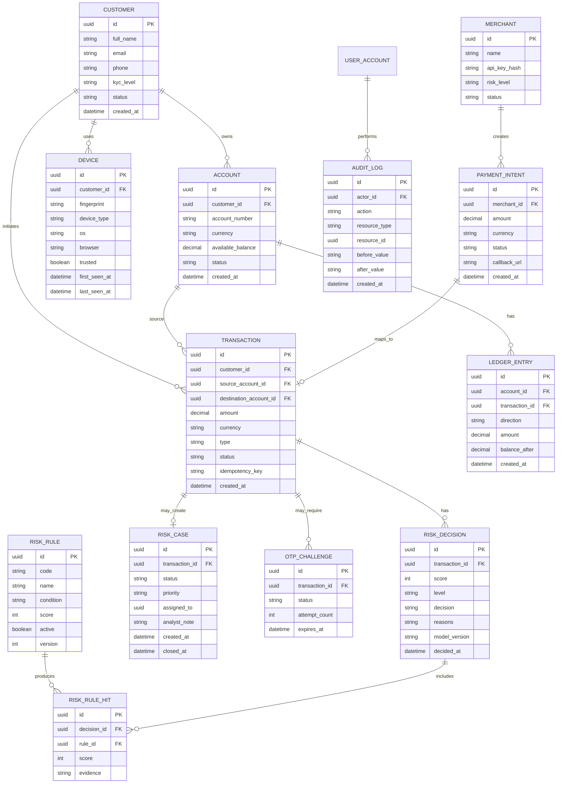

# Real-time Banking and Payment Risk Platform

## 1. Tổng quan project

### 1.1. Mục tiêu

Real-time Banking and Payment Risk Platform là hệ thống đánh giá rủi ro giao dịch ngân hàng và thanh toán theo thời gian gần thực.

Hệ thống nhận giao dịch từ mobile banking, internet banking, merchant checkout, hoặc payment gateway giả lập. Sau đó hệ thống phân tích rủi ro bằng rule engine, velocity check, device fingerprint, user behavior, blacklist, và mô hình ML tùy chọn. Kết quả trả về là approve, require challenge, hold for review, hoặc decline.

### 1.2. Vấn đề thực tế cần giải quyết

Trong banking và payment, giao dịch gian lận thường cần được phát hiện trước khi tiền rời khỏi tài khoản hoặc trước khi payment được xác nhận. Nếu hệ thống chỉ xử lý sau khi giao dịch hoàn tất, ngân hàng hoặc merchant sẽ mất tiền, tăng chargeback, và giảm niềm tin người dùng.

Project này mô phỏng một risk platform xử lý các vấn đề sau:

- Giao dịch bất thường về số tiền.
- Giao dịch lặp lại trong thời gian ngắn.
- Giao dịch từ thiết bị mới.
- Giao dịch từ IP hoặc quốc gia lạ.
- Giao dịch sau khi user đổi mật khẩu.
- Giao dịch tới người nhận mới.
- Giao dịch tới merchant hoặc MCC rủi ro cao.
- Nhiều giao dịch thất bại liên tiếp.
- Account takeover.
- Payment fraud.
- Money mule pattern ở mức demo.

### 1.3. Kết quả đầu ra

Mỗi giao dịch sẽ có một risk decision:

| Decision | Ý nghĩa |
|---|---|
| APPROVE | Cho phép giao dịch tiếp tục |
| CHALLENGE | Yêu cầu xác thực thêm, ví dụ OTP hoặc MFA |
| HOLD | Giữ giao dịch để analyst kiểm tra |
| DECLINE | Từ chối giao dịch |
| FREEZE_ACCOUNT | Khóa tạm thời tài khoản vì rủi ro cao |

---

## 2. Phạm vi hệ thống

### 2.1. In scope

- Đăng nhập và quản lý phiên người dùng.
- Tạo giao dịch chuyển khoản hoặc payment.
- Đánh giá rủi ro theo thời gian gần thực.
- Rule engine có thể cấu hình.
- Velocity check theo user, account, card, device, IP, merchant.
- Risk score và risk reason.
- Step-up authentication bằng OTP giả lập.
- Manual review cho analyst.
- Case management cho giao dịch nghi vấn.
- Dashboard giám sát transaction volume, fraud rate, decline rate, risk score distribution.
- Audit log cho mọi action quan trọng.
- Event streaming bằng Kafka hoặc RabbitMQ.
- Cache feature bằng Redis.
- API documentation bằng OpenAPI hoặc Swagger.

### 2.2. Out of scope cho bản demo

- Không xử lý tiền thật.
- Không lưu số thẻ thật.
- Không tích hợp trực tiếp với ngân hàng thật.
- Không cần PCI DSS production-grade.
- Không cần mô hình ML phức tạp ngay từ đầu.
- Không cần ISO 20022 đầy đủ, chỉ mô phỏng một số field payment cơ bản.

### 2.3. Giả lập trong project

| Thành phần thật | Cách mô phỏng trong project |
|---|---|
| Core banking | Internal Ledger Service |
| Payment gateway | Mock Payment Gateway Service |
| OTP provider | Mock OTP Service |
| Fraud analyst team | Admin dashboard |
| Device fingerprint vendor | Device metadata từ frontend |
| Sanction/blacklist provider | Internal blacklist table |

---

## 3. Stakeholder và actor

| Actor | Vai trò |
|---|---|
| Customer | Tạo giao dịch, xác thực OTP, xem trạng thái giao dịch |
| Merchant | Gửi payment request và nhận payment status |
| Risk Engine | Tính điểm rủi ro và đưa ra quyết định |
| Risk Analyst | Review giao dịch bị hold, approve hoặc reject |
| Admin | Cấu hình rule, threshold, blacklist, merchant risk level |
| System Auditor | Xem audit log và lịch sử decision |
| Notification Service | Gửi OTP, alert, email, hoặc webhook |
| Ledger Service | Giữ số dư, debit, credit, rollback |
| Payment Gateway | Xử lý payment authorization giả lập |

---

## 4. Domain glossary

| Thuật ngữ | Định nghĩa |
|---|---|
| Transaction | Giao dịch chuyển tiền hoặc thanh toán |
| Payment Intent | Yêu cầu payment trước khi được xác nhận |
| Risk Score | Điểm rủi ro từ 0 đến 100 |
| Risk Decision | Kết quả đánh giá rủi ro |
| Velocity Check | Kiểm tra tần suất giao dịch trong một cửa sổ thời gian |
| Step-up Authentication | Xác thực thêm khi rủi ro trung bình |
| Case | Hồ sơ review thủ công cho giao dịch nghi vấn |
| Rule | Điều kiện business dùng để cộng điểm rủi ro |
| Feature | Dữ liệu đầu vào cho risk engine |
| Device Fingerprint | Dấu hiệu nhận diện thiết bị |
| Blacklist | Danh sách user, account, IP, device, merchant bị chặn |
| Whitelist | Danh sách tin cậy |
| MCC | Merchant Category Code, nhóm ngành của merchant |

---

## 5. Business logic tổng quát

### 5.1. Transaction lifecycle



### 5.2. Risk score threshold

| Risk score | Risk level | Decision |
|---:|---|---|
| 0 - 29 | LOW | APPROVE |
| 30 - 59 | MEDIUM | CHALLENGE |
| 60 - 79 | HIGH | HOLD |
| 80 - 100 | CRITICAL | DECLINE hoặc FREEZE_ACCOUNT |

### 5.3. Risk rules bản đầu tiên

| Rule code | Điều kiện | Điểm |
|---|---|---:|
| R001 | Số tiền lớn hơn daily average x 5 | +20 |
| R002 | User dùng thiết bị mới | +15 |
| R003 | IP thuộc blacklist | +80 |
| R004 | Device thuộc blacklist | +80 |
| R005 | Account tạo dưới 7 ngày | +20 |
| R006 | Người nhận mới | +15 |
| R007 | Quá 5 giao dịch trong 10 phút | +25 |
| R008 | Tổng tiền trong 1 giờ vượt hạn mức | +30 |
| R009 | Quốc gia đăng nhập khác quốc gia thường dùng | +20 |
| R010 | Giao dịch sau khi đổi password trong 24 giờ | +20 |
| R011 | Merchant thuộc nhóm rủi ro cao | +20 |
| R012 | User có 3 OTP fail trong 30 phút | +25 |
| R013 | Email hoặc phone mới được cập nhật | +15 |
| R014 | Tài khoản nhận tiền từng dính fraud case | +40 |
| R015 | Transaction amount là số tròn lớn, ví dụ 10,000,000 VND | +10 |

### 5.4. Risk score formula

```text
base_score = sum(rule_scores)
ml_score = optional value from model, range 0..100
final_score = min(100, round(base_score * 0.7 + ml_score * 0.3))
```

Nếu chưa làm ML trong version đầu, dùng:

```text
final_score = min(100, sum(rule_scores))
```

### 5.5. Decision logic

```text
if ip in blacklist or device in blacklist:
    decision = DECLINE
    risk_score = 100

else if risk_score >= 80:
    decision = DECLINE

else if risk_score >= 60:
    decision = HOLD

else if risk_score >= 30:
    decision = CHALLENGE

else:
    decision = APPROVE
```

### 5.6. Step-up authentication logic

Khi decision là CHALLENGE:

1. Transaction chuyển sang trạng thái CHALLENGE_REQUIRED.
2. OTP Service tạo OTP giả lập.
3. Notification Service gửi OTP qua email hoặc log console.
4. Customer nhập OTP.
5. Nếu OTP đúng và chưa hết hạn, transaction được approve.
6. Nếu OTP sai quá 3 lần, transaction bị decline.
7. Nếu OTP hết hạn, transaction bị expire.

### 5.7. Manual review logic

Khi decision là HOLD:

1. Risk Engine tạo Risk Case.
2. Analyst xem transaction detail, user history, rule hit, device, IP, geo, beneficiary, merchant.
3. Analyst chọn approve hoặc reject.
4. Hệ thống ghi audit log.
5. Nếu approve, transaction được gửi sang Ledger hoặc Payment Gateway.
6. Nếu reject, transaction bị decline và reason được lưu lại.

### 5.8. Ledger logic cho transfer

Với giao dịch chuyển khoản nội bộ:

1. Kiểm tra tài khoản nguồn còn hoạt động.
2. Kiểm tra tài khoản đích tồn tại.
3. Kiểm tra số dư khả dụng.
4. Tạo transaction ở trạng thái CREATED.
5. Gọi Risk Engine.
6. Nếu APPROVE, debit tài khoản nguồn.
7. Credit tài khoản đích.
8. Ghi ledger entry 2 chiều.
9. Cập nhật transaction thành SETTLED.

Ledger phải dùng idempotency key để tránh trừ tiền 2 lần.

---

## 6. Use case

### 6.1. Use case overview



### 6.2. UC01 - Customer login

| Field | Nội dung |
|---|---|
| Actor | Customer |
| Trigger | User đăng nhập vào mobile banking hoặc web banking |
| Precondition | User đã có tài khoản |
| Main flow | User nhập username/password, hệ thống kiểm tra credential, ghi login event, cập nhật device/IP |
| Alternative flow | Nếu login từ device mới, hệ thống đánh dấu device_new = true |
| Output | Access token, refresh token, login event |

### 6.3. UC02 - Create bank transfer

| Field | Nội dung |
|---|---|
| Actor | Customer |
| Trigger | User gửi yêu cầu chuyển tiền |
| Precondition | User đã đăng nhập, account active |
| Main flow | User nhập amount, beneficiary, description. Transaction Service tạo transaction. Risk Engine đánh giá. Hệ thống approve, challenge, hold, hoặc decline |
| Output | Transaction status và risk decision |

### 6.4. UC03 - Create merchant payment

| Field | Nội dung |
|---|---|
| Actor | Merchant |
| Trigger | Merchant gửi payment request |
| Precondition | Merchant có API key hợp lệ |
| Main flow | Merchant tạo payment intent. Payment Service gọi Risk Engine. Nếu approve, gateway giả lập authorize payment. Merchant nhận webhook |
| Output | Payment status |

### 6.5. UC04 - Risk evaluation

| Field | Nội dung |
|---|---|
| Actor | Risk Engine |
| Trigger | TransactionCreated event |
| Precondition | Transaction hợp lệ |
| Main flow | Load transaction, user profile, device, IP, historical features. Chạy rules. Tính score. Lưu decision. Publish RiskDecisionMade event |
| Output | Risk score, decision, reason list |

### 6.6. UC05 - OTP challenge

| Field | Nội dung |
|---|---|
| Actor | Customer |
| Trigger | Risk decision là CHALLENGE |
| Precondition | OTP đã được tạo |
| Main flow | User nhập OTP. Hệ thống verify OTP. Nếu đúng, transaction được approve |
| Alternative flow | Sai quá 3 lần thì decline |
| Output | Challenge result |

### 6.7. UC06 - Manual review

| Field | Nội dung |
|---|---|
| Actor | Risk Analyst |
| Trigger | Risk decision là HOLD |
| Precondition | Risk case đã được tạo |
| Main flow | Analyst xem case, kiểm tra evidence, chọn approve hoặc reject, nhập note |
| Output | Case closed, transaction updated |

### 6.8. UC07 - Configure risk rules

| Field | Nội dung |
|---|---|
| Actor | Admin |
| Trigger | Admin muốn thay đổi rule hoặc threshold |
| Precondition | Admin có quyền RISK_ADMIN |
| Main flow | Admin tạo/sửa/tắt rule. Hệ thống validate rule. Rule version mới được active |
| Output | Rule version và audit log |

---

## 7. Data flow

### 7.1. High-level data flow



### 7.2. Transfer sequence



### 7.3. Payment sequence



---

## 8. Architecture

### 8.1. Component diagram



### 8.2. Service responsibility

| Service | Trách nhiệm |
|---|---|
| API Gateway | Routing, rate limit, JWT verification, request logging |
| Auth Service | Login, token, role, session, device binding |
| Customer Service | Customer profile, KYC level giả lập, contact info |
| Account Service | Account, balance view, account status |
| Transaction Service | Transfer lifecycle, transaction status, idempotency |
| Payment Service | Payment intent, merchant request, webhook |
| Risk Engine | Tính risk score và risk decision |
| Rule Engine | Chạy rule có cấu hình |
| Feature Service | Tạo feature từ transaction history, user, device, IP |
| Blacklist Service | Quản lý blacklist và whitelist |
| Case Management | Manual review workflow |
| Ledger Service | Debit, credit, ledger entry, reversal |
| Notification Service | OTP, email, alert |
| Audit Service | Lưu audit log cho action quan trọng |

---

## 9. Data model

### 9.1. ERD



### 9.2. Core tables

#### customers

| Column | Type | Note |
|---|---|---|
| id | UUID | Primary key |
| full_name | VARCHAR | Customer name |
| email | VARCHAR | Unique |
| phone | VARCHAR | Unique |
| kyc_level | VARCHAR | BASIC, VERIFIED, PREMIUM |
| status | VARCHAR | ACTIVE, SUSPENDED, CLOSED |
| created_at | TIMESTAMP | Created time |

#### accounts

| Column | Type | Note |
|---|---|---|
| id | UUID | Primary key |
| customer_id | UUID | FK customers.id |
| account_number | VARCHAR | Unique |
| currency | VARCHAR | VND, USD |
| available_balance | DECIMAL | Current available balance |
| status | VARCHAR | ACTIVE, FROZEN, CLOSED |

#### transactions

| Column | Type | Note |
|---|---|---|
| id | UUID | Primary key |
| customer_id | UUID | FK customers.id |
| source_account_id | UUID | Source account |
| destination_account_id | UUID | Destination account |
| merchant_id | UUID | Nullable for bank transfer |
| amount | DECIMAL | Transaction amount |
| currency | VARCHAR | Currency |
| type | VARCHAR | TRANSFER, PAYMENT, REFUND |
| status | VARCHAR | CREATED, APPROVED, SETTLED, DECLINED |
| idempotency_key | VARCHAR | Unique per request |
| created_at | TIMESTAMP | Created time |

#### risk_decisions

| Column | Type | Note |
|---|---|---|
| id | UUID | Primary key |
| transaction_id | UUID | FK transactions.id |
| score | INT | 0 to 100 |
| level | VARCHAR | LOW, MEDIUM, HIGH, CRITICAL |
| decision | VARCHAR | APPROVE, CHALLENGE, HOLD, DECLINE |
| reasons | JSONB | Rule hit details |
| model_version | VARCHAR | Optional |
| decided_at | TIMESTAMP | Decision time |

#### risk_rules

| Column | Type | Note |
|---|---|---|
| id | UUID | Primary key |
| code | VARCHAR | R001 |
| name | VARCHAR | Human-readable name |
| condition | JSONB | Rule condition |
| score | INT | Score added when hit |
| active | BOOLEAN | Enable or disable |
| version | INT | Rule version |

---

## 10. API design

### 10.1. Auth APIs

| Method | Endpoint | Purpose |
|---|---|---|
| POST | /api/v1/auth/login | Login |
| POST | /api/v1/auth/refresh | Refresh token |
| POST | /api/v1/auth/logout | Logout |
| GET | /api/v1/auth/sessions | View active sessions |

### 10.2. Account APIs

| Method | Endpoint | Purpose |
|---|---|---|
| GET | /api/v1/accounts | Get user accounts |
| GET | /api/v1/accounts/{id} | Get account detail |
| GET | /api/v1/accounts/{id}/balance | Get balance |

### 10.3. Transfer APIs

| Method | Endpoint | Purpose |
|---|---|---|
| POST | /api/v1/transfers | Create transfer |
| GET | /api/v1/transfers/{id} | Get transfer detail |
| POST | /api/v1/transfers/{id}/confirm-otp | Confirm OTP |
| POST | /api/v1/transfers/{id}/cancel | Cancel transfer |

Example request:

```json
{
  "sourceAccountId": "acc_001",
  "destinationAccountNumber": "970400000001",
  "amount": 5000000,
  "currency": "VND",
  "description": "Pay invoice",
  "idempotencyKey": "client-request-001",
  "device": {
    "fingerprint": "fp_abc123",
    "type": "WEB",
    "os": "Windows",
    "browser": "Chrome"
  },
  "context": {
    "ipAddress": "118.69.1.1",
    "country": "VN",
    "userAgent": "Mozilla/5.0"
  }
}
```

Example response:

```json
{
  "transactionId": "txn_001",
  "status": "CHALLENGE_REQUIRED",
  "riskDecision": {
    "score": 45,
    "level": "MEDIUM",
    "decision": "CHALLENGE",
    "reasons": [
      "NEW_DEVICE",
      "NEW_BENEFICIARY",
      "AMOUNT_ABOVE_NORMAL"
    ]
  }
}
```

### 10.4. Payment APIs

| Method | Endpoint | Purpose |
|---|---|---|
| POST | /api/v1/payments | Create payment intent |
| GET | /api/v1/payments/{id} | Get payment status |
| POST | /api/v1/payments/{id}/confirm | Confirm payment action |

### 10.5. Risk APIs

| Method | Endpoint | Purpose |
|---|---|---|
| POST | /api/v1/risk/evaluate | Evaluate risk synchronously |
| GET | /api/v1/risk/decisions/{transactionId} | Get risk decision |
| GET | /api/v1/risk/rules | List rules |
| POST | /api/v1/risk/rules | Create rule |
| PATCH | /api/v1/risk/rules/{id} | Update rule |
| POST | /api/v1/risk/blacklists | Add blacklist item |

### 10.6. Case APIs

| Method | Endpoint | Purpose |
|---|---|---|
| GET | /api/v1/cases | List risk cases |
| GET | /api/v1/cases/{id} | Get case detail |
| POST | /api/v1/cases/{id}/assign | Assign case |
| POST | /api/v1/cases/{id}/approve | Analyst approve |
| POST | /api/v1/cases/{id}/reject | Analyst reject |

---

## 11. Event design

### 11.1. Kafka topics

| Topic | Producer | Consumer | Purpose |
|---|---|---|---|
| transaction.created | Transaction Service | Risk Engine | Start risk evaluation |
| risk.decision.made | Risk Engine | Transaction Service, Dashboard | Apply decision |
| transaction.settled | Ledger Service | Notification, Dashboard | Notify success |
| transaction.declined | Transaction Service | Notification, Dashboard | Notify decline |
| otp.challenge.created | OTP Service | Notification | Send OTP |
| risk.case.created | Risk Engine | Case Management, Dashboard | Create manual review case |
| rule.updated | Risk Admin | Risk Engine | Reload rule cache |
| blacklist.updated | Blacklist Service | Risk Engine | Reload blacklist cache |

### 11.2. transaction.created event

```json
{
  "eventId": "evt_001",
  "eventType": "transaction.created",
  "occurredAt": "2026-05-04T10:00:00Z",
  "payload": {
    "transactionId": "txn_001",
    "customerId": "cus_001",
    "sourceAccountId": "acc_001",
    "amount": 5000000,
    "currency": "VND",
    "type": "TRANSFER",
    "deviceFingerprint": "fp_abc123",
    "ipAddress": "118.69.1.1",
    "country": "VN"
  }
}
```

### 11.3. risk.decision.made event

```json
{
  "eventId": "evt_002",
  "eventType": "risk.decision.made",
  "occurredAt": "2026-05-04T10:00:01Z",
  "payload": {
    "transactionId": "txn_001",
    "score": 45,
    "level": "MEDIUM",
    "decision": "CHALLENGE",
    "reasons": [
      {
        "ruleCode": "R002",
        "ruleName": "New device",
        "score": 15,
        "evidence": "Device first seen now"
      },
      {
        "ruleCode": "R006",
        "ruleName": "New beneficiary",
        "score": 15,
        "evidence": "No previous transfer to this beneficiary"
      },
      {
        "ruleCode": "R001",
        "ruleName": "Amount above normal",
        "score": 15,
        "evidence": "Amount is 4.8x user average"
      }
    ]
  }
}
```

---

## 12. Feature engineering cho risk engine

### 12.1. Feature groups

| Group | Feature examples |
|---|---|
| User profile | account_age_days, kyc_level, status |
| Transaction | amount, currency, type, beneficiary_new |
| Velocity | count_10m, count_1h, amount_sum_1h, amount_sum_24h |
| Device | device_new, device_trusted, device_blacklisted |
| Network | ip_blacklisted, country_changed, vpn_detected giả lập |
| Behavior | usual_amount_avg, usual_login_hour, unusual_time |
| Merchant | merchant_risk_level, mcc_risk_level |
| Security event | password_changed_24h, otp_failed_30m |

### 12.2. Redis key design

| Key | Purpose | TTL |
|---|---|---|
| velocity:user:{userId}:10m | Count giao dịch user trong 10 phút | 10 phút |
| velocity:account:{accountId}:1h | Tổng tiền account trong 1 giờ | 1 giờ |
| velocity:device:{fingerprint}:1h | Count theo device | 1 giờ |
| otp:txn:{transactionId} | OTP challenge | 5 phút |
| blacklist:ip | Set IP blacklist | Không TTL |
| blacklist:device | Set device blacklist | Không TTL |
| profile:user:{userId} | Cached user risk profile | 30 phút |

---

## 13. Rule engine design

### 13.1. Rule condition format

```json
{
  "field": "transaction.amount",
  "operator": ">",
  "valueFrom": "user.avgAmount30d",
  "multiplier": 5
}
```

### 13.2. Rule evaluation result

```json
{
  "matched": true,
  "ruleCode": "R001",
  "score": 20,
  "evidence": {
    "amount": 5000000,
    "avgAmount30d": 900000,
    "ratio": 5.55
  }
}
```

### 13.3. Rule engine pseudocode

```text
function evaluateRisk(transaction):
    features = featureService.build(transaction)
    activeRules = ruleRepository.findActiveRules()
    totalScore = 0
    reasons = []

    for rule in activeRules:
        result = ruleEngine.evaluate(rule.condition, features)
        if result.matched:
            totalScore += rule.score
            reasons.add(result.evidence)

    score = min(totalScore, 100)
    decision = decisionPolicy.decide(score, features)

    saveRiskDecision(transaction.id, score, decision, reasons)
    publishRiskDecisionMade(transaction.id, score, decision, reasons)

    return decision
```

---

## 14. Security design

### 14.1. Authentication and authorization

- Customer dùng JWT access token và refresh token.
- Admin và analyst dùng role-based access control.
- Merchant dùng API key hoặc OAuth2 client credentials giả lập.
- Sensitive admin API cần role RISK_ADMIN.
- Manual review API cần role RISK_ANALYST.

### 14.2. API security checklist

- Validate input cho mọi request.
- Rate limit login, OTP, payment, transfer.
- Idempotency key cho transfer và payment.
- Không expose internal error ra client.
- Không log OTP, password, token, hoặc dữ liệu nhạy cảm.
- Object-level authorization cho accountId, transactionId, caseId.
- Audit log cho admin action và analyst decision.
- Encrypt secrets bằng environment variables hoặc secret manager.

### 14.3. Data privacy cho bản demo

- Không dùng số thẻ thật.
- Nếu cần card, chỉ lưu token dạng card_token.
- Mask thông tin nhạy cảm ở UI.
- Log chỉ lưu metadata cần thiết.
- Xóa hoặc fake dữ liệu cá nhân trong seed data.

---

## 15. Observability

### 15.1. Metrics

| Metric | Ý nghĩa |
|---|---|
| transaction_total | Tổng số giao dịch |
| transaction_approved_total | Giao dịch approve |
| transaction_declined_total | Giao dịch decline |
| risk_decision_latency_ms | Thời gian risk decision |
| risk_score_avg | Risk score trung bình |
| otp_failed_total | Số OTP fail |
| risk_case_open_total | Case đang mở |
| rule_hit_total{ruleCode} | Số lần rule match |
| kafka_consumer_lag | Độ trễ Kafka consumer |

### 15.2. Logs

Mỗi request nên có correlation_id.

Log format gợi ý:

```json
{
  "timestamp": "2026-05-04T10:00:00Z",
  "level": "INFO",
  "service": "risk-engine",
  "correlationId": "corr_001",
  "transactionId": "txn_001",
  "message": "Risk decision made",
  "score": 45,
  "decision": "CHALLENGE"
}
```

### 15.3. Dashboard nên có

- Tổng giao dịch theo phút.
- Approve rate, challenge rate, hold rate, decline rate.
- Top rule hit.
- Risk score distribution.
- Fraud case by status.
- Kafka lag.
- API latency p95.
- Error rate theo service.

---

## 16. Non-functional requirements

| Requirement | Target cho demo |
|---|---|
| Risk decision latency | Dưới 300ms cho synchronous path |
| API latency p95 | Dưới 500ms cho transfer request |
| Availability | Chạy ổn định qua Docker Compose |
| Scalability | Risk Engine scale ngang theo Kafka partition |
| Reliability | Idempotency cho transaction/payment |
| Auditability | Mọi decision có reason và audit log |
| Security | JWT, RBAC, rate limit, input validation |
| Maintainability | Clean architecture, service boundary rõ |
| Observability | Logs, metrics, dashboard |

---

## 17. Suggested tech stack

### 17.1. Backend

| Component | Tech |
|---|---|
| API services | Java 21, Spring Boot 3 |
| Security | Spring Security, JWT |
| Database | PostgreSQL |
| Cache | Redis |
| Event streaming | Apache Kafka |
| ORM | Spring Data JPA |
| Migration | Flyway |
| API docs | OpenAPI, Swagger UI |
| Testing | JUnit, Testcontainers, Mockito |

### 17.2. Frontend

| Component | Tech |
|---|---|
| Customer UI | React, Vite |
| Admin dashboard | React, Ant Design hoặc shadcn/ui |
| Charts | Recharts |
| API client | Axios hoặc TanStack Query |

### 17.3. DevOps

| Component | Tech |
|---|---|
| Local orchestration | Docker Compose |
| CI/CD | GitHub Actions |
| Monitoring | Prometheus, Grafana |
| Logging | Loki hoặc ELK optional |
| Deployment | VPS hoặc AWS EC2 |
| Reverse proxy | Nginx |
| TLS | Let’s Encrypt |

---

## 18. Folder structure gợi ý

```text
real-time-banking-risk-platform/
  backend/
    api-gateway/
    auth-service/
    customer-service/
    account-service/
    transaction-service/
    payment-service/
    risk-engine/
    case-service/
    ledger-service/
    notification-service/
    common-lib/
  frontend/
    customer-web/
    risk-dashboard/
    merchant-demo/
  infrastructure/
    docker-compose.yml
    kafka/
    prometheus/
    grafana/
    nginx/
  docs/
    architecture.md
    api.md
    data-model.md
    risk-rules.md
    deployment.md
  scripts/
    seed-data.sql
    load-test.js
```

---

## 19. MVP roadmap

### Phase 1: Core transaction flow

- Auth Service.
- Customer, Account, Transaction Service.
- PostgreSQL schema.
- Transfer API.
- Idempotency key.
- Basic frontend transfer form.

### Phase 2: Risk Engine

- Kafka event transaction.created.
- Feature builder.
- Rule engine hard-coded rules.
- Risk score and decision.
- risk_decisions table.
- Update transaction status by decision.

### Phase 3: Challenge and case management

- OTP challenge flow.
- Manual review case.
- Analyst dashboard.
- Approve/reject case.
- Audit log.

### Phase 4: Payment and merchant flow

- Merchant demo app.
- Payment intent API.
- Mock payment gateway.
- Webhook simulation.
- Merchant risk level.

### Phase 5: Observability and deployment

- Prometheus metrics.
- Grafana dashboard.
- Docker Compose full stack.
- GitHub Actions CI.
- Nginx reverse proxy.
- Deploy to VPS.

---

## 20. Demo scenarios

### Scenario 1: Low-risk transfer

Input:

- Existing device.
- Known beneficiary.
- Normal amount.
- Same country.

Expected:

- Risk score: 0 - 29.
- Decision: APPROVE.
- Transaction: SETTLED.

### Scenario 2: Medium-risk transfer

Input:

- New device.
- New beneficiary.
- Amount above normal.

Expected:

- Risk score: 30 - 59.
- Decision: CHALLENGE.
- User enters OTP.
- Transaction: SETTLED if OTP passed.

### Scenario 3: High-risk transfer

Input:

- More than 5 transactions in 10 minutes.
- Amount exceeds hourly limit.
- Merchant high risk.

Expected:

- Risk score: 60 - 79.
- Decision: HOLD.
- Risk case created.
- Analyst reviews and approves/rejects.

### Scenario 4: Critical-risk transfer

Input:

- IP blacklisted.
- Device blacklisted.

Expected:

- Risk score: 100.
- Decision: DECLINE.
- Optional: account frozen.
- Alert generated.

### Scenario 5: Merchant payment fraud

Input:

- Merchant high risk.
- New customer device.
- Multiple payment attempts.

Expected:

- Risk score: high.
- Payment status: under_review hoặc declined.
- Webhook sent to merchant.

---

## 21. Acceptance criteria

### 21.1. Functional

- User tạo transfer thành công.
- Risk Engine trả về score, decision, reason.
- Transaction status thay đổi theo decision.
- OTP challenge hoạt động cho medium risk.
- Manual review hoạt động cho high risk.
- Admin tạo và tắt rule được.
- Dashboard hiển thị transaction và risk metrics.
- Kafka event được publish và consume đúng.
- Audit log ghi lại action quan trọng.

### 21.2. Technical

- Docker Compose chạy toàn bộ hệ thống.
- API có Swagger UI.
- Database migration chạy tự động.
- Unit test cho risk rules.
- Integration test cho transfer flow.
- Logs có correlation_id.
- Metrics xuất ra Prometheus.
- README có architecture, setup, demo scripts.

---

## 22. Điểm mạnh khi ghi vào CV

Bạn có thể viết trong CV:

```text
Built a real-time banking and payment risk platform using Spring Boot, Kafka, Redis, PostgreSQL, and React to evaluate transaction fraud risk before payment execution.

Designed a rule-based risk engine with velocity checks, device fingerprinting, blacklist screening, OTP challenge, manual review workflow, and explainable risk decisions.

Implemented event-driven transaction processing with Kafka, idempotent payment APIs, audit logging, Prometheus metrics, and Grafana dashboards for operational monitoring.

Containerized the full system with Docker Compose and deployed it behind Nginx on a VPS with CI/CD using GitHub Actions.
```

---

## 23. README outline

```text
# Real-time Banking and Payment Risk Platform

## Overview
## Business Problem
## Features
## Architecture
## Tech Stack
## Data Flow
## Risk Engine Design
## API Documentation
## Database Schema
## Kafka Topics
## Demo Scenarios
## Local Setup
## Testing
## Monitoring
## Deployment
## Screenshots
## Future Improvements
```

---

## 24. Future improvements

- Add ML fraud scoring model bằng Python FastAPI.
- Add graph-based fraud detection cho mule account network.
- Add anomaly detection cho user behavior.
- Add rule versioning và A/B testing.
- Add ISO 20022-like payment message mapping.
- Add OpenTelemetry tracing.
- Add Kubernetes deployment.
- Add Terraform deployment to AWS.
- Add CDC với Debezium cho audit/event sync.
- Add real-time alerting qua Slack hoặc Telegram.

